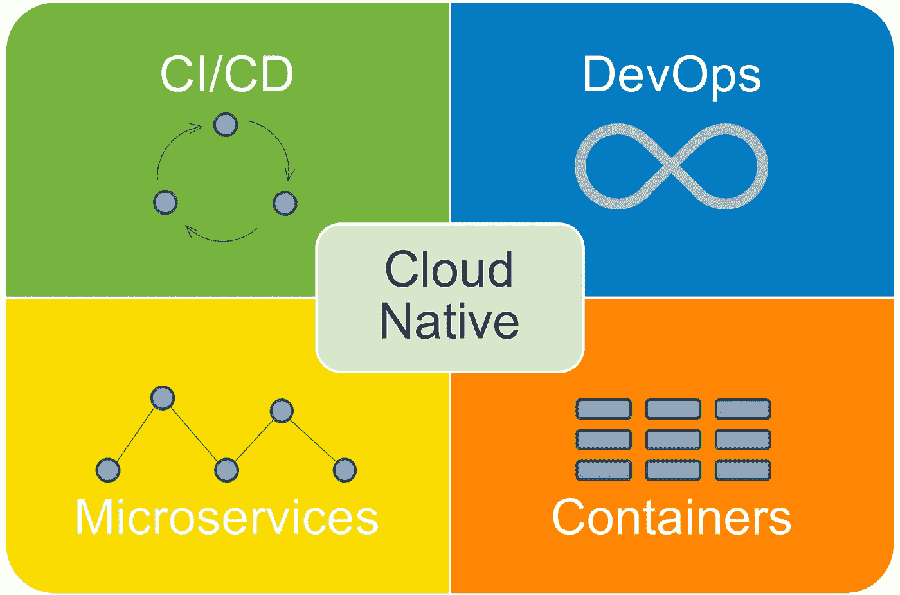
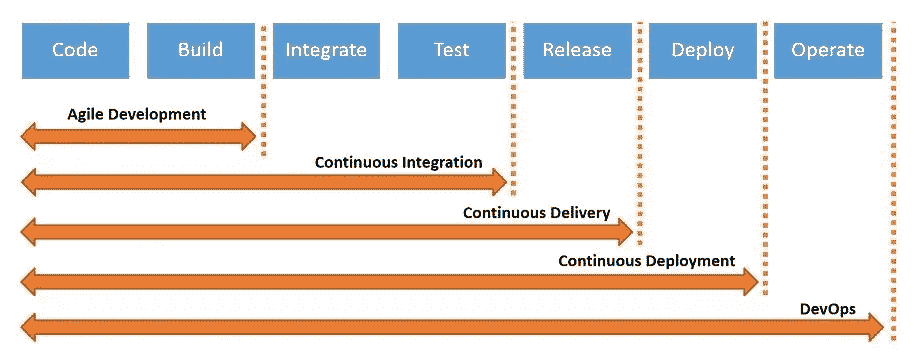
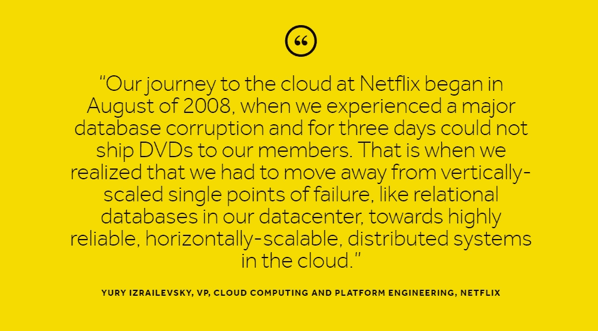

# 现在每个公司都是软件公司，很快每个公司都会变成 DevOps 公司。

> 原文：<https://medium.com/hackernoon/devops-transformation-7-ways-to-hack-the-culture-909e84b34aa0>

## DevOps 转型:破解文化的 7 个技巧

> “幸存下来的不是最强壮的物种，也不是最聪明的物种。是最能适应变化的一种。”—查尔斯·达尔文

# 为什么是 DevOps？

这是我们对快速变化的技术趋势的快速反应，产生了兴奋和推动业务增长，DevOps 通过更快地向市场提供预期的功能，帮助增长黑客您的业务绩效指数。DevOps 诞生于漫长的软件开发历史，是一种经过深思熟虑的方法。如今每个公司都是软件公司，他们都明白 DevOps 的价值。

DevOps 已经为许多知名公司带来了成功，如[网飞](https://thenewstack.io/netflix-devops-scale/)、[亚马逊](https://www.slideshare.net/AmazonWebServices/devops-the-amazon-story)和[谷歌](https://thenewstack.io/google-reveals-the-secrets-of-devops/)。Amazon 已经能够通过自动化发布来加速他们的软件开发生命周期。就像每个人一样，如果你的最终目标是更快的发布和更高质量的服务，以及增加客户满意度，那么应用 DevOps 原则就是方法。

DevOps 的主要目的很简单:以更好的质量频繁、可靠地发布软件更新。换句话说，DevOps 是整个组织为了更好的组织敏捷性而进行的心智模型转换..是关于交付涅槃。

# 今天，我们将讨论 DevOps 转型的七个简单技巧。

## 1.为变化做好准备并采用云原生方法

我们已经知道变化是唯一不变的。这种变化有时可能很可怕，但不根据技术趋势变化可能是你可能做的最糟糕的事情。众所周知，DevOps 旨在解决 IT 部门最重要的问题之一，弥合开发人员和运营人员之间的差距，这是当前的需要，必须尽快解决。这只能通过持续和小的增量变化来实现。管理层应该确保在提出文化变革之前宣传 DevOps 的优势和好处，这必须由 IT 架构师和各个团队的经理来推动。

许多人认为**云原生**只是另一个时髦词。不，不是的。这是一套完整的方法论。无论是创业公司还是企业，他们都希望使用云原生架构来更快速地创新。

Image credits: [Instana](https://www.instana.com/blog/cloud-native-seeing-through-hype/)

Cloud-native 利用了许多现代技术；它将敏捷、DevOps 和持续交付的方法与微服务、云、容器和无服务器的架构和技术相结合。云原生战略为企业带来了更高的速度、能力、性能和利润。不仅仅是容器化和微服务设计，您还必须采用新的云原生方法，如最小可行产品(MVP)开发、多元测试、快速迭代，以及在 DevOps 模型中跨组织边界密切合作。苹果、亚马逊、谷歌、网飞、Spotify、Airbnb、特斯拉、高通都是最早采用这种方法的巨头，并且都非常成功。

***注意*** :云原生具有巨大的潜力，但当您有遗留应用程序和传统实践时，它也有自己的缺点。

> “没有什么比习惯更强大。”— Ovid

## 2.接受失败并快速学习

由于 DevOps 主要与快速做事和快速学习有关，最初可能有 99%的失败机会，有时可能看起来很难，但通过适当的指导方针和方法，可以处理不利的情况，更重要的是，接受失败是最重要的因素，否则指责游戏就开始了。组织和团队需要理解 DevOps 的方法是消除团队之间的混乱，但是要达到一个好的阶段，最初会有很多混乱。

然而，正如敏捷的“失败并尽快调整”方法论一样，开发运维失败是朝着正确方向迈出的一步。它们是从失败中学习的第一步，将你的 DevOps 实践转变为一个将引导你走向更大成功的实践，宜早不宜迟。

> "成功是从一个失败走向另一个失败而不丧失热情的能力."温斯顿·丘吉尔

 [## 如何从失败中吸取教训

### DevOps 失败对于一些人来说是一个敏感的话题，因为 DevOps 通常被认为是避免失败的一种方式。作为一个…

www.pagerduty.com](https://www.pagerduty.com/blog/learn-from-failure-devops/) 

## 3.学会随时随地保持连续性

持续无处不在的含义是应用持续集成、持续测试、持续部署和持续改进的实践。这些东西为公司的学习曲线增加了更多的价值，并有助于使过程更加敏捷和精益。

最终目标很简单，像水一样在任何地方都是连续的， [JFrog](https://jfrog.com/whitepaper/a-vision-of-liquid-software/) 将这一概念定义为“ [***创造液体软件***](https://jfrog.com/whitepaper/a-vision-of-liquid-software/) ”在这个世界中，我们系统的软件随时都在更新。实际上，软件将变得流动，因为产品和服务将被连接到“软件管道”,不断地将更新流入我们的系统和设备；流动软件持续自动更新我们的系统，无需人工干预。

几天前，我写了一篇关于我们为什么需要 CI/CD 的文章，分享如下。

 [## 为什么需要持续集成和持续部署？

### 持续集成和持续部署已经统治了软件行业。因为每个人的目标…

dzone.com](https://dzone.com/articles/streamline-your-software-delivery-with-continuous) 

> “实践持续改进的理念。一天比一天好。”—布莱恩·特雷西

## 4.专注于自动化

DevOps 主要是关于自动化，如果可能的话，零接触自动化。IT 经理和开发运维主管必须专注于选择最佳工具和开发运维流程，以帮助大规模实现开发运维。选择工具后，就该定义使用每个工具的策略和步骤，以及何时使用和为什么使用。像 Docker、Kubernetes、Terraform、JFrog、AWS、Slack、Chef 等工具。来帮助您建立自动化能力。自动化重复的开发任务和一些日常活动将会给开发人员额外的时间去做对业务重要的事情。自动化还有助于公司快速失败、快速建设、快速交付，这反过来又有助于提高整体绩效。

Note: Don’t jump into automation without architecting and designing properly.

但是这种自动化文化应该来自最高管理层，因此大多数维护和遵循遗留实践的公司可能会发现在整个组织中开始这种文化有点困难。但他们都必须像一些 DevOps 专家所说的那样，到 2020 年每个公司都将是 DevOps 公司，他们必须适应 DevOps，否则就会死亡。

 [## 马斯洛 2.0: DevOps 将主宰世界上所有的软件

### 我们都熟悉马斯洛的需求层次理论。我们最基本的人类需求，像食物和水，都在…

jfrog.com](https://jfrog.com/blog/how-devops-empowers-maslows-hierarchy-of-needs-2-0/) 

> "作为开发人员，我们拥有的最强大的工具是自动化."—斯科特·汉瑟曼

## 5.拥有一个反馈回路，以实现更好的沟通

开发人员和运营人员之间的不匹配可以通过反馈回路来克服，反馈回路可以帮助识别瓶颈并消除它们。反馈循环帮助团队纠正错误，并密切关注干扰连续软件交付的模式。一个适当的反馈循环过程可以通过消除导致问题的瓶颈，从而提高整体生产力，让团队表现得更好。许多简单的过程验证了软件开发中的反馈循环——日常的 Scrum、代码审查、单元测试、在生产中持续监控性能等。
通常，你希望反馈循环尽可能的短，这样你就可以快速适应你的过程。

> “我们不能用创造问题时的思维来解决问题。”—爱因斯坦

## 6.建立团队之间的信任

信任是任何企业通过 DevOps 取得成功的先决条件。
企业的业绩直接取决于组织内部的团队协作和团队之间的信任。随着 DevOps 实践从上层管理向下流动，信任被赋予高度的重要性，因为这是帮助团队集体工作的润滑剂。
在团队之间建立信任是 DevOps 的主要目标。在 DevOps 中，开发人员和运营人员现在将作为彼此的支持团队，而不是制造指责游戏。随着 DevOps 的实施，团队瓶颈和摩擦将会减少，因此信任应该是一个重要的因素。工程主管和副总裁一直在使用最大化开发和运营团队之间日常互动的策略来建立信任

> “维系所有关系(包括领导者和被领导者之间的关系)的粘合剂是信任，而信任的基础是诚信。”—布莱恩·特雷西
> 
> "当信任度很高时，交流就变得容易、即时和有效."—斯蒂芬·R·科维

## 7.有耐心

许多人过度计算并感到失望的一个关键问题是，他们认为 DevOps 可以被视为一种一蹴而就的方法，但事实并非如此。耐心是这里的关键；文化的植入和范式的转变需要几个月的时间。对于一个维护所有遗留实践的老公司来说，这不是一件容易的工作；他们需要仔细思考并执行 DevOps 计划。许多大公司花时间考虑 DevOps，但仍然如此，他们现在都在享受好处。一个例子是网飞，网飞的云之旅始于 2008 年&因此是 DevOps。作为一家必须处理大量流量的公司，网飞指出云的可扩展性优势是他们决定迁移的关键驱动因素之一。当你开始的时候，耐心和保持持续的进步是你所需要的，缓慢和稳定赢得比赛。

Image source: [https://amido.com/blog/a-case-study-of-devops-at-netflix/](https://amido.com/blog/a-case-study-of-devops-at-netflix/)

> “变化是缓慢而渐进的。这需要努力工作、一点运气、相当程度的自我牺牲和极大的耐心。”罗伯特·格林

以开发运维为中心的自动化可以为企业带来显著的竞争优势。我们都知道 DevOps 已经存在，而且它是当今任何软件驱动的组织的必需品。以正确的方式进行开发始于正确的思维方式和成长心态，并找出可以轻松自动化的关键流程。DevOps 在未来几年将会更加令人兴奋。

你可能还想阅读我的 ***五大技巧，以确保高级管理层支持你团队的敏捷雄心。***

 [## DevOps 五大技巧:确保管理层的认同

### 在这篇客座博文中，Pavan Belagatti，一位在自动化软件提供商 Shippable 工作的 DevOps 影响者，分享了他的…

www.computerweekly.com](https://www.computerweekly.com/blog/Ahead-in-the-Clouds/DevOps-top-5-tips-Securing-management-buy-in) 

我每天在 LinkedIn 上分享关于 DevOps 的故事，让我们在 [**LinkedIn**](https://www.linkedin.com/in/pavan-belagatti-growthmarketer) 上连线。