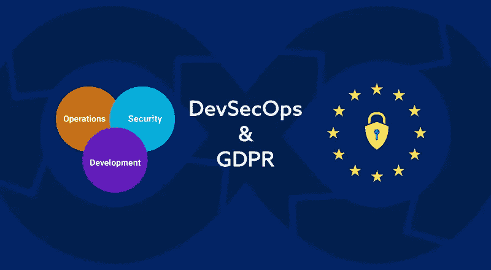

# 德夫塞科普斯和 GDPR

> 原文：<https://medium.com/hackernoon/devsecops-and-gdpr-can-devsecops-help-companies-comply-with-gdpr-6f8bb85620dd>

## 数据安全是一个价值数十亿美元的问题，目前需要我们的关注。DevSecOps 能帮助公司遵守 GDPR 协议吗？

Photo by [Matthew Henry](https://unsplash.com/@matthewhenry?utm_source=medium&utm_medium=referral) on [Unsplash](https://unsplash.com?utm_source=medium&utm_medium=referral)

GDPR 的存在和最近 CCPA(加州消费者隐私法案)的公布让许多人开始认真思考他们的数据隐私。

一方面，我们不断收到导致不确定性的“英国退出欧盟”延迟的更新，另一方面，我们试图评估英国退出欧盟对欧洲、英国、世界以及包括 it 在内的每个商业领域的影响。随着英国退出欧盟协议，软件开发行业正在经历一个更大的政策变化，这个变化就是 GDPR。

我们已经认识到数据是 21 世纪的新资产。如今，随着对业务关键型决策流程的需求，It 就像货币一样有价值。

> GDPR 和 CCPA 等法律改变了人们对待数据安全的方式。

因此，在这篇文章中，我们将解决一些与 GDPR 相关的一般性问题，并帮助您理解 DevSecOps 如何最适合安全驱动的软件开发。

如果您想知道我们为什么要讨论 GDPR 和数据安全，这是因为数据安全已经变得非常重要，这是我们将**安全视为战略方面**而不是作为软件开发过程的一部分来实现的恰当时机。要做到这一点，DevSecOps 似乎是从软件开发生命周期的开始就能满足安全性需求的合适模型。

## 我们要解决的主要问题是:

*   什么是 GDPR？
*   GDPR 如何影响软件开发？
*   GDPR 和英国退出欧盟有关系吗？
*   这个数据保护规则适用于每个公司吗？
*   DevSecOps 如何帮助遵守安全标准？
*   是在全球推行还是只在欧洲推行？
*   世界上还有哪些国家在数据安全方面迈出了一步？

让我们逐一回答前面提到的每个问题。

# 什么是 GDPR？

**GDPR 代表通用数据保护条例**

它旨在重塑欧洲联盟内部数据收集和数据处理的整个框架。这一数据保护规则使人们能够控制自己的个人数据。

这一规则被认为是多年来数据保护和数据安全方面的巨大变化。根据该法规，人们可以在同意的情况下控制如何收集和处理数据。

## GDPR 如何影响软件开发？

最近，我们观察到软件在可伸缩性、稳定性、敏捷性和安全性方面有了更大程度的发展。IT 行业正快速向前发展，使企业能够利用安全、可靠、功能丰富的软件解决方案更快地扩展。

[GDPR 合规是软件开发公司的头等大事](https://www.spec-india.com/blog/gdpr-changing-the-face-of-data-protection-in-it-outsourcing/)因为他们经常与世界各地任何人的个人数据进行交互。这是他们应对数据监管的一个主要问题，因为它需要额外的投资来观察海外数据传输，充分遵守 GDPR，并且最重要的是需要雇用数据处理官员(DPO)。

## 软件开发公司的关键要点

*   你不能忽视 GDPR 是一家软件开发公司
*   仔细阅读并理解 GDPR 为您的企业/服务制定的安全标准
*   将安全性视为成功软件开发的主要因素之一
*   将您的软件开发模型更改为 DevSecOps 将节省您的成本和时间，并且还有助于满足监管标准
*   安全驱动的基础架构可以为您赢得竞争优势
*   违反任何 GDPR 条款可能会导致您支付罚款
*   将软件安全视为共同的责任

而且软件目前构建的迭代和部署比较多，使得软件开发者对安全方面格外重视。

## GDPR 和英国退出欧盟有关系吗？

不。英国退出欧盟指的是英国脱离欧盟的过程，这一过程仍在进行中。GDPR 是一项革命性的数据监管法案，由欧盟制定，旨在保护欧盟内部的个人隐私。它还为国际商业建立了数据隐私标准。

> 经过两年的过渡期，GDPR 于 2018 年 5 月 25 日在整个欧盟生效。

在英国退出欧盟协议之前，英国被期望遵守 GDPR 法案，因为它是欧盟成员国。目前，他们有自己的数据保护法案 2018，被称为英国实施的 GDPR。

一旦英国离开欧盟，两国政府将确保英国和 EEA(欧洲经济区)国家之间的数据顺畅和安全流动。

## 这个数据保护规则适用于每个公司吗？

这是最重要的问题之一。根据欧洲委员会官方网站，该法律适用于:

*   将个人数据作为其在欧盟设立的分支机构活动的一部分进行处理的公司或实体，无论数据在哪里处理；或者
*   在欧盟之外成立的公司，提供商品/服务(付费或免费)或监控欧盟境内个人的行为。

## **用最简单的话来说**

该法律适用于向欧盟个人提供服务/产品或参与监控欧盟个人数据的任何公司/组织/个人。

> 简而言之，该法律适用于所有公司，无论它们在哪里运营(欧盟内部或外部)以及与欧盟个人的任何数据处理(存储、监控、生成、收集、修改、删除、使用等)相关联。

如果您是处理任何个人数据(关于个人的任何信息，包括姓名、身份、出生日期、地点、生物特征记录或任何教育、财务、医疗、就业相关信息)的小型或大型商业企业，您必须遵守 GDPR 标准。

# DevSecOps 如何帮助遵守安全标准？

安全不再仅仅适用于开发的一个阶段。

脸书的首席执行官马克·扎克伯格称 GDPR 是“互联网非常积极的一步”,还有一些其他领导人认为 GDPR 不清楚也不明确。

**GDPR 提出了一些关于数据安全的重要问题和讨论。人们必须按照保护访问者和用户数据的数据安全标准行事。**

然而，对于 IT 专业人员来说，遵守这种隐私法案的条款似乎更麻烦，而且现在对他们来说，以一种必须满足数据安全要求的方式设计他们的软件是一种挑战。要做到这一点，我们必须考虑 DevSecOps 不仅符合 GDPR，而且符合世界各地的任何其他保护法案。

## 有必要重温软件开发方法吗？

这个问题的答案是主观的，取决于你的需求，比如你的项目类型是什么，你如何使用数据，你的数据库有多大，你如何处理和收集数据，等等。

然而，对于每个公司和组织来说，数据保护变得至关重要，以保护其用户的数据并确保没有漏洞和违规。人们开始意识到自己的数据安全，在向任何公司提供个人数据时，他们通常会更加担心。

# 为什么要使用 DevSecOps 来解决数据安全需求？

*   它符合 GDPR 和 CCPA 等国的数据保护法
*   它确保您的软件符合所有数据安全标准
*   它有助于设计安全领先的软件解决方案
*   它将安全提升为组织中每个人的集体责任
*   它专注于更快地交付软件，最大限度地关注安全性
*   它简化了数据存储、处理和收集，可以保证适当的合规性
*   一种逻辑的、战略性的和潜在的软件开发方法，将安全性作为一个关键组成部分

除此之外，DevOps 有能力以最高的质量和灵活性来构建现代软件，并产生巨大的成果。通过在软件开发过程中实现“安全性作为代码”,任何组织都可以利用安全性和敏捷性的强大组合来促进协作和透明性。

DevSecOps 不是将安全性放在软件生命周期的末尾，而是放在每个阶段，以确保整个开发过程中的安全和顺畅。

DevSecOps 将安全性作为一项共同的责任来实施，可以从软件创建的开始阶段就衡量应用程序的安全性。

IT 世界不仅将 DevOps 作为软件开发模型，还将 [DevOps 作为一种哲学](/faun/devops-as-a-philosophy-c3409213d79a)，通过持续集成和持续交付带来变革。

> 无论是 DevOps 还是 DevSecOps，安全性都是必须的。

进一步来看，DevSecOps 成为 IT 行业的主要实践之一，因为它有可能战胜革命性的数据保护法案，如 GDPR 法案。

*为了创建下一代软件解决方案，在保持灵活性的同时对软件应用高级安全性是非常关键的。*

## 是在全球推行还是只在欧洲推行？

该法律旨在保护欧盟公民的个人数据，但由于治外法权的范围，向欧盟公民提供服务/产品或参与监控欧盟个人数据的公司必须遵守 GDPR 标准。

## 还有哪些国家在数据安全方面采取了措施？

不仅仅是欧盟和英国对数据安全违规采取了严肃的措施。许多国家正在计划制定自己的数据保护法，例如:

*   加州消费者隐私法(CCPA)—2020 年 1 月 1 日生效
*   巴西—一般数据保护将于 2020 年 2 月生效
*   塞尔维亚和泽西岛—符合 GDPR 标准
*   乌克兰、摩纳哥、马来西亚、瑞士、波斯尼亚将于 2020 年通过数据安全修正案
*   香港建立了一个“新的道德责任框架”,控制商业运作中的安全

## 在您的组织中实现 DevSecOps

如果你没有考虑到 GDPR 和数据安全，你就错过了软件开发的一个重要部分。由于数据安全被认为不仅仅是一种策略，现在是朝这个方向思考的时候了。

## **贵公司准备好实施 DevSecOps 了吗？**

DevSecOps 是从一开始就实现安全性的最佳模型。它不仅有助于遵守 GDPR，还支持全球几乎所有类型的数据保护法。

你对德弗赛科普斯和 GDPR 的交叉路口有什么想法？通过评论让我们知道。

**注**:这篇文章之前发表在我们的博客上: [*这里*](https://www.spec-india.com/blog/devsecops-gdpr-and-data-security/)