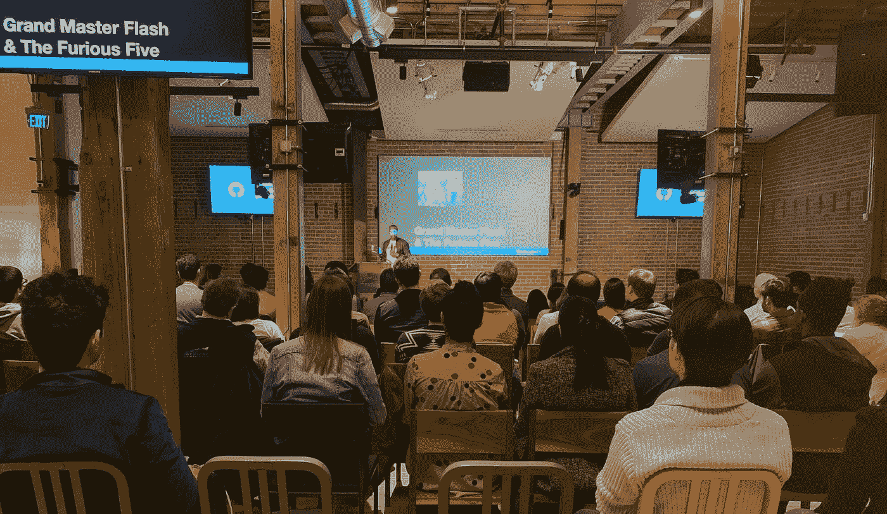
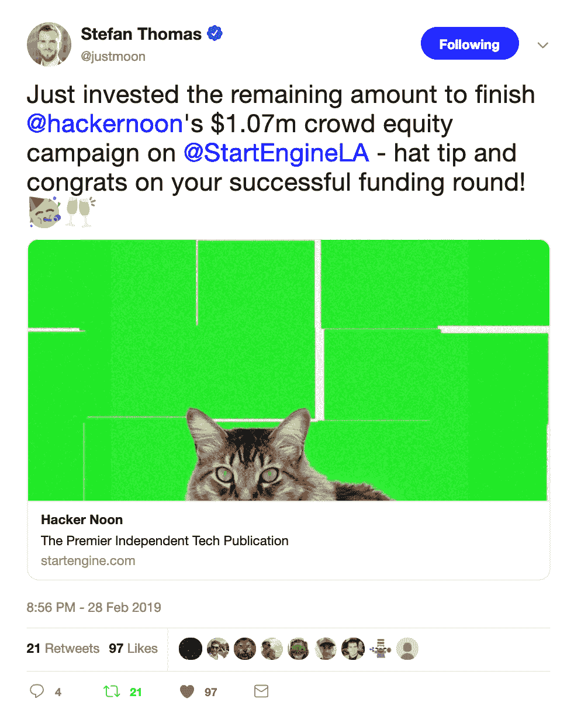
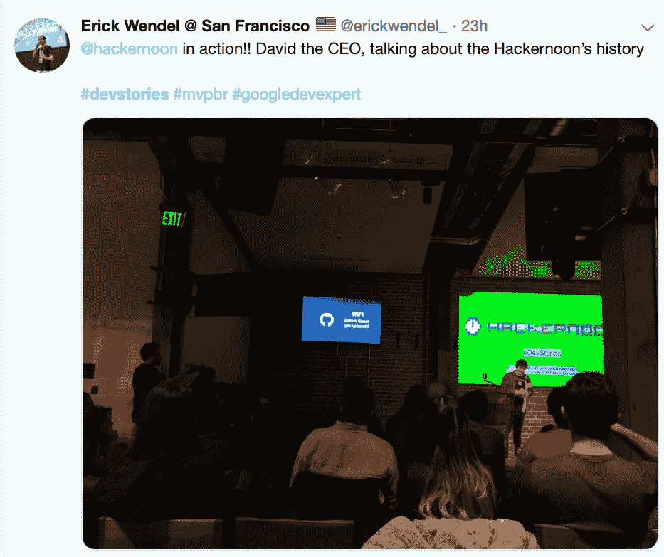
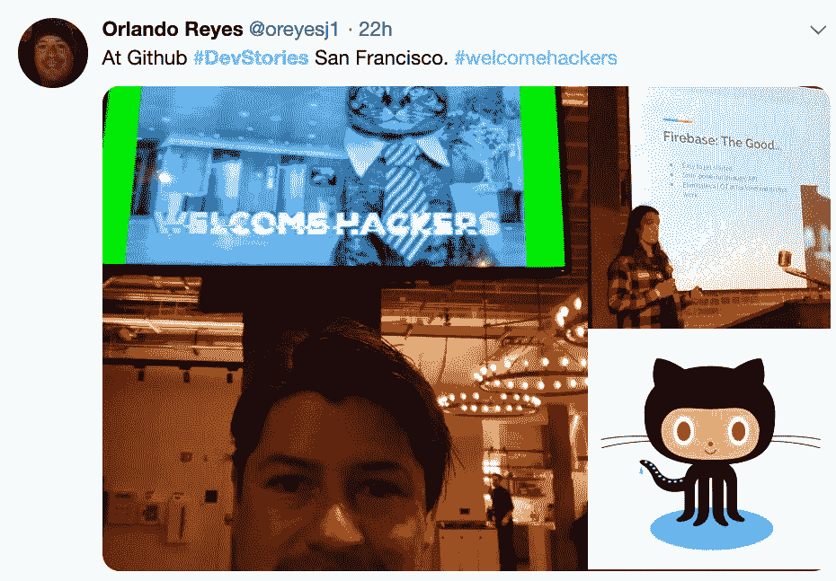
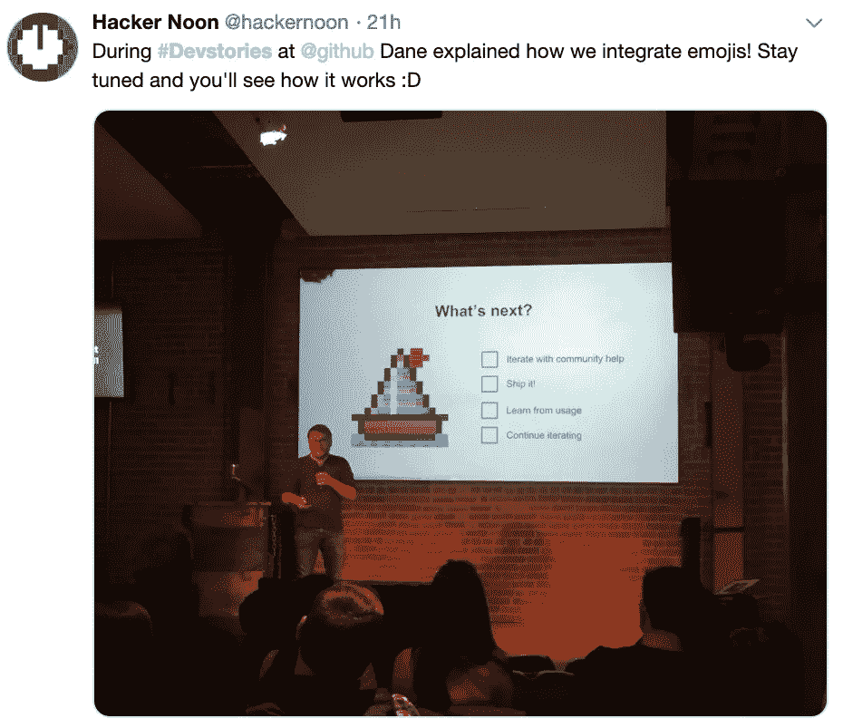
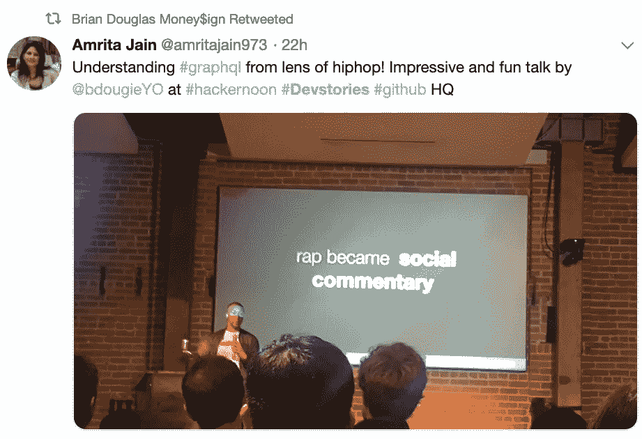
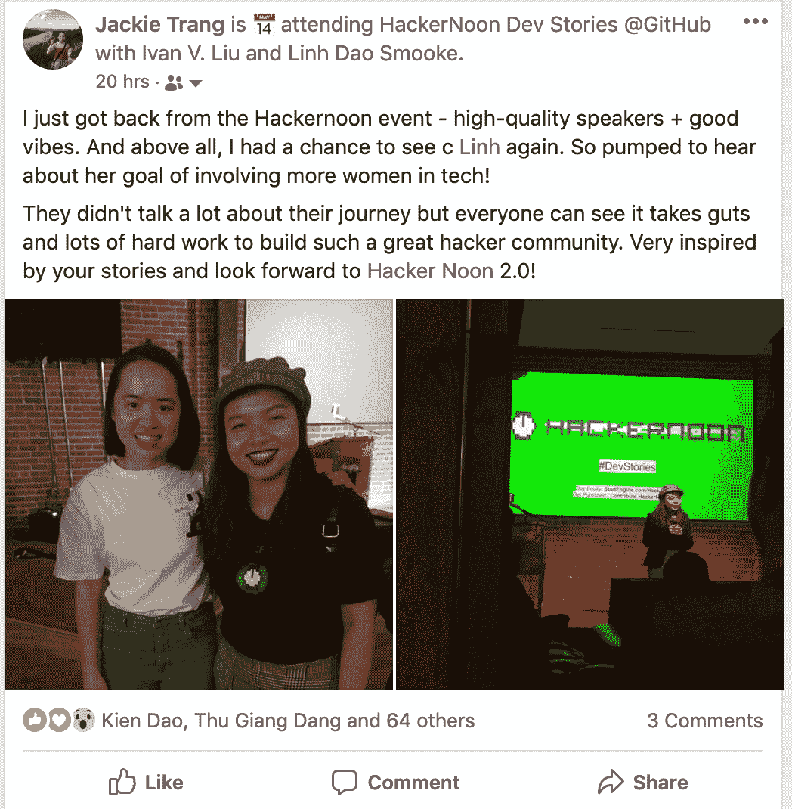
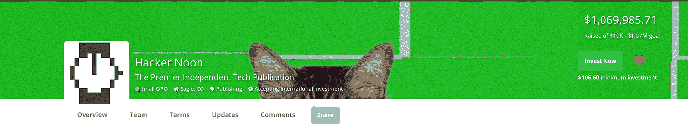

# #DevStories @ GitHub HQ，并正式超额认购众筹！

> 原文：<https://medium.com/hackernoon/devstories-github-hq-and-officially-oversubscribed-crowdfund-35cee41c07a8>

## 但是首先，向我们本周的投资者大喊:[纳德·阿扎德](https://www.linkedin.com/in/nader-azad-38482a72/)、[本·福根](https://twitter.com/bforgan)和[乔治·乔治·加利德斯](https://www.linkedin.com/in/george-georgallides/)。[我们达到了最大值](http://startengine.com/hackernoon)！

## 嘿黑客们，

## 昨晚发生了两件大事:

## 首先，120 多名开发人员参加了我们的[Hacker Noon # dev stories @ Github 活动](https://twitter.com/search?src=typd&q=%23devstories)，这是我们 8 位演讲者中的 3 位([所有资深开发人员](https://hackernoon.com/hacker-noon-dev-stories-at-githubs-sf-hq-on-feb-28-44cfbcba7d63) btw)第一次发表开发演讲。

## 其次，[我们的股权众筹现在正式全额认购](http://startengine.com/hackernoon)！呜哇！不管怎样，仍然有机会再投资一些。我一会儿再解释。

[*Thank you Stefan!*](https://twitter.com/justmoon)

# 黑客正午#devstories 事件@ GitHub HQ

Hacker Noon 最初是一个不起眼的技术博客，它是一个让资历过高和不够优秀的工程师从第一人称的角度分享他们的故事的地方。我们是一个发布他们如何工作的地方:他们在构建什么，为什么它很酷，以及他们到底是如何构建的。

Thanks for coming, [Erick Wendel](https://medium.com/u/a0d7369532ea?source=post_page-----35cee41c07a8--------------------------------)!

> “通常，软件的故事是由不做这个东西的技术主管设计的。制造这个东西的人是最好的故事讲述者，因为他们确实制造了这个东西。代码的作者是经验的独裁者。”(此处阅读完整文字记录[。)](https://hackernoon.com/green-iteration-and-trusting-the-process-7289863897)

对于我们来说，毫不掩饰地、全心全意地奉献一整个晚上向开发者致敬，这是令人满足的、有益的，也是非常需要的。

[*Hackers Welcome indeed!*](https://twitter.com/oreyesj1/status/1101328177241055233)

演讲者们努力解决这样的问题:技术能反映，或者更好地预测人类的行为吗？当涉及到设计和迭代时，如何处理选择的麻痹(用时间和金钱来决定努力)？在区块链这样一个本来就矛盾的体系中,“开放”和“封闭”之间的二元性呢？更多[视频](http://youtube.com/hackernoon) & [图片](http://facebook.com/hackernoon)来了。

[Dane showing Hacker Noon 2.0’s emojis to readers :)](https://twitter.com/hackernoon/status/1101663950142300160)

People loveeeee Brian’s talk

观众欣喜若狂。差不多两个小时了，没人离开。活动结束后，人们留下来进行更深入的交谈，并建议我们举办更多这样的活动。你知道吗，在这个之后，我们可能会。

[Lily Chen](https://hackernoon.com/@lilychendances) & [Crystal Beasley](https://hackernoon.com/@crisbeasley), 2 of our speakers

Thanks for coming, [Jackie Trang](https://medium.com/u/9af8e169c5dd?source=post_page-----35cee41c07a8--------------------------------)!

我们的下一站:伦敦——我们读者最多的三个城市之一。我们正在为 5 月/6 月的下一次活动寻找志愿者、赞助商和演讲者。**邮箱**[partners@hackernoon.com](mailto:partners@hackernoon.com)**如果有兴趣的话。**

*换挡……*

# 我们正式提高了股权众筹的最高限额！

[*$1,069,985.71 raised*](http://startengine.com/hackernoon)*! What a number.*

这是一条漫长的道路，但我们就快到了。我们现在已经进入了一个被称为活动超额认购的阶段。

*这是什么意思？*

**是的你还可以** [**投资黑客正午**](http://startengine.com/hackernoon) 。不，我们银行里还没有 107 万美元。

尽管美国证券交易委员会规定的众筹上限是 107 万美元，但超过上限的活动承诺将被列入等候名单。如果由于某种原因，过去的投资没有通过，空间将为超额认购/等候名单投资者打开。等待名单上的潜在投资者将有 24 小时的时间进行确认，然后再将现货提供给其他人。

对于那些正在考虑投资的人，请加入等待名单，很有可能会有机会为你敞开大门。

我们现在有超过 1000 名真正的粉丝，这对我来说仍然是超现实的。感谢那些已经投资、传播消息或者仅仅是支持 Hacker Noon 的人。该团队正在努力为技术专业人士打造一个最佳的发布场所。首先是向 Hacker Noon 的 OG 粉丝(开发者)致敬，并成功地转移了我们一直依赖的内容管理系统。现在任何一天。

直到下一次每个人，

[林刀 Smooke](http://hackernoon.com/@linhdaosmooke)

**附言:有一个科技故事？拜访******。****

**向我们本周的投资者大声喊出来！为那些使我们能够 [**建立一个更好的技术网站**](https://bitly.com/HNshares) **:** 的人干杯**

*   **[Nader Azad](https://www.linkedin.com/in/nader-azad-38482a72) ，迪士尼新成立的[直接面向消费者](https://variety.com/2018/digital/news/disney-reorganizes-direct-to-consumer-streaming-unit-1202726528/)流媒体部门负责发行技术组合的产品经理，**
*   **[Ben Forgan](https://twitter.com/bforgan) ，一位全球企业家，作为 [Hologram](http://hologram.io/) 的创始人/首席执行官和 [Magic](http://magic.co/) 的创始人，专注于构建互联网连接的未来，以及**
*   **乔治·乔治里德斯是 T21 风投公司的管理合伙人，也是达尔文公司的联合创始人。**