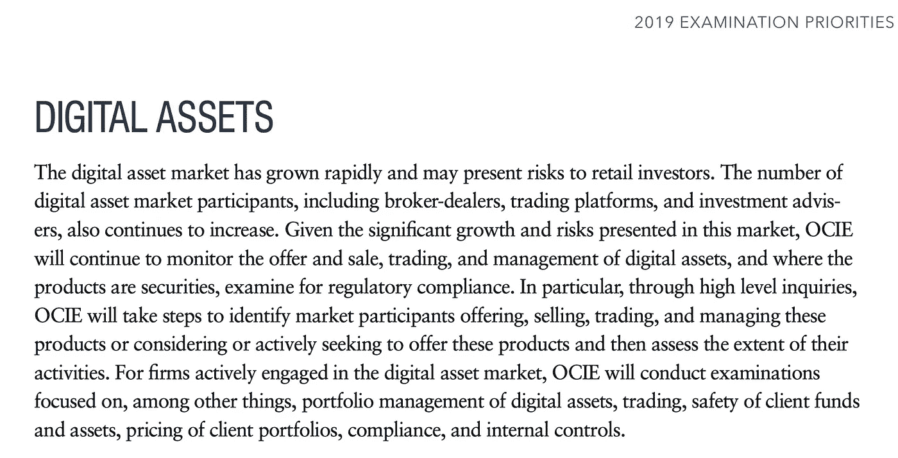
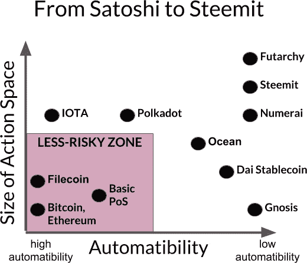
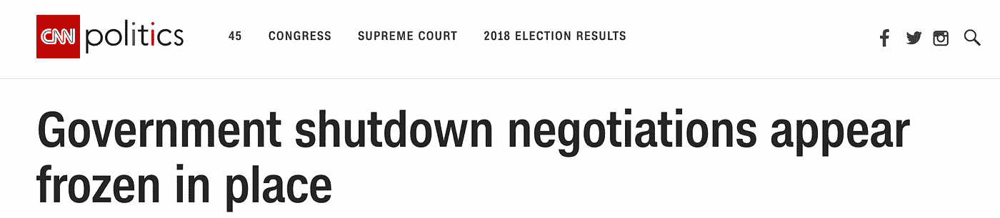

# 加密货币革命失败了吗？

> 原文：<https://medium.com/hackernoon/did-the-cryptocurrency-revolution-fail-988bf9b2fc90>

## 区块链似乎正站在伟大的边缘——它死了吗？

没有什么能像革命一样带来改变。如果成功了，他们就会打破现状，一切都不会再一样了。如果他们失败了，他们会在灾难中失败，尸体会被吊在绞刑架上。但无论是成功的——美国、法国和互联网革命——还是失败的——中国的义和团运动或伟大的犹太人反抗罗马，它们都是历史的里程碑。有些失败是因为外部力量残酷地粉碎了他们，有些失败是因为教义本身有不可克服的局限性。当市场位于其前高点的近 10%时，我们动摇了，见证了一场革命的尝试。我们护理伤口，重新分配我们微薄的投资组合，并转向面对这个问题:

“[Everyone ***WAS***getting Hilariously Rich](https://www.nytimes.com/2018/01/13/style/bitcoin-millionaires.html).”

革命失败了吗？

而我们*必须*回答这个问题。我们每个人都可以专注于自己的错误——在底部卖得太多，在顶部买得太多，就像狗追尾巴一样。但是为了自己的理智和我们的时间，我们必须超越自己的错误和错失的机会，问自己这个问题。因为如果革命没有死亡，这只是通往光明未来的暂时障碍，那么我们都应该接受罗斯柴尔德的明智建议…

> “当街上有血的时候就买，即使血是你自己的”——罗斯柴尔德男爵

**如果加密市场没有死亡，现在就是冒险者大赚一笔的时候了。**

# 加密货币革命

很容易将[加密货币](https://hackernoon.com/tagged/cryptocurrency)热潮归类为一场革命。革命建立在激进的思想上，加密货币致力于消除货币的集中化，这当然是一个激进的概念。我们可以在任何寻求推翻现状的运动中找到许多相似之处。甚至加密货币运动的人口统计数据也确实显示出与其他大规模运动的相似之处。吸引了相似的人群:年轻人，那些没有家庭的人，以及那些仍在探索自己道路的人——冒险者。教义可能不同，但吸引人们的总是相同的:一个重塑自我的机会，一个扭转沮丧情绪的机会，以及一个纠正错误和进行变革的机会。那么，从革命的角度来分析密码，我们能学到什么呢？首先，我们可以了解我们在这个过程中的位置。Crypto 未能从一个激进的运动演变成一个既定的转变。阅读埃里克·霍弗的 [*真正的信徒*](https://www.amazon.com/True-Believer-Thoughts-Movements-Perennial/dp/0060505915) 可以获得这方面的有趣观点。我们可以说，密码未能从推测走向应用。要了解这是一个小挫折还是一场令人心碎的灾难，我们必须更仔细地观察。

Dissatisfaction breeds rebellion

革命既取决于领导人，也取决于教义。我们可以在密码革命中创造同样的区别:**项目(领导者)**和**分布式账本技术(教义)**。

# 失败

过去三年见证了分散市场、自动化设备、赌博服务、货币、预测软件和交易平台等一切事物的出现。人们预示着区块链的潜力。这真的感觉像一场革命。但结果却是**什么有形的东西都没有出现。** 2018 年本该是“领养年”唯一的有形产品是一个价值 1300 亿美元的众包平台和一种去中心化的货币——但事实证明，即使是这样，使用起来也非常不稳定、困难和昂贵。这在很大程度上是一场失败的革命，至少在短期内是如此。让我们互相指责。

要揭开真正的罪魁祸首，我们必须分析领导人和教义。如果我们的结论是领导人失败了，但理论是合理的，那么我们只需要新的领导人。新的领导者总是会崛起。但是，如果教义已经腐烂，我们应该重新调整我们的精力。

正如你将读到的，两者都有责任。领导革命的项目当然错误地处理了他们的发展，骗局比比皆是，但技术主义本身也导致了一些令人失望的结果。但是并没有失去一切。

TLDR:如果区块链技术有未来，而且项目的不当行为是主要原因，市场无疑会复苏。如果技术本身存在缺陷，最好把精力花在别的地方。

# 为什么领导者失败了？

团队和项目引领了加密革命。虽然有些人成功了，但有些人却悲惨地失败了。我们不需要看很远就能看到许多项目和团队的欺诈和不道德行为的例子。这个行业当然吸引了那些肮脏的人，但也让他们有了机会。甚至许多诚实的领导人在遭遇失败时也没有受到渎职的指责。遇到了障碍，犯了错误，忽视了基本原则。

我们可以将项目的失败和戏剧性的崩溃归因于以下几点:

1.  **低估政府监管的影响**
2.  **区块链公司的财务实践**
3.  **设计糟糕的应用程序**

## 政府规程

“政府无法阻止比特币。他们无法监管它。他们不会监管它。即使他们这样做也没关系，”投资者们鼓吹道。这些陈述中唯一被证明适度正确的是，政府可能无法真正“阻止”比特币或加密货币。但历史表明，它们肯定会让市场陷入瘫痪。市场天生具有投机性；有关美国证券交易委员会(SEC)打击和中国禁令的报道并不一定非要成为现实，才会导致股价飙升。

其次，监管既关闭了现有公司，也限制了新实体的运营能力。ico 成为 SEC 的目标，人们被指控欺诈，新公司不得不通过法律障碍来确立自己的地位。投资基金和私人投资者在进入加密投资的法律雷区时必须非常谨慎。所有这些都被证明对整个市场有极大的影响。

展望未来:在这方面，我们有理由感到乐观。假设政府加强监管，其效果是可以预测的。市场将会调整，既定的法律将为金融机构和企业家提供一条清晰的前进道路。然而，一个令人担忧的问题是，监管机构已经失去了优先考虑这一问题的动力。但是根据 [SEC 的审查重点](https://www.sec.gov/files/OCIE%202019%20Priorities.pdf)，数字资产监管仍然是重中之重。

[CCN Report](https://www.ccn.com/sec-lists-cryptocurrency-as-a-top-examination-priority-for-2019/)

## 财务实践

对许多公司来说，领导层非常糟糕。专注于在弗洛伊德·梅威瑟营销和奢华派对上花费数百万的项目；他们浪费、滥用资金，缺乏好的开发人员，并且专注于制造宣传而不是制造产品。这尤其是由于筹款模式:ICO。

众所周知，大量的前期融资会导致糟糕的商业实践。许多企业家在没有兑现承诺或开发出成功产品的情况下就变得富有。努力工作应该导致成功的提升，而不是相反。仅仅因为一份白皮书，就有数千万的资金存在银行里，公司几乎没有压力去高效或有效地发展。

**展望未来:**要确保高质量的项目得到资助，而低质量的项目得不到资助，现实是至关重要的。这也不是什么大问题。如果技术是健全的，更好的领导是存在的，并将继续出现。

## 设计糟糕的应用程序

应用程序过于关注整合区块链，而不是吸引用户。大多数应用程序很早就失败了，但那些成功的应用程序创建了笨重的产品，具有笨重的 UI/UX，严重依赖集中化，并且与现有的解决方案相比绝对没有优势。达普一到达就已经死了。

此外，项目低估了设计具有大“动作空间”的应用程序的难度[阅读这篇文章，全面了解](/berlin-innovation-ventures/behavioral-crypto-economics-6d8befbf2175) [Elad Verbin](https://medium.com/u/6fba3a5e83fc?source=post_page-----988bf9b2fc90--------------------------------) 的观点。围绕比特币设计一个激励结构，其中应用的经济学围绕两个选项——“验证或拒绝交易”——相对简单。围绕具有多个动作和低自动化潜力的系统设计一个应用程序是非常具有挑战性的。项目极大地低估了为许多复杂问题设计分散解决方案的难度，结果失败了。

[https://medium.com/berlin-innovation-ventures/behavioral-crypto-economics-6d8befbf2175](/berlin-innovation-ventures/behavioral-crypto-economics-6d8befbf2175)

> 应用[机制设计](https://en.wikipedia.org/wiki/Mechanism_design)来生产“在野外”运行良好的系统是一项非常困难的任务，即使在最好的条件下——单个玩家的行动空间很简单，易于分析和优化。当行动难以优化时，因为它们会在“低风险空间”之外，机制设计者几乎没有机会。— [埃拉德·韦尔宾](https://medium.com/u/6fba3a5e83fc?source=post_page-----988bf9b2fc90--------------------------------)

**展望**:这个我不太看好。我们现在知道，区块链并不像我们最初认为的那样普遍适用。我们仍在等待杀手级应用——向大众证明区块链的应用。但首先，我们需要重新评估我们对区块链的使用。

## 结论

很明显，区块链革命的领导人在几个方面都失败了。项目未能有效地管理自己，它们未能适应监管世界，它们未能开发有用的应用程序。然而，尽管这些项目中有一些失败了，但只要技术基础健全，仍然有希望和巨大的潜在价值。

# 教义:区块链和其他分布式账本技术

很明显，领导人并不是这次事故的唯一责任人。该学说本身存在缺陷，未能吸引广泛的受众，也未能产生显著的影响。区块链是一个相当激进的学说。民主的出现推动了政治体系的权力下放。区块链是负责数字系统去中心化的学说。该学说是否合法可以从两个方面来看:

**论点 1:去中心化对于新兴数字世界的安全和发展是必要的。因此，这项技术的失败部分是由于它来得太早。但需求终究会到来。**

**论据 2:分权没有必要，事实上从根本上与人类社会不相容。有一天，民主也会垮台。**

## 论点 1:权力下放是必要的

我们必须承认，权力下放效率较低，也是唯一的出路。我们下定决心走向民主——但仅仅是在经历了数百年的暴政之后。最终，尽管效率低下，我们最终决定权力下放是最重要的。这是有先例的。

> 一个人只要读一读历史书就会明白，效率并不总是等同于好。

集权总是更有效率——无论是在政府中(暴政或君主制)，在金钱中(中央银行)，还是在组织中(教练、指挥、首席执行官)。棒球队、管弦乐队和企业不是民主是有原因的；如果是的话，进步将是罕见的。只有当一个人相信“绝对的权力导致绝对的腐败”时，分权才是合理的。如果绝对的权力可以诚实而合乎道德地运用，那么解决的办法就是将权力赋予诚实而合乎道德的人。它与我们最伟大的历史领导人一起工作。然而，如果一个人相信那个古老的租户，那么分散化是唯一的方法。权力制衡与民主化决策— *它们是低效的吗？* **是的。** *他们的进步是否令人沮丧？* **是**。暴政会取得更大的成就吗？ **当然可以**。但是人们必须简单地阅读历史书籍，看看效率并不总是等同于好。因此，权力下放不仅重要，而且对自由社会至关重要。

The world may have been moving towards democracy — but old institutions didn’t go easily

但是革命也必须有广泛的基础。他们必须恰当地识别问题，并围绕解决方案建立支持。如果现状被大众接受，革命就会很快消亡。称之为现状的暴政。如果东西没坏，就不要去修它。现在一定是人们无法接受激进变革的时候了。法西斯主义和共产主义没有在美国兴起是有原因的。那么，为什么加密革命未能吸引更广泛的基础(至少在短期内)？

回过头来看，尽管有许多数据泄露、银行欺诈案件、高昂的转账成本和“集中化的危险”，但这些问题还没有严重到需要立即采用。事实是，大多数人基本上没有受到这些侵犯隐私行为的影响，对集中化的风险视而不见，对西联汇款收取的刑事费用漠不关心。对于一般人来说，现状是可以接受的。以及那些现状不可接受的地方(津巴布韦、委内瑞拉等。)，满足不了需求。在祖母对比特币感兴趣之前，事情需要变得非常糟糕。

但有理由假设需求会到来。我们既需要数字价值交换，也需要保护转移到数字世界的巨大价值[(阅读此处的论点)](https://hackernoon.com/why-cyptocurrencies-wont-be-irrelevant-for-long-ec9ccb7d1286)。如果我们承认数字世界将很快需要去中心化，唯一需要回答的问题是区块链是否是去中心化最有效的方法？

## DLTs 是最有效的分权方法吗？

任何革命都必须为问题提供可行的解决方案。我们都知道区块链的问题。鉴于目前区块链和其他 DLT 是*唯一的*技术，我不认为我实际上有适当的知识来决定它们是否是正确的去中心化技术。

不管怎样，我的想法是:平台扩展的限制被广泛记录，在分散的环境中推进创新的挑战也是如此。叉子比比皆是，以太坊和比特币仍然慢得令人痛苦，权衡被深思熟虑和辩论，我们没有更接近可以与 Visa 竞争的应用程序——如果这曾经是目标的话。事实证明，分权远不如集权有效，这并不奇怪。

但这也是*所期待的*。我也不相信大多数可伸缩性问题不会随着时间的推移而得到解决。人们继续建造新的 DLT，为未来带来希望。然而，我认为折衷将是分散技术的固有特性；因此，我们需要问自己应该下放哪些权力。

# 观点 2:权力下放与人类社会不相容

## 自由主义与集体主义及其与区块链的关系；

自由主义与集体主义之争可能是过去一千年来最深刻的辩论。这场辩论体现了权力下放的挑战，西方自由民主的结果就是例证。

洛克和亚当斯以及宗教改革的领导者们是过去一千年中最深刻的思想革命的创始人。自由主义和个人的理想化是引入民主、促进民族国家、防止圣战和促进我们今天所期望的个人自由的基础。比特币似乎只是这种自由趋势的延续:**如果一个中央集权的力量可以随意操纵他们交换价值的手段，那么个人就不是自由的。只有我，只有我一个人，负责保管我的财富，我才能拥有真正的自决权。**

问题是，也许是自由主义，就此而言，比特币是做空的。事实仍然是，人类远非个人主义者。在哲学和思想上，我们可能是独立的个体，但是我们的行为揭示了我们对集体主义的倾向。我们定义自己，也许首先是通过我们的名字，但其次是通过我们的群体身份:我们的宗教，我们的政治信仰，我们的家庭，社区，国家，城市。可以想象，自由主义与我们的自然存在方式是完全矛盾的。

Just look at today’s news to see the downsides to democracy

这与加密货币有什么关系？嗯，也许权力下放不是办法。也许在许多情况下，成本大于收益。也许许多新兴的区块链应用实际上与我们正常的生活方式相矛盾。我们喜欢自己的信用卡奖励，以及将失败归咎于他人的能力。我们喜欢效率。我们喜欢集体主义、安全感和可控的利率。如果我们采取这种观点，我们必须得出结论，区块链会死，所有的 DLT。民主也许不远了。

# 真相

真相介于两者之间。权力下放和区块链无疑在安全和安保方面提供了优势。然而，它们受到影响所有分权组织的同样的限制。如果我们承认这些限制中有一些是无法克服的，但也意识到权力下放的重要性，那么问题就是:**我们可以在哪里和什么地方应用区块链？**

## 真正的用例

我们唯一的机会是试图预测区块链和 crypto 的短期轨迹(5 到 10 年)。除此之外的任何预测都是不可能的；我们无法预料其他技术的未来状态；对经济和世界秩序不可避免的变化视而不见；或者对权力下放的需求将如何演变。1995 年，没人能预测到易贝、脸书、YouTube、Snapchat 或 Waze。

从短期来看，我相信我们会看到 DLT 在以下四个领域的应用:

1.  **分散的价值储存:**稀缺的数字价值储存的重要性将继续增长。我认为比特币不会很快消亡，挑战者将会出现。我相信我们还将看到更高效的加密货币的崛起，它们将开始在在线市场上获得更广泛的使用。然而，这不会一蹴而就。
2.  **公司间协作过于繁琐和昂贵的领域:** DLT 将首先在实体间协作程度高而信任度低的行业中采用。目前，克服这些挑战的唯一方法是通过复杂的文档技术。因此，这些行业将受益于采用 DLT，尽管它们效率低下。最有可能符合这一类别的行业是供应链，无论是农业、制造业还是食品生产。

3.**新兴物联网技术:**即将到来的物联网革命将为安全技术创造巨大需求，使设备能够互动、共享信息和自动化决策。考虑到许多公司可能会跨物联网运营，区块链可以为预期的合作困难提供一个可行的解决方案。

4.**数字资产，如收藏品或股票:**我们将继续看到数字资产的出现，包括收藏品和股票。我认为视频游戏行业可能会采用这种解决方案来处理游戏中的可交易物品，尤其是考虑到视频游戏已经是数字化的。我预计许多股票也将向数字资产转型。苹果股票数字化稀缺只是时间问题。

**补充说明:**密切关注那些出现在上述行业中的公司。随着 DLT 用例的开发，钱包、投资工具和安全升级将会成功。 [Kzen Network](https://www.kzencorp.com/) s 是一项值得关注的有趣钱包技术。他们的钱包叫做 [ZenGo](https://www.zengo.com) 。

# 结论

革命总是混乱的。激进的想法从来不会没有问题，旧秩序也不会悄无声息地消失。DLT 过去几年的起伏跌宕具备了一场成功革命的早期阶段和一场失败革命的典型灰烬的所有特质。

我相信答案在中间的某个地方。我们必须接受现实，认识到贪婪和管理不善导致了许多公司的失败，高估技术的潜力导致了巨大的投机，抵制机构的影响远远超过最初的预期。在某些方面，我们没能尊重集权与分权之争的巨大规模——我们的争论只是千年战争的一个缩影。

与此同时，我们不能让恐惧影响我们的判断。区块链和其他 DLT 的许多基本面没有改变。这项技术仍有许多合法用途，尽管没有最初推测的那么多。DLT 继续制造令人震惊的头条新闻。但我们必须更明智；更吝啬；对团队和领导者的要求更高。我们必须更加批判地看待，更加勤奋。区块链和 DLT 将会产生影响——如何产生影响仍有待确定。

在推特上关注我:[**@ noamlevinson**](https://twitter.com/noamlevenson)

如果您喜欢该内容，请按住鼓掌按钮！它帮助我获得曝光率。

*我喜欢获得问题或建议，所以请发表评论吧！*

***免责声明:这不是投资建议，仅仅是我对这个话题的看法。自己做研究。***