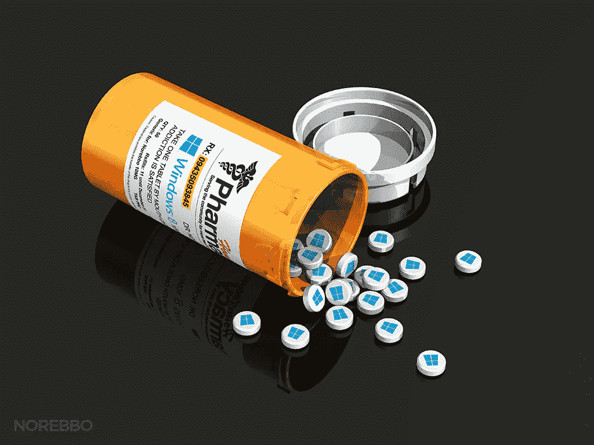
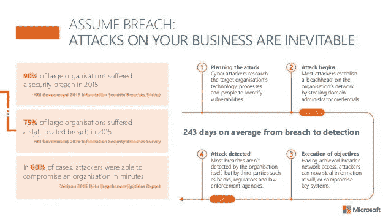
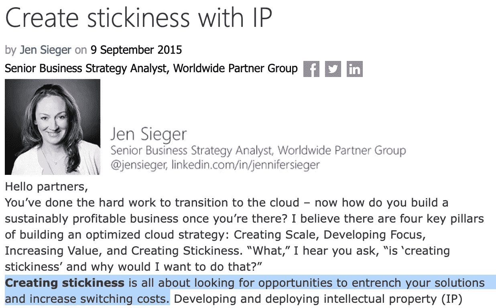

# 数字氧

> 原文：<https://medium.com/hackernoon/digital-oxy-122de9091786>

尽管维护的老化产品组合从未像今天这样复杂、漏洞百出、易受攻击或管理成本高昂，但世界各地的 IT 专业人员都认为微软产品仍然是同类产品中最好的。值得称赞的是，按市值衡量，微软是世界上最大的公司，他们的产品的流行是不可否认的，Windows 仍然是事实上的游戏平台，所以很容易理解为什么这么多人有这种印象。但市值、流行程度和游戏并不是衡量一切的标准，当依赖于实际考虑消费者和企业福利的指标来确定哪一个是最好的时，一个不同的叙事立即变得明显。

一个恰当的例子是，尽管他们的流行程度或市场容量有限，但当基于强调业务福利(优先考虑质量、生产力、简单性、安全性、可支持性等)的指标对他们进行评估时，为了找到一个相对于竞争对手而言有利于微软支柱的指标，人们将不得不绞尽脑汁。事实就是如此，个人电脑的发明者 IBM 注意到，通过将用户迁移到苹果生态系统，拥有成本降低到 Windows 个人电脑用户的 1/3；这在一个行业中是相当大的差距，在这个行业中，哪怕是 1%的节约也会让高管们变得好色。

与此同时，没有一种云服务比微软自己的 Azure 和 Office 365 平台更容易受到攻击。在他们的云基础设施被反复开发之后，[微软](https://www.wired.com/story/microsoft-email-hack-outlook-hotmail-customer-support/)、[德勤](https://krebsonsecurity.com/2017/09/source-deloitte-breach-affected-all-company-email-admin-accounts/)和无数其他公司已经证明，要覆盖微软生态系统中不断膨胀的威胁面简直是不可能的。甚至微软自己也建议安全专业人员[在他们的云和传统生态系统中承担违约](https://myignite.techcommunity.microsoft.com/sessions/64587)；只是不在他们的营销材料里。

尽管与他们的竞争对手相比，他们的解决方案相当于一种令人肃然起敬的白痴税，但直到今天，世界各地寻求快速简便的生产效率的企业仍继续在其整个基础设施中部署微软解决方案。这怎么可能呢？尽管 IBM 强调了这些致命的缺点，微软仍然是有史以来最大的公司，Windows 怎么能成为世界上最杰出的操作系统呢？尽管如此，是什么让企业留在微软的生态系统中？

正如萨克勒家族和 T2 羟考酮家族所展示的那样，企业可以通过牺牲消费者福利和制造产品来获得巨大的利润，这些产品简化了成瘾和依赖，同时往往与它们声称提供的一切背道而驰。尽管经常被忽视，但技术也可以被设计成巩固和依赖，微软在历史上就是这种做法的典型代表。

Source: [https://blogs.partner.microsoft.com/mpn/create-stickiness-with-ip/](https://blogs.partner.microsoft.com/mpn/create-stickiness-with-ip/)

2001 年，微软因人为提高竞争门槛而陷入困境。尽管损害已经造成，但似乎他们并没有因为自那以后人为增加自己产品的出口壁垒而得到足够的信任。虽然这种方法通常被称为[锁定](https://en.wikipedia.org/wiki/Vendor_lock-in)，并且根据你问的是谁，从不赞成到非法，微软公开将其称为“[创造粘性](https://blogs.partner.microsoft.com/mpn/create-stickiness-with-ip/)，尽管它们在功能上是同义词。

一旦这些反竞争做法导致他们的产品在整个行业中饱和，微软选择设计他们的软件以增加粘性，作为一种人为提高迁移到竞争平台所需的成本和退出壁垒的手段。事实上，微软是如此有效地将这种依赖性融入到他们的产品中，以至于甚至将他们软件的现有版本升级到更新的版本经常是噩梦的实质。当试图升级到他们的竞争对手之一时，这只会变得更糟，任何现代企业都会很高兴地证实这一点；包括微软:

> “Windows API 如此广泛、如此深入、如此实用，以至于大多数独立软件开发商不使用它简直是疯了。它深深嵌入在许多 Windows 应用程序的源代码中，以至于使用不同的操作系统会产生巨大的转换成本。正是这种转换成本让客户有耐心坚持使用 Windows，克服我们所有的错误、我们的驱动程序有问题、我们的总拥有成本高、我们有时缺乏性感的视觉以及许多其他困难。客户一直在评估其他桌面平台，但是要迁移的工作量太大了，所以他们希望我们只是改进 Windows，而不是强迫他们迁移。简而言之，如果没有这个叫做 Windows API 的独家特权，我们早就死了。专注于核心 API 的应用程序开发推动了 Windows 系列产品的发展。”
> [*亚伦·康托勒，微软，2004*](https://en.wikipedia.org/wiki/Vendor_lock-in#cite_note-1)

然而，微软不可能达到市场饱和，更不用说仅仅依靠肮脏的软件建立一个十亿美元的帝国。以这种方式建立起来的技术在自由市场上往往不会有太好的表现，需要相当多的帮助来抵消这些缺点。因此，微软产品具有最高的转售利润，同时也为 IT 顾问和托管服务提供商创造了最多的机会和长期需求。虽然微软的产品很少在自由市场上表现良好，但在市场领域，这与事实相去甚远，这些领域受到其庞大的合作伙伴网络的严重影响，该网络由全球数百万 IT 顾问和托管服务提供商组成。

尽管这些产品每年为微软创造 1000 多亿美元的收入，但人们经常忽略的是，它们的大规模实施也会给整个行业带来数万亿美元的年度支持负担，而无数 it 专业人员正是依靠这种负担茁壮成长的；不管是不是搭档。据微软称，合作伙伴公司贡献了微软 95%的收入，平均而言，他们为微软创造的每 1 美元收入中，就有 9 美元来自合作伙伴公司。这不是巧合或意外，而是当微软的竞争对手可以细分他们的 TCO 时，有意的利益冲突。

尽管许多人将微软解决方案目前复杂、错误、脆弱和昂贵的状态解释为无知和冷漠的产物，但这些并不是对软件工程最佳实践一无所知的公司的行为。它实际上需要对软件有很高的理解，才能设计出巩固、依赖和锁定的软件，更不用说建立一个广泛的合作伙伴网络来分发它，微软的市场表现就是一个证明，而不是一个例外。

与普渡制药公司依赖于伪装成医生的牟取暴利的毒贩网络没有什么不同，微软似乎也依赖于一个由适应不良的专家组成的冲突网络，在整个行业巩固他们自己的产品。当将这种利益冲突与为在监管严重不足的行业中站稳脚跟而简化的产品结合起来时，微软的成功、Windows 的普及以及它们在整个行业中的持久力立即变得更加明显，并且明显不那么道德。