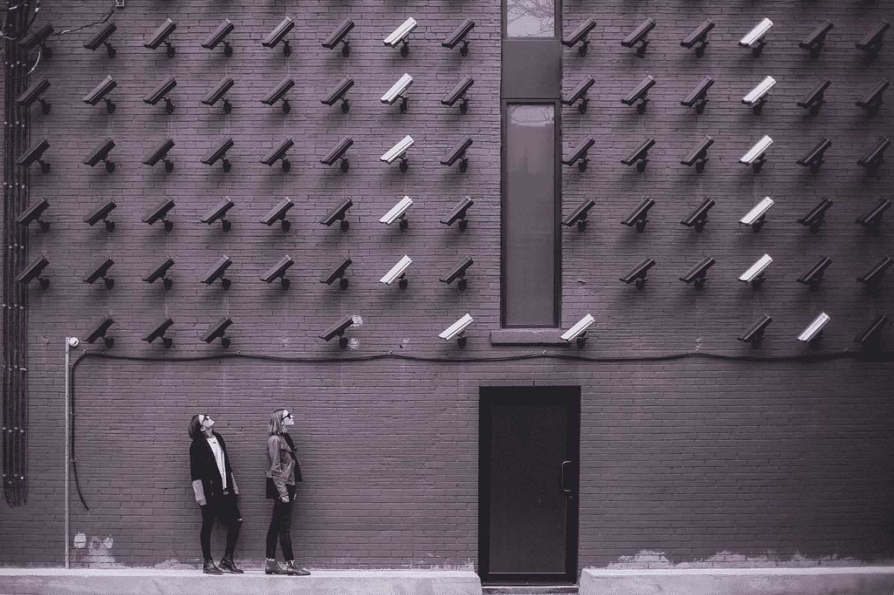

# 数字隐私:关于自由与控制的对话

> 原文：<https://medium.com/hackernoon/digital-privacy-liberty-versus-control-d4ce422bbdc3>

The internet is a space that was expected to liberate citizenry, but instead, it turned into an ecosystem for state and corporate surveillance.

在伊朗，国家监控无处不在，很难不意识到数字隐私。尽管这不是伊朗独有的现象，但博客作者、记者和普通公民都面临着因在网上写作或分享内容而被逮捕的威胁。伊朗政府审查大多数社交媒体平台和国际新闻机构的网站——要求人们使用某种形式的[代理服务器](https://en.wikipedia.org/wiki/Proxy_server)或[虚拟专用网](https://en.wikipedia.org/wiki/Virtual_private_network) (VPN)来绕过互联网审查。因此，数字隐私和互联网自由是我十多年来一直在探索的话题。

数字隐私不仅仅是一个好东西；这是我们作为人类的权利。根据*第十二条***:**

> *“任何人的私生活、家庭、住宅或通信不得加以任意干涉，他的荣誉和名誉不得加以攻击。人人有权享受法律保护，免受这种干涉或攻击。”*

*互联网是一个原本有望解放公民的空间，但它却变成了一个国家和企业监控的生态系统。1996 年，已故的约翰·佩里·巴洛——《感恩而死》的作词人和世界知名的互联网自由倡导者——撰写了网络空间独立宣言。他在信中写道:*

> *“我们正在创造一个人人都可以进入的世界，没有因种族、经济实力、军事力量或出生地而产生的特权或偏见。*
> 
> *我们正在创造一个世界，在这个世界里，任何人、任何地方都可以表达他或她的信仰，无论多么独特，而不用担心被迫沉默或顺从。"*

*巴洛在声明的结尾指出:*

> *“我们将在网络空间创造精神文明。愿它比你们的政府以前创造的世界更加人道和公平。”*

*在特勤局巴洛对史蒂夫·杰克森游戏公司进行突袭后，他与米切尔·卡普尔和约翰·吉尔摩一起成立了电子前沿基金会，以保护数字隐私、言论自由、创造力、创新。在大规模监控的时代，网络中立的失败，[为暴虐政权量身定制的算法](https://www.theguardian.com/world/2018/aug/02/google-working-on-censored-search-engine-for-china)，以及*方*——脸书、亚马逊、和谷歌——接管网络，他的愿景和 EFF 的使命比以往任何时候都更加重要。*

*爱德华·斯诺登[—](https://twitter.com/snowden)—**棱镜**、**无限线人**、 **XKeyscore** 以及秘密法庭指令等事件的曝光，让公众开始关注大众对数字隐私的需求。最近关于社交媒体平台如何利用用户数据为自己谋利的报告，明知这侵犯了用户的利益(例如[脸书的“项目图集”](https://techcrunch.com/2019/01/29/facebook-project-atlas/))，增加了人们对国家和企业对民众进行大规模监控这一主题的兴趣。因此，人们越来越有兴趣保护他们的数字隐私。*

*然而，仍然经常听到人们说，“如果我没有什么可隐藏的，为什么数字隐私如此重要。”正如爱德华·斯诺登所说:“辩称你不在乎隐私权是因为你没什么可隐瞒的，这与说你不在乎言论自由是因为你无话可说没什么区别。”正如摄政法学院教授、前辩护律师詹姆斯·杜恩指出的那样，你没有什么可隐瞒的也不是事实:*

*对联邦刑法目前的规模的估计各不相同。据报道，国会研究服务机构甚至无法统计当前的联邦犯罪数量。这些法律分散在美国法典的 50 多个标题中，大约有 27，000 页。更糟的是，成文法的条款经常通过引用的方式纳入由国会授权的各种管理机构颁布的行政法规的条款和制裁。至于有多少这样的法规还没有定论，但美国律师协会(ABA)认为有近 1 万个。*

*当连联邦政府都不知道有多少条法律的时候，你作为个人没有违反其中一条的几率有多大？红衣主教黎塞留在一句广为流传的话中说:“如果有人给我六行由最诚实的人亲笔写的字，我会从中找出一些东西来绞死他。”一个国家可以利用其收集的所有公民数据——无论是直接还是间接(如美国的 FISA 命令)——来证明起诉或勒索批评者的正当性。*

*更重要的是，我们不知道谁可以访问我们的电子邮件、信息、网络搜索等。十年之内。正如我在早先一篇关于[数字身份](/digiport/identity-past-present-future-f54f2b651021)的文章中提到的，如果我们能从过去几年的[雅虎](https://en.wikipedia.org/wiki/Yahoo!_data_breaches)、 [Equifax](https://www.nytimes.com/interactive/2017/your-money/equifax-data-breach-credit.html) 、[脸书](https://www.nytimes.com/2018/09/28/technology/facebook-hack-data-breach.html)、[谷歌](https://www.wired.com/story/google-plus-bug-52-million-users-data-exposed/)和 [Target](https://www.nbcnews.com/technology/massive-target-credit-card-breach-new-step-security-war-hackers-2D11778083) 数据泄露事件中学到什么，那就是中央数据仓库——蜜罐——公司存储数百万人私人记录的地方——是脆弱的。更糟糕的是，最终，为这些漏洞付出最高代价的是用户，而不是平台。*

* [## 数字身份:消除进入壁垒

medium.com](/digiport/identity-past-present-future-f54f2b651021) 

**我不是一个*坏人***

只有 T2 的坏人应该害怕国家监视的想法是另一个流行的误导性陈述，已经被证明是不准确的，除非你认为像民权、环境和动物权利活动家这样的人是坏人。2016 年，美国公民自由联盟报告称，[脸书、推特和 Instagram 与 Geofeedia](http://fusion.net/story/356808/facebook-twitter-instagram-geofeedia-tracking/) 分享了其用户信息，该公司被执法部门用来监控和锁定活动人士。报告发布后不久，这些平台暂停了 Geofeedia 的访问，但还有许多其他平台——Media Sonar、Dunami 和 Dataminr——具有类似的实时地理定位功能和关键字过滤。

脸书和谷歌正在尽可能多地收集我们的数据。在《连线》杂志最近发表的一篇文章中，[伊西·拉波斯基](https://www.wired.com/story/facebook-research-app-lessons/?utm_source=twitter&utm_campaign=wired&utm_brand=wired&utm_social-type=owned&mbid=social_twitter&utm_medium=social)写道:

> “这份报告[指的是一份关于脸书的'*项目图集'*'的 [TechCrunch](https://techcrunch.com/2019/01/29/facebook-project-atlas/) 报告]发现，脸书一直在付钱给年仅 13 岁的人下载一个应用程序，该程序允许脸书访问用户的全部电话和网络历史，包括加密的活动和私人信息和电子邮件。这款名为 Research 的应用程序让脸书可以看到人们的朋友是如何与这些用户互动的，这些朋友还没有同意收集他们的数据。"

社交网络通过不加选择地收集用户数据，对用户的了解超过了对自己的了解；其中很大一部分很容易被交给国家和其他第三方——通过我们注册时同意的模糊的“隐私政策”。当一个国家能够监控其公民，控制信息的获取，并获得控制异议的工具时，这个国家就有能力成为极权主义国家。

有些人指责公开分享私人数据的人幼稚，结果使他们自己变得脆弱；然而，即使他们不这样做，也不会有太大的不同。爱德华·斯诺登的爆料以及我们对“棱镜”、“无限线人”和“FISA 命令”等项目的了解，让我们毫不怀疑我们正生活在大规模监控之下。如果说从 2012-2016 年 SIGINT 战略中可以学到什么的话，那就是 NSA 拥有更大的权力。

公司国家和私人实体可以访问我们的浏览习惯、私人信息和通信方面的多年信息。关心自由、公正、透明和民主，却对数字隐私持消极态度，这是 [*双重思想*](https://en.wikipedia.org/wiki/Doublethink) 。正如[世界上最著名的安全专家和密码学家之一 Bruce Schneier](https://www.schneier.com/) 所说:“太多的人错误地将这场辩论描述为‘安全与隐私’真正的选择是自由还是控制。"* 

*如果你喜欢你所读的，我会很高兴鼓掌。在 Twitter 上关注我，获取更多关于新兴技术、隐私战和安全漏洞的前沿报道。*

*我的以太坊地址公开接受捐赠😊0x3e 78 FD 46 f 98549 e5c 5a 3799 E0 bfda e 7684133 b 78*