# 数字证券监视器

> 原文：<https://medium.com/hackernoon/digital-securities-monitor-584317ad338e>

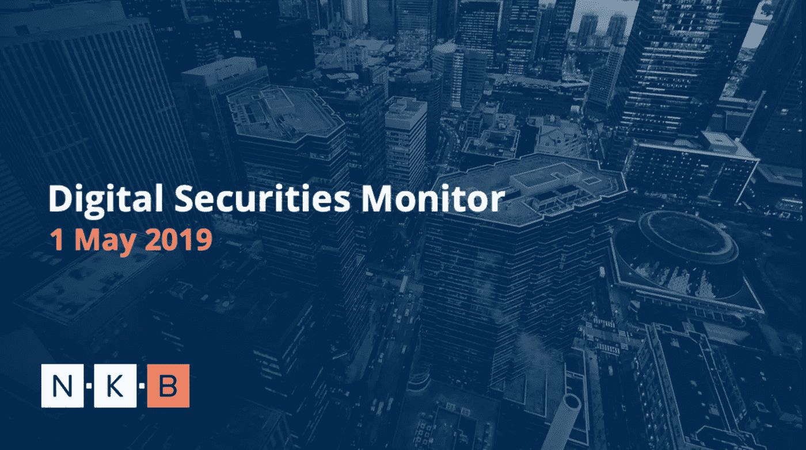

2019 年 5 月 1 日

# 介绍

**在总结部分，我们总结了 2018 年，数字证券的出现，以及区块链技术的独特命题及其对传统金融证券世界的好处。**

*   2018 年 ICO 热潮回顾
*   安全令牌产品的兴起
*   区块链技术在传统证券领域的优势

## **行业概述**

**安全令牌基础设施构建者的广泛列表，例如:**

*   发行平台
*   二级市场
*   服从
*   经纪交易商
*   监护

## **安全令牌产品**

**专门介绍实际安全令牌产品、其融资详情以及安全令牌的区别的部分:**

*   STO 市场表现
*   安全令牌分类

## **监管概述**

**深入了解我们的数字证券监控系统的重要组成部分，以及世界各地特定监管机构的立场:**

*   美国
*   联合王国
*   欧洲联盟
*   亚洲和大洋洲

## **市场发展&新闻**

**从 2018 年初至今最重要的发展和新闻，说明来自不同领域的市场参与者的活动，例如:**

*   规章制度
*   机构发展
*   安全令牌市场

## **结论**

**在最后一部分，我们将深入探讨基础设施、监管、代币发行和投资等特定领域，提出展望和改进建议，并重点关注生态系统蓬勃发展需要解决的问题。**

*   市场展望
*   参考

# 1.摘要

## ***2018 年回顾***

如果 2018 年上半年是首次发行硬币的出现，那么 2018 年下半年很可能被视为监管不确定的时期，因为 ICO 市场生态系统发生了重大变化。2017 年底/2018 年初，ICO 热潮导致超过 170 亿美元的资金流入，这无疑引起了监管机构的注意，因为他们开始打击不受监管的全球市场，以保护投资者。SEC 主席杰伊·克莱顿(Jay Clayton)在 2018 年年中(当时正是 ICO 融资的高峰期)发出的初步警告，导致 2018 年下半年融资额大幅下降，仅略高于 40 亿美元。

*图一。ICO 筹款的演变*

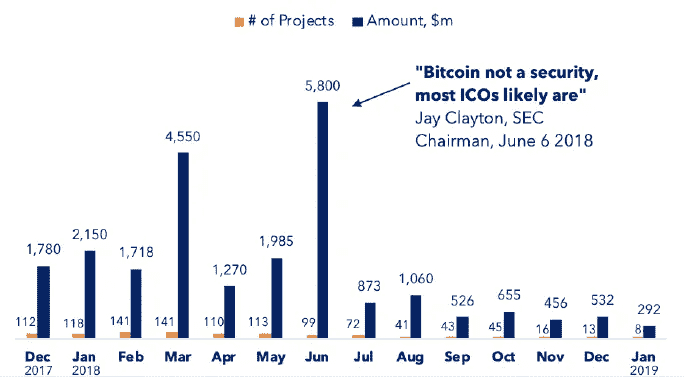

source: NKB Research / [link](https://www.coinschedule.com/stats)

## ***证券代币发行的兴起***

随着监管机构开始收紧对通过公用事业代币筹资这种新型筹资模式的控制，在许多情况下，公用事业代币甚至不是项目功能的基础，合法发行者和各种企业家开始寻找其他筹资途径。这是为了最大限度地降低监管风险，增加对投资者的保护，并最终提供基础资产的真实价值，同时仍然能够利用区块链技术(DLT)的潜力。

将金融[证券](https://en.wikipedia.org/wiki/Security_(finance))的传统结构与 DLT 的核心效率结合起来，可能会成为建立新金融工具的一个有前途的交叉点，代表着向数字化世界的自然演进。一些人甚至会认为，DLT 正在为所有证券的最终令牌化奠定基础，这是所有证券持有和转让方式的结构性转变。

## ***DLT 在传统证券界的好处***

在下面的章节中，我们将研究谁是主要的市场参与者，DLT 如何使他们受益，DLT 的独特主张，以及它的其他[好处](/loopring-protocol/the-2019-truth-on-security-tokens-7800c14129e4)。

*   **监管机构:**凭借 DLT 提供的透明度，监管机构将获得对市场和参与者更大的可见性，从而提高其效率并简化合规流程(详细内容将在本文中讨论)
*   **发行人**:接触新投资者、灵活的类似股份的结构、以前不可能实现的证券化、精确的资本表管理，以及降低成本
*   **投资者**:在流动性更强的环境中获得更多机会和进行交易的能力

**A .基于区块链的证券的独特优势:**

**互操作性**

今天传统证券的问题是它们不能互相交流。互操作性使 DLT 的资产能够以独特的方式相互参照和互动，创造出新的金融工具。

传统经纪账户可以持有各种类型的资产，如股票、债券、商品等。然而，这里的创新在于以太坊的 ERC-20 标准允许投资者持有代表许多不同 T21 类型资产的证券代币，这些代币相互作用，创造出新的金融工具。

**编码符合性**

安全令牌的另一个关键特征是它们是可编程的。证券的令牌化也使合规变得自动化。

编码权利、KYC 支票、投票、预扣税、地址排除、归属、上限表、回购、强制转让权利、治理整合、股息、股息频率和许多其他功能将允许安全令牌在不同的管辖区进行交易，包括分散的交易所。

DLT 让监管者也变得更容易，他们将不再需要搜索档案，协调多个系统并找到与证券交易相关的纸质文件；相反，他们可以见证区块链交易并查看智能合约，以直接了解某项资产的交易实践和规则。

美国特拉华州已经开始立法[努力](https://www.unlock-bc.com/news/2018-01-05/delaware-and-the-delaware-blockchain-initiative)使公司能够使用区块链作为他们关于股东的账簿和记录。这些努力是摆脱美国复杂的间接证券所有权计划的一部分，该计划需要中介机构。

**B .区块链技术的附属利益**

**部分所有权&增加流动性**

证券的代币化允许发行者将基础资产分成更小的单位，实现部分所有权，这使得一些投资者投资任何 s to 都更加实惠，也使得代币更容易在二级市场上转让。这种好处对私人市场参与者特别有吸引力，如房地产开发商、艺术品或老爷车或其他“高单位成本”资产的所有者。

尽管房地产的部分所有权已经存在于公开交易的房地产投资信托基金中，但房地产支持的代币的好处是，它们允许选择单一的投资物业，并使投资者能够在全球范围内创建量身定制的市场投资组合。

世界上的许多资产，如房地产、艺术品和私募股权基金，都具有流动性低的特点。这些资产的所有权很少进行交易，而且在转手时交易成本很高。承担这些成本的投资者理性地将非流动性资产的价值贴现作为补偿(非流动性贴现)。

随着证券代币支持部分所有权，从而降低最低投资，更多的流动性将进入市场。随着越来越多的人能够购买较小的股份，许多被认为缺乏流动性或不容易(再)出售的资产可以增加其在区块链的流动性。

**时区自由市场**

如果交易者想交易，在周一到周五的模式中(不包括节假日)，每天有 7 个小时。DLT 在这方面的优势在于全球影响力和时区自由市场，24/7/365 全天候开放。虽然，严格来说，阻止 24 小时交易的不是技术，而是传统。

**快速结算**

如今，即使在传统的金融市场，交易本身也可以非常迅速地进行，然而，所有权从卖方转移到买方的过程并没有随着时间的推移而真正发生变化。

尽管大多数交易所目前已经将结算时间从 T+5 缩短到 T+3，然后再缩短到 T+2，但这仍然意味着所有权转移至少在交易执行后的 2 个工作日内不会发生。对于私人证券，这可能需要更长的时间。

DLT 的另一个核心优势是将 T+结算载入史册:基于区块链的证券已经被证明在结算相关的时间和成本方面更加高效。有了 DLT，交易几乎可以立即执行。二级市场上买卖双方的实时结算降低了结算风险。

虽然肯定还有其他因素(除了技术本身)，但 DLT 可以将传统的金融世界转移到实时结算上。

**降低成本**

今天，证券交易的过程与许多欠中介机构的费用有关。DLT 消除了对大多数第三方的需求，此外，智能合同的集成降低了复杂性，减少了与证券管理相关的成本和文书工作，并减少了律师和后勤人员的总体参与。

我们不要忘记会计和审计流程的简化、更容易的上限表管理和发行后管理，这些都是令牌化的巨大补充优势。

# **2。行业概述**

## **发行平台**

*图二。安全令牌发布平台列表*

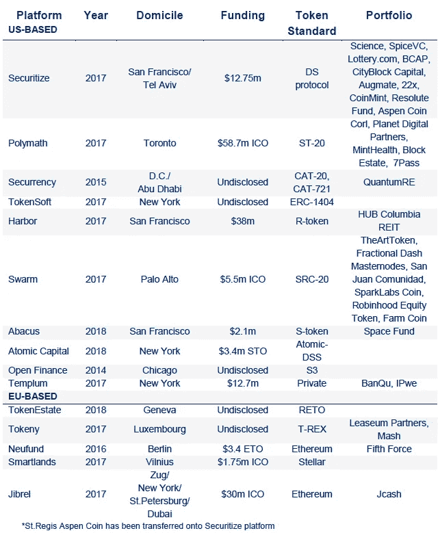

source: NKB Research

## **二级市场**

*图 3。证券代币交易场所列表*

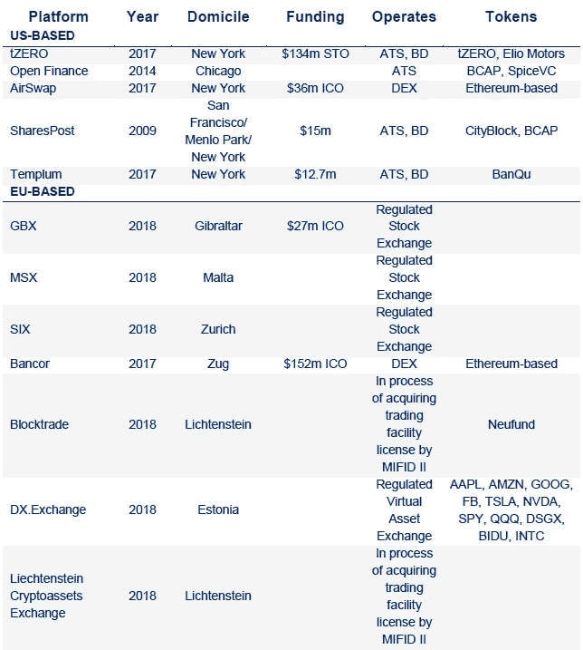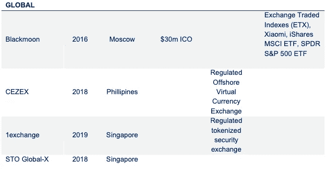

source: NKB Research

## **符合性**

尽管我们认为法律流程的某些要素(律师在其中没有增加多少价值)将在未来实现自动化，但从确定代币的性质到发行后服务，律师仍然是成功的 STO 流程的关键部分。

*图 4。“数字化”法律顾问公司名单*

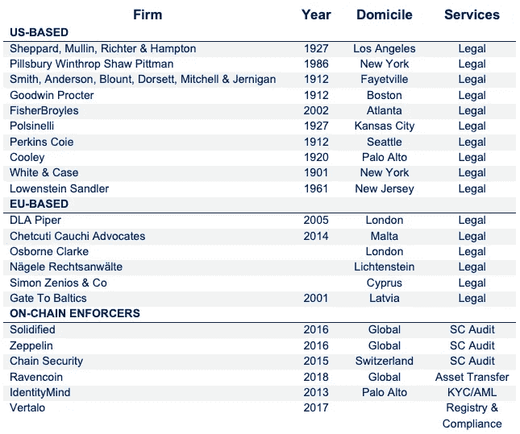

source: NKB Research / [link](https://icoholder.com/blog/security-token-offering-lawyers/)

## 经纪交易商

*图 5。经纪交易公司名单*

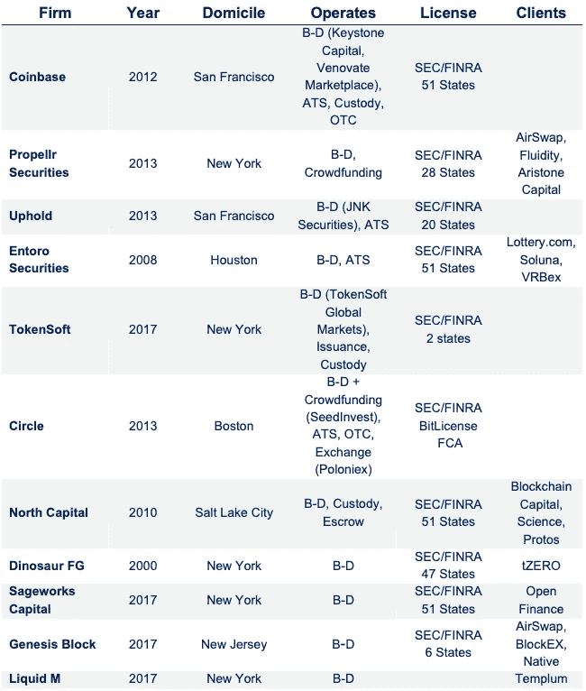

source: NKB Research / [link](https://distributed.com/news/op-ed-broker-dealers-leading-sto-market)

## **保管**

证券令牌化的另一个难题是，如今个人、经纪自营商、投资顾问、私人基金和注册投资公司如何合法有效地保护数字资产？值得注意的是，个人投资者可以将他们的数字资产存储在数字钱包中，虽然这在每个司法管辖区可能有所不同，但注册投资者有义务仅将他们的数字资产存储在合格的托管机构。

*图 6。托管提供商列表*

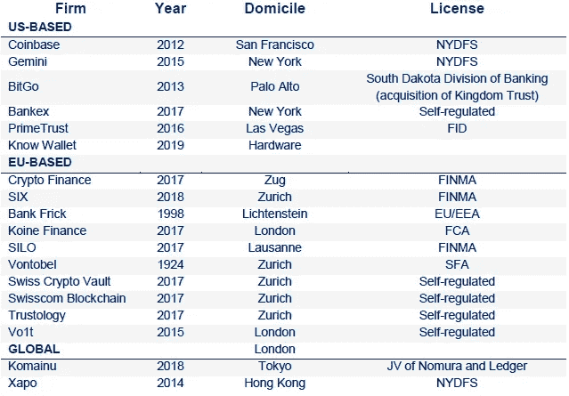

source: NKB Research / [link](/@jeanphilippejabre/the-ultimate-list-of-cryptocurrency-custody-solutions-for-consumers-and-institutions-bbe6056e8431)

# **3。安全令牌产品**

*图七。STO 筹集的资金总额*

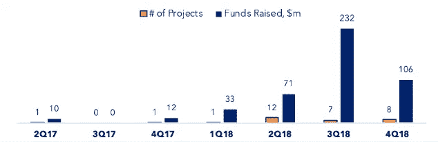

source: NKB Research / [PWC](https://www.pwc.ch/en/publications/2019/ch-20190308-strategyand-ico-sto-report-q1-2019.pdf)

*图 8。最大 sto 列表*

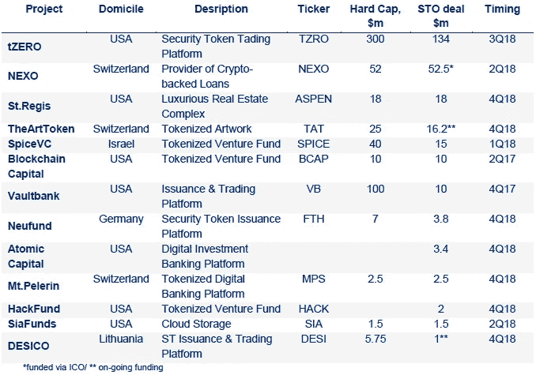

source: NKB Research

## **安全令牌分类**

*   **a .股权代币**代表一家公司的股权，或者可以转换为一家公司的股份
*   **b .收入代币**授权代币持有者获得红利或收入百分比
*   **c.**
*   **d** 。资产支持代币构成了现实世界资产的经济权利，如艺术品、房地产、发电厂等。
*   **e .混合令牌**除了作为安全令牌之外，还可以具有实用功能，例如授权令牌持有者享受服务折扣
*   **f.** **基金代币**通常代表有限合伙人在基金中的股份

## **a .股权代币**

**投票结构示例:**

**佩勒林山**

*   每个代币代表 Mt Pelerin Group SA 的一股股份
*   Mt Pelerin 集团股份有限公司的 100%股份以连锁形式发行
*   对应于 5%权益的待售代币数量
*   流动性之路:未公布

**Neufund**

*   代币代表 Neufund 的基础公司 Fifth Force GmbH 的股权
*   股权在区块链上被象征化了
*   Neufund 为资产令牌化和发行提供端到端解决方案
*   流动性之路:大宗交易、马尔他证券交易所(MSX)、币安、比特贝

**非投票结构示例:**

**Securosys**

*   集合代币可以转换成股份
*   100 个代币兑换成一份面值为 1.00 瑞士法郎的 Securosys 股票
*   当公司发放股息时，该代币使持有者有权以每代币的形式参与年度股息
*   与股息挂钩的参与是由 Securosys 以瑞士法郎、代币或乙醚支付的现金
*   每股代币的参与金额等于每股 Securosys 股票支付的股息价值的 1%
*   流动性之路:开放金融

**开放金融**

*   该令牌代表 A 系列优先股以及网络的收入份额/利润份额
*   代币持有者有权获得 10%的总调整收入(季度)
*   股息将在瑞士联邦理工学院、OFN 或其他地方支付？
*   流动性之路:开放金融

**股利结构示例:**

**金库**

*   该代币代表 Vaultbank 未来创收业务中无投票权股票的受益所有权权益
*   根据董事会和有投票权股份持有人的批准，Vaultbank 打算向代币持有人支付季度股息
*   流动性之路:建立自己的交易场所

**健康银行**

*   HBE 是一种股权象征，代表健康银行的股份
*   该代币用于持有健康银行合作社的金融股权，包括分红权
*   这些人本身没有投票权，除非投资者希望并有资格成为健康银行章程规定的成员
*   流动性之路:未公布

## **b .收入代币**

**Siafunds**

*   双重令牌:Siacoin 和 Siafunds
*   Siacoin 被用作房东和房客之间的交换媒介
*   Siafunds 按比例收取网络费用，占总支出的 3.9%
*   在 10，000 个 Siafunds 中，Nebulous(操作平台)提供了 750 个作为注册安全令牌
*   流动性之路:未公布

**Lottery.com**

*   代币代表每季度支付的净抽彩收入的固定百分比(7%)
*   代币没有投票权/清算权/使用权
*   获得流动性的途径:通过与证券化合作的二级交易场所

## **c .债务凭证**

**增益**

*   该令牌是一个 ERC223 数字安全令牌，作为资本融资的一部分，将用于履行债务协议下的义务
*   认购者或贷款人将向 Gainfy 提供为期两年的贷款，并向 Gainfy 收取年利率
*   根据指定的协议条款，债务总额加上应计利息将以资产安全令牌(收益)的形式偿还给订户
*   收益令牌将在第一个融资后周年的两周内发放给订户
*   流动性之路:未公布

## **d .资产支持证券**

**圣里吉斯阿斯**

*   该代币代表圣里吉斯阿斯彭度假村的间接分散股权
*   这个代币是由度假村的房地产作为资产担保的
*   获得流动性的途径:通过与证券化合作的二级交易场所

瑞士金币

*   SRC 价值与瑞士商业房地产投资组合相关
*   硬币的价值受两个因素影响:

1.  收入再投资:净租金收入的 80%将用于再投资
2.  价格机制:高需求可以引发更多代币出售

*   流动性之路:未公布

**发言人**

*   每一个 TAT 都以 1:1 的比例得到战后和当代艺术的支持，从发行之日起 10 年后到期，尽管用户可以延长期限
*   发行规模上限为 5000 万€，资产净值每月计算一次
*   每件艺术品都存放在瑞士政府保护的瑞士保税仓库里
*   流动性之路:将公布多个实体

## **e .混合代币**

**NEXO**

*   代币持有者从 Nexo 的利润中获得 30%的股息
*   代币由 Nexo 贷款组合的资产支持
*   基本股息按照持股比例支付给所有合格的代币持有者
*   根据 Nexo token 在 Nexo 钱包中的时间长短，为每个 Nexo token 单独支付忠诚度红利
*   忠诚红利的份额不低于总红利的 1/3
*   代币持有者在使用 NEXO 代币偿还贷款利息时会获得折扣
*   流动性之路:开放金融

**策罗**

*   代币代表公司总利润(季度)的 10%
*   股息以美元、BTC、瑞士法郎支付
*   没有投票权或优先权
*   它是一种混合令牌(令牌持有者的费用折扣)
*   必须持有代币 90 天才能获得红利
*   流动性之路:tZero

## **f .基金代币**

**SpiceVC**

*   Token 代表传统基金中的 LP 关系
*   代币持有者有权从投资组合的业绩中获得红利
*   流动性之路:开放金融

**22x 基金**

*   代币代表 22X 基金的经济利益
*   来自基金的变现用于回购代币
*   获得流动性的途径:通过与证券化合作的二级交易场所

**区块链资本**

*   Token 代表区块链资本 III 数字流动性风险基金中间接的部分无投票权经济利益
*   流动性之路:开放金融

# **4。监管概述**

## **美国**

1933 年的《证券法》和 1934 年的《证券交易法》奠定了证券的基石。两者都是对 1929 年大萧条的回应，旨在保护世界经济和美国投资者。这两部法律都旨在确保投资者拥有做出投资决定所需的足够信息。

今天的证券大多是通过所谓的 Howie 测试来判断的，这是 SEC 确定什么是证券，什么不是证券的一套条件。

**豪威测试包括 4 个问题:**

1.金钱的投资？

2.一个普通的企业？

3.利润预期？

4.主要来自他人的努力？

2012 年，美国总统巴拉克·奥巴马(Barack Obama)签署了《2012 年就业法案》(JOBS Act 2012)，即《快速启动我们的创业公司法案》(jump start Our Business Startups Act)，该法案为初创公司和其他新兴公司(年收入不到 10 亿美元)提供了更自由的融资渠道。

*图 9。美国证券监管框架*

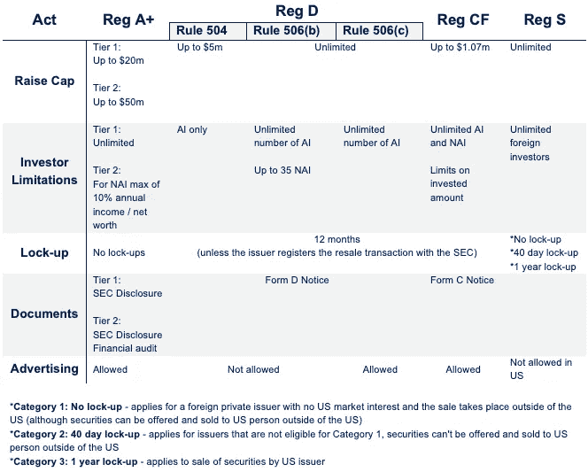

source: NKB Research / [link](https://hackernoon.com/security-tokens-in-the-us-regulations-and-exemptions-under-the-sec-laws-4640b5570948)

## **英国**

英国金融行为监管局(FCA)最近发布了一份[文件](https://www.fca.org.uk/publication/consultation/cp19-03.pdf)，概述了监管机构对加密资产的立场。与美国的豪威测试不同，FCA 希望在单独的基础上识别每个特定的令牌。虽然公用事业和交换代币不受监管，但与安全代币(特定投资或可转让证券)或构成电子货币的代币有关的任何商业活动，或者如果公司参与支付服务，将受监管。

对加密资产的监管要求与传统投资相同。用公平竞争法的话说:“公平竞争法是技术中立的”。

**令牌发行—** 安全令牌的发行者本身不受监管，但发行行为受到监管

**安全令牌—** 安全令牌的发行受证券发行法规的约束。这主要是关于财务推广规则——研究它们，找一个顾问，请不要承诺具体的回报。

**可转让证券—** 同样的规则适用于证券代币，但还需要一份招股说明书。招股说明书必须由 FCA 审查和批准。首次发行者还需要完成 FCA 的资格审查。这可以与招股说明书审查同时进行，但要尽早开始，这可能需要一段时间，尤其是在 crypto(3.75-3.81)这样的新市场中。

## **欧盟**

尽管还没有发布关于证券令牌的明确指南，但欧洲的证券受 MIFID 2 法规的监管，受欧洲证券和市场管理局(ESMA)的监管，该机构将任何资产视为证券，只要该资产是可转让的、可流通的和标准化的。在某些情况下，欧盟监管机构可能会要求证券发行人发布招股说明书，这实际上是一份向潜在投资者描述证券的披露文件。

根据招股说明书指令(2003/71/ES ),任何超过€100k 的可转让证券融资都必须发行由各自国家的国家金融监管机构批准的招股说明书。

[**2018 年 7 月 21 日起，欧盟新章程规定(EU) 2017/1129** :](http://www.wfw.com/wp-content/uploads/2017/08/WFW-Briefing-CapitalMarkets1-August2017.pdf)

不要求为不超过 100 万€(按 12 个月计算)的证券发行发行发行说明书

成员国发行的证券可免于发布招股说明书，只要资金总额低于 800 万€(按 12 个月计算)

如果硬上限超过€800 万英镑的门槛，证券发行人有义务根据招股说明书条例 809/2004 和欧盟招股说明书指令 2003/71 发布招股说明书

必须向特定成员国的监管机构提交招股说明书

在一个司法管辖区进行的公共安全发行可以很容易地扩展到所有其他欧盟成员国，从而消除对欧洲分散性的担忧

*   会员国的门槛限制和适用规则列表在这里

## [亚洲&大洋洲 ](/panony/security-token-regulations-in-asia-7ce2ac33be3d)

## **新加坡**

根据新加坡金融管理局(MAS)的规定，数字资产被归类为证券，除非它们符合以下豁免条件:

12 个月内 500 万新加坡元以下的小额和私人招揽

12 个月内不能招揽超过 50 名投资者

投资机构的私人邀约

来自合格投资者的私人征集

## **马来西亚**

马来西亚证券委员会(SC)最近发布了 2019 年资本市场和服务(证券规定)(数字货币和数字代币)令，有效地将所有数字代币归类为证券。

## **香港**

通过适当的注册，机构投资者可以在香港投资安全令牌，因为加密货币是由证券及期货事务监察委员会(SFC)监管的金融科技监管沙箱的一部分。证监会还宣布向数字资产投资基金管理公司发放牌照。

## **韩国**

韩国金融服务委员会(FSC)于 2017 年 1 月实际上宣布了一项延长的全数字令牌销售禁令

## **日本**

金融服务机构(FSA)正在考虑将加密货币相关业务从当前的《支付服务法案》纳入《金融工具和交易法案》( FIEA ),该法案将加密货币视为金融资产的价值交换工具(与法定货币相同)。这一转变也将为安全令牌在加密货币交易所上市铺平道路。

## **中国**

严格禁止所有与加密货币相关的活动

## **菲**

菲律宾监管机构卡加延经济区管理局(CEZA)推出了一套管理数字资产令牌发行(DATO)的新规则，基本上要求所有 DATO 都有适当的发行文件，详细说明发行者和项目，以及附带的建议和专家认证。所有 DATOs 还必须在获得许可的离岸虚拟货币交易所(OVCE)上市。

## **澳大利亚**

2017 年，澳大利亚证券和投资委员会(ASIC)发布了指导方针，其中代币(公用事业证券)的自然结构决定了其在一般消费者法律和公司法下的法律待遇。

# **5。市场活动**

## **法规**

*   [香港命令交易所摘牌](https://www.coindesk.com/hong-kong-orders-crypto-exchanges-delist-tokens-deemed-securities)
*   [瑞士金融监管机构将部分 ico 视为证券](https://www.coindesk.com/switzerland-will-treat-some-icos-as-securities-finance-regulator-says)
*   [立陶宛发布安全令牌指南](https://www.coindesk.com/lithuania-issues-guideline-on-when-ico-tokens-are-securities)
*   [阿联酋允许公司通过 s To 筹集资金](https://www.coindesk.com/united-arab-emirates-to-allow-icos-as-corporate-funding-option)
*   [欧盟证券监管机构建议在现有规则下监管数字资产](https://www.coindesk.com/eu-securities-group-advises-regulating-crypto-assets-under-existing-rules)
*   [SEC 关于数字证券发行与交易的声明](https://www.sec.gov/news/public-statement/digital-asset-securites-issuuance-and-trading)
*   [非洲首个安全令牌框架](https://cryptovest.com/news/raise-a-and-k-partner-on-africas-first-security-token-framework/)
*   [马来西亚将 ico 作为证券进行监管](https://www.coindesk.com/malaysia-to-regulate-icos-as-securities-offerings-from-tuesday)
*   [卢森堡通过法案赋予区块链证券合法地位](https://www.coindesk.com/luxembourg-passes-bill-to-give-blockchain-securities-legal-status)
*   [泰国为区块链证券的发行和交易开绿灯](https://www.coindesk.com/thailand-green-lights-issuance-and-trading-of-blockchain-securities)
*   [德国证券监管机构批准发行数字债券](https://www.crowdfundinsider.com/2019/02/144629-germany-bafin-approves-bitbond-to-issue-digital-securities-tokenized-bonds/)
*   [香港证监会发布证券代币详细指引](https://cointelegraph.com/news/hong-kongs-securities-regulator-issues-detailed-guidance-for-security-token-offerings?utm_source=Telegram&utm_medium=social)
*   [SEC 发布代币投资框架](https://www.theblockcrypto.com/2019/04/03/a-closer-look-at-the-secs-newly-issued-token-investment-framework/)

## **机构发展**

*   [SBI 和 Ripple 组成财团将区块链引入证券产品](https://www.coindesk.com/sbi-ripple-asia-forms-consortium-to-bring-dlt-to-securities)
*   [加拿大证券交易所利用区块链建立新的清算所](https://www.coindesk.com/canadian-securities-exchange-taps-blockchain-new-clearinghouse)
*   [瑞士瑞信银行和 ING 通过区块链发送 3000 万美元证券](https://www.coindesk.com/banking-giants-send-30-million-in-securities-over-dlt-platform)
*   [德交所筹划区块链证券借贷平台](https://www.coindesk.com/deutsche-borse-plans-blockchain-securities-platform-with-r3-tech)
*   [欧洲央行和日本银行称区块链可能动摇证券结算](https://www.coindesk.com/central-banks-say-blockchain-shake-securities-settlement)
*   [加拿大银行区块链试验显示证券即时结算](https://www.coindesk.com/bank-of-canadas-dlt-trial-shows-instant-securities-settlement-possible)
*   [瑞士证券交易所将证券令牌化](https://www.coindesk.com/swiss-stock-exchange-to-tokenize-securities-in-new-dlt-platform)
*   [泰国计划发行债券硬币以加快结算速度](https://www.coindesk.com/thailand-is-planning-a-bond-coin-for-faster-securities-settlement)
*   [中国银行通过区块链发行价值 13 亿美元的证券](https://www.coindesk.com/chinese-banking-giant-issues-1-3-billion-in-securities-on-a-blockchain)
*   [高盛支持的 Circle 收购经纪人和众筹平台 SeedInvest](https://www.coindesk.com/circle-crypto-securities-bid-crowdfunding-seedinvest-acquisition)
*   [摩根大通将金条令牌化](https://thetokenist.io/jpmorgan-to-tokenize-gold-bars/)
*   [新加坡开发资产证券化结算系统](https://www.coindesk.com/singapores-central-bank-sgx-develop-blockchain-settlement-system)
*   [美第奇风险投资公司收购数字股权](https://www.coindesk.com/overstocks-medici-acquires-digital-tokens-representing-startup-equity-shares)
*   [由 30 家中央证券托管机构组成的小组正在探索托管](https://www.coindesk.com/a-group-of-30-global-central-securities-depositories-is-exploring-crypto-custody)
*   [投资银行 BTG Pactual 计划通过 s to 筹集 1500 万美元](https://www.coindesk.com/brazilian-bank-aims-to-raise-15-million-through-security-token-offering)
*   [瑞士证券交易所计划推出区块链平台和 STO](https://www.reuters.com/article/us-six-blockchain/swiss-exchange-six-to-launch-blockchain-bourse-in-second-half-idUSKCN1PV2D2)
*   [大和完成区块链试点，以提高交易后流程的效率](https://cointelegraph.com/news/japans-second-largest-securities-brokerage-daiwa-completes-blockchain-pilot?utm_source=Telegram&utm_medium=social)
*   [Inveniam Capital Partners 将价值 2 . 6 亿美元的房地产进行股权化](https://www.coindesk.com/66-million-building-to-be-tokenized-on-ethereum-blockchain-in-record-deal)
*   [保险公司 AXA XL 推出安全令牌和众筹保险](https://ct.com/7e46)
*   [eToro 收购智能合同初创公司 Firmo](https://www.coindesk.com/etoro-acquires-smart-contract-startup-for-tokenized-asset-boost)

## **安全令牌市场**

**a)基础设施&伙伴关系**

*   [比特币基地收购三家金融公司成为受监管证券公司](https://www.coindesk.com/coinbase-says-its-on-track-to-become-a-regulated-securities-firm)
*   [Crypto Startup 收购受监管的经纪人来交易安全令牌](https://www.coindesk.com/crypto-startup-uphold-moves-to-become-licensed-u-s-broker-dealer)
*   [币安、Neufund 和马耳他证券交易所合作推出安全令牌交易所](https://www.google.com/url?sa=t&rct=j&q=&esrc=s&source=web&cd=1&cad=rja&uact=8&ved=2ahUKEwjj9pbFxsrhAhWKEVAKHaArDNUQFjAAegQIBhAB&url=https%3A%2F%2Fblog.neufund.org%2Fneufund-partners-with-malta-stock-exchange-and-binance-d01033e60402&usg=AOvVaw3dGIiHQTXDDJR04xKS5QdQ)
*   [OpenFinance 为安全令牌推出受监管的 ATS](https://www.coindesk.com/openfinance-launches-regulated-trading-platform-for-security-tokens)
*   [安全令牌发行平台 Neufund 与 Blocktrade.com 合作](https://www.crowdfundinsider.com/2018/09/139518-security-token-platform-neufund-partners-with-blocktrade-com-on-secondary-transactions/)
*   [Comistar 在欧盟推出 STO 服务平台 token ize](/@Comistar/we-have-opened-our-sto-services-security-token-offerings-in-european-union-fce1c05d54cf)
*   [CEZEX 将在香港推出证券代币交易](https://www.scmp.com/business/money/investment-products/article/2167722/philippines-security-token-exchange-readies)
*   [港湾正式推出平台](https://www.coindesk.com/harbor-launches-tokenized-equity-purchases-with-real-estate-offering)
*   [Harbor 和 BitGo 合作伙伴托管安全令牌](/harborhq/harbor-and-bitgo-7431a965a97c)
*   [发行收购 CrowdfundX](https://www.prnewswire.com/news-releases/issuance-announces-letter-of-intent-to-acquire-pioneering-fintech-marketing-firm-crowdfundx-300743319.html)
*   [安全令牌公司聚集扩大产业规模](https://www.chipin.com/industry-titans-scale-security-token-efforts/)
*   [TokenSoft 收购受监管经纪交易商的股份](https://www.coindesk.com/ico-facilitator-tokensoft-acquires-stake-in-regulated-broker-dealer)
*   [OpenFinance 交易平台上线](/openfinance/openfinance-network-first-to-launch-security-token-trading-17aec05cdda5)
*   [DX.exchange 将美国股市数字化](https://bitsonline.com/dx-exchange-tokenize-major-stocks/)
*   [EOS 区块链上的安全令牌](https://thetokenist.io/tokenized-securities-are-finally-coming-to-eos-financial-securities-protocol-fsp-unveiled-for-the-eos-network/)
*   [策罗证券代币交易正式开业](https://www.coindesk.com/overstocks-tzero-token-platform-has-officially-opened-for-trading)
*   [TokenSoft 与比特币基地合作提供安全令牌托管](https://www.thepaypers.com/cryptocurrencies-bitcoin-virtual-currencies/tokensoft-coinbase-partner-for-sto-option/776558-39)
*   [tZERO 推出交易服务](https://cointelegraph.com/news/overstocks-tzero-security-token-platform-begins-live-trading)
*   [TokenSoft 推出安全令牌托管钱包](https://www.coindesk.com/tokensoft-launches-crypto-custody-service-for-security-tokens)
*   [证券化、Coinstreet Partners 和 STO Global-X 合作将 STO 引入亚洲](https://www.thestreet.com/press-releases/securitize-coinstreet-partners-and-sto-global-x-collaborate-to-modernize-digital-securities-in-asia-14851115)
*   [高回报将使阿斯彭硬币转变为 Tezos](https://thetokenist.io/securitize-and-elevated-returns-to-tokenize-1-billion-of-real-estate-assets-on-tezos/)
*   [德意志交易所、瑞士电信和 Sygnum 合作创建合规的数字资产生态系统](https://cointelegraph.com/news/deutsche-borse-swisscom-and-sygnum-partner-to-create-new-compliant-digital-asset-ecosystem?utm_source=Telegram&utm_medium=social)
*   [Polymath 与 SeriesOne 合作推出数字证券生态系统](https://cointelegraph.com/news/funding-platform-seriesone-partners-with-polymath-to-use-its-security-token-protocol)
*   [Tokeny 和 DLA Piper 组成数字证券联盟](https://www.securities.io/digital-securities-alliance-formed-by-tokeny-and-dla-piper/)
*   [Templum 与 MIH 合作推出数字证券交易所](https://www.securities.io/templum-and-mih-to-launch-exchange-services-for-digital-securities/)

**b)交易&执行**

*   [安全令牌启动港筹集 2800 万美元](https://www.coindesk.com/a16z-founders-fund-back-28-million-raise-tokenized-securities-startup)
*   [tZERO 在 STO 筹集了 1 . 34 亿美元——还有更多的资金投入](https://www.coindesk.com/overstock-blockchain-subsidiary-raises-134-million-in-token-sale)
*   [受监管交易商 Templum 为豪华度假村举办安全代币销售](https://www.coindesk.com/regulated-trader-templum-hosts-security-token-sale-for-luxury-resort)
*   [曼哈顿第一栋令牌化公寓](https://cryptoslate.com/new-yorks-30-million-housing-development-up-for-grabs-on-ethereum/)
*   [首只令牌化房地产基金](https://blog.brickblock.io/launching-the-worlds-first-tokenized-real-estate-fund-231068889e7c)
*   [高回报通过 STO 筹集了 1800 万美元](https://www.coinspeaker.com/indiegogo-platform-hosts-first-equity-ico-securing-18m-for-elevated-returns/)
*   [第一家将股票进行令牌化的公司](https://www.mtpelerin.com/blog/world-first-tokenized-shares)
*   [Harbor 以房地产发行启动股权化收购](https://www.coindesk.com/harbor-launches-tokenized-equity-purchases-with-real-estate-offering)
*   [TokenEstate 执行第一笔安全令牌交易](/token-estate/tokenestate-executes-first-digital-share-transaction-67128c460f35)
*   [欧洲首只令牌化股权](https://thetokenist.io/neufund-to-host-europes-first-primary-issuance-of-tokenized-equity-to-general-public/)
*   [Nexo 宣布首次分红](/nexo/interim-dividend-for-nexo-token-holders-approved-8983626b4560)
*   [Sharespost 执行了第一笔二级证券交易](https://www.coindesk.com/security-token-trades-on-regulated-platform-in-market-first)
*   [Overstock 开始向投资者分发 tZERO 代币](https://www.coindesk.com/overstocks-tzero-begins-distributing-its-security-token-to-investors)
*   [SharesPost 执行第一笔 BCAP 代币交易](https://www.coindesk.com/security-token-trades-on-regulated-platform-in-market-first)
*   [阿斯彭币迁移证券化](https://www.crowdfundinsider.com/2019/01/143318-aspencoin-migrates-over-to-securitize-with-18-million-security-token/)
*   [首款医疗安全令牌产品](https://www.prnewswire.com/news-releases/agenus-to-launch-the-first-asset-backed-digital-security-offering-in-healthcare-300785670.html)

# **6。结论**

## **市场前景**

*   **基础设施**

首先，基础设施层必须发展到监管机构能够接受的水平: **b)** 对证券代币的潜在发行人来说足够方便，他们不会因为流动性困境和监管不确定性而犹豫不决，最终； **c)** 一旦这些问题得到解决，将意味着投资者有信心配置资本。

2018 年吸引了大量现有公司或初创公司，它们进入了数字证券领域，并已经推出了自己的产品。虽然形式有限，但今天，在监管机构的许可下，人们可以发行、提供、交易和存储安全令牌(取决于管辖范围)。2019 年，我们预计大多数行业参与者，主要是现有的传统二级市场，如瑞士证券交易所或 ICE 的 Bakkt，将提供机构级产品，以改善和合法化现有的基础设施。

*   **法规**

2017 年的牛市不仅引起了更广泛的主流市场的关注，也引起了监管机构的关注。即使我们不能否认监管机构以各种指导方针、建议和草案的形式做出的切实努力，2018 年也没有带来任何僵化的东西。我们预计，2019 年将最终清理数字证券的水域；我们对 ESMA 的框架特别感兴趣，因为 SEC 和 FCA 的立场或多或少是明确的。

*   **代币发售**

令牌化本身不会使基础资产变得更有价值，基本面仍然是投资决策的关键部分。实际上，对于任何 STO 来说，为了吸引投资者的注意力，基本面必须是有吸引力的、可取的和有价值的。我们认为，随着基础设施的成熟和监管的清晰，目前不具流动性的有吸引力的资产将变得象征性。除了美术、体育和房地产等行业，潜在数字化证券的一个特别有趣的领域是定向发行，这在制药行业已经很有名，只适用于更广泛的市场——例如苹果将其整个产品组合标记出来，突然之间，投资者可以做多 AirPods /做空 iPod。

*   **投资者**

产业圈最后但并非最不重要的部分是资金，它也与生态系统的其余部分直接相关。迄今为止，已有逾 5 亿美元投资于技术开发(3.2 亿美元——交易所/1.8 亿美元——发行平台)，另有约 5 亿美元直接投资于 sto，其市场规模为 10 亿美元。根据我们的估计，我们认为，凭借合法的基础设施、明确的监管和声誉良好的参与者的参与(以项目或其他参与的形式)，到 2020 年，流入令牌化证券领域的资金可能会在 2017 年全球私人资产管理公司筹集的 7500 亿美元中占有 1%的份额，导致 650%的增长。

## **参考文献**

*   [https://medium . com/loop ring-protocol/the-2019-truth-on-security-tokens-7800 c 14129 E4](/loopring-protocol/the-2019-truth-on-security-tokens-7800c14129e4)
*   [*https://hacker noon . com/the-security-token-thesis-4c 5904761063*](https://hackernoon.com/the-security-token-thesis-4c5904761063)
*   [*https://www . Bloomberg . com/news/articles/2019-01-03/Tesla-stock-on-a-区块链-offers-hint-of-where-crypto-s-head*](https://www.bloomberg.com/news/articles/2019-01-03/tesla-stock-on-a-blockchain-offers-hint-of-where-crypto-s-headed)
*   [*https://icoholder.com/blog/security-token-offering-lawyers/*](https://icoholder.com/blog/security-token-offering-lawyers/)
*   [*https://distributed . com/news/op-ed-broker-dealers-leading-sto-market*](https://distributed.com/news/op-ed-broker-dealers-leading-sto-market)
*   [https://www . PwC . ch/en/publications/2019/ch-2019 03 08-strategy and-ico-sto-report-Q1-2019 . pdf](https://www.pwc.ch/en/publications/2019/ch-20190308-strategyand-ico-sto-report-q1-2019.pdf)
*   [*https://www . gatetobaltics . com/new/security-token-offing-in-European-union-201 . html*](https://www.gatetobaltics.com/new/security-token-offering-in-european-union-201.html)
*   [*http://www . wfw . com/WP-content/uploads/2017/08/WFW-简报-资本市场 1-2017 年 8 月. pdf*](http://www.wfw.com/wp-content/uploads/2017/08/WFW-Briefing-CapitalMarkets1-August2017.pdf)
*   [https://medium . com/panony/security-token-regulations-in-Asia-7 ce 2 AC 33 be 3d](/panony/security-token-regulations-in-asia-7ce2ac33be3d)
*   [*https://www . McKinsey . com/~/media/McKinsey/industries/private % 20 equity % 20 and % 20 principal % 20 investors/our % 20 insights/the % 20 rise % 20 and % 20 rise % 20 of % 20 private % 20 equity/the-rise-and-rise-of-private-markets-McKinsey-global-private-markets-review-2018 . ashx*](https://www.mckinsey.com/~/media/mckinsey/industries/private%20equity%20and%20principal%20investors/our%20insights/the%20rise%20and%20rise%20of%20private%20equity/the-rise-and-rise-of-private-markets-mckinsey-global-private-markets-review-2018.ashx)
*   [https://hacker noon . com/security-tokens-in-the-us-regulations-and-exemptions-under-the-sec-laws-4640 b 5570948](https://hackernoon.com/security-tokens-in-the-us-regulations-and-exemptions-under-the-sec-laws-4640b5570948)

研究分析师:大卫·阿尔维/ **大卫.阿尔维@nkbgroup.io**

如果本报告有任何不准确之处，请直接联系我们提出建议。

> 本报告仅供参考。它不作为购买或出售任何金融工具的要约或邀约，也不作为任何交易的官方确认。本文档中包含的所有市场价格、数据和其他信息都是根据可靠来源编制的，但我们不保证这些信息是完整、准确或最新的。过去的业绩不是未来业绩的可靠指标。不得进一步分发。加密货币的投资与基本风险相关，包括价值损失 100%的风险。不得在数字资产被认定为非法的国家分发。
> NKB 控股英国有限公司在英格兰和威尔士注册，注册号为 11314202，注册办事处位于伦敦康诺特广场 1 号，邮编:W2 2ET。

*NKB 集团*

办事处:伦敦、维也纳/布拉迪斯拉发、特拉维夫

[www.nkbgroup.io](http://www.nkbgroup.io)

【https://www.linkedin.com/company/NKBGroup】

[https://twitter.com/theNKBGroup](https://twitter.com/theNKBGroup)

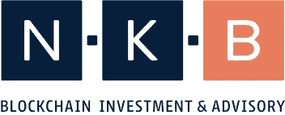