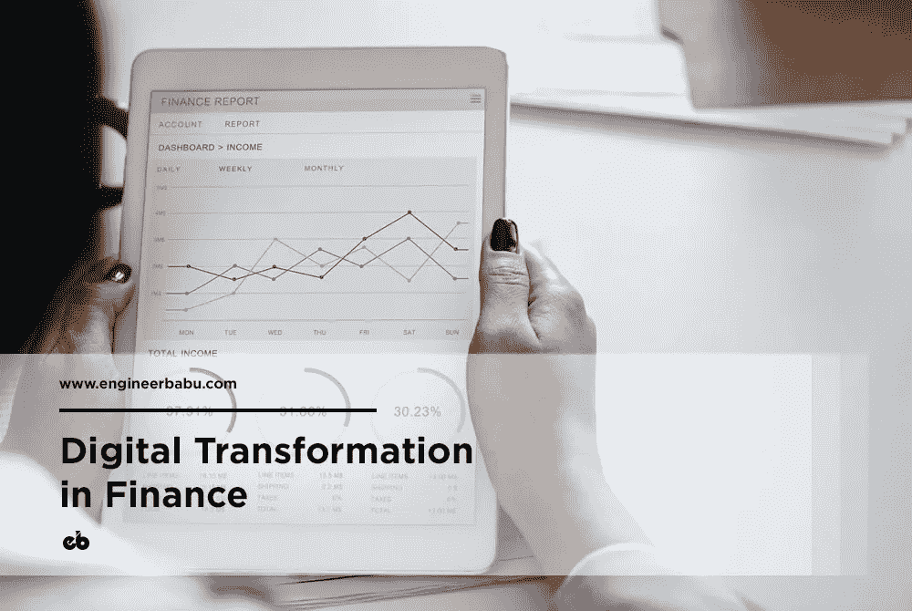
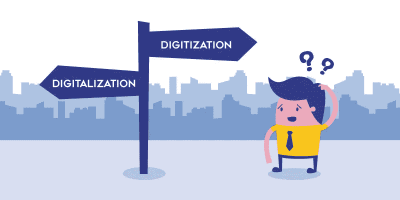
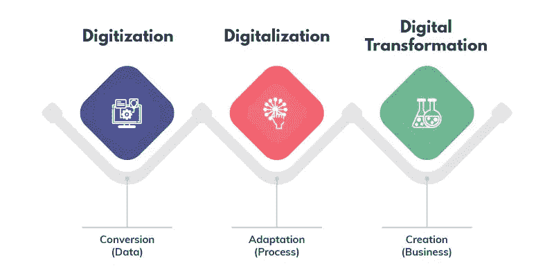
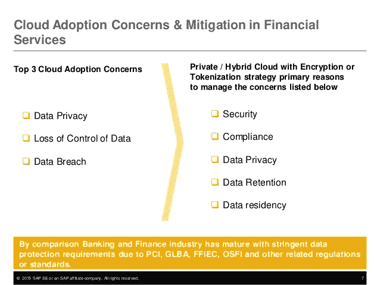
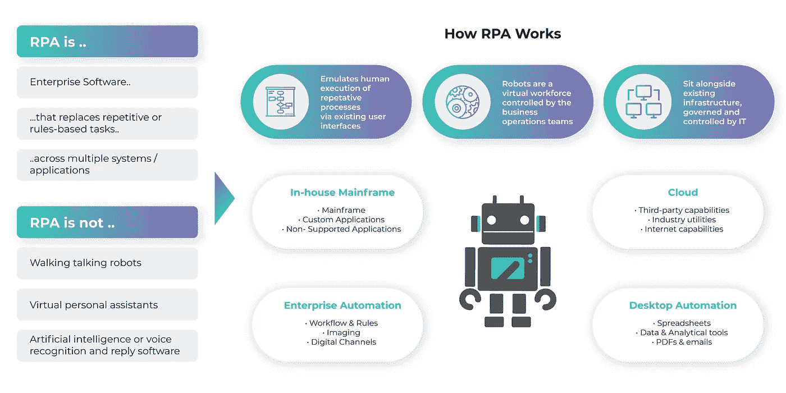
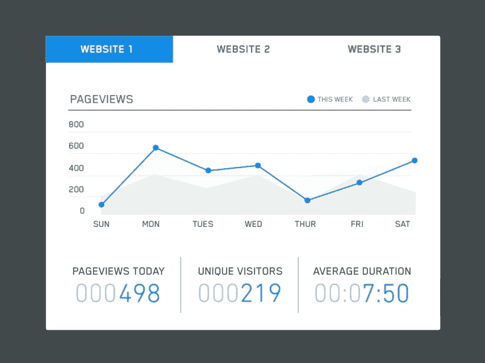

# 金融领域的数字化转型

> 原文：<https://medium.com/hackernoon/digital-transformation-in-finance-23faefa35a45>

## 数字化颠覆金融业。

Transforming Finance One Step at a Time

数字(Digital)——这个被使用或过度使用了一段时间的流行语，给金融银行业带来了巨大的冲击。*数字化或数字化转型无非是金融服务的转型*。
从客户服务到机器学习，从人工智能到移动性；金融行业从复杂、耗时的操作转变为更加简化的结构，并直接掌舵，引领这一转变的是革命性的金融科技(或 FinTech)公司。

数字化转型是利用技术重新创造高效的运营和流程。*数字化不是取代传统系统，而是利用技术使现有系统或服务变得更好。* 那么，**数字化和数字化到底有什么区别呢？**

People often get confused in these two terms. So, what exactly is the difference?

许多人认为它们很相似，但数字化是以计算机可识别的格式存储、转换、处理或传输信息的过程。而数字化则是采用新技术后社会、商业和经济行为的改变 *。*

数字化的本质是消费者、企业和政府采用&整合技术与系统、流程、人员和整个商业社区协作的方式。

数字化最好的例子之一是**苹果手表**。

Source: uxinmotion.net

Apple Watch 是理解数字化的一个完美标本，它展示了如何将一只普通的手表改造成一只具有电话、信息和互联网功能的手表。
另一个很好的例子是与 [**Aadhar 卡**](http://uidai.gov.in) **(印度居民的唯一识别号码)**相关联的**移动号码，该号码又与消费者的金融账户相关联。**

然而，推动数字化转型走向成功的不仅仅是技术，还有不断变化的企业场景、业务流程和运营文化。

瞄准数字化转型的金融项目，时间长，规模大，风险也大。尽管许多人认为数字化转型是一种炒作或混乱，但它确实涉及商业领域的一场真诚的&重大变革。自从数字化转型进入金融领域以来，已有许多调查和研究来了解其重要性或影响。数字化转型技术要求对硬件、软件甚至有时对产品或服务进行投资。

***Gartner*** *对来自大型企业机构的财务高管进行的调查显示，* ***62%*** *认为数字化转型是一项* ***管理举措*** *，而其余的则将其视为* ***优化*** *的一部分。此外，许多公司热衷于投资能够加速业务发展的技术。事实上，企业选择投资数字化转型，以区别于竞争对手。*

# 数字化转型对金融的影响

数字颠覆严重影响了职业世界的各种习惯和行为。与智能手机和互联网相结合的技术为客户和金融机构带来了诸多好处。以前，数字化转型的影响是未知的，因为人们担心从手工到数字世界的过渡。然而，现在情况发生了变化。随着更严格的监管和不断变化的客户需求，金融应用和系统变得更加灵活和先进。

对于金融机构来说，数字化不仅仅是采用云、大数据、社交媒体或移动等技术。它旨在创造新的商业模式，发展一个所有市场的消费者都可以参与的生态系统。
因此，组织更加关注利用新兴技术来帮助他们定位团队并将其转变为高绩效团队。

数字化转型使数字工具能够提高生产力和效率，并将纸质文档转换为安全的 PDF 或 HTML 格式。用申请表和产品说明书的日子已经一去不复返了。销售团队和现场人员现在可以使用智能手机和其他便携式设备轻松显示信息。许多金融服务提供商已经接受了数字化转型。然而，许多公司已经采取了观望发展的态度，然后决定投资数字化。

数字化转型伴随着风险，因此挫折方法是一条更安全的路线。

数字化对经济增长产生了积极影响，并加速了创新的增长。许多人在争论没有经济增长，但潜在的积极影响的迹象相当明显；最好的例子是**手机银行应用、手机钱包和电子钱包**。

With the introduction of banking apps; Mobile Money and E-Wallets have taken a center stage in Finance all across the world.
Source: [theninehertz.com](http://theninehertz.com)

此处列举了金融行业数字化转型的重要性:

**1。高标准化:**财务职能总是被认为是高绩效的。当这些与具有标准化流程和数据的技术系统集成时；导致高度标准化。
 **2。高度自动化的功能:**新技术工具的采用提高了汇款、采购订单、发票生成和 KYC 验证等服务的流程自动化程度。
 **3。更快的性能:**随着大数据和其他机器学习工具在金融领域的采用，预测和预报预算变得更加容易，使团队能够提前完成月末周期。

**4。洞察力驱动的功能:**数字化改变了金融模式，使资源更加集中于获得洞察力，而不是只关注交易。

**5。改善客户和员工体验:**客户和员工可以获得相同级别的信息，从而减少交易中的混乱。

6。更好的服务交付:集成了新技术的遗留系统已经改变了金融业的运营模式。结构化流程改善了服务交付。

除了高度重要性之外，世界各地的金融服务和银行机构会影响其业务的主要优先事项和挑战包括以下战略:

1.  按照监管要求行事
2.  降低零售业务运营的成本或提高利润
3.  改进的客户细分
4.  服务、产品设计和促销渠道的改进
5.  从物理或传统渠道迁移到数字平台
6.  遵循所有合规性和指导原则，将遗留系统与新技术相集成

金融组织现在实施这些战略，他们可以数字化改造和自动化其流程。其影响是，在更短的时间内执行客户操作有了显著的改进。自动化使金融公司能够满足监管期限，降低运营和交易风险，并通过技术投资保持竞争力。

数字化转型有助于自动化单调的任务、合规性管理以及会计和运营职能，包括账目、报告和分析。数字化还降低了网络风险的可能性，并最大限度地减少了因执行稳健策略而出现的错误。

# 批评家对数字化转型的回应

尽管数字化转型带来了积极影响，但批评者认为，这是技术供应商重新设计其服务和产品并以数字化转型的名义销售它们的绝佳机会。这里需要注意的另一个关键点是，没有一个技术人员会把工作时间花在数字化转型或创新上，而是花在编程、编码和开发上。然而，*批评家们没有意识到这种编码、编程和开发是使一个系统以一种特殊的方式运行的原因*。技术驱动这些系统，从而推动变革。

# 为什么数字化转型对金融业至关重要？

数字化转型可能看起来只是一个流行词，但正如他们所说，冰山比表面上看起来的要多，我们的数字化转型故事肯定也有更多。
*数字化的概念帮助金融服务高管改变已经设定的规则，经济增长非常明显。*面向客户的移动应用是最好的例子。越来越多的人依赖于移动和在线银行应用程序，金融和银行服务正在朝着数字化转型的方向发展。对客户来说，应用程序越方便，数字交易和财务增长就越多。

对于银行和信用卡公司来说，提供无停机时间和更快交易流程的移动客户体验更为重要。资本市场、基金和股票市场等其他金融机构利用大数据和自动化工具进行数据分析和高性能计算，以跟踪毫秒级的交易数据。

Progression from Digitization to Digital Transformation

仔细观察这两个例子可以发现，企业正在利用技术来改善客户体验。
***金融行业数字化转型的主要目标是更加以客户为中心。***
在金融服务领域，竞争不仅仅是与其他金融服务提供商的竞争，而是与提供真正技术和消费者体验的任何人的竞争。数字化金融服务或开发金融移动应用程序的重点应该是让客户的生活更轻松。在这里，必须指出的是，数字化转型不是一种技术战略，而是一种商业战略，使企业能够快速响应市场。

数字化为金融领域的银行、信贷和资本市场功能带来了新的机遇。有多个分支位置，很难将一个分支保持在消费者旁边；因此，移动应用程序可以让你的办公室直接在你的手中。话虽如此，许多金融机构仍然依赖于运行在 IBM 框架上并基于 COBOL 构建的遗留系统。然而，这些系统无法升级或更新，因为开发人员也转向了更新的技术。对于一些金融服务公司来说，从数据中提取数据并进入基于现代技术的系统是一个相当大的挑战。除了将遗留系统与先进技术相集成之外，公司员工接受数字化的热情也是一个挑战。但随着现有服务和产品的中断，公司有必要专注于获取新技能和技术。

在数字环境中生存的关键是适应和调整变化。首席信息官有责任接受变革并引领变革。虽然合适的技术将超越效率，但确保成功实施的是员工。

# 旨在支持金融功能的数字工具

面向金融服务行业的数字工具更侧重于改进和更新现有的能力和核心系统。还有其他指数工具，旨在提供新的能力。
扰乱金融系统的不断发展的技术包括:

**云** 在金融领域采用云的优势毋庸置疑。云带来进一步的加速和迅捷。金融服务中的云技术加速了新的数字工作流，实现了有效的部门间协作或业务与第三方之间的协作。金融机构将**基于 SaaS 的云应用**用于人力资源和会计等业务流程。随着工作人员和团队负责人对应用程序的熟悉，它将与核心系统集成在一起。金融服务/解决方案发现安全合规性是至关重要的问题。

Cloud Adoption Concerns in Financial Services
Source: slideshare.net

然而，借助支持云的应用，可以轻松扩展关键功能的数据，例如**信用评分、消费者支付、基本账户功能的报表和账单**。此外，数据速度对于金融公司保持竞争力和效率至关重要。由于敏感的个人信息，金融服务行业是网络罪犯的主要目标。云的快速性保护了关键数据、数字金融资产和用户信息，同时保护了员工的绩效。

**机器人流程自动化** 金融服务垂直领域最热门的领域之一是机器人流程自动化。金融机构在多种技术系统上工作，而流程机器人有助于跨各种系统的自动化交易处理和通信。

RPA efficiently replaces human involvement and consequently reduces human errors in the process.

流程机器人解决了金融行业的主要挑战，可有效用于:

*   计费和收款操作及应收账款功能
*   日记帐分录、分配和调整、公司间交易
*   财务和外部报告
*   预算、规划和预测
*   资金流程

过程机器人将通过降低效率和解决手工密集型活动来增强遗留系统的功能。虽然过程机器人在一些组织中处于测试状态，但是在支持遗留系统方面表现得非常好。

**数据可视化
企业高管拥有大量数据，但就这些数据进行交流是一个问题。**

Data Visualization is the key to attain meaningful insights.
Source: [dribbble.com](http://dribbble.com)

然而，通过数据可视化，人们可以很容易地跟踪和预测组织的绩效。金融部门被认为是数据中心。借助数据可视化，分析人员可以解释复杂的数据，跟踪信息的交叉点，并根据这种分析提供有助于预测组织绩效的详细信息。

据估计，超过 65%的人是视觉学习者。数据可视化技术为决策者提供了详细的可视化数据说明，以便他们能够通过可视化理解分析结果并做出明智的决策。
数据可视化还可以帮助金融部门识别互动功能和更深刻见解的新趋势和其他趋势。事实上，财务主管使用数据可视化来跟踪财务和非财务 KPI。此外，这些财务主管通过关联 KPI 指标和数据分析来提高团队绩效。

**高级分析
由于存在多种渠道，金融机构收集了大量的客户数据。使用人工智能或高级或预测分析可以有效利用这些数据来洞察消费者行为。高级/预测分析可以帮助金融机构优化其流程，从而降低成本。**

**预测分析**
预测分析最适用于欺诈检测等应用。预测分析报告的仪表板提示并提供交易数据异常的通知。除了检测异常，高级分析软件还可以帮助收集、清理和分析原始数据。这些分析还通过预测营销工作以及使用机器学习算法分析客户过去和现在的在线行为来帮助识别客户趋势。
高级分析改进了各种财务功能，并帮助财务主管获得洞察力，例如:

*   改善供应链
*   收入预测
*   识别故障点
*   欺诈检测

人工判断与自动化和高级分析的结合为业务提供了道德监督。

**认知计算** 认知计算是金融领域的又一次持续颠覆。它是一种利用自然语言处理、机器学习、语音识别和计算机视觉来刺激人类思维的技术。对于金融机构来说，收集、分析和使用数据来改进决策是至关重要的。

An idea inspired by cognitive computing. While chatting or performing financial transactions through cognitive computing, the avatar responds in different facial expressions according to the content of the conversation. It makes it appear more like a face-to-face conversation, enhancing the facial expression/emotion that is usually missing.
Source: [dribbble.com/phoenixjah](http://dribbble.com/phoenixjah)

认知计算的一些基本要素是:

*   它使金融机构能够获得有关客户的个性化信息，并使用这些信息来通知付款、账单和其他提醒。认知计算还提供关于超越客户支付和其他智能自动化服务的建议。
*   认知计算还确保创建对话界面，用于提出客户查询并对其做出回应。聊天机器人是人工智能支持的数字助理的最佳例子，开发这种机器人是为了响应客户查询，从而改善消费者服务和客户关系管理。
*   机器人顾问也是认知计算的一部分，但不是人工智能驱动的。机器人顾问使用算法来读取数据，并提出合适的建议。
*   认知技术的工作原理与人类思维相似，但被认为是安全的关键。保护财务数据至关重要；因此，认知计算是解决方案。
*   由于金融行业的法律和法规非常复杂，对数据策略的了解不足会使金融成为客户面临的一大挑战。借助认知计算，规则的实时更新和策略的实时实施有助于保持策略文档的更新并鼓励良好的合规性。
*   认知计算实现了实时交易分析和改进的交易系统，从而可以更快更好地为客户服务。

认知计算对公司和客户都有好处。支持算法、机器学习、数字顾问和网络安全改进的应用对客户管理财务产生了积极影响。

**内存计算** 金融公司处理着海量数据、更高的交易量和不断提高的合规性；出现了解决实时数据分析挑战的需要。如果是金融行业，它必须是高性能的，但是对于巨大的数据负载，效率可能会受到威胁。
海量的交易和会计数据需要一个强大的基础设施，具有高交易速度和实时性。内存计算平台解决了这些挑战。信息存储在专用服务器的主随机存取存储器中。这意味着它消除了从服务器检索数据时的延迟。
24 小时运行的手机银行积累了大量的数据，同时还有法规、汇率、利率、股价等。也需要更新。内存计算平台为用户提供实时信息和计算。它还以极快的速度实时提供有关商品交易的信息，让用户体验前所未有的金融体验。

**区块链** 最近最流行的数字工具之一是[区块链](http://www.engineerbabu.com/blog/what-is-blockchain/)。随着区块链技术的出现，金融服务业被认为进入了一个新的数字化时代。这项新技术改变了我们对交易的看法，并彻底改变了经济。区块链技术在所有扰乱金融垂直领域的技术中脱颖而出。
区块链助力去中心化数字货币，又称加密货币。

在区块链技术中，加密的数据块被视为货币，在交易过程中共享。区块链技术利用先进的加密技术来验证货币和交易。区块链技术确保只有拥有区块链部分的授权用户才能使用私钥编辑数据。
智能合约是区块链技术最具吸引力的应用之一。它自动执行商业协议和交易。由于区块链技术没有中间商，智能合同被认为比传统协议更安全，传统协议增加了中间商的成本。人们还认为，区块链技术将有助于减少欺诈，实现一次性 KYC 流程，高效的&成本效益交易，等等。

这项技术听起来可能很有前途，但要用区块链技术彻底改造金融和银行业，仍需要应对许多挑战。

# 结论性观点

我们看到上述技术颠覆金融业只是时间问题。随着消费者变得越来越聪明、要求越来越高，

> *商业机构必须进行数字化转型，以吸引、抓住并保持消费者的注意力。*

— — — — — — — — — — — — — — — — — — — — — — — — — —

## 看我的其他相关文章

**1。** [**如何创办一家 FinTech 公司**](https://www.engineerbabu.com/blog/how-to-start-a-fintech-company/) **，还上**[**hacken noon**](https://hackernoon.com/how-to-start-a-fintech-company-e12bf425338)
**2。** [**美国十大金融科技公司转型金融**](https://www.engineerbabu.com/blog/top-10-fintech-companies-in-usa/) **3。**[**fin tech 2019**](https://www.engineerbabu.com/blog/fintech-in-2019/)**，还上了**[**hacker noon**](https://hackernoon.com/fintech-in-2019-54309d19bdb7) **4。** [**区块链如何革命性地改变银行和金融市场**](https://www.engineerbabu.com/blog/blockchain-revolutionizing-banking-financial-markets/) **，也上**[**hacker noon**](https://hackernoon.com/how-is-blockchain-revolutionizing-banking-and-financial-markets-9241df07c18b) **5。** [**求教区块链给你的日常银行解决方案**](https://www.engineerbabu.com/blog/asking-for-blockchain-to-your-daily-banking-solutions/) **，也上**[**hacker noon**](https://hackernoon.com/asking-for-blockchain-to-your-daily-banking-solutions-1f9e649b0820)

> *我是 Mayank，*[*engineer Babu*](https://www.engineerbabu.com/)*的联合创始人。随时联系我关于*[*LinkedIn*](https://www.linkedin.com/in/mayankpratap/)*| mayank@engineerbabu.com(关于 EngineerBabu —* [*中*](https://hackernoon.com/how-mayank-pratap-built-engineerbabu-a-profitable-it-service-company-generating-more-than-50-000-per-month-bcd3006bdbb5) *)。*

此外， [EngineerBabu](https://www.engineerbabu.com/) 通过构建高级 IT 解决方案，帮助初创公司、企业和所有者发展业务。他们开发的项目 95%都按时完成了。 [30+获风投](https://www.engineerbabu.com/casestudies)资助，赢得最具创新总理设计奖，入选 Y-Combinator 2016 & 2017。