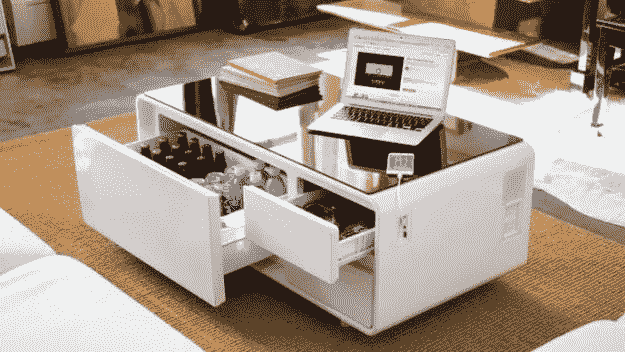
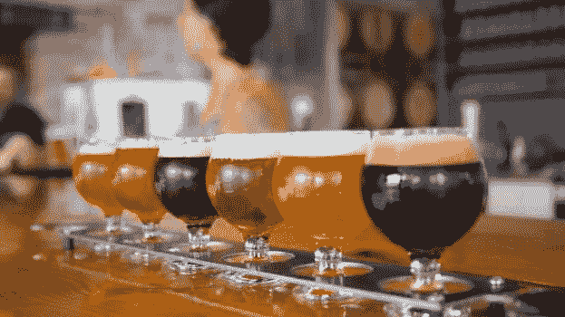
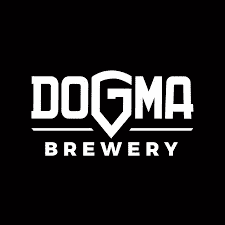
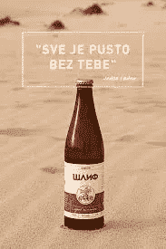

# 数字化转型与创新第一集:科技+精酿啤酒=天作之合

> 原文：<https://medium.com/hackernoon/digital-transformation-innovation-episode-1-tech-and-craft-beer-is-the-match-made-in-heaven-76192417a748>

This is a dream table. Right?

有一种刻板印象是，在技术行业工作的人下班后和朋友一起放松时，很可能会喝一些异国情调的精酿啤酒，老实说，我对此很有同感。因此，我认为这是开始我的 ***“数字化转型与创新”*** 系列的一个完美主题，我将在其中讲述有趣的故事、方法和概念，帮助你掌握在不断变化的市场中获胜所需的心态。

# 首先，我们来看看精酿啤酒行业是怎么回事。

啤酒？每个人都喜欢啤酒。当你谈论啤酒时，大多数人会想到大品牌:**喜力、阿姆斯特尔、宝拉纳、百威** **等。**

当你想到所有这些啤酒品牌时，你首先想到的是味道。淡啤酒，淡口味，浅黄色。大多数人在品尝精酿啤酒时都会说它们有点奇怪。那是因为他们习惯了商业啤酒的味道。

塞尔维亚的精酿啤酒文化没有美国那么发达。我们还有很长的路要走，但是我们能从美国精酿啤酒这个非常特殊的行业中学到什么呢？

首先，美国的精酿啤酒产业价值 260 亿美元，占据了 T21 12.7%的市场份额，这很惊人。在塞尔维亚，精酿啤酒行业仍然是一种地下社会。但我预测，随着最近教条啤酒厂的崛起，整个行业都会崛起。它与塞尔维亚的科技产业紧密相连。你可以在每一次科技聚会和活动中看到教条。此外，新的酿酒厂 Slif 凭借完全由软件控制的啤酒制作过程、出色的口味和真正有趣的社交媒体活动，正在一路攀升。

但是商业啤酒和精酿啤酒有什么区别呢？

商业啤酒是 **90%** 的营销和 **10%** 的产品。而精酿啤酒是 **95%** 产品和 **5%** 营销，有些啤酒厂是 **100%** 产品和 **0%** 营销。

商业啤酒味道相似，而每一种精酿啤酒都有其独特的味道和体验。人们倾向于购买特定的精酿啤酒，因为他们的朋友告诉他们这很好，或者他们已经看到许多人在**un tapd**上分享它，有时是因为好奇和对啤酒的热爱，而人们倾向于购买商业啤酒主要是因为常规和营销。
当有人第一次尝试优质精酿啤酒时，他们会沉迷于尝试和饮用越来越多来自不同啤酒厂的精酿啤酒，由此我们可以得出结论:

***1)精酿啤酒行业关注的是产品。***

他们自己的成功和销售取决于他们竞争对手的产品的成功和质量。

在这个行业里，啤酒厂要想作为行业生存下去，就必须齐心协力！
这是一个值得注意的信息，告诉我们所有其他行业如果想向客户提供高质量的产品，需要如何运营，尤其是我们每天都有好产品推出的科技行业。

# 这个故事对科技界的人有什么价值？

整个科技行业必须理解的第一个也是最重要的价值观是**你的竞争对手实际上是你最大的合作伙伴**。手工酿酒厂知道这一点。如果一家精酿啤酒厂吸引了一个顾客购买精酿啤酒，那么所有其他的啤酒厂也有了一个可能的顾客。我们可以看到这已经在科技领域发生了。想想社交媒体。你可能会认为 Twitter 和脸书是竞争对手，这在某种程度上是对的，但是他们非常依赖对方。你知道有多少人一生中只尝试过一个社交媒体平台？可能没有。第一个尝试将他们引入社交媒体世界的社交媒体平台。所以有些人可能会把脸书作为他们的第一个平台。他们通过使用脸书和 T21 了解并看到了社交媒体的所有好处。出于好奇，他们很有可能会尝试其他社交媒体平台。最后，他们可能会从脸书开始，但最终会在推特上结束。这就是为什么其他应用和平台的存在对脸书这样的社交媒体公司很重要。而这也是**脸书**带来 **Instagram** 的原因。

另一个很好的例子是**优步**和 **Lyft** 。大多数人的手机上都安装了**优步**和 **Lyft** 。来自**优步**的良好的首次服务意味着 **Lyft** 将获得一个潜在客户，反之亦然。

这是至关重要的一点，也是我对这个系列的第一个建议。 ***当考虑你产品的商业模式时，想想你的竞争对手，以及你如何利用他们的服务为你服务。考虑他们的商业模式，以及你如何帮助自己和你的竞争对手获得更多的客户。不要害怕召集他们开会讨论这个问题，并给他们一些好的冰镇 IPA。***