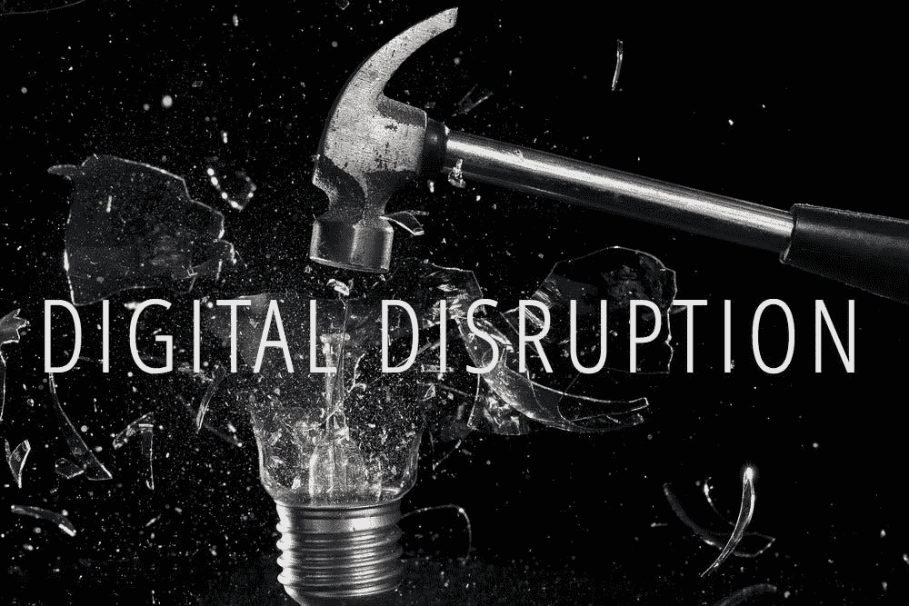

# 数字化转型与创新第 2 集:揭开市场颠覆的神秘面纱

> 原文：<https://medium.com/hackernoon/digital-transformation-innovation-episode-2-demystifying-market-disruption-717d8dc693ba>

当你想到短语 ***【扰乱市场】****时，你首先想到的是，市场颠覆者是被选中的少数人，他们只是幸运地在正确的时间找到了正确的利基。这些是我们生命中被选择的人，被选择的英雄，他们将帮助我们的生活变得更好。虽然有相当多的事实在那里，那些英雄不是那些穿着闪亮盔甲的人。那些英雄穿着相当暗的盔甲，并堆积着重型武器。他们是一些人的英雄，同时也是许多人的痛苦，因此，在 ***数字转型和创新系列*** 的第 2 集，我们将探讨为什么我们对市场颠覆的看法有点…模糊。*

**

*Clouded?*

***云**是一个坚实的基础，我应该从这里开始我的观点，因为云技术具有颠覆许多行业的潜力。一些公司很聪明地意识到，将数据和文件存储在互联网上对他们的用户来说更方便、更容易访问。这种想法广为传播，由此诞生了像网飞这样的市场颠覆者。*

*我想我们都知道网飞的所作所为以及它是如何扰乱市场的，但是有一件事我们忘记了，那就是它对它的竞争对手做了什么。还记得**大片**吗？或者其他当地的音像店？这些企业背后都有真正的人，其中很多都破产了。为什么？因为网飞和 T21 把电影搬到了互联网上。这很棒。如果我们想生活在一个更美好的世界，市场颠覆是必须的。但就像任何变化一样，对市场上的每个人来说，这都不是一个令人愉快的变化。*

# ***扰乱意味着混乱***

*破坏就是混乱。如果我们看一下市场扰乱的定义，我们简单的谷歌搜索会告诉我们:*

> ***市场混乱**是指**市场停止以常规方式**发挥作用的情况，其典型特征是**市场**快速大幅下跌。市场混乱可能是由对股票交易所的物理威胁或异常交易(如崩盘)造成的。*

*这很简单。对于大多数公司来说，市场混乱并不是真正的英雄人物。然而，我看到许多人谈论它，好像它是每天都在发生的事情。事实上，当他们的市场发生真正的混乱时，许多人会感到非常不安。这没关系。我对所有从事创新或数字转型服务的人的一个大建议是，让人们正确看待市场混乱带来的混乱，因为这样他们就能更好地理解为什么这是必须的。*

**

*人们抵制变革，害怕新事物。他们觉得做老式的事情很舒服，这就是他们拒绝改变的原因。我们让他们走出舒适区的唯一方法是将 ***颠覆性创新*** 推向市场。*

# *颠覆性创新*

***颠覆性创新**的结果是导致**市场被颠覆**。因为我们已经知道市场混乱对每个人来说都不是最愉快的时候，我们必须有一个好的框架来对抗所有试图逆转我们工作的批评者。永远记住，当市场混乱时，公司有两种选择:**适应新规则或死亡**。他们中的一些人会适应，他们会与你竞争，他们中的一些人会死去。当适应阶段结束时，你会有一些优势，但你仍然需要**迭代创新**，以便保持领先地位并制定规则。顶端只留给最勇敢的人。*

*当扰乱市场时，从法律角度考虑你的立场是非常重要的。你的颠覆性创新可能会建立在法律的灰色地带。这是全新的，具有颠覆性，很可能还没有人监管这一领域的业务。你的竞争对手会在那里等你。打架推你**违法**。*

*这两个问题现在浮现在脑海里。好了，如何获得一个好的颠覆性创新创意，如何保护我不被推下法律悬崖。答案是一样的:**分组，搭档，与人交谈**。*

*人是关键。合作伙伴是关键。团体比个人更强大。创新的过程应该有条不紊。它应该包括市场中的所有利益相关者。本系列的下一集将继续探讨合作关系如何帮助你创新，以及为什么它们至关重要。*