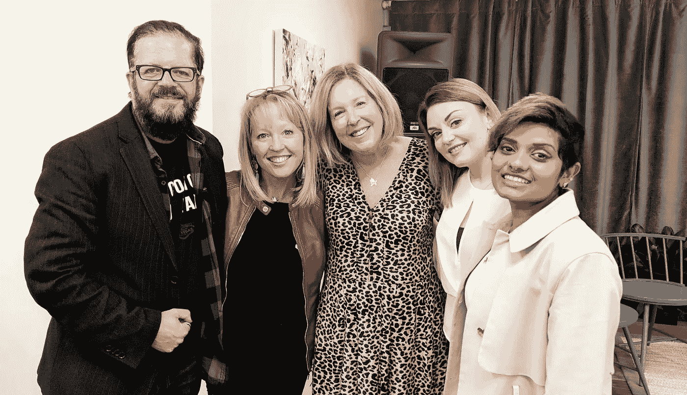

# 在 SXSW 期间，Digital Trends 的“科技为善”活动占据了中心舞台

> 原文：<https://medium.com/hackernoon/digital-trends-tech-for-good-campaign-took-center-stage-during-sxsw-f8879f8451cd>

(Photo credit: Priya Kuber)

在过去的一年里，关于隐私泄露的头条新闻[猖獗](https://www.identityforce.com/blog/2018-data-breaches)，负责任地使用技术成为今年西南偏南电影节的主题，这是一年一度的音乐和电影节，吸引了来自各行各业的[超过 75，000 名艺术和技术爱好者](https://www.cnn.com/2013/09/13/us/south-by-southwest-fast-facts/index.html)。一些 SXSW 会谈[提到了 2018 年的剑桥分析](https://schedule.sxsw.com/2019/events/PP90114)丑闻及其对品牌和消费者的影响。

布莱恩·索利斯的新书[*Life scale:How to Live a More Creative，Productive，and Happy Life*](https://lifescaling.me/) *，*在 SXSW 首次亮相，其主题是应对这些不断发展的技术现实，以回收创造力。在德克萨斯州奥斯汀的铆钉工会议上，数据伦理占据了中心位置。

Tina Mulqueen 代表最大的独立技术出版商 Digital Trends(数字趋势)主持了专家组会议，该公司因其对数据的透明使用和以消费者为中心的 GDPR 方式而受到《福布斯》的称赞。该小组就我们的后 GDPR 气候提出了有趣的问题，包括媒体、营销人员和消费者在围绕数据道德和隐私的教育中扮演的角色，是以消费者为中心主题的延续。

## **在数据使用方面，营销人员对消费者有什么责任？**

营销人员有责任教育消费者如何使用他们的数据吗？Wendy Glavin 是 Wendy Glavin Agency 的首席执行官，也是通用电气、IBM 和博雅公司的资深员工。她说，营销人员应该负责教育和告知人们，或者至少鼓励他们自学，这样人们就不会随意泄露数据。

总部位于区块链的以同意为中心的约会应用 [Loly](https://app.loly.co/) 的首席执行官 Adryenn Ashley 反驳说，希望任何形式的隐私都是一场失败的游戏。“他们试图给我更好的优质广告，这很好，”阿什利在为数据使用辩护时说。“没有隐私这回事，”她说。“表现得好像每个人都知道一切。”

“品牌或公司如何促进这种平衡，”穆尔奎因问道，“在他们如何使用数据为消费者服务，以及他们如何尊重他们所服务的数据的完整性之间？”

Gun Inc .的 CMO 普丽娅·俱吠罗说:“公司需要强制要求数据处理的透明度。”她是第一个在印度创办开源硬件公司的女性，并在 28 岁时建立了湾区第一个以女性为中心的共同工作空间。她说，虽然公司或政府可能不值得信任，但我们大多数人真正想知道的是，他们为什么使用我们的数据。这“只是一个正确信息的简单问题。只是一个“为什么”…消费者和公司需要达成共识。这是我们需要走的中间道路。”

## **呼吁围绕数据使用展开更复杂的对话**

Mulqueen 之前为福布斯撰写了关于这个主题的文章，并在去年的物联网世界峰会上谈到了如何协调人类与数据的关系，他说技术将在我们的生活中扮演越来越重要的角色，我们需要停止对创新的反应，并开始为创新做规划。“我们需要思考如何用我们想要居住的技术来建设未来，”她说。

虽然这个问题很复杂，消费者感受到了最近数据泄露的压力，但 Mulqueen 仍然保持乐观。

“我们热爱技术，我们知道关于数据伦理的讨论不是二元的，”Mulqueen 说。“这不是‘我们应该或不应该’使用消费者信息。事实上，消费者越来越希望我们利用数据让他们的生活更轻松，并节省他们的时间。问题是，大多数消费者不知道数据是如何被使用的，这使得他们在遇到坏人时不那么警惕。

## **“科技为善”活动将继续探索科技的道德用途**

该小组是我们可以从 Digital Trends 的“科技为善”活动中期待的许多此类对话的第一次。“我们希望促进关于数据伦理等问题的透明对话。我们希望突出那些善用技术的品牌和创新者，这样我们就能在创新创造更美好未来的过程中发挥自己的作用，不管这种作用有多小。”

Digital Trends 的“tech for good”计划将涵盖利用技术改善生活的品牌的编辑视频报道，为服务不足的人口和社区延续技术教育和技术包容性，并确保那些有能力创新的人正在建设一个我们迫不及待想要生活的未来。