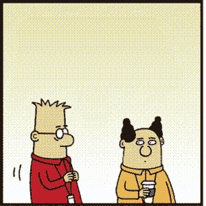
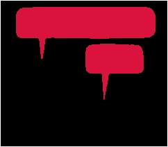
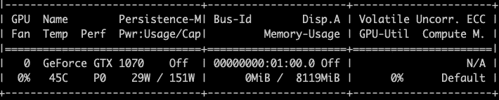
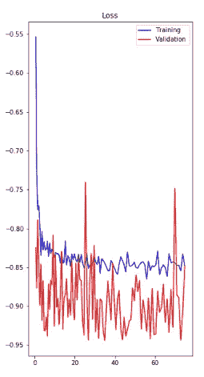
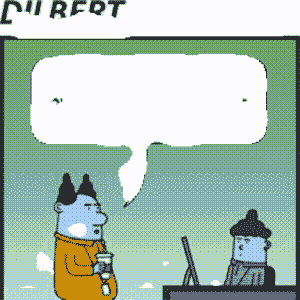
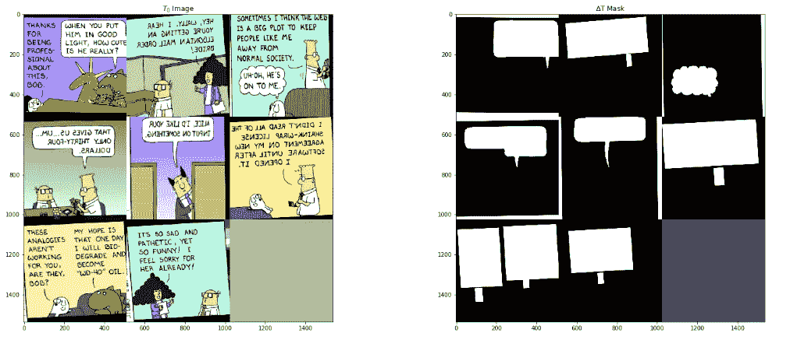

# 作为 GIF 的呆伯特

> 原文：<https://medium.com/hackernoon/dilbert-as-a-gif-f39c6a134020>

## 使用深度学习创建动画 GIF

我们提出了一种使用深度学习从连环漫画创建 GIF 的方法。最终结果如下所示:

Dilbert as a GIF

*声明:所有的呆伯特漫画都是斯科特·亚当斯的作品，你可以在 dilbert.com**找到它们*

# *gif 更好*

*在移动设备中，gif 是比静态图像更好的呈现内容的方式。由于更快的互联网速度和使用社交媒体应用程序与朋友快速分享的能力，我们也看到了 gif 的爆炸式增长。在漫画的例子中，我们经历了放大和缩小的痛苦——gif 似乎是一个自然的过程。*

# *将深度神经网络用于娱乐*

*我们都爱呆伯特，从某种奇怪的角度来说，也爱那个尖头发的老板。多亏了斯科特·亚当斯，这些年来我们得到了充分的娱乐。我们想知道是否可以将任何连环画转换成 GIF？毕竟，GIF 只是一系列图像帧。*

*为了从漫画中创建 GIF，我们将漫画剪切成独立的帧，然后使用 FFMpeg 将它们组合成一个 GIF。这就是简单又甜蜜的 GIF 获取方式。但是我们能做得更多吗？*

## *文本移除*

*我们想到删除文本，然后让它在一秒钟后出现，这样就好像这个人刚刚说了这些话。它赋予了角色生命。*

*因此，删除文本是这个项目的主要任务。*

## *培训数据准备*

*在所有不同类型的深度神经网络中，我们都需要带标签的训练数据。我们使用的训练数据是使用 [PixelAnnotationTool](https://github.com/abreheret/PixelAnnotationTool) 手动准备的。我花了 1 个小时注释了大约 200 张图片。你基本上在泡泡里面点击一次，在外面点击一次，你会得到下面的结果。该工具使用[分水岭算法](https://en.wikipedia.org/wiki/Watershed_(image_processing))来完成这项工作。*

**

*Manually Masked Speech Bubble*

## *决定深度神经网络*

*我们一直在寻找能够进行图像分割的架构。**图像分割**是将一幅图像分割成多个片段的过程。实现这一点的最著名的方法是 Mask-RCNN，它用于高分辨率图像，因为它们对图像中甚至微小的物体斑点都非常好。Mask-RCNN 还具有更高的 GPU 内存要求，在 8 到 13 千兆字节的范围内，并且需要大量调整，以便在更小的内存中进行训练，我们拥有的硬件是 GTX 1070，它只有 8 千兆字节的 GPU 内存。*

**

*GTX 1070 memory*

*虽然 Mask-RCNN 功能更强大，可以用于检测+分割，但我们只需要 Unet 足够好的分割。此外，在过去，我们对该模型的性能有着良好的体验。所以，我们决定用 [Unet 型号](https://en.wikipedia.org/wiki/U-Net)。它使用 VGG 作为基础模型，并在此基础上进行构建。模型看起来是这样的，所有的层都光彩夺目:*

**

*Unet architecture image from deeplearning.net*

## *火车，火车*

*在决定了模型之后，现在是根据手工和工具创建的训练数据来训练 Unet 模型的时候了。数据被分成训练集和验证集，并且在 GTX 1070 上总共进行了大约 15 分钟的训练。*

*让我们看看下面显示损失的图表。损失([骰子系数](https://en.wikipedia.org/wiki/S%C3%B8rensen%E2%80%93Dice_coefficient))在训练的 10 次迭代内急剧下降，然后在-0.85 骰子值附近波动。验证数据的二进制精度和损失紧随其后，也处于相同的水平。(验证数据的损失波动很大，因为它们数量很少。)*

**

# *是时候看看结果了*

*耶！辛苦了。是时候看看结果了。很棒，不是吗？*

**

*First Cut*

# *一些问题需要注意*

*对我来说结果看起来很棒，但它只完成了项目的 20%。如果你注意到上面，你会看到一些小的白色斑点散布在一些离真正的讲话气泡很远的图像上，这些看起来不太好。为了去除小的伪影，我们在生成的掩模中找到连接的组件，并去除具有阈值内的区域的组件。*

## *没有语音气泡的文本*

*此外，当文本周围没有语音气泡时，这不会很好地工作。如果你看到最近的呆伯特漫画，你会发现他们中的大多数都没有任何言论泡沫。因此，为了解决这个问题，我们需要新的训练数据，其中我们有覆盖文本的掩码。所以，我再次坐下来创建蒙版，但是这次 PixelAnnotationTool 没有帮助，我使用了[这个工具](https://github.com/tzutalin/labelImg.git)。新的训练数据结合旧的数据解决了这个问题。正如您在下面看到的，训练数据现在是这样的:*

**

*Training data with and without speech bubbles*

## *填充空白背景*

*一旦你遮蔽了一个区域，这个区域看起来是白色的。在有语音气泡的情况下，它可能看起来还可以，但是在没有语音气泡的文本的情况下，它会看起来很难看。所以，我们需要用原始背景重新绘制被遮罩区域产生的背景空白。为此，我们简单地将每个高度的像素颜色从顶部复制到该高度的每个像素。因为在每个高度至少有一个像素是真实的背景色，我们可以找到它并在那个高度复制它。*

## *帧的持续时间*

*每个帧可以有相同的持续时间，但这会使一些帧显示太长或太短的持续时间。为了解决这个问题，我们查看 Unet 模型返回了多少正像素，并相应地为不同的帧给出成比例的持续时间。*

# *将来的*

*从《呆伯特》开始，目标是覆盖尽可能多的漫画出版物。我们相信经过训练的模型可以为其他出版物进行调整。*

*一定要让我们知道你的漫画建议。*

*事不宜迟，直接去[comic2gif.com](http://comic2gif.com)创建你自己的 GIF 吧。*