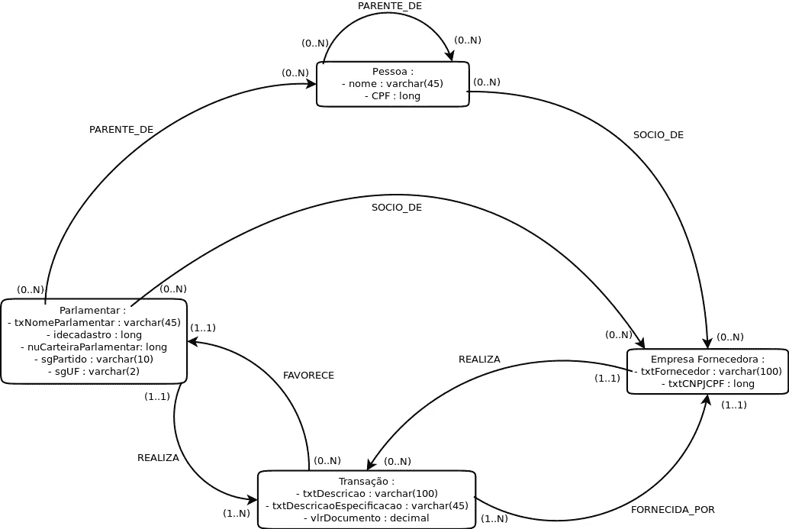
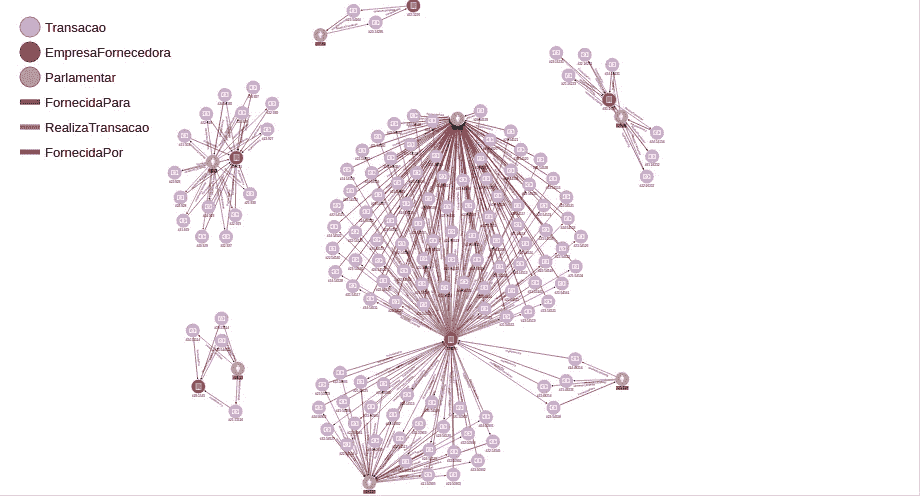
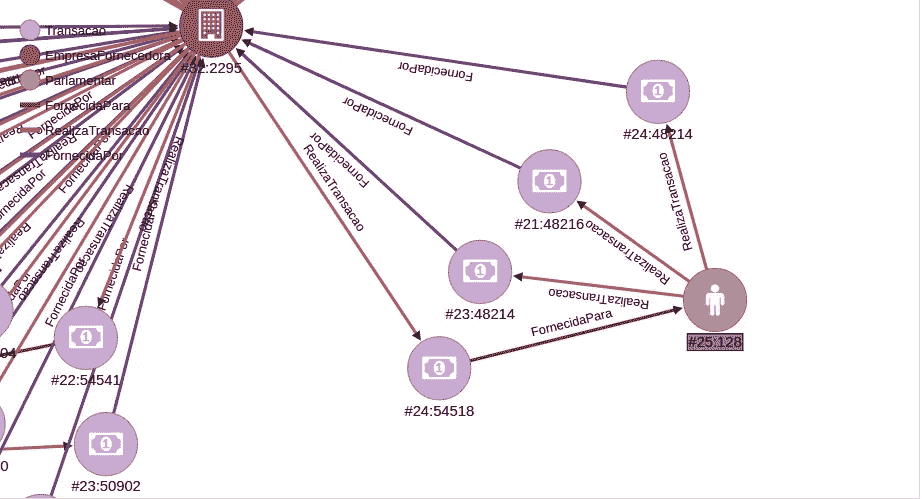
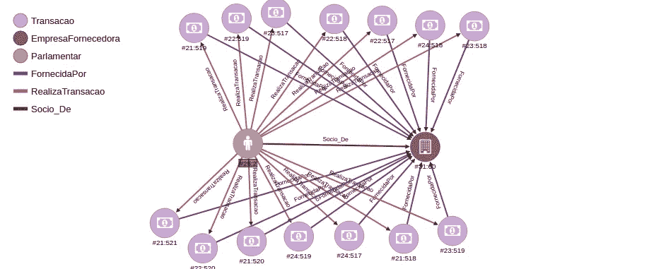
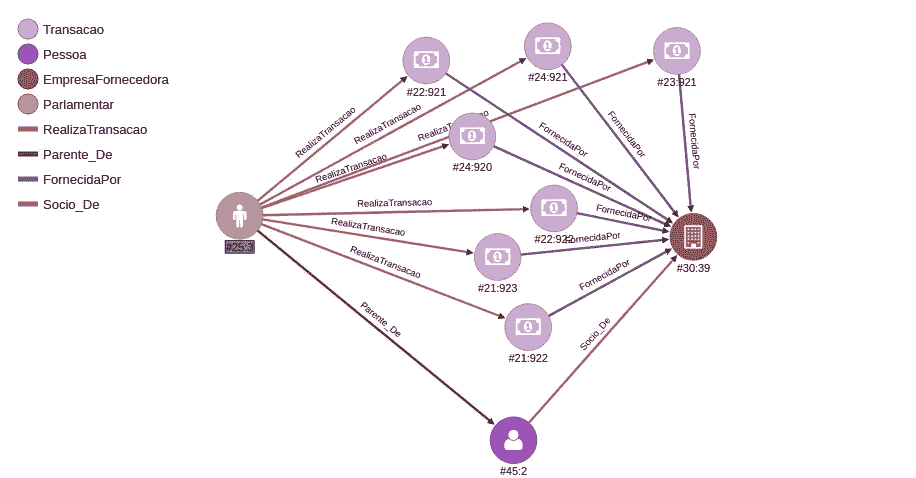
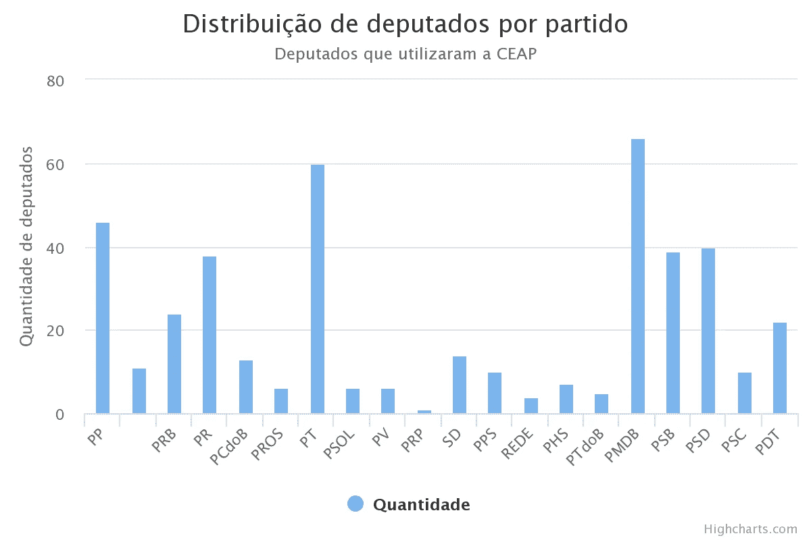
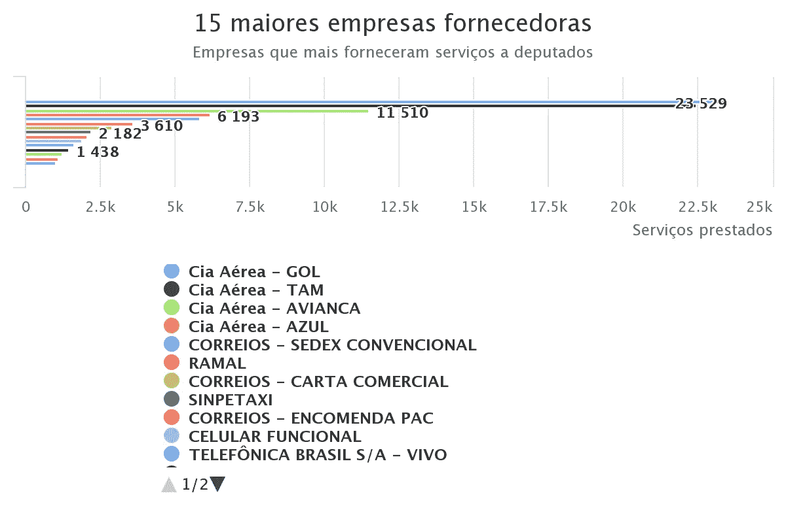

# 使用 OrientDB 发现巴西开放数据中的模式

> 原文：<https://medium.com/hackernoon/discovering-patterns-in-brazilian-open-data-using-orientdb-89f5414ae662>


Photo by [rawpixel](https://unsplash.com/@rawpixel?utm_source=medium&utm_medium=referral) on [Unsplash](https://unsplash.com?utm_source=medium&utm_medium=referral)

2018 年，我即将完成计算机科学的毕业，为了我的毕业设计，我决定研究政府的透明度，特别是众议院的公开数据。

在巴西，我们的副手每月都有配额来完成他们的工作。假设某个副手需要购买机票或为汽车加油，以便参加会议，他或她可以使用每月配额来完成这些工作。然而，这笔钱是公共的，因此使用它有一些规则。一条特别的规则引起了我的注意，它说代表们不能用这笔钱购买他或她是合伙人的公司的产品或服务，或者在第三代成为合伙人之前是亲属的公司的产品或服务。

有了这些信息，我想知道是否有可能发现一名代表是否非法使用这一配额。这就是我工作的目标，在众议院提供的关于议员开支的公开数据中发现可能的欺诈模式。在这个项目中，我还试图找出一些代表是否在 2014 年为他的竞选提供资金的特定公司使用了这笔钱，**这并不违法**，但这对我们的社会是一个很好的信息。

为了完成所有这些，我决定使用一个面向图形的[数据库](https://hackernoon.com/tagged/database)。我选择 OrientDB 作为 DBMS 是因为查询语言源自 SQL。在接下来的部分中，我将解释实现这些目标的整个过程。

# 开放数据

我要做的第一件事是获取数据。首先我从这个链接下载了 2017 年的人大代表费用报告: [CEAP 公开数据](http://www2.camara.leg.br/transparencia/cota-para-exercicio-da-atividade-parlamentar/dados- abertos-cota-parlamentar)。有很多文件选项可以下载，我用了一个 CSV 文件来导入 [OrientDB](https://hackernoon.com/tagged/orientdb) 中的数据。获得费用报告后，我必须获得 2014 年选举中对代表的竞选捐款，您可以在此链接中找到: [TSE 公开数据](http://www.tse.jus.br/eleitor-e-eleicoes/estatisticas/repositorio-de-dados-eleitorais-1/repositorio-de- dados-eleitorais)。这也是一个 CSV 文件，里面有每个副手竞选的所有捐款。

# 数据模型

一旦我有了数据文件，我就能够分析它并建立一个数据模型。数据模型用于提供信息在数据库中如何组织的一般视图，以及数据属性和关系。数据模型是按照图形化模型构建的，它提出了一种为图形数据库建模的方法。下图是我建立的模型，试图证明提到的可能的欺诈模式。



不幸的是，这个模型是葡萄牙语的，但是我们可以看到盒子将变成数据库中的顶点，箭头表示盒子/顶点如何相互关联。名为“Parlamentar”的左框代表一名代理人，我们可以看到，一名代理人可以执行多项“交易”或交易，而交易通常由“Empresa fornecedora”或供应公司提供。同时，我以一种公司也可以执行捐赠给代理人的交易的方式建模。通过这种模式，我们可以发现某个代表是否将每月定额资金用于向该代表的竞选活动捐款的公司。

我们还可以看到，代理人可以是公司的合伙人，代理人的亲戚也可以是公司的合伙人。这样我们就可以发现一个代理人是否将这笔钱用于他或他的亲戚是合伙人的公司。

# 抽取、转换、加载至目的端（extract-transform-load 的缩写）

一旦构建了数据模型，就应该编写一些代码将所有数据导入 OrientDB。OrientDB 是用 Java 编写的，并且有一个与 Java 语言的良好接口，因此我用 Java 编写了一个 ETL，它读取 CSV 文件并将信息保存在 OrientDB 中，所有的属性和关系都遵循数据模型。

代码是公开的，可以通过这个链接在 github 中找到: [CEAP_ETL](https://github.com/gabrielmm1234/CEAP-ETL) 。

这里唯一值得注意的一点是，为了避免两个顶点代表同一个代理，我必须经常检查一些顶点是否已经保存在数据库中。供应公司也是如此。

在 Ubuntu 16–04 LTS、英特尔酷睿 i5–5200 u CPU 2.20 GHz * 4 和 6 Gb RAM 的机器上，2017 年的支出报告有 209496 笔交易，花了 16 个小时完成导入过程。捐款文件必须经过过滤，只使用联邦代表，最终版本有 19302 笔捐款，花了 5 个小时完成导入。

# 发现模式

有了保存数据并根据数据模型进行结构化的数据库，我就能够利用 OrientDB 工具并发现一些有趣的结果。

在 OrientDB 中，如果你想在你的图形中找到一些特定的模式，你可以使用**匹配**操作符。让我们看看下面的查询:

```
**MATCH**
{class: Parlamentar, as: p}−RealizaTransacao−>{class: Transacao ,as: t}−FornecidaPor−>{class: EmpresaFornecedora, as: e},
{as: e}−RealizaTransacao−>{class: Transacao, as: t2}−FornecidaPara−> {as: p}
**RETURN** $elements
```

这个查询非常具有描述性，我们可以看到它试图在图中找到一个模式，这个模式有一个代理“p ”,它执行一个由公司“e”提供的交易“t”。并且同一公司“e”执行捐赠“t2 ”,该捐赠被捐赠给在开始时声明的同一代理“p”。

很简单，对吧？下图显示了结果



因此，结果显示，2014 年，7 名代表将每月配额资金用于向他们捐款的公司。浅棕色顶点代表代理，深棕色顶点代表公司，紫色顶点代表交易。这张图片很难看到模式，因为它试图显示整个结果，下图显示了模式的更多细节:



在这里，我们可以看到某个代理接受了一家公司的一次捐赠，并与同一家公司进行了三次交易。同样，这样做并不违法，但了解这些信息很重要。

但是诈骗模式呢？不幸的是，代表们的亲属信息是不公开的。一种解决办法是建立一个网络抓取器，从脸书、推特和其他网站上获取信息。但为了验证模型和整个过程，我插入了假数据来模拟欺诈场景，希望如果众议院有这种数据，他们可以使用相同的过程来检查代表的费用。

下面的查询是为了使用我提到的假数据在图中找到一个可能的欺诈模式。

```
**MATCH**
{class: Parlamentar, as: p}−RealizaTransacao−>{class: Transacao, as: t}−FornecidaPor−>{class: EmpresaFornecedora, as: e},{as: p}−Socio_De−> {as: e}
**RETURN** $elements
```

这里我们可以看到，该模式寻找一个代理“p ”,它执行一个由公司“e”提供的事务“t ”,同一个代理“p”是前面定义的同一个公司“e”的合伙人。这是图表中的欺诈模式，下图显示了结果。



在图像中，我们可以看到浅棕色顶点中的代理与深棕色顶点中的公司相关联，同时该代理执行由同一公司提供的几个事务。正如我以前说过的，如果众议院有关于代表是合伙人的公司的信息，他们可以使用图表而不是关系结构来处理这个问题。

最后，下面的查询显示了最后一个模式，该模式尝试查找代理亲戚是否是他或她用钱购买产品或服务的公司的合作伙伴。

```
**MATCH**
{class: Parlamentar, as: p}−RealizaTransacao−> {class: Transacao ,as: t}−FornecidaPor−> {class: EmpresaFornecedora, as: e},{as: p} −Parente_De−>{class: Pessoa, as: p2}−Socio_De−>{as: e}
**RETURN** $elements
```

该查询遵循与其他查询相同的方法，不同之处在于现在代理人“p”是个人“p2”的亲属，而该个人是之前定义的公司的合伙人。结果如下图(也是用假数据)。



# 透明度

在所有这些过程之后，项目目标实现了，但是所有的发现以及我接下来要展示的其他发现，都必须公布，这样每个人都可以看到我们的代表们是否正确地使用了这笔钱。

为此，我用 Ruby on Rails 构建了一个 web 系统，它使用 HTTP 与 OrientDB 通信，从上面的查询中检索结果，并在系统中显示一个图形。该系统还显示 2017 年以来关于费用报告的其他信息。以下查询显示了 2017 年使用月度配额最多的政党。

```
**select** SgPartido, **count** (SgPartido) **from** Parlamentar **GROUP BY** SgPartido
```



在系统向 OrientDB 发送 HTTP 请求并将结果检索为 JSON 之后，屏幕上显示了上面的图表。JSON 被传递到一个名为 Highchart.js 的 Javascript 图表库。通过它，我们可以看到 PMDB 是 2017 年使用资金最多的一方。在这里我们可以看到与 SQL 语言的相似性，这使得真正容易适应这个 NoSQL 数据库管理系统。

其他有趣的信息是他们花钱的目的。下面的查询发现。

```
**select** TxtFornecedor, in ("FornecidaPor").size() as servicos
**from** EmpresaFornecedora
**order by** servicos desc **limit** 15
```



由此我们可以看出，提供服务最多的公司是旅游公司。这是有道理的，因为大多数代表来自其他州，例如他们需要出差。我们再次看到了与 SQL 语言的相似性，然而，OrientDB 允许我们获得多少“FornecidaPor”类型的边(这意味着由提供)进入公司的顶点。例如，23529“FornecidaPor”类型的边进入“Cia Aérea - GOL”顶点。所以这个查询基本上是返回公司的名称，以及有多少“FornecidaPor”类型的边进入顶点，按照提到的边的大小排序。

# 结论

项目完成后，我能够对整个过程得出一些结论

1.  每个问题都有一个理想的解决方法。图形数据库非常适合处理密切相关且具有复杂关系的数据。例如，我们需要寻找代理人的亲属，直到第三级，这种关系最好用图结构而不是表结构来建模。
2.  OrientDB 是一个很棒的多模型 DBMS。我忘记说了，但它也适用于键值对和文档。您可以为顶点和边创建类，并用这些类组织数据，这在编写查询时非常有用。您可以建立层次关系并进一步改进您的查询。
3.  最后，我得出的最后一个结论是，图表对于揭示关系非常有用，它是一个可行的解决方案，可以通过开放数据发现模式，并为我们的人口提供透明度。

希望你喜欢，欢迎在评论中分享你的想法:)