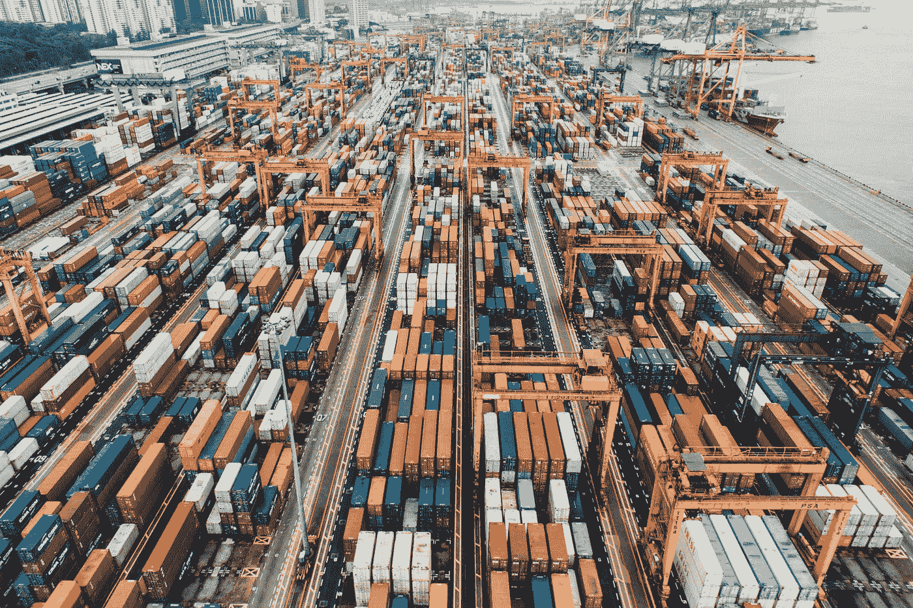
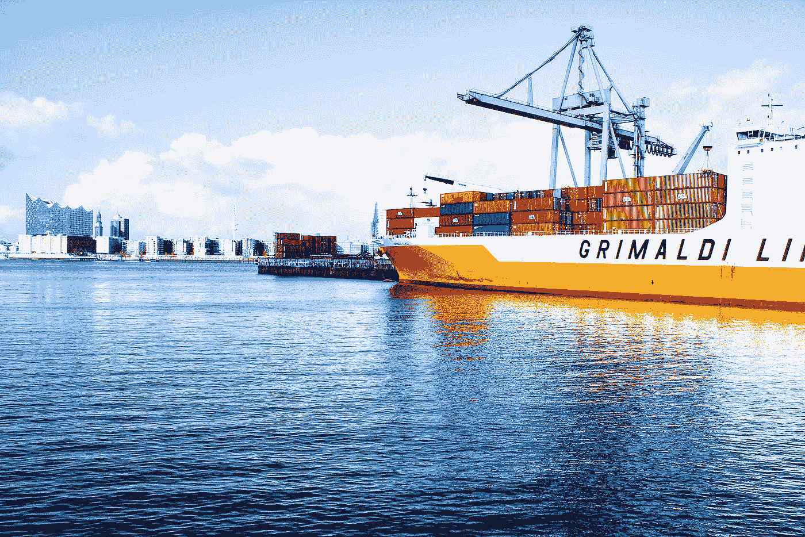

# 用区块链技术颠覆贸易融资

> 原文：<https://medium.com/hackernoon/disrupting-trade-finance-with-blockchain-technology-612646a4abc2>

在创业公司和 T2 区块链 T3 的世界里，“颠覆”这个词经常被漫无目的地使用。但有一个行业，像德勤和世贸组织都认为，分散化破坏的时机已经成熟——有一个项目迁移到卡尔达诺，可能会有解决方案。

Most, if not all, industries worldwide rely on trade financing.

贸易融资大— ***真的大*** 。

价值**[**10 万亿美元全球**](https://www2.deloitte.com/content/dam/Deloitte/global/Documents/grid/trade-finance-placemat.pdf) **y** 据估计，高达 90%的世界贸易依赖于某种形式的贸易融资发票和流动资本的适当获取。例如，在任何时候，全球资产负债表上都有超过 43 万亿美元的发票等待支付。**

> **“世界贸易的 90%依赖于贸易融资发票……。但新兴市场约 70%的中小企业缺乏信贷渠道。**

**尽管如此，根据世界银行集团最近的一项研究，新兴市场中约 70%的中小企业无法获得足够的信贷。其中，50%的客户在某个时候曾有过被传统银行机构拒绝的贸易融资请求。**

**然而，这并不是因为信用不良，这些公司产生的发票财务状况良好。相反，这是因为所需的基础设施不存在，无法为如此大量的中小企业提供发票信用。因此，出现了 1.5 万亿美元的信贷缺口，主要来自亚洲国家，这些国家的经济正以前所未有的速度增长。**

**根据世界经济论坛，如果贸易融资问题继续有增无减，到 2025 年，贸易融资缺口将超过 2.4 万亿美元。**

**Traxia 基金会及其首个工作解决方案 LiqEase 正在寻求通过 Cardano 区块链将中小企业的营运资本资产数字化，并促进全球 1.1 万亿美元的发票资产交易。**

**由 Cardano 投资的第一个项目，LiqEase 的最终目标是为贸易融资资产创建一个全新的数字资产类别，它利用区块链[技术](https://hackernoon.com/tagged/technology)作为解决方案。**

**的确是一个崇高的目标。但是为什么贸易融资首先需要区块链呢？让我们找出答案。**

## **贸易金融为什么需要区块链？**

**如果你已经关注金融科技领域相当长的时间，你可能已经听说了区块链的每一个所谓的用例。**

****

**Photo by [Axel Ahoi](https://unsplash.com/@axelahoi?utm_source=medium&utm_medium=referral) on [Unsplash](https://unsplash.com?utm_source=medium&utm_medium=referral)**

**事实是，并不是每个行业都需要区块链。不是每个行业都能从区块链中获益。**

**但贸易金融不属于这些行业。贸易金融行业面临[真正的挑战](https://www.wto.org/english/thewto_e/coher_e/challenges_e.htm)，区块链解决方案公司准备解决这些挑战。原因如下:**

*   **区块链便于根据不可变的链上交易历史进行快速信用风险评估。**
*   **最大限度地减少文件检查中的人为错误。**
*   **记录的即时验证和核对。**
*   **通过智能合同技术自动履行合同。**
*   **低成本、即时和安全的数据交换。**
*   **不再需要承担信贷风险的第三方(即银行)的非中介化。**
*   **没有重复支出，所以交易对手风险有限。**
*   **发票资产无可争议的所有权—一切尽在区块链。**

**我们坚定地生活在 21 世纪，时间不会很快变慢。但贸易融资几乎跟不上，而且它的大部分基础设施多年来都没有改变。从技术角度来看，贸易融资仍在古代运作。**

**当前的贸易融资流程成本高昂，充斥着官僚主义，需要大量的时间投入。再加上漫长的跨境支付和结算，显然需要一种高效的解决方案。**

**主要机构都注意到了区块链在贸易融资方面的潜力。四大咨询公司德勤指出，贸易融资可以通过以下方式得到显著改善:**

> **[“…利用基于区块链的基础设施来提高效率，降低成本基础，并开辟新的收入机会，如支持交易的信贷和融资担保的新模式。”](https://www2.deloitte.com/content/dam/Deloitte/global/Documents/grid/trade-finance-placemat.pdf)**

**同样，德勤也在正在进行的区块链革命中看到了贸易金融数字化的机会。**

**他们也不孤单。2018 年，世界贸易组织发表了一份 160 页的报告[关于区块链改革国际贸易的潜力，结论是:](https://www.wto.org/english/res_e/booksp_e/blockchainrev18_e.pdf)**

> **[“如果我们成功创造了一个有利于区块链更广泛发展的生态系统，10 到 15 年后，国际贸易可能会大不相同。”](https://www.wto.org/english/res_e/booksp_e/blockchainrev18_e.pdf)**

**由此看来，区块链对贸易融资的用处是毋庸置疑的。真正的问题是，谁将为贸易融资数字资产建立第一个交易所？**

## ****Traxia 和 LiqEase 分散交易所****

**[Traxia Foundation](https://www.traxia.co/)的成立旨在通过确保世界各地的公司都能获得贸易融资来实现更大的全球连通性。**

**由于 Traxia 是一个瑞士基金会，他们通过支持公司利用他们的财政和技术资源进行建设来帮助促进增长，其中第一个是 LiqEase。**

**LiqEase 的目标是利用区块链技术，为贸易融资资产建立一个新的数字资产类别。LiqEase 是一个 B2B 贸易融资平台，已经通过保时捷作为买家的真实案例对发票进行了贴现。**

**为了将发票换成应收账款，LiqEase 正在建立自己的分散式发票交易所。该平台名为 LiqEase DEX，专业投资者将能够访问一个全新的资产类别，在一个分散的市场上轻松买卖，就像当前的数字资产一样。**

**The sign-up process for new buyers or sellers on the platform is simple.**

**为了促进发票交易，LiqEase 在卢森堡创建了一个“特殊目的载体”;这将允许平台上的投资者像购买公司债券一样购买和交易发票。**

**然而，Traxia 团队面临着巨大的挑战，因为许多传统的贸易融资专业人士和投资者仍然对基于区块链的解决方案持谨慎态度，因此需要一些时间来观察如何采用分散化、令牌化的生态系统。**

## ****Cardano/em urgo 投资的第一个项目****

**卡达诺的风险投资公司 Emurgo 成立的目的是促进卡达诺区块链的发展。随后，Emurgo 对 Traxia 项目进行了早期投资。**

**Tobias and Bruno, CEO and CMO of Traxia respectively, appeared on the Cardano Effect Podcast.**

**[Cardano](https://www.cardano.org) 是第三代区块链平台，建立在学术严谨的基础上，准备成为世界上的“区块链”金融操作系统。**

**那么，特拉夏成为迁移到卡尔达诺的第一个解决方案似乎是合适的。**

**Emurgo 投资的其他项目包括正在建立开放钱包协议的 [Tesseract](https://gettes.io/#in-box) 、DNA 生物技术公司 [Helixworks](https://helix.works/) 和提供资产管理服务并推出 sto 的 [Y2X](https://y2x.io/) 。**

## **结论**

**贸易融资是现代日常生活中不可或缺的一部分。尽管如此，即使我们拥有所有的技术工具，仍然有许多效率低下的地方。**

**然而，过去十年中出现的一种新工具，即分散式分类账技术，可能是使贸易融资更加方便和公平的关键，为大公司和小公司创造了公平的竞争环境。**

**采用区块链的解决方案会更加困难。围绕加密货币的情绪已经影响了更广泛的区块链行业，许多传统金融专业人士对这个领域持谨慎态度。**

***免责声明——Elliot 是 fintech 和* [*加密货币文案*](http://www.blockwriter.co.uk) *。这是一篇观点文章，作者与 Traxia 或 LiqEase 没有任何关系，但他持有一些 TMT 令牌。***