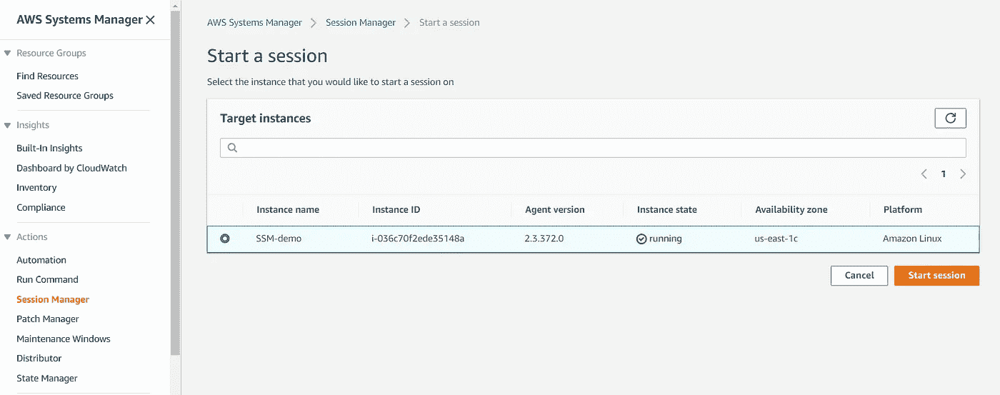
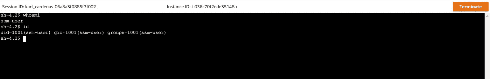
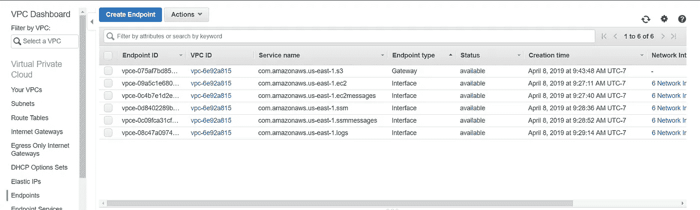
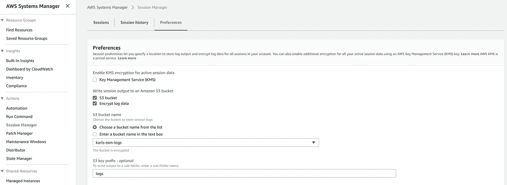
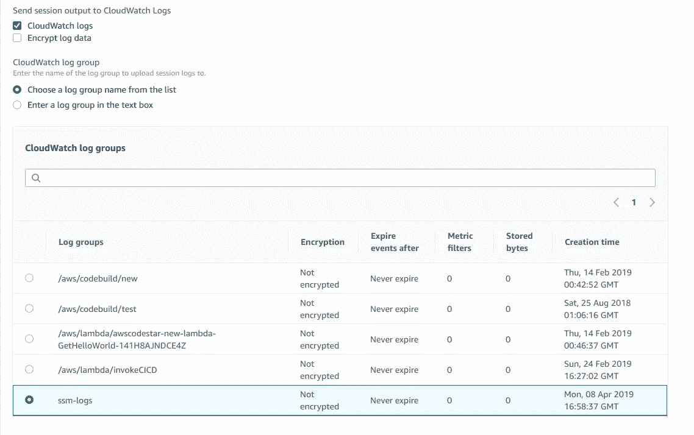
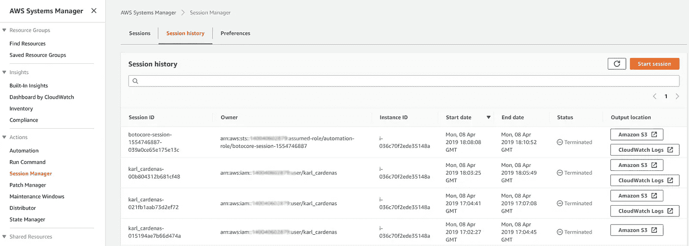

# 丢掉你的 SSH 密钥，启用 AWS SSM！

> 原文：<https://medium.com/hackernoon/ditch-your-ssh-keys-and-enable-aws-ssm-ec1c2b27350c>


Photo by [marcos mayer](https://unsplash.com/photos/8_NI1WTqCGY?utm_source=unsplash&utm_medium=referral&utm_content=creditCopyText) on [Unsplash](https://unsplash.com/search/photos/lock?utm_source=unsplash&utm_medium=referral&utm_content=creditCopyText)

如果您为一个组织(无论大小)管理 AWS，那么您很可能有几个很少使用的安全外壳(SSH)密钥，或者更糟的是，您不记得该密钥是为哪个帐户创建的。SSH 密钥管理本身就是一个兔子洞，大多数人都理解不恰当的 SSH 密钥管理带来的安全问题。幸运的是，有一种方法可以告别使用 SSH 远程访问 EC2 实例的繁琐做法。请允许我向您介绍 AWS 服务，系统经理(SSM)。

在本指南中，我将教您以下内容:

*   确定 SSM 远程会话管理器的要求，包括对企业的要求
*   为所有 EC2 实例启用远程会话管理器
*   启用远程会话管理器日志记录
*   通过 IAM 用户权限锁定远程会话管理器🔐
*   调试远程会话管理器

# 启用 SSM 远程会话管理器

AWS 托管服务 SSM 提供了一个简洁的特性，叫做会话管理器。会话管理器允许我们通过使用 HTTPS TLS1.2/端口 443 连接到一个实例并获得一个 shell 会话，而不必使用 SSH 密钥。重要的是要理解这不是一个 SSH 连接，而是一个 HTTPS 连接。会话管理器允许我们直接从 web 浏览器或通过 AWS CLI 使用终端会话。真的那么简单…..*假设你已经正确配置好了一切*。

以下是让 SSM 的远程会话管理器工作的核心要求:

*   **SSM 代理安装在实例**上。默认情况下，SSM 代理安装在 Amazon Linux、Amazon Linux2、Ubuntu Server 16.04、Ubuntu Server 18.04 和所有 Windows Server AMIs 上。[代理也可以安装在你的实例](https://docs.aws.amazon.com/systems-manager/latest/userguide/ssm-agent.html)(如果没有的话)或者通过使用 [Packer](https://www.packer.io/intro/) 预存在你的 AMI 中。
*   **EC2 实例需要一个 IAM 实例配置文件**—EC2 类型的实例配置文件角色。要为 SSM 创建 IAM 实例概要文件，请遵循此[链接](https://docs.aws.amazon.com/systems-manager/latest/userguide/getting-started-create-iam-instance-profile.html)。
*   **IAM 实例配置文件需要适当的 SSM 权限。**这是一个经常引起混淆或被遗漏的步骤。为了让 SSM 代理与 AWS SSM API 端点通信，它需要适当的 IAM 权限。为了方便起见，AWS 提供了一个名为`amazonEC2RoleforSSM`的默认 SSM 策略。也就是说，我建议您根据默认提供的策略制定自己的策略，该策略不包括以下权限`s3:*`(稍后将详细介绍)。

当您为您的实例检查了这三个需求后，您就可以开始使用 SSM 的远程会话了。哒哒！



What you should see if all requirements have been met!



What a session looks like in the browser

然而，正如生活中的其他事情一样，还有比我上面提到的三个要求更不明显的要求。此外，如果你是直接连接的企业用户，事情*可能*会变得有点棘手。让我们深入探讨一下“不太常见”的需求。

*   VPC 可以访问互联网。这不是每个人都有的奢侈品。如果您所在的组织将 [Direct Connect](https://aws.amazon.com/directconnect/) 与您的 AWS 基础架构结合使用，那么您可能会有一些专门创建的没有互联网网关(IGW)和 NAT 网关的 VPC，因此您只能通过公司数据中心访问互联网。这让事情变得更加困难，但幸运的是，我们有一个解决方案——我稍后会详细讨论这个问题。
*   **AWS CLI 需要 SSM 插件**。没错，如果您想从您的工作站使用远程会话功能，那么您需要为 AWS CLI 安装一个额外的插件。这是一个简单的安装，所有方向都可以找到[这里](https://docs.aws.amazon.com/systems-manager/latest/userguide/session-manager-working-with-install-plugin.html)。

## 应对 VPC 互联网挑战

如果您发现自己处于我上面描述的情况——一个没有互联网连接的 VPC，您需要启用六个 [VPC 端点](https://docs.aws.amazon.com/systems-manager/latest/userguide/sysman-setting-up-vpc.html)。简单。

如果您不熟悉 VPC 端点，这是一种通过 AWS 内部网络基础设施将指定的互联网流量路由到 AWS 公共 API 端点的方式。传统上，如果您需要调用 EC2 服务 API，其余的调用将通过 NAT 或 IGW 路由，并通过互联网服务提供商(ISP)提供的公共互联网，然后到达面向公众的 EC2 API。然而，对于 VPC 端点，REST 调用到达 API 端点，但是通过 AWS 网络主干从 VPC 直接路由到面向公众的 API，因此永远不会到达公共互联网，而是始终留在 AWS 基础设施内部。很酷吧？这使得没有互联网接入的 VPC 能够利用 SSM 的远程会话管理器。

注意:当创建端点- **时，确保您启用了私有 DNS 名称！**

*   com.amazonaws. `*region*`。地对地导弹
*   亚马逊网站消息
*   com.amazonaws. `*region.*` ec2
*   com . Amazon AWS .`*region.*`ec2 消息
*   com.amazonaws. `*region.*`日志
*   com.amazonaws. `*region.*` *s3*



These endpoints will allow you to leverage SSM’s Remote Session Manager and all it’s functionality

如果您想知道为什么日志和 s3 是端点列表的一部分，只需知道如果启用了日志功能，它们是必需的。logs 端点用于 CloudWatch 日志。我要再次强调这一点，确保在创建端点时启用私有 DNS 名称。这是因为我们缺乏互联网接入，我们需要我们的 VPC 端点拥有可以在没有互联网接入的情况下解析的 DNS 名称。

# 启用日志记录

在 SSM 的远程会话管理器中启用日志记录非常简单。只需导航到 SSM 远程会话屏幕，单击首选项选项卡，然后单击“编辑”。这将带您进入一个面板，其中包含启用 KMS、S3 日志记录和 CloudWatch 日志记录的选项。让我们同时启用 S3 和 CloudWatch。

注意:*[*KMS 选项*](https://docs.aws.amazon.com/systems-manager/latest/userguide/session-preferences-enable-encryption.html) *是除了默认的 TLS 1.2 加密之外，如果您想要加密 SSM 连接数据。连接加密将包括利用您的自定义 KMS 密钥或 AWS 管理的 SSM KMS 密钥的加密。启动会话管理器会话的用户和会话连接到的实例都必须拥有使用指定 KMS 密钥的权限。请注意，自定义 KMS 键将产生额外的费用。**

## *S3*

*我创建了一个名为 karls-ssm-log 的私有 S3 桶。然后，我简单地在选择选项中选择了 bucket(见下面)，然后指定了一个名为 logs 的文件夹/前缀。我还选择了要加密的日志。*

**

*我想在这里强调一下，允许您的 IAM 实例角色(附加到实例)正确访问 S3 存储桶是很重要的。AWS 提供的默认 SSM 策略`amazonEC2RoleforSSM`具有`s3:*`，因此可以覆盖所有场景，但是我不建议提供这么多的访问权限，而是将策略限制为只能访问您创建的 SSM 指定的日志桶。*

*此外，如果选择加密日志，请确保 IAM 实例角色具有适当的 KMS 访问权限。如果您的存储桶在全局级别配置为使用自定义 KMS 密钥加密所有内容，IAM 实例角色将需要访问权限以使用指定的自定义 KMS 密钥。*

## *云观察*

*我创建了一个名为`ssm-log.`的未加密的 Cloudwatch 日志组，我只需导航到 SSM，并按照上面提到的相同步骤进入会话管理器的首选项选项卡。下面的截图说明了如何启用 Cloudwatch 日志。*

*注意:如果您希望加密 Cloudwatch 日志，请确保创建 Cloudwatch 日志组时启用了加密，否则将日志写入日志组会失败。*

**

*Simply check the CloudWatch checkbox and select the desired log-group*

## *访问日志*

*为了访问 SSM 远程会话管理器日志，您可以直接转到 S3 存储桶和/或指定的 Cloudwatch 日志组。然而，有一个更简单的选择。在会话管理器选择屏幕中，中间的选项卡用于查看历史。启用日志记录后，会话历史屏幕将包含相应会话日志的快捷方式(见下文)。*

**

*Logs are easily consolidated for your convenience*

*注意:从`aws cli`启动的日志将没有用户/角色的名称，而是包含前缀 botocore-session-#######。但是，使用 CloudTrail，您可以使用 botocore 会话 id 来查找通过 STS 授予的临时访问密钥，并从那里开始反向工作，确定为哪些用户/角色提供了临时访问密钥。这不是一个容易也不有趣的过程，但它肯定有可能确定最终用户🔎。*

# *用户权限*

*管理员对启用 SSM 远程系统管理器最常见的担忧之一是，每个人都能够远程访问满足 SSM 要求的任何实例。毕竟现在准入门槛大大降低简化了。幸运的是，我们可以利用 [IAM 用户权限](https://docs.aws.amazon.com/systems-manager/latest/userguide/session-manager-getting-started-restrict-access.html)来控制谁可以使用 SSM 的远程会话管理器远程访问实例。我们有能力通过利用`tags`或像`instanceID`一样细化来锁定访问。*

*看一下下面的 IAM 策略示例。这个示例策略通过使用带有键值对`ssm:enabled`的`tag`来限制用户使用远程会话管理器的能力。如果实例的标签具有正确的值，则用户可以启动远程会话，否则，访问将被拒绝。该策略还确保只允许用户终止他们自己的会话，从而避免了诱骗其他用户的能力。请访问此[链接](https://docs.aws.amazon.com/systems-manager/latest/userguide/getting-started-restrict-access-examples.html)了解更多政策示例。*

```
*{
    "Version": "2012-10-17",
    "Statement": [
        {
            "Effect": "Allow",
            "Action": [
                "ssm:StartSession"
            ],
            "Resource": [
                "arn:aws:ec2:*:*:instance/*"
            ],
            "Condition": {
                "StringLike": {
                    "ssm:resourceTag/ssm": [
                        "enabled"
                    ]
                }
            }
        },
        {
            "Effect": "Allow",
            "Action": [
                "ssm:TerminateSession"
            ],
            "Resource": [
                "arn:aws:ssm:*:*:session/${aws:username}-*"
            ]
        }
    ]
}*
```

# *调试 SSM*

*有时，您可能会遇到远程会话管理器不工作的情况。调试 SSM 可能是一项挑战，尤其是当您无法远程访问实例时。我建议采用以下调试步骤:*

1.  *确保 AMI 安装了代理*
2.  *验证是否附加了 EC2 实例角色*
3.  *验证 EC2 实例角色是否具有适当的 SSM 权限*
4.  *重新启动实例*

*以上四个步骤将解决大部分与 SSM 相关的问题。然而，还有更棘手的情况。*

*问:**我启用了日志记录，但是我不能再连接到我的实例了？***

*答:这可能是网络问题或缺乏权限。确保您的 VPC 可以访问互联网，如果它没有启用 SSM 所需的 VPC 端点，并且启用了专用 DNS。如果 S3 日志记录启用了加密，则确保 bucket 和 IAM 实例角色都可以访问 KMS 密钥(如果 S3 bucket 中使用了自定义 KMS 密钥)。*

*问:**我没有启用日志记录，仍然无法连接到我的实例？***

*答:假设你已经覆盖了基础知识；已安装代理，实例角色，IAM 权限。查看您的网络安全组和网络 ACL。确保您允许 VPC 内的入站和出站`tcp 443`流量。换句话说，您信任来自 VPC CIDR 的流量，不要与 VPC 外部的流量混淆。*

*问:**在哪里可以查看代理生成的日志？***

*答:您可以在以下位置查看 Linux 实例上的 SSM 代理日志*

*   *`/var/log/amazon/ssm/amazon-ssm-agent.log`*
*   *`/var/log/amazon/ssm/errors.log`*

*在窗口中*

*   *`%PROGRAMFILES%\Amazon\SSM\Logs\amazon-ssm-agent.log`*
*   *`%PROGRAMFILES%\Amazon\SSM\Logs\errors.log`*

*问:**是否可以进行更多的调试？***

*答:没错——只需修改`seelog.xml.template`(我建议你复制一份)。*

*在 Linux 中，可以找到该文件*

*   *`/etc/amazon/ssm/seelog.xml.template`*

*在窗口中*

*   *`%PROGRAMFILES%\Amazon\SSM\seelog.xml.template`*

*将`minlevel=info`的值更改为`minlevel=debug`*

```
*<seelog type="adaptive" mininterval="2000000" maxinterval="100000000" critmsgcount="500" minlevel="debug">*
```

*问:**我还应该了解哪些有用的链接？***

*答:可以，在[亚妇会 SSM 论坛](https://forums.aws.amazon.com/forum.jspa?forumID=185)上提问！*

# *准备好扔掉你的 SSH 密钥了吗？*

*我希望您会发现本指南有助于您开始使用 SSM 的远程会话管理器。AWS 在为 SSM 提供文档方面做得很好，但是在如何设置这个功能方面确实没有一个整体的工作帮助，更不用说几个“陷阱”了，这就是本文的原因。现在您已经掌握了所有这些知识，现在就开始使用 SSM，让 SSH 密钥成为过去。*