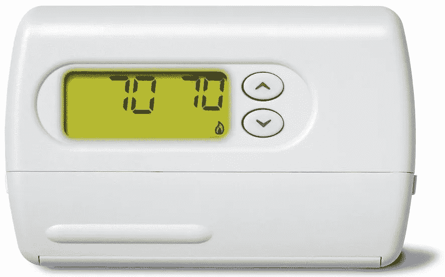
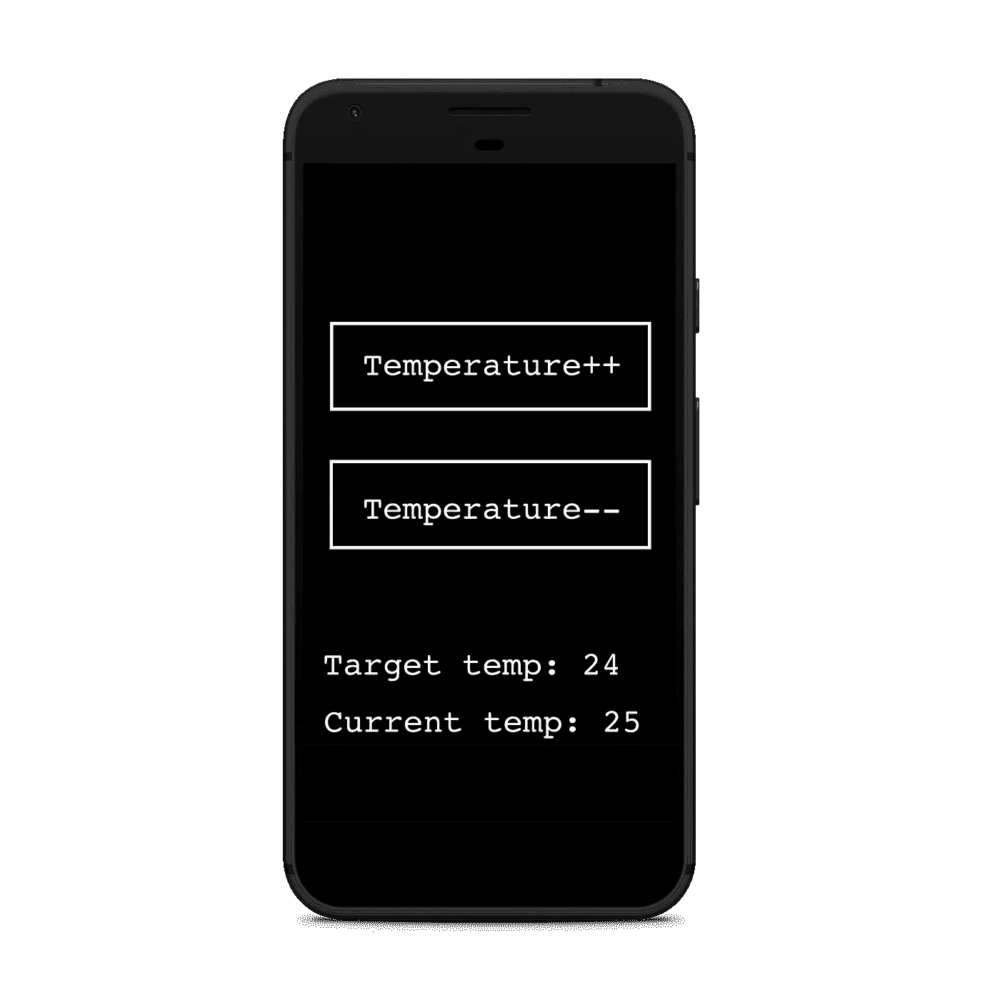
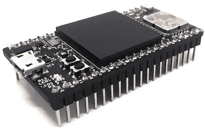
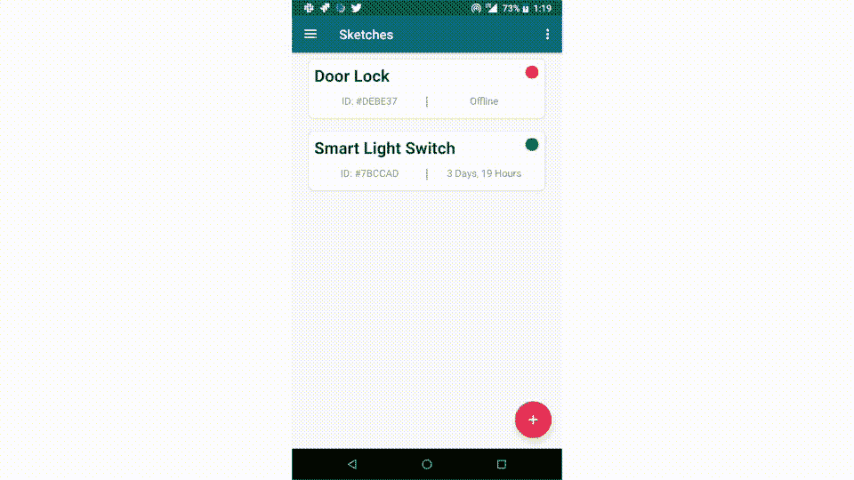
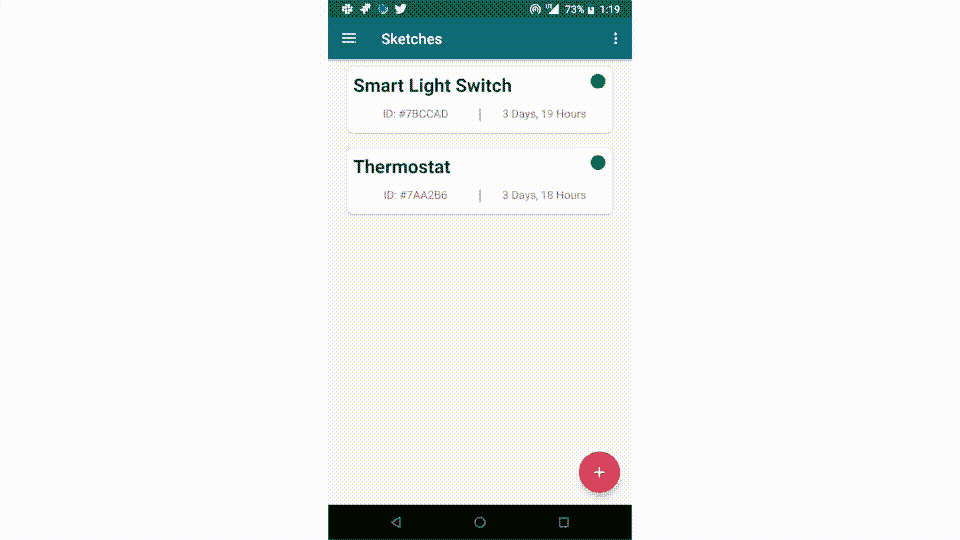

# DIY——建造你自己的分散式恒温器

> 原文：<https://medium.com/hackernoon/diy-build-your-own-decentralized-thermostat-7acb6a2833d4>

在这篇博文中，我们将探索如何构建一个“分散式”恒温器，在这个过程中，我们将探索分散式物联网的概念。

从最基本的定义来看，分散式物联网是指不依赖集中式云服务或中间人进行通信的物联网。

在过去的几年里，人们一直致力于构建完全去中心化的 P2P 消息网络。分散式消息网络包括[耳语](https://github.com/ethereum/go-ethereum/wiki/Whisper-Overview)、[蜂群 PSS](https://swarm-guide.readthedocs.io/en/latest/pss.html) 和[比特消息](https://bitmessage.org/wiki/Main_Page)。

一旦分散式消息传递网络发展成熟，变得可扩展和可靠，与集中式设备相比，它可以提供许多好处，包括:

*   它没有服务器。你不必设置服务器或其他媒介来与你的设备通信。
*   **您可以持续访问您的设备。由于你依赖的是 P2P 网络而不是服务器(单点故障)，你的正常运行时间明显更长，而且没有维护服务器的开销。**
*   **您的通信可以是完全隐私的，包括元数据。**许多分散的消息网络，如 Whisper，使用暗路由和加密来支持私人通信，没有可靠的方法让外人跟踪元数据。

请注意，所有去中心化的消息传递网络都还非常不成熟，仍然缺少一些使它们可靠和可伸缩的核心特性(例如，激励层)。但是，嘿，我们是黑客，如果我们不参与实验技术，谁会呢？

事不宜迟，让我们继续构建高度实验性的分散式恒温器。

严格地说，分散式恒温器已经存在了相当一段时间。这是一个经典的例子:



A classic “decentralized” thermostat

上述恒温器在任何意义上都是分散的。它不依赖任何集中式云服务或中间人，与它的通信是私密的，包括任何元数据(除非你不信任你的家庭)。

但是，在这篇博文中，我们更感兴趣的是构建一个*智能*分散式恒温器。至少，我们希望能够通过手机远程控制它。下面是我们想要提供的功能的粗略草图:



A mockup interface for the functionality/data we want to expose to the phone from the thermostat.

以上是我们想要建立的功能非常基本的样机。具体来说，我们希望能够做到以下几点:

1.  设置目标温度。
2.  显示目标温度和实际温度。

我们现在将探索恒温器和电话之间使用分散技术的通信层的两种可能的实现。我们讨论的焦点将只集中在通信层，而不是硬件的内部。

## 实施#1:耳语

Whisper 是以太坊的分散消息协议，如果你熟悉以太坊，它与`geth`捆绑在一起。通常，您必须在您的硬件上设置一个 Whisper 节点，对其进行调整，使其不会消耗过多的硬件资源，为通信生成密钥，优雅地处理任何崩溃，设置启动时自动启动，等等。

或者，你可以使用[麋鹿](https://elk.cc?ref=d-ther-1)。Elk 是一个硬件开发板，用于构建分散的和区块链连接的设备，它为开箱即用的 Whisper 提供支持。它处理密钥管理和生成，并提供类似 Arduino 的 SDK，而无需在嵌入式设备上设置 Whisper 节点。



Elk: A hardware development board for building decentralized and blockchain-connected devices.

下面是我们用 raw Whisper 和 Elk 的 SDK 编写的恒温器代码(也被称为[草图](https://www.arduino.cc/en/Tutorial/Sketch))的概要。如果你不熟悉 Arduino 编码方式，你可以在这里[了解更多。](https://www.arduino.cc/en/Tutorial/Sketch)

```
/* Initial target temperature (in Celsius) */
unsigned int targetTemperature = 23;// 1\. Setting a topic
String TOPIC = "0x11223344";void setup() {
  // 2\. Listening to incoming Whisper messages.
  Whisper.subscribe(TOPIC, &handleMessage);
}void loop() {
  // logic related to running the thermostat goes here
}void handleMessage(WhisperMessage message) {
  // 3\. Handling incoming whisper messages. if (message.payload == "increaseTemperature") {
    targetTemperature += 1;
    setTemperature(targetTemperature); // Send acknowledgement that message is received.
    Whisper.send(message.from, TOPIC, "ack"); } else if (message.payload == "decreaseTemperature") {
    targetTemperature -= 1;
    setTemperature(targetTemperature); // Send acknowledgement that message is received.
    Whisper.send(message.from, TOPIC, "ack"); } else if (message.payload == "currentTemperature") {
    // Respond with current temperature
    Whisper.send(message.from, TOPIC, readTemperature()); } else if (message.payload == "targetTemperature") {
    // Respond with target temperature
    Whisper.send(message.from, TOPIC, targetTemperature); }
}/* Stub of setting target temperature. */
void setTemperature(unsigned int target);/* Stub to read current room temperature from temperature sensor. */
float readTemperature();
```

让我们更仔细地检查一下上面的代码:

1.  **设置话题。** Whisper 依靠话题使其路由更高效。这实际上是您设置的 4 个字节的任意数据，发送方和接收方需要使用相同的主题进行通信。你可以在这里了解更多关于[的话题。](https://geth.ethereum.org/whisper/Whisper-Overview)
2.  **收听传入的密语信息。** Elk 提供密钥管理，并自动使用其自动生成的密语密钥(如果您愿意，可以覆盖该密钥)。该设备本质上监听发送到主题的任何消息，它能够解密。
3.  **处理传入的密语消息。**这部分代码是不言自明的，它定义了一个接口，用于将设备接收的消息转化为功能。

上面的代码是一个智能恒温器的工作实现的概要，我们可以使用 Whisper 远程设置和监控温度。尽管上面的实现存在许多问题:

1.  **没有认证。任何人都可以向恒温器发送命令。解决这个问题的一个简单方法是检查邮件是否被您加密了。**
2.  在炎热的夏天，当你试图告诉你的恒温器在回家的路上给房子降温时，用耳语传递信息是没有保证的。
3.  **你需要开发一个手机应用程序或其他用户界面来使用它。** Whisper 是一种底层协议，没有用户界面。

## 实现#2: Elk 协议+应用程序

构建恒温器通讯层最简单的方法是使用 [Elk](https://elk.cc) 以及 Elk 协议和移动应用程序。Elk 协议扩展了以太坊的 [Whisper](https://github.com/ethereum/go-ethereum/wiki/Whisper-Overview) 协议，以简化与物联网设备的通信。与 Whisper 相比，它具有以下优势:

1.  **它包括开箱即用的身份验证。**
2.  **它包括重试和超时机制。**
3.  **它会自动生成一个移动界面来与您的设备进行通信。**Elk 应用程序为您生成一个基本的用户界面，帮助您快速开始使用您的设备。

下面是使用 Elk 协议与恒温器通信所需的代码:

```
/* Initial target temperature (in Celsius) */
unsigned int targetTemperature = 23;void setup() {
  // Define a name for the sketch to be used in the Elk app
  Elk.setName("Thermostat"); // Exposing variables
  Elk.expose("Current Temperature", &readTemperature);
  Elk.expose("Target Temperature", &targetTemperature); // Exposing functions
  Elk.expose("Temperature++", &increaseTemperature);
  Elk.expose("Temperature--", &decreaseTemperature);
}void loop() {
  // logic related to running the thermostat goes here.
}void increaseTemperature() {
  targetTemperature += 1;
  setTemperature(targetTemperature);
}void decreaseTemperature() {
  targetTemperature -= 1;
  setTemperature(targetTemperature);
}/* Stub of setting target temperature. */
void setTemperature(unsigned int target);/* Stub to read current room temperature from temperature sensor. */
float readTemperature();
```

上面的代码是我们实现恒温器的通信层所需要的全部。该代码公开了增加和降低目标温度的两个函数，以及目标温度和当前温度的两个变量。为了简洁起见，我剔除了硬件相关的功能。

当我们将上面的草图部署到板上时会发生什么？你现在可以下载 Elk 应用程序，扫描电路板的二维码，瞧！Elk 应用程序使用 Whisper 与电路板通信，获取关于草图的元数据，并为我们在草图中展示的功能生成一个接口。



Adding a sketch to one’s phone with the Elk app and the Elk board’s QR code.

该接口还提供恒温器已经成功接收到消息的反馈。



The interface generated by the Elk app from our sketch. The interface is dynamically generated without having to code anything. Variables like target and current temperatures are updated in real-time.

请注意，当前的实现允许任何人与您的设备通信。为了安全起见，您可以通过 IDE 配置轻松地将您自己作为开发板的用户列入白名单。

就是这样！我们现在能够使用分散的信息网络来控制我们的恒温器——不需要中间人或服务器。那不是很容易吗？

在 Elk，我们的使命是将分散技术引入物理世界，并使其开发体验提高 10 倍。如果您对此感兴趣，请查看我们的[开发板](https://elk.cc)。