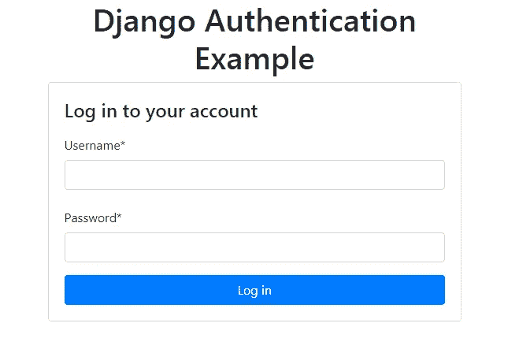
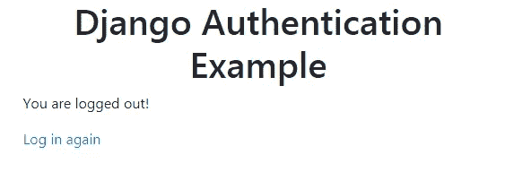
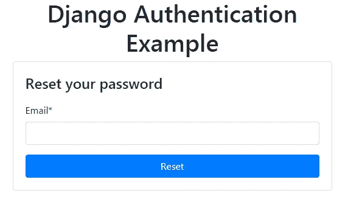
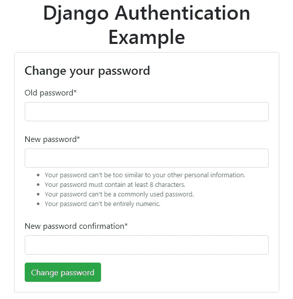

# Django 认证—登录、注销和密码更改/重置

> 原文：<https://medium.com/hackernoon/django-authentication-login-logout-and-password-change-reset-a5f3d9313cd5>


Photo by [Caspar Camille Rubin](https://unsplash.com/@casparrubin?utm_source=medium&utm_medium=referral) on [Unsplash](https://unsplash.com?utm_source=medium&utm_medium=referral)

在本教程中，您将学习如何轻松地为 Django 应用程序添加一个完整的身份验证系统，包括登录、注销、密码更改和重置功能。

我们还将使用`django-crispy-forms`和 Bootstrap 4 来设计应用程序 UI。

# 先决条件

让我们从本教程的先决条件开始。为了一步一步地遵循教程，您需要一些要求，例如:

*   Python 的基础知识，
*   姜戈(`django-admin.py`和`manage.py`)的工作知识，
*   安装在您系统上的 Python 3 的最新版本(最新版本是 **3.7**

我们将使用`pip`和`venv`，它们在 Python 的最新版本中被打包成模块，所以你实际上不需要安装它们，除非你使用的是旧版本。

如果你准备好了，让我们开始吧！

# 创建虚拟环境

虚拟环境允许您将当前的项目依赖项与全局安装在您的系统或其他虚拟环境中的其余包隔离开来。您可以使用需要安装在您的系统上的`virtualenv`,也可以使用在 Python 3 的最新版本中作为模块提供的`venv`模块。

转到您的命令终端并运行:

```
$ python -m venv env
```

接下来，使用以下方法激活虚拟环境:

```
$ source env/bin/activate
```

> ***注意*** *:请注意，在 Windows 上，您需要使用* `*source env/Scripts/activate*` *才能激活您的虚拟环境。*

激活环境后，您需要使用`pip`安装 Django:

```
$ pip install django
```

如果框架安装成功，您现在可以使用 Django 管理命令来创建和使用您的项目。

# 创建 Django 项目

现在让我们使用`django-admin.py`创建项目。在您的终端中，运行以下命令:

```
$ django-admin.py startproject demoproject
```

Django 有一个 ORM，它抽象了 dircet 数据库操作并支持 SQLite，这是在项目中默认配置的，所以我们将在本教程中使用 SQLite 数据库。

如果您需要使用 PostgreSQL、MySQL 或任何其他数据库管理系统，您必须首先安装它，然后打开项目的`settings.py`，并在`DATABASES`对象中添加数据库地址和凭证。

以下是`sqlite`的默认配置:

```
DATABASES = {
    'default': {
    'ENGINE': 'django.db.backends.sqlite3',
    'NAME': os.path.join(BASE_DIR, 'db.sqlite3'),
    }
}
```

# 添加`django-crispy-forms`

我们将使用 Bootstrap 4 来设计认证表单，所以您需要使用`pip`来安装它:

```
$ pip install django-crispy-forms
```

接下来，打开`settings.py`文件，将应用程序添加到已安装的应用程序中:

```
INSTALLED_APPS = [
    # [...]
    'crispy_forms'
]
```

接下来，添加以下设置，将 Bootstrap 4 设置为`django-crispy-forms`的默认样式框架:

```
CRISPY_TEMPLATE_PACK = 'bootstrap4'
```

# 创建`accounts`应用程序

应用程序是 Django 组织项目的方式。把它们想象成模块。

让我们将项目中所需的认证逻辑封装到一个`accounts`应用程序中。很明显，您可以使用任何您认为合适的有效名称。

转到您的终端，在您的项目文件夹中导航(如果您尚未这样做):

```
$ cd demoproject
```

接下来，使用`manage.py`创建应用程序:

```
$ python manage.py startapp accounts
```

`manage.py`是 Django 的另一个管理脚本，存在于根项目的文件夹中。它为最常用的 Django 管理命令提供了一个很好的包装。

前面的命令将创建一个具有默认文件结构的 Django 应用程序。要使这个应用程序成为您项目的一部分，您需要打开`settings.py`文件并将其添加到`INSTALLED_APPS`数组:

```
INSTALLED_APPS = [
# [...]
'accounts'
]
```

就这样，现在您可以使用以下命令创建您的数据库并运行您的 Django 开发服务器了:

```
$ python manage.py migrate 
$ python manage.py runserver
```

您可以使用浏览器导航到`localhost:8000`地址，查看您的 web 应用程序是否启动并运行。

# `auth`内置应用程序

`auth`应用程序是 Django 中的一个内置认证系统，允许开发人员将认证添加到他们的应用程序中，而无需从头开始重新发明轮子来实现基本功能。

Django 认证应用程序提供了以下现成的功能:

*   通过`LoginView`类视图登录，
*   通过`LogoutView`类视图注销，
*   通过`PasswordResetView`类视图重置密码，
*   通过`PasswordChangeView`类视图修改密码，

您只需要提供模板来在您的应用程序中实现这些功能。

对于注册用户，您需要创建您的视图和模板。

你需要在`settings.py`文件的`INSTALLED_APPS`中有`django.contrib.auth` app，这是默认情况。

接下来在您的`accounts`应用程序中创建`urls.py`文件，并添加以下代码:

```
from django.contrib.auth import views
from django.urls import pathurlpatterns = [
]
```

# 使用`LoginView`登录用户

您可以使用`LoginView`基于类的视图在 Django 应用程序中登录用户。在您的`accounts/urls.py`文件中添加以下路径:

```
urlpatterns = [
    path('login/', views.LoginView.as_view(), name='login'),
```

您只需使用`LoginView`的`as_view()`方法返回一个回调对象，该对象可以作为视图函数分配给`path()`函数。

接下来，您需要为您的登录视图提供一个模板。在您的`accounts`应用程序的根目录下创建一个`templates`文件夹，并使用以下代码添加一个`base.html`文件:

```
<!doctype  html>
<html  lang="en">
<head>
<link  rel="stylesheet"  href="[https://maxcdn.bootstrapcdn.com/bootstrap/4.0.0/css/bootstrap.min.css](https://maxcdn.bootstrapcdn.com/bootstrap/4.0.0/css/bootstrap.min.css)"  integrity="sha384-Gn5384xqQ1aoWXA+058RXPxPg6fy4IWvTNh0E263XmFcJlSAwiGgFAW/dAiS6JXm"  crossorigin="anonymous">
<title>Django Authentication Example</title>
</head>
<body>
  <div  class="container">
    <div  class="row justify-content-center">
      <div  class="col-4">
      <h1  class="text-center">Django Authentication Example</h1>
      
      
      </div>
    </div>
  </div>
</body>
</html>
```

我们首先在基本 HTML 模板中导入 Bootstrap 4。然后我们创建一个容器`<div>`一个标题和一个`main`块，Django 在其中呈现模板的其他部分。

接下来，用下面的代码创建一个`templates/registration`文件夹和`login.html`模板:

```


<div class="card">
<div class="card-body">
<h4 class="card-title">Log in to your account</h4><form method="post">

<input type="hidden" name="next" value="{{ next }}">{{ form|crispy }}<button type="submit" class="btn btn-primary btn-block">Log in</button>
</form>
</div>
</div>

```

我们扩展前面的基本模板，加载`crispy_forms_tags`，然后覆盖`main`块来添加我们的登录表单。

接下来，我们用 POST 方法创建一个 HTML 表单，并使用“`. The`crisp”过滤器呈现表单字段，将引导样式应用于各个字段。

`csrf_token`将 CSRF 保护字段添加到我们的登录表单。

我们还添加了一个隐藏的表单字段，用于保存 Django 在用户成功登录后将用户重定向到下一个页面的下一个 URL。默认情况下，它会重定向`accounts/profile` URL。

# 设置登录重定向 URL

您可以通过`LOGIN_REDIRECT_URL`设置来设置下一个 URL 或登录重定向 URL。打开`settings.py`文件并添加:

为了测试登录视图，您可以从终端使用`manage.py createsuperuser`命令创建一个用户。

> ***注意*** *:登录后会被重定向到* `*/accounts/profile*` *网址。*

这是用 Bootstrap 4 设计的登录表单的屏幕截图:



# 使用`LogoutView`注销用户

您可以使用`LogoutView`基于类的视图注销应用程序中的用户。在您的`accounts.py`文件中，添加`/logout`路径，并将其与`LogoutView`的可调用视图链接起来:

```
path('logout/', views.LogoutView.as_view(), name='logout'),
```

我们再次使用`as_view()`方法从`LogoutView`类返回一个可调用的对象。

接下来，您需要用下面的代码创建一个`registration/logged_out.html`:

```

<p>You are logged out!</p>
<a  href="">Log in again</a>
```

这是注销完成视图的屏幕截图:



# 使用`PasswordResetView`、`PasswordResetDoneView`、`PasswordResetConfirmView`和`PasswordResetCompleteView`重置密码

您可以让用户使用多种视图重置密码:

*   `PasswordResetView`，
*   `PasswordResetDoneView`，
*   `PasswordResetConfirmView`
*   `PasswordResetCompleteView`

在您的`accounts/urls.py`文件中，添加以下路径:

```
path('password-reset/', views.PasswordResetView.as_view(), name='password_reset'),
path('password-reset/done/', views.PasswordResetDoneView.as_view(), name='password_reset_done'),
path('reset/<uidb64>/<token>/', views.PasswordResetConfirmView.as_view(), name='password_reset_confirm'),
path('reset/done/', views.PasswordResetCompleteView.as_view(), name='password_reset_complete'),
```

接下来，您需要用下面的代码添加一个`registration/password_reset_form.html`模板:

```


<div  class="card">
<div  class="card-body">
<h4  class="card-title">Reset your password</h4>
<form  method="post">

<input  type="hidden"  name="next"  value="{{ next }}">
{{ form|crispy }}<button  type="submit"  class="btn btn-primary btn-block">Reset</button>
</form>
</div>
</div>
</div>

```

同样的，你需要添加`password_reset_confirm.html`、`password_reset_done.html`、`password_reset_email.html`和`password_reset_complete.html`模板。

这是使用 Bootstrap 4 设计的密码重置表单的屏幕截图:



# 使用`PasswordChangeView`和`PasswordChangeDoneView`更改密码

您可以让您的用户通过`PasswordChangeView`和`PasswordChangeDoneView`基于类的视图更改他们的密码。

在您的`accounts/urls.py`文件中，添加以下路径:

```
path('password-change/', views.PasswordChangeView.as_view(), name='password_change'),
path('password-change/done/', views.PasswordChangeDoneView.as_view(), name='password_change_done'),
```

接下来创建一个`registration/password_change_form.html`模板并添加以下代码:

```


<div  class="card">
<div  class="card-body">
<h4  class="card-title"> Change your password</h4><form  method="post">

{{ form|crispy }}<button  type="submit"  class="btn btn-success">Change password </button>
</form>
</div>
</div>

```

还需要添加`password_change_done.html`模板。

这是密码更改表单的屏幕截图:



# 注册用户

对于注册用户，Django 内置的 auth 应用程序不提供 ready view 函数或基于类的视图，因此您需要提供自己的自定义实现。

# 导入项目中的 URL`urls.py`

您已经在 accounts 应用程序中添加了用于在您的 web 应用程序中实现身份验证的各种 URL，但是在您将它们添加到项目的 level `urls.py`文件之前，它们无法使用。

首先，这是`accounts/urls.py`文件的完整源代码:

```
from django.contrib.auth import views
from django.urls import pathurlpatterns = [
    path('login/', views.LoginView.as_view(), name='login'),
    path('logout/', views.LogoutView.as_view(), name='logout'),
    path('password-change/', views.PasswordChangeView.as_view(), name='password_change'),
    path('password-change/done/', views.PasswordChangeDoneView.as_view(), name='password_change_done'),
    path('password-reset/', views.PasswordResetView.as_view(), name='password_reset'),
    path('password-reset/done/', views.PasswordResetDoneView.as_view(), name='password_reset_done'),
    path('reset/<uidb64>/<token>/', views.PasswordResetConfirmView.as_view(), name='password_reset_confirm'),
    path('reset/done/', views.PasswordResetCompleteView.as_view(), name='password_reset_complete'),
]
```

接下来，打开项目根目录下的`urls.py`,使用`include()`函数导入账户 URL:

```
from django.urls import path, includeurlpatterns = [
    path('accounts/', include('accounts.urls'))
]
```

现在，开始启动您的开发服务器。您可以在`/accounts`路径下使用您的认证 URL:

*   `http://127.0.0.1:8000/accounts/login/`对于登录用户来说，
*   `http://127.0.0.1:8000/accounts/logout/`对于注销用户，
*   `http://127.0.0.1:8000/accounts/password-change/`用于更改密码、
*   `http://127.0.0.1:8000/accounts/password-reset/`用于重设密码。

# 结论

在本教程中，我们看到了如何使用`auth`应用程序在 Django 应用程序中轻松添加登录、注销、密码重置和更改功能，而无需重新发明轮子。

我们还使用了 Bootstrap 4 和`django-crispy-forms`来设计登录、密码更改和重置的各种表单。