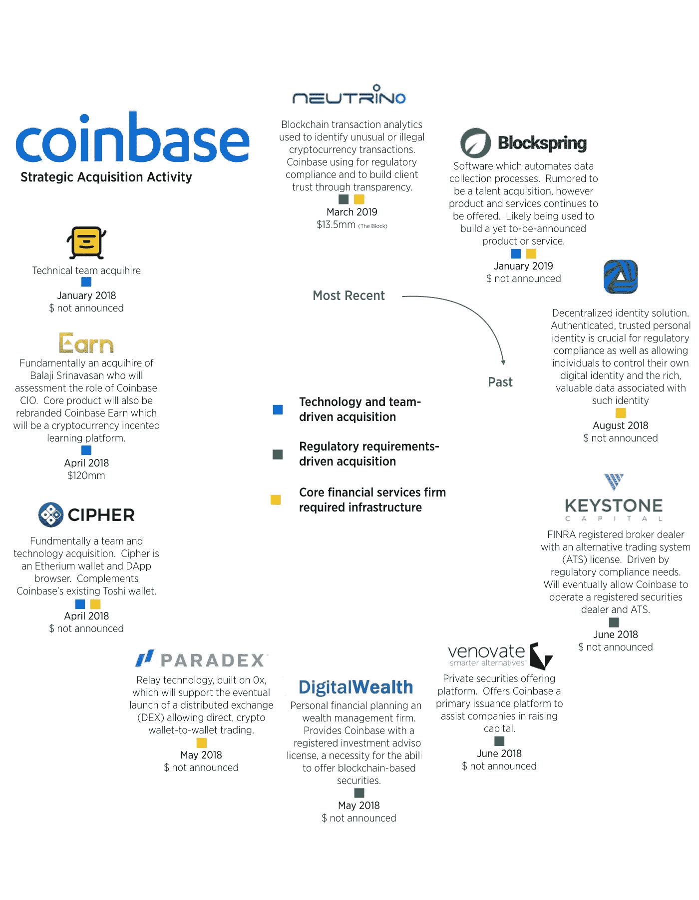

# DLT M&A 周刊:2019 年 3 月 10 日

> 原文：<https://medium.com/hackernoon/dlt-m-a-weekly-3398f8cd32b1>

## 分布式账本技术并购

过去一周没有新的 DLT M&A 交易宣布。

今天，我们将仔细审视比特币基地在过去一年左右时间里的战略收购努力。在 2018 年 5 月从 LinkedIn 招募了 Emilie Choi 之后，比特币基地是迄今为止最活跃的 DLT 收购者。Emilie 负责公司和业务发展以及比特币基地的风险投资。

我们下面的评估强调了每次收购之前的业务，它如何适应比特币基地的努力和每次收购的战略驱动因素。就像早期的谷歌和脸书一样，比特币基地的许多收购都是团队和技术驱动的交易。此外，值得注意的是，比特币基地已经提前并积极地建立其监管合规能力，随着证券监管机构在加密资产市场的影响力日益显现，这种能力变得越来越重要。

