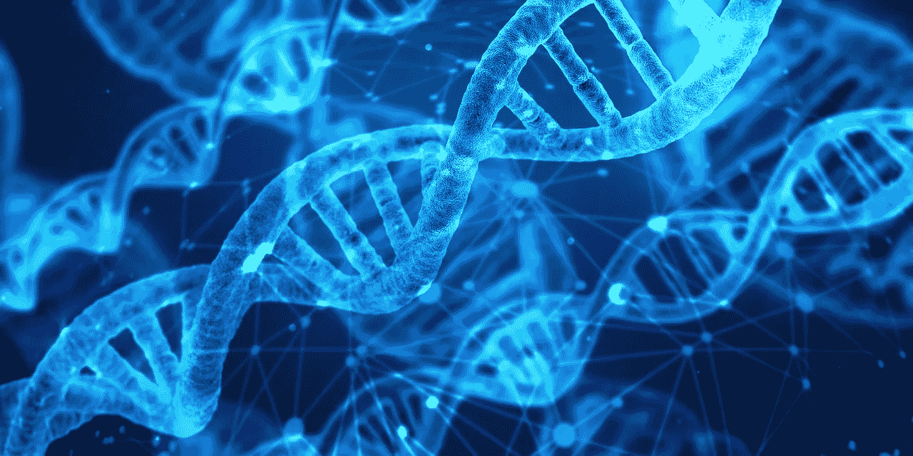
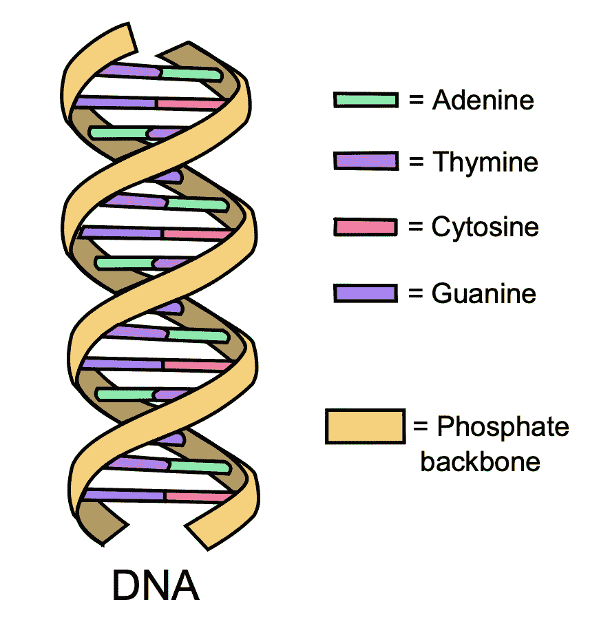
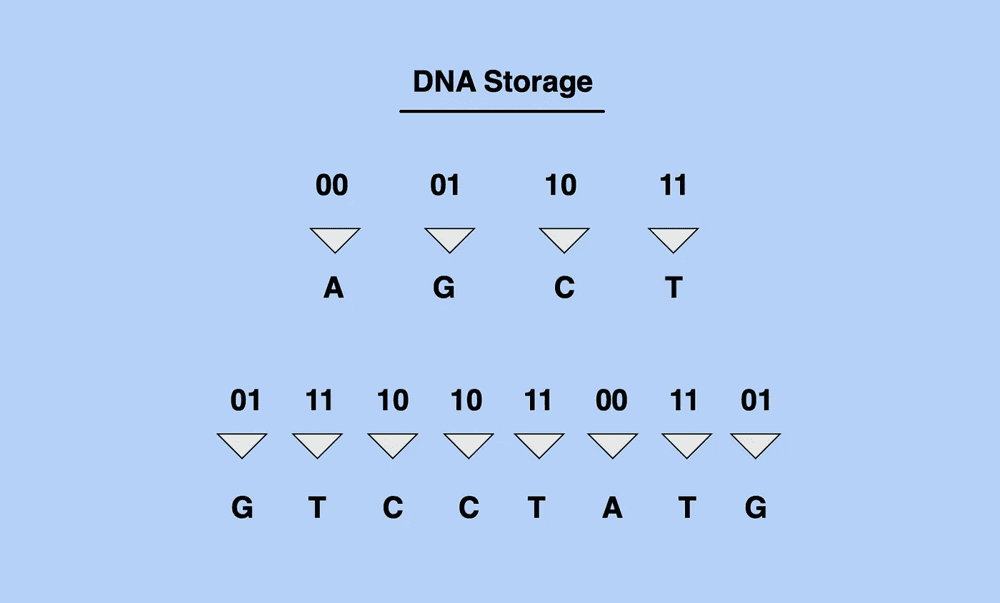
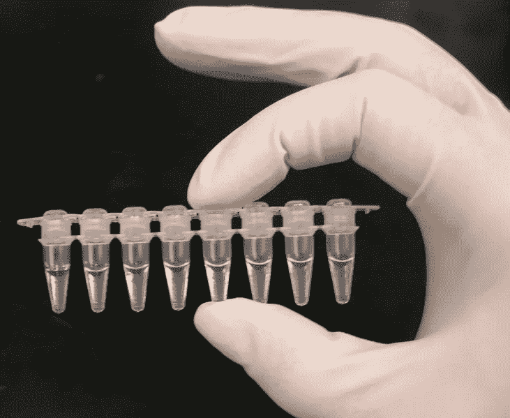

# DNA 数据存储

> 原文：<https://medium.com/hackernoon/dna-data-storage-d0f0e93513b>

众所周知，脱氧核糖核酸(DNA)储存了我们的遗传信息。然而，越来越多的科学家和未来学家正在认识到 DNA 存储非遗传信息的潜力。

**DNA**

DNA 存在于人体的几乎每个细胞中。它存储生物信息，如眼睛颜色、头发颜色和肤色。DNA 中包含的遗传数据是每个细胞执行其功能的蓝图。所以，DNA 本质上是人体的“程序”。

DNA 由四种碱基组成:腺嘌呤、鸟嘌呤、胞嘧啶和胸腺嘧啶(被称为 AGCT)。从这四个碱基开始，DNA 形成了由三个核苷酸组成的组(称为密码子)。密码子是给予我们细胞蛋白质形成指令的单位。

**如何在 DNA 中储存非遗传信息**

我们的信息技术基础设施是基于以位(由 0 和 1 两个数字组成)存储信息，而 DNA 信息是以四个潜在基本单位的字符串存储的。例如:

位(1001100111)

DNA 序列(AGTCATGAC)

因此，要在 DNA 中存储非遗传信息，我们必须首先将二进制数据从比特转换成 DNA 数据的四单元(AGCT)结构。

虽然这在理论上并不难，但在实践中却有些复杂。

Converting Bits into DNA sequence.

**合成 DNA**

由于 DNA 使用有机物，DNA 数据存储将远比我们目前的数据存储机制更有效。以分子形式存储的数据将只使用存储所需的最少数量的原子。

科学家已经成功地将数据储存在合成 DNA 中。合成 DNA 就像真正的 DNA 一样，但是是由科学家从头开始创造的。储存在合成 DNA 上的数据保存在试管中，不附着在任何活的有机体上。

**合成 DNA 数据存储的优势**

合成 DNA 数据存储有几个好处。DNA 可以保存数千年，而传统硬盘中的数据可能在 30 年内遭到破坏或损坏。

由于 DNA 存储的效率，DNA 的存储容量是巨大的:一克合成 DNA 可以存储超过 215 的数据！

此外，DNA 可以被无限制地免费复制。

**合成 DNA 数据存储的缺点**

合成 DNA 储存的主要缺点包括高昂的成本和访问时间。虽然目前以 DNA 形式存储数据的成本很高，但随着技术的发展，这一成本有望急剧下降。目前，从 DNA 中输入和检索数据需要几个小时，这对于大多数实时应用程序来说是不切实际的。科学家们正在努力缩短这一访问时间。

**DNA 密码术**

正在进行多种努力来探索 DNA 存储密钥和其他私人信息的潜力。一种想法是将敏感信息隐藏在 DNA 中，这样它就隐藏得足够好，不需要加密。这种方法被称为“DNA 隐写术”。初创公司 Carverr 正在寻求这一想法的一种实现方式，试图将比特币密码(即私钥)存储在 DNA 中。

**结论**

在 DNA 中可行地存储非遗传数据的财政和工程障碍是巨大的，这项技术还处于起步阶段。克服这些障碍将带来数据存储和安全的革命，让大量数据安全地存储在仅仅一克物质中。它还将开启未来的、新的有机计算用例，包括脑机接口。

—

[沙安雷](http://www.shaanray.com)

请关注 [Lansaar Research](https://medium.com/lansaar) 关于媒体的报道，了解最新的新兴技术和新的商业模式。