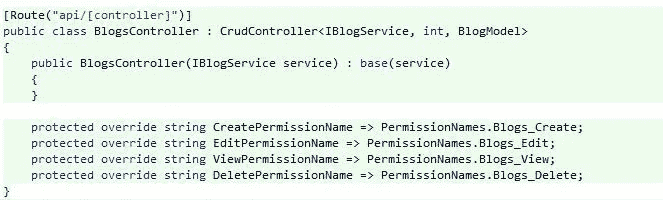
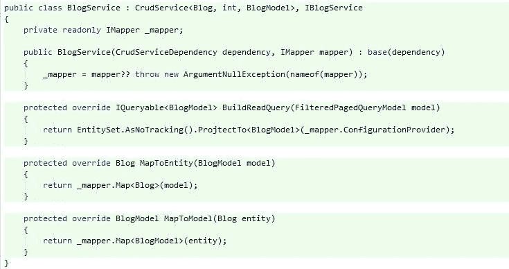
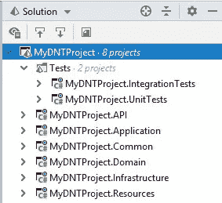
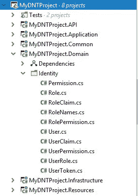
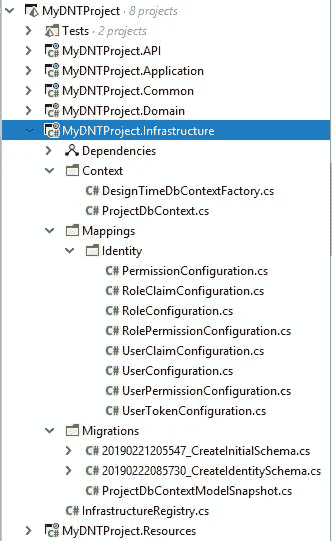
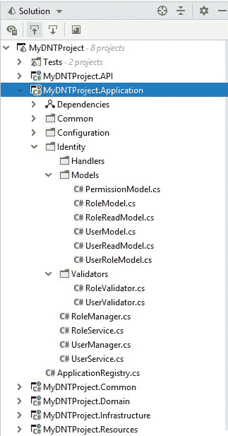
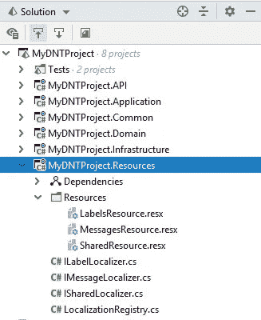
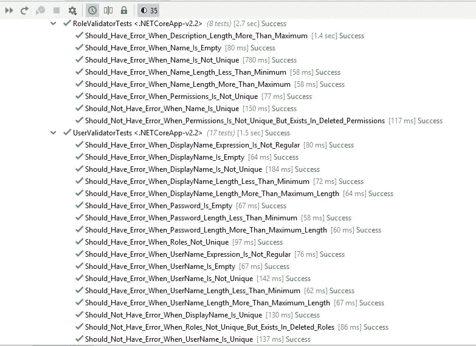
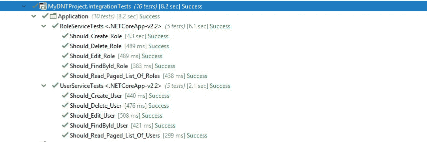
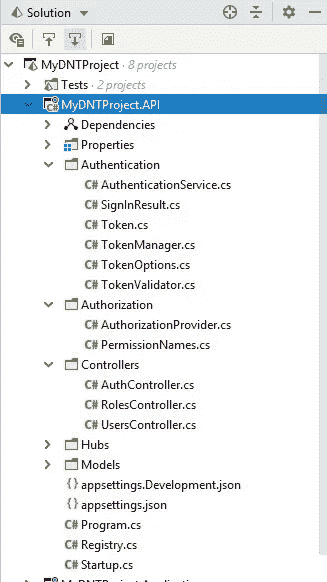

# 作为轻量级基础设施的 DNTFrameworkCore

> 原文：<https://medium.com/hackernoon/dntframeworkcore-as-a-lightweight-infrastructure-e14283cdb523>


Photo from pexels.com

[dntframeworcore](https://github.com/rabbal/DNTFrameworkCore)是一个轻量级、可扩展的基础设施，用于构建基于 ASP.NET 核心的高质量 Web 应用，其目标如下:

*   各种应用中的通用结构，如横切关注点等
*   遵循 DRY 原则，专注于主要业务逻辑
*   减少开发时间
*   减少 bug 并阻止 bug 传播
*   减少缺乏面向对象和面向对象知识的新开发人员的培训时间



Blog Entity CRUD API



Blog Entity CRUD Service

# 特征

这个框架有各种特性，我在下面列出了它们:

*   [自动输入验证和业务验证](https://github.com/rabbal/DNTFrameworkCore/blob/master/test/DNTFrameworkCore.Tests/Validation/ValidationInterceptorTests.cs)
*   [自动交易管理](https://github.com/rabbal/DNTFrameworkCore/blob/master/test/DNTFrameworkCore.Tests/Transaction/TransactionInterceptorTests.cs)
*   [事件](https://github.com/rabbal/DNTFrameworkCore/blob/master/src/DNTFrameworkCore.EntityFramework/Application/CrudService.cs#L155)
*   [具有跟踪状态机制的聚合更新(主-详细信息)](https://github.com/rabbal/DNTFrameworkCore/blob/master/src/DNTFrameworkCore/Domain/Entities/ITrackedEntity.cs)
*   [自动编号](https://github.com/rabbal/DNTFrameworkCore/tree/master/test/DNTFrameworkCore.EntityFramework.Tests/Numbering)
*   [功能编程错误处理，而不是使用异常进行流程控制](https://github.com/rabbal/DNTFrameworkCore/tree/master/src/DNTFrameworkCore/Functional)
*   [动态权限授权](https://github.com/rabbal/DNTFrameworkCore/tree/master/src/DNTFrameworkCore.Web/Authorization)
*   [CrudService](https://github.com/rabbal/DNTFrameworkCore/tree/master/src/DNTFrameworkCore.EntityFramework/Application)
*   [CrudController](https://github.com/rabbal/DNTFrameworkCore/blob/master/src/DNTFrameworkCore.Web/API/CrudController.cs)
*   [数据库记录器提供商](https://github.com/rabbal/DNTFrameworkCore/tree/master/src/DNTFrameworkCore.EntityFramework/Logging)
*   [审计](https://github.com/rabbal/DNTFrameworkCore/tree/master/src/DNTFrameworkCore.EntityFramework/Auditing)
*   [数据保护密钥数据库](https://github.com/rabbal/DNTFrameworkCore/tree/master/src/DNTFrameworkCore.EntityFramework/DataProtection)
*   [名值设置管理](https://github.com/rabbal/DNTFrameworkCore/tree/master/src/DNTFrameworkCore.EntityFramework/Configuration)
*   [挂钩](https://github.com/rabbal/DNTFrameworkCore/tree/master/src/DNTFrameworkCore.EntityFramework/Context/Internal)
*   [软删除](https://github.com/rabbal/DNTFrameworkCore/blob/master/src/DNTFrameworkCore/Domain/Entities/ISoftDeleteEntity.cs)
*   [多重租赁](https://github.com/rabbal/DNTFrameworkCore/blob/master/src/DNTFrameworkCore/Domain/Entities/ITenantEntity.cs)
*   [跟踪机制(CreatorUserId，CreationDateTime，LastModifierUserId，…)](https://github.com/rabbal/DNTFrameworkCore/tree/master/src/DNTFrameworkCore/Domain/Entities/Tracking)
*   [FluentValidation 集成](https://github.com/rabbal/DNTFrameworkCore/tree/master/src/DNTFrameworkCore.FluentValidation)
*   [背景任务队列](https://github.com/rabbal/DNTFrameworkCore/tree/master/src/DNTFrameworkCore/Threading/BackgroundTasks)
*   CQRS(即将推出)
*   实体历史(即将推出)

# 装置

要基于 DNTFrameworkCore 创建您的第一个项目，您可以安装以下软件包:

```
PM> Install-Package DNTFrameworkCore
PM> Install-Package DNTFrameworkCore.EntityFramework
PM> Install-Package DNTFrameworkCore.EntityFramework.SqlServer
PM> Install-Package DNTFrameworkCore.Web
PM> Install-Package DNTFrameworkCore.Web.EntityFramework
PM> Install-Package DNTFrameworkCore.FluentValidation
PM> Install-Package DNTFrameworkCore.Web.MultiTenancy
```

运筹学

1-运行以下命令，安装基于 ASP.NET 核心 Web API 和 DNTFrameworkCore 的[样板项目](https://github.com/rabbal/DNTFrameworkCoreTemplate)模板:

```
dotnet new --install DNTFrameworkCoreTemplateAPI::*‌‌
```

2-使用已安装的模板创建新项目:

```
dotnet new dntcore-api
```

现在，您有了一个如下所示的解决方案，它包含完整的身份管理功能，包括用户、角色和动态权限管理，并且还集成了持久 JWT 身份验证机制:



Multi Project Solution

# 介绍已安装模板中的各种项目

**域**项目包含应用程序的“域模型”。例如，在该模板中设计了身份管理系统的贫血域模型。



**基础设施**项目包含 DbContext、映射和 EF 核心迁移。



**应用**项目包含与领域实体、验证器、应用服务和事件处理器相关的 DTOs 模型。



**资源**项目包含 resx 文件。



项目包含了你的应用程序的单元测试。例如，您可以在下图中看到 UserValidatorTests 和 RoleValidatorTests 的结果:



**IntegrationTests** 项目包含应用程序的集成测试。例如，您可以在下图中看到 RoleServiceTests 和 UserServieTests 的结果:



**API** 项目包含控制器、集线器和 JWT 认证基础设施。例如，您可以在下图中看到角色控制器、用户控制器和授权控制器:



最后，如果这个基础设施是有用的，分享它。