# 公司实际上需要区块链吗？

> 原文：<https://medium.com/hackernoon/do-companies-actually-need-blockchain-df8aea80d98d>

[区块链](https://hackernoon.com/tagged/blockchain) [技术](https://hackernoon.com/tagged/technology)是这些天的热门话题，将这项技术整合到你的业务中会有好处。然而，企业应该明智地权衡他们的选择。这项技术可以极大地帮助降低成本，增加收入，并消除对中间人的需求。但由于它仍相对较新且未经测试，区块链的好处是以交易速度为代价的。目前..😉

让我们来看看有哪些条件可以帮助您决定您的企业是否真正需要区块链技术。

## 你准备好迎接未来了吗？

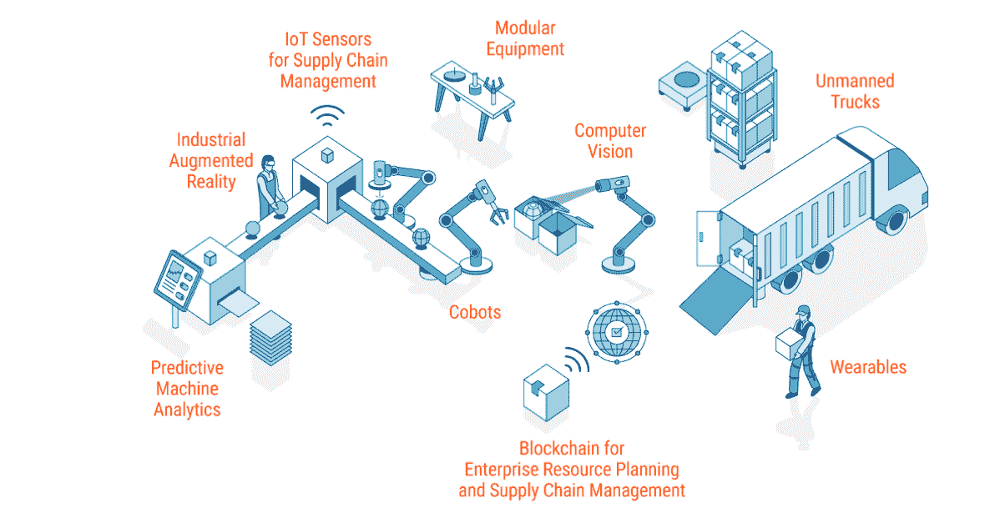

## 你能保证数据安全吗？

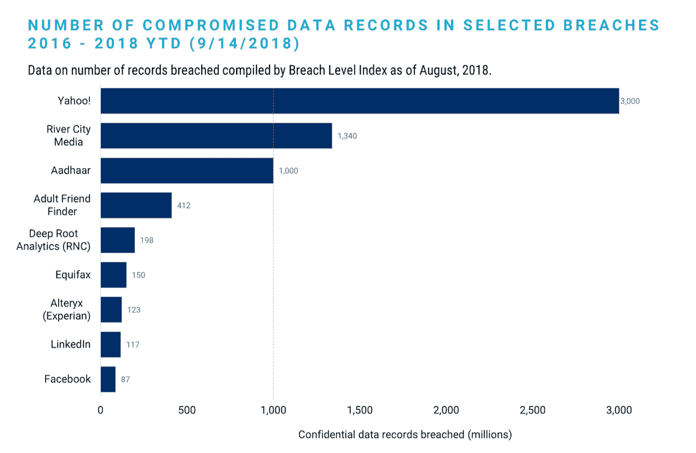

## 人人都是科技公司！

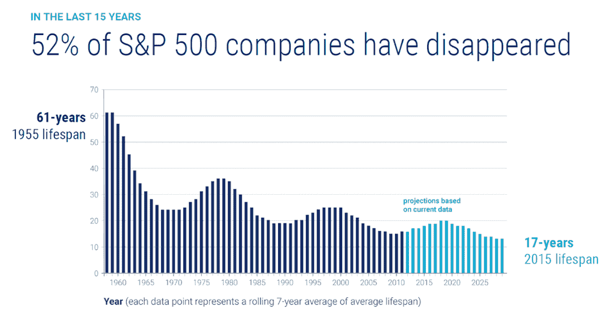

## 了解区块链是否适合您的业务的一种方法是评估您的公司需求。

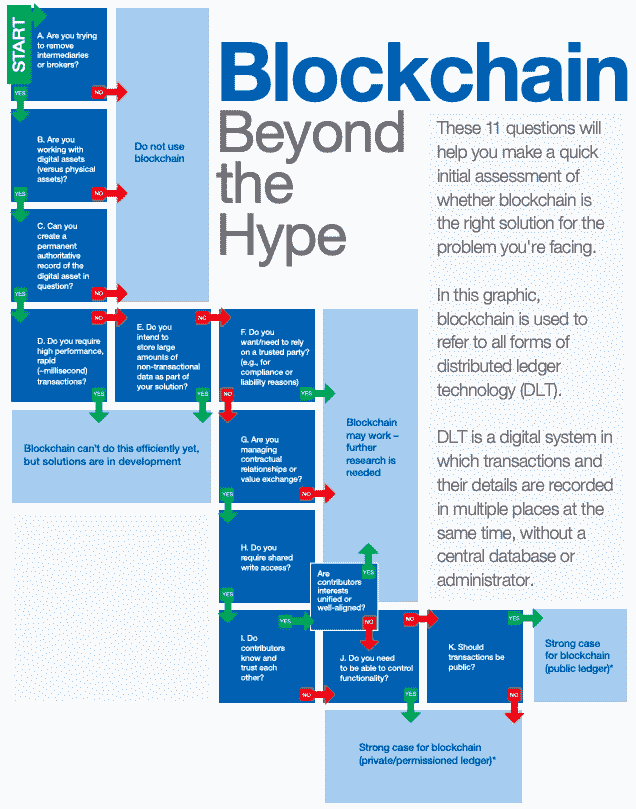

## 另一种方法是评估区块链在效率和安全改进、新业务部门的替代融资或扩张方面带来的机会。

围绕“区块链”的炒作、加密货币等投机性新资产和 ico 等替代性筹资手段夸大了这项新技术的现实能力和应用。企业、开发商和投资者还没有找到适合分布式账本技术的应用程序。

## **数据库**

几十年来，数据库一直用于保存状态和查询数据。已经投入了几十年的研究来优化不同层次的查询处理。

*   自然，它们在事务吞吐量和查询延迟方面具有最高的性能。
*   但是，一直以来，它们都被设计为由一个机构集中管理。因此，不同缔约方之间不需要共识机制。
*   此外，集中式服务、服务器和数据中心容易受到网络攻击

## **无权限区块链**

无许可区块链是不受中央权威机构管理的公共分类账。也就是说，分类帐分布在对等体的动态网络中。

*   Satoshi 的聪明之处在于，他提出了一种设计，这种设计在一个动态的、不可信的网络中保持分布式状态的一致性。这意味着未经许可的区块链可以容忍一个(部分)具有拜占庭式或不可信行为的网络。
*   因为一切都是有代价的，所以这里的权衡是性能成本(吞吐量和延迟)。在比特币中，性能的急剧下降是因为 POW 协议本身的设计速度很慢。与普通数据库相比，在任何无权限的区块链中，性能下降是不可避免的。因为无论如何，为了保持分布式状态的一致性，在(地理上分布式的)网络中的不同对等体之间必须有通信。

## **获得许可的区块链**

许可区块链代表一种混合设计。它们没有被集中到单个实体，但是它们被授权给一小组预先选择的可以写状态的可信对等体。

*   由于数据库网络不会像无权限区块链那样扩展到大量公共节点，因此它在吞吐量和延迟方面的性能要好得多。
*   尽管如此，它的性能无法与集中式数据库竞争。

在查看了这些不同的系统之后，很容易意识到没有一个放之四海而皆准的解决方案。一切都是有得有失。不同的应用有不同的要求，因此相应的解决方案也不同。

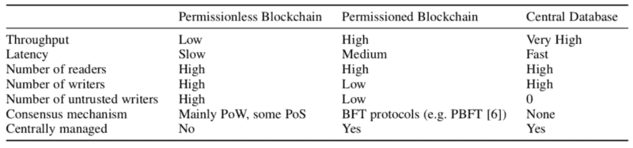

公共和私有区块链之间的唯一区别在于谁被允许加入网络、执行共识协议和维护共享账本。

**一个公共的区块链**网络是完全开放的，任何人都可以加入和参与这个网络。网络通常具有激励机制，以鼓励更多的参与者加入网络。比特币是当今生产中最大的公共区块链网络之一。公共区块链的一个缺点是维护大规模分布式账本需要大量的计算能力。另一个缺点是公开的区块链的开放性，这意味着交易很少甚至没有隐私，并且只支持弱的安全概念。

**一个私人的区块链**网络需要一个邀请，并且必须由网络发起人或者由网络发起人制定的一套规则来验证。建立私人区块链的企业通常会建立一个许可的网络。这就限制了谁被允许参与网络，并且只能参与某些交易。

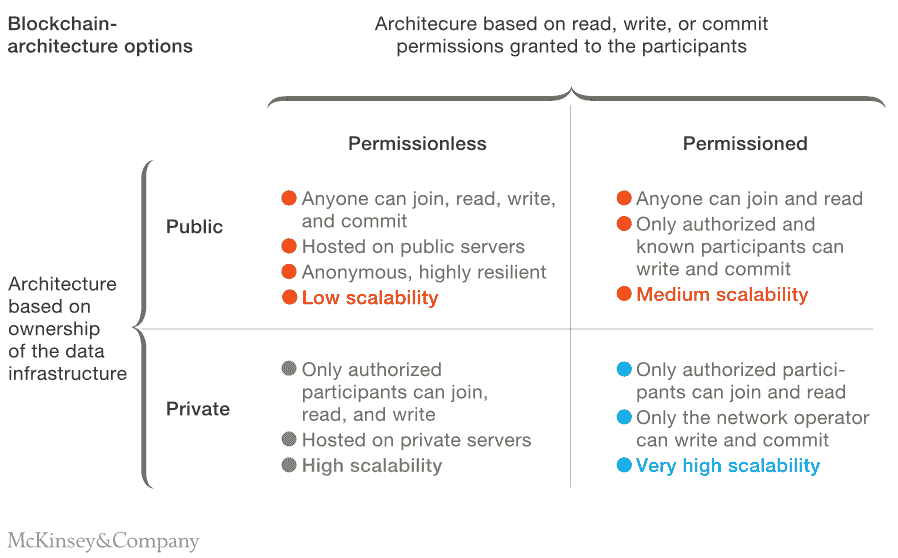

*Commercial Blockchains might use private, permissioned architecture to optimize network openness and scalability*

是否采用区块链不仅仅是一个技术决定；这也是一个商业决策。伟大的用例以比采用带来的好处低得多的成本解决了真正的问题。区块链的独特属性，意味着一个新的分析框架是有用的，部分原因是区块链出现在社会技术发展的一个独特点上。虽然应用技术来改进业务流程并不是什么新鲜事，但前几代技术主要是为了更快、更安全地交换信息。与此同时，区块链是关于价值交换的；它旨在使个人能够相互交换货币和其他资产，而无需依赖第三方来管理交易。这也意味着公司内部和公司之间的业务流程的戏剧性的重新定义。

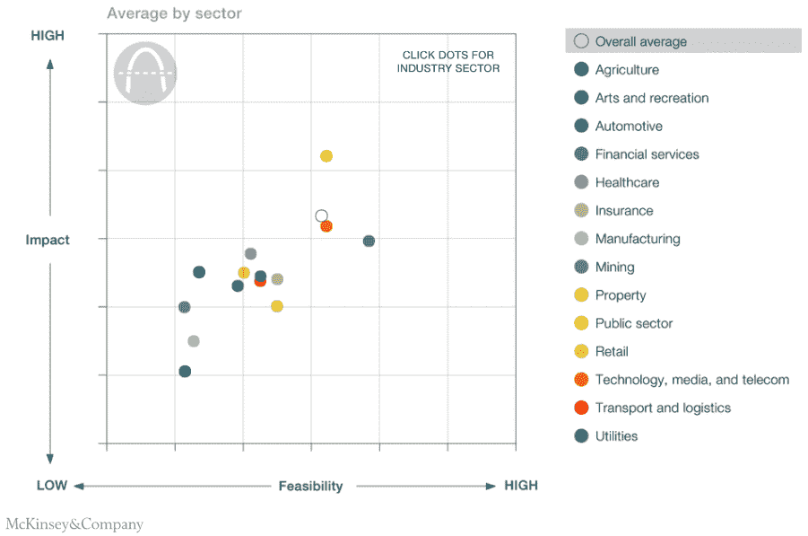

*Blockchain Disruption Across Industry Sectors*

## 区块链的战略价值主要在于降低成本

区块链可能具有颠覆性的潜力，成为新运营模式的基础，但其最初的影响将是提高运营效率。通过取消中介或记录保存和交易对账的管理工作，可以降低现有流程的成本。这可以通过捕获损失的收入并为区块链服务提供商创造新的收入来转移价值流。根据麦肯锡的调查，“短期内大约 70%的价值在于降低成本，其次是创收和资本释放”

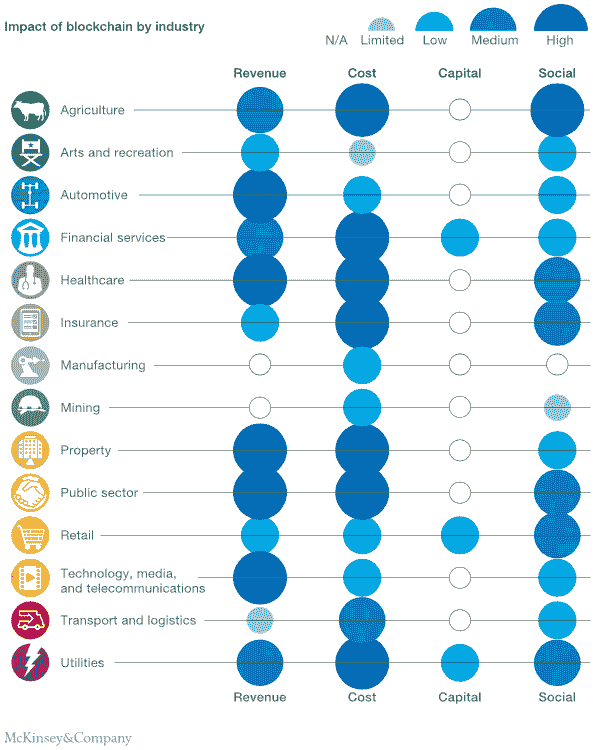

*Value derived from Blockchain technology across industries*

## 高潜力用例的特征

加密货币的核心优势是低费用可转让性、跨境交易能力和在价值增值/储存情况下的通缩特征。区块链的主要优势是去中心化、密码安全、透明和不变性。它允许在不依赖第三方权威的情况下验证信息和交换价值。

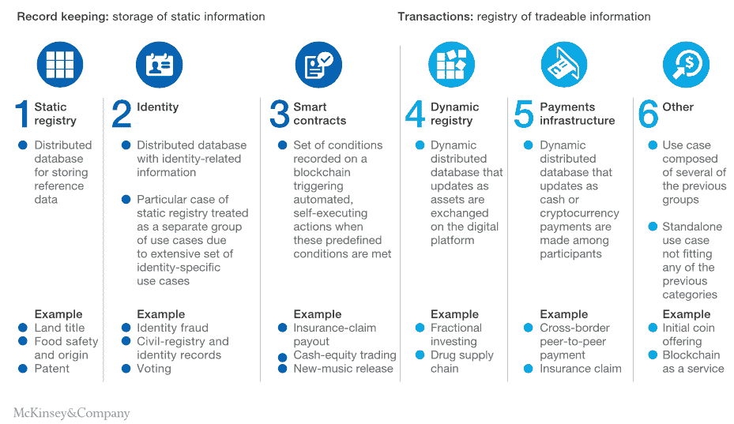

*Six distinct categories of blockchain use-cases addressing two major needs*

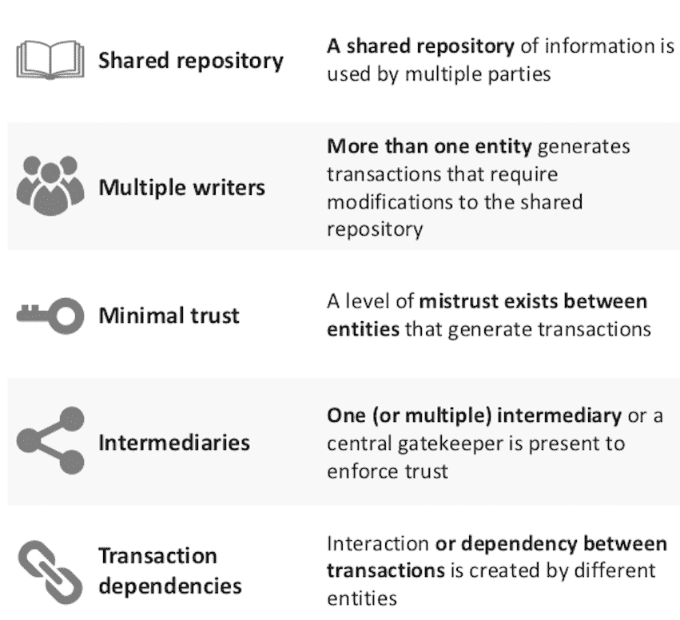

*Characteristics of high‐potential use cases*

# [moonwale Ventures 商业咨询和创业顾问](http://moonwhale.io/business-consulting/)

基于市场定位优化区块链战略。确定有前景的使用案例，制定策略和设计选择，以形成可行的解决方案。

行业领导者应该立即行动起来，保持他们的市场地位，并利用这个机会制定行业标准。作为追求对协调和监管批准要求较少的用例的主导者，他们可以建立市场解决方案。

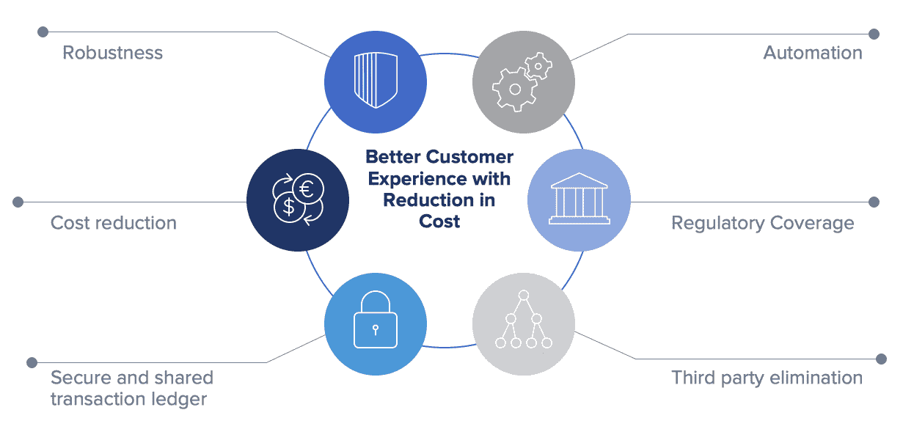

*月鲸:价值链优化，效率提升*

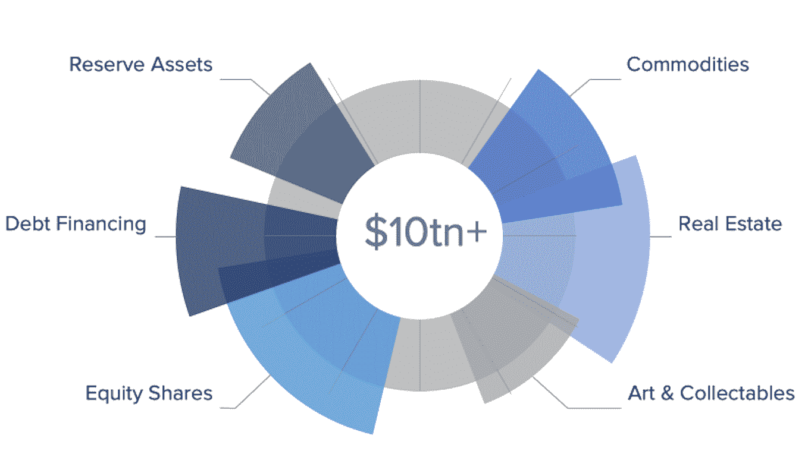

*月鲸:为你的扩张融资，将资产证券化*

*来源:CB Insights，* [*你需要一个区块链吗？*](https://eprint.iacr.org/2017/375.pdf) *、世界经济论坛、麦肯锡&公司、IBM*

我希望你喜欢这篇文章！请在下面留下任何反馈。让我们祝愿 2019 年更加美好。:)

# 关于作者

**Iliya Zaki 是**[**moonwale Ventures**](https://moonwhale.io)**的营销和业务开发主管。**

Moonwhale Ventures 是一家 [STO 金融咨询公司](https://moonwhale.io/investment-platform/#third)，为公司提供关于 STO 进程&结构的战略建议，以及代币发行，包括其项目的生命周期管理和二级市场参与。Moonwhale 还在建立一个端到端证券令牌(STO)投资平台，该平台将迎合寻求投资 STO 项目的投资者，以及寻求通过 STO 筹集资金以资助业务扩张或新企业的公司。

更多信息，请访问:[月鲸 STO 解决方案](https://moonwhale.io/investment-platform/#third)

[推特](https://twitter.com/MoonwhaleBV) | [领英](https://www.linkedin.com/company/moonwhalebv) | [脸书](https://www.facebook.com/MoonwhaleBV/) |

