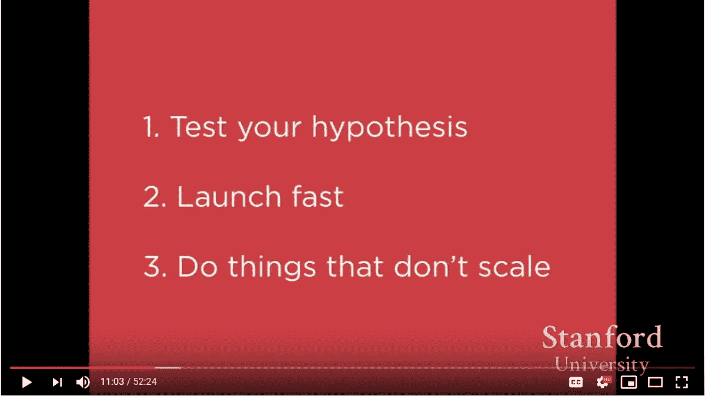

# 做不可扩展的事情:4 个鼓舞人心的创业例子

> 原文：<https://medium.com/hackernoon/do-things-that-dont-scale-4-inspirational-startup-examples-a2ab3a5c4926>

有一个想法你还没能开球？在你开始之前，早期创始人在考虑大联盟吗？这里有一些来自资金雄厚的初创企业的灵感，关于他们如何验证他们最初的想法。

> 从小处着手。现在开始。开始吧..

*排名不分先后，来了:*

1.  [Doordash](https://www.doordash.com/)

由 Y Combinator 支持的 DoorDash 是几家利用物流服务按需提供餐馆送餐服务的科技公司之一。这里有一小段[摘自创始人](https://www.youtube.com/watch?v=sr0UabJd8qE&feature=youtu.be&t=199)、 [Stanley Tang](https://medium.com/u/b70728731dd8?source=post_page-----a2ab3a5c4926--------------------------------) 关于如何开始和最初做一些根本无法扩展的事情。

零比一，非常快。方法如下:

> *登陆页面在一个下午，他们在晚上做餐馆取货和送货的工作(都是他们自己做的，而且是在大学期间！).是的，一天之内。*

*关键要点*:把这当成一个实验，拿出来验证一下！开始时，你的目标是获得反馈，并确保你要解决的不是个人偏见！这样做最大的好处是你也将有机会与你的用户交谈并获得实时反馈！这可能不是对每个人都有效，但是对其他 90%的想法是有效的，你正等着在发布前构建一个“完成的&闪亮的”产品..

如果你在解决一个真正的问题，你不需要任何算法或完美的网页。一个干净的登录页面，把所有的东西拼凑在一起，让事情运转起来，这就是你所需要的。

这是视频中我最喜欢的一张幻灯片:

May sound really basic, but definitely important.

2. [Teespring](https://teespring.com) —

YC 再次表示，Teespring 是一个定制商品的平台，在这里你可以设计自己的衣服并开店，团队负责其他一切事务，并从销售额中提成。Teespring 的创始人沃克·威廉姆斯(Walker Williams)讲述了一些有趣的技术，这些技术帮助他们获得了最初的用户，同时做了一些根本不可扩展的事情。

做不可扩展的事情本质上不会持续你很长时间，直到你的第一百万个用户才会结束——它肯定会中断，但你会得到你想要的结果，花费更少的时间和金钱。

*关键要点*:获取用户没有灵丹妙药。你不可能一夜之间拥有成百上千的用户。百万分之一的产品被病毒式传播，他们的故事是不同的。但这并不意味着剩下的人没有活下来，有些人活下来了。其中的一个共同点是他们一次只培养一个用户。最初会很艰难，不会有任何成功的故事可以推销，但作为一名创始人，你有责任亲自带来这些用户，即使这需要你与客户通电话。

当你开始时，斜坡是最陡的，希望最终你能到达一个点。这可能需要时间，你不会看到你的时间投资回报率，但专注于增长。尽可能给你的初始用户最好的体验，给他们留下难忘的体验，让他们成为你产品的拥护者和拥护者。沃克仍然每天提供多达 20 张 CS 门票，并通读他所有的 twitter 订阅和他的社区——了解你的客户在谈论什么，好的坏的甚至是丑陋的，以便你可以解决它，这很重要。

主动接触当前用户和被搅动的用户，这将帮助你找到痛点，并为当前用户解决这些痛点。

> “问题是不可避免的，尽一切努力纠正它”

所有需要的是一个诽谤者击落吨的势头。咬紧牙关，尽你所能去弥补。

最后，记住这一点！

> 经验法则:只担心下一个数量级。

当你 10 岁时，想想 100 岁；当你到达那里，担心下一个 900。不要直接跳转或优化上面的两到三个级别。人们说需要是发明之母——我向你保证，你会弄明白的。

3. [ProductHunt](http://www.producthunt.com)

在推特上关注了[瑞安·胡佛](https://medium.com/u/c2146664c8e4?source=post_page-----a2ab3a5c4926--------------------------------)之后，我认识到了从想法到实际可行的 MVP 的重要性，以及快速发货和获得客户反馈的价值。

下一个是我的另一个例子(我们的！)最受欢迎的初创公司——product hunt——一个允许用户分享他们最喜欢的产品并在全球范围内发现新产品的网站。

四处探索后，我在胡佛 2014 年初的[博客文章](/on-startups/the-artifacts-of-product-hunt-11682e9e01dd)上发现了这一点，分享了他关于筹集 610 万美元首轮融资的最新情况和经历。

他分享了自己卑微的出身——引用瑞安的话

> “产品搜索始于电子邮件列表。我在一个凌晨把它扔在一起，邀请了一些朋友来投稿，并在网上分享了它。”

一点一点，从朋友和网络，他们开始建立和运输的 MVP，而不是把时间放在一起，琢磨这个想法。电子邮件列表开始获得大量用户反馈，几个月后，内森·巴肖(Nathan Bashaw)才开始建立“真正的”PH！

在 Ryan 发表的另一篇[文章](https://www.fastcompany.com/3024472/how-we-got-our-first-2000-users-doing-things-that-dont-scale)中，他讲述了如何做一些不可扩展的事情，以及他们如何在这个过程中拥有 2000 名用户。在这种情况下，他分享了成功的测试版有多重要，以及手动缓慢增长如何比曲棍球棒曲线更能推动公司长久发展。他还分享了电子邮件作为一种工具有多么重要(虽然今天有大量的自动化，但在正确的上下文中，一封写得很好的电子邮件在早期可以有很大的帮助！成长黑客们，注意了！)

*关键要点*:最终产品看起来、摸起来都要比你发布的第一个产品好 100%。(在大多数情况下，也会解决不同的问题)。因此，早点开始，快速出货，收集反馈，然后从头开始。此外，在建立你的 MVP 的同时，重要的是开始建立平行的分布:一个 Twitter 关注，一个电子邮件列表，任何有助于传播消息的东西:)

4. [Airbnb](http://www.airbnb.com)

Airbnb 是一个安排或提供住宿(主要是寄宿家庭或旅游体验)的在线市场，在“他们是如何做的事情”中，可能有最多人谈论的[文章](https://mediaschool.com.au/airbnb-story-brian-chesky-lessons-for-business-startups/?print=print)、[播客](https://mastersofscale.com/brian-chesky-handcrafted/)和[视频](https://youtu.be/2hESOWxPrSU?list=PLQDKn_3NPlwa56iP9qUQkSLeuUXP0kY8p&t=9)，这些内容并没有扩大规模，但却让他们走到了今天(切斯基与格雷厄姆最著名的对话，加上他们公开分享的其他轶事)

从[肖恩·埃利斯](https://medium.com/u/8ee94400f4fb?source=post_page-----a2ab3a5c4926--------------------------------)的《黑客成长》一书中摘出一个:

“在发展公司的过程中，令他们惊讶的是，Brian 和 Joe 发现纽约市虽然游客众多，但却发展不足。查看他们的列表，联合创始人 Joe Gebbia 回忆说“照片真的很糟糕。人们使用照相手机，拍摄 Craigslist 质量的照片。惊喜！没有人预订，因为你看不到你在支付什么。”他们最早的投资者之一、YC 的保罗·格拉汉(Paul Grahan)建议，这两项旨在提高预订率的实验技术含量低、工作量大，但执行起来很快，最终取得了令人难以置信的效果。

切斯基和格比亚租了一台 500 美元的相机，挨家挨户地为该市尽可能多的房源拍摄专业照片。然后，他们将照片经过改进的房源的预订数量与纽约其他房源的预订数量进行了比较，发现新照片带来的预订数量增加了两到三倍，立即使他们在纽约看到的收入翻了一番。

随着他们的假设被证实，他们将这一点扩展到巴黎、伦敦、温哥华、迈阿密——所有这些城市都显示出相似的结果。因此，Airbnb 决定创建一个摄影项目，允许主办方安排一名专业摄影师来拍摄他们的房源。它在 2010 年夏天由 20 名摄影师发起，到 2012 年已经发展到 2000 多名自由摄影师，为 6 大洲的 13，000 个房源拍摄照片。"

*关键要点*:所有其他方法可能都有助于扩展，但[布莱恩·切斯基](https://medium.com/u/bb249e5e0d1b?source=post_page-----a2ab3a5c4926--------------------------------)和[乔·格比亚](https://medium.com/u/8e37c023687a?source=post_page-----a2ab3a5c4926--------------------------------)坚持做那些根本无法扩展的事情，但帮助他们了解用户正在经历的真正问题。在追求虚荣或不相关的增长时，很容易失去你的北极星指标，但重要的是，你要坚持基础，专注于你想去的地方。

做不占用资源的事情:

1.  [保罗·格拉厄姆随笔](http://paulgraham.com/ds.html) — Stripe、Airbnb、Pinterest、苹果、Pebble、Meraki
2.  做不可扩展的事情( [YouTube 播放列表](https://www.youtube.com/watch?v=2hESOWxPrSU&list=PLQDKn_3NPlwa56iP9qUQkSLeuUXP0kY8p) ) — Airbnb
3.  环顾四周，在[的 ProductHunt 上发现了一个精彩的](https://medium.com/u/e8c69f713e48?source=post_page-----a2ab3a5c4926--------------------------------)[资源](https://dothingsthatdontscale.com/)这是 KP——一个不可扩展的创业公司黑客和故事的众包集合！
4.  通过[缓冲](/buffer-posts/achieving-scale-by-doing-things-that-dont-scale-adb9bdee273e)做不可伸缩的事情

有几个人正在努力让我们其他人的这种方式变得更容易，他们分享了一些我非常喜欢在 Twitter 上关注的人，以及他们都做了些什么！

有想法吗？只是想在没有任何编码的情况下快速验证它吗？你可以从这里开始>向[本·托塞尔](https://medium.com/u/1e799dd24f88?source=post_page-----a2ab3a5c4926--------------------------------):)赊账

💻个人页面/登陆页面:Carrd.co
🖥想打造下一个 Airbnb +无代码:Webflowapp
💵支付:Stripe Atlas/Razorpay
🛠自动化自动化📊数据库到网站/表单:Airtable
🎨线框/原型:草图应用/ Figma 设计
📝路线图，规划:Trello
📛购买域名:Namecheap / Google domains
📧时事通讯:Revue 电子邮件活动:Mailchimp
📸免费高质量照片:Unsplash
📈分析:谷歌分析，Baremetrics
💌收件箱:SuperhumanCo 表单:SurveyMonkey，Typeform
📄文档:谷歌文档，概念，Dropbox
🖼麻省理工学院授权插图:unDraw
📹轻松视频对话:出现

你也应该看看他的 [MakerPad](https://www.makerpad.co/) (早些时候在 NewCo 做了一些很酷的事情)的一些很棒的 Carrd 教程或者你如何用最简单的方法构建 x！

如果你还没有遇到过[Startup Stash](https://startupstash.com/)——一定要查看一下，这是一组跨不同垂直行业的令人敬畏的资源！制造商 Bram Kanstein 现在正与 NoCodeMVP 一起帮助你们更轻松地做每件事。🚀🚀🚀

最后但同样重要的是，分享[帕特·沃尔斯](https://medium.com/u/a780322f57a7?source=post_page-----a2ab3a5c4926--------------------------------)提出的另一个精彩的[计划](https://24hrstartup.com/)—“24 次创业”——一个让你能够向前迈进并在短时间内建立起来的旅程，以防你需要外部动力！

一如既往，如果我能在你的[之旅](http://www.learnpmwith.me)中帮到你什么，或者如果你只是想获得一些想法，请随时[联系](http://www.suhasmotwani.com)或给我发[消息](http://www.linkedin.com/in/suhasmotwani)——乐意效劳:)

 [## your product guy(@ MotwaniSuhas)| Twitter

### yourproductguy 的最新推文(@MotwaniSuhas)。每天提高 1 %|数据驱动的 PM | Ed-tech / CPG | HMU if I…

twitter.com](https://twitter.com/MotwaniSuhas)