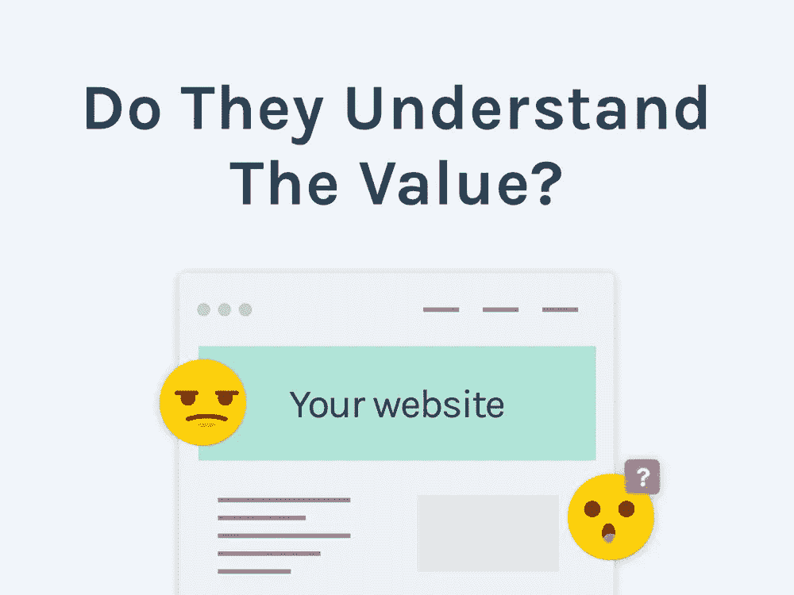
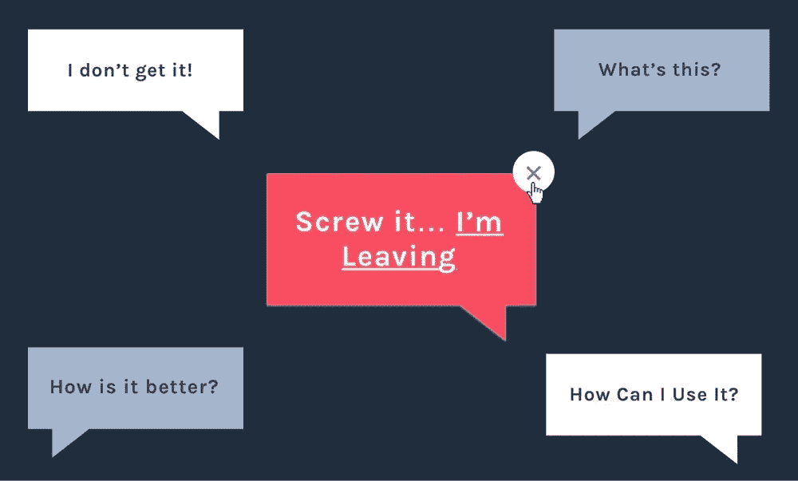
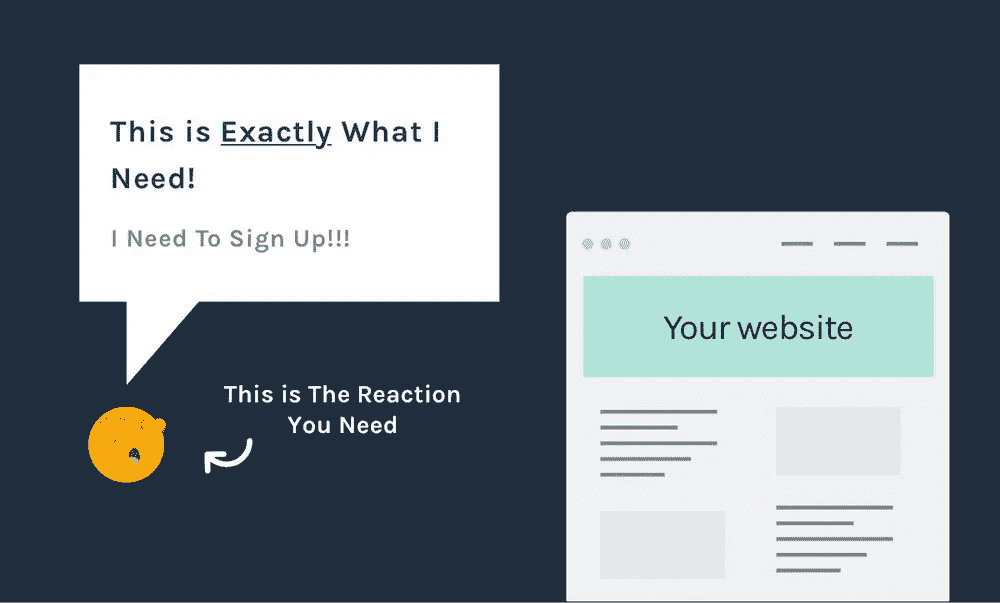
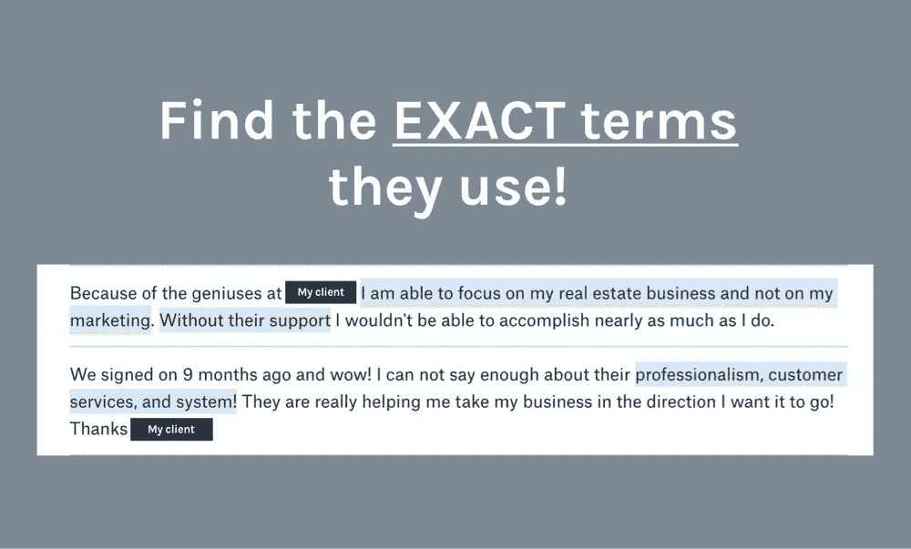
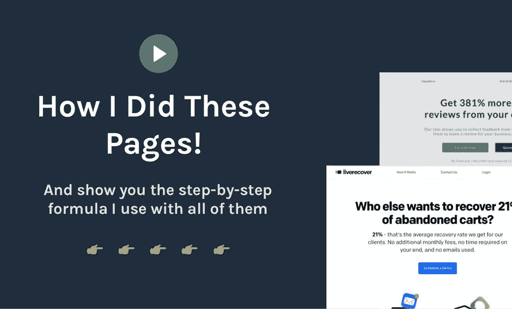
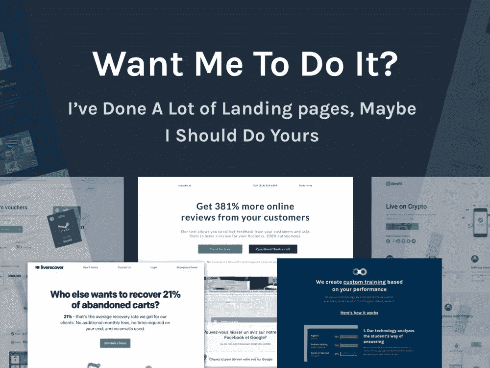

# 访问者了解你的产品吗？SaaS 转化率的秘密

> 原文：<https://medium.com/hackernoon/do-visitors-understand-your-product-the-secret-for-saas-conversion-rates-c2acba09c1d7>

你的访客可能不喜欢你的解释

这是唯一能让你的 [SaaS](https://hackernoon.com/tagged/saas) 转化率暴涨的东西…

**你如何解释产品。**

我知道，我知道…这听起来并不性感，**但这很有效(实际上非常有效)！**

**为什么？因为人们需要感觉到他们可以从你的产品中获得价值，这是他们转变的唯一原因。**

此外，你的产品越贵，就越难证明其价值，你就越需要确定这个信息传递过程。

**这是我为客户做的每个优化项目的核心，也是我很少看到做对的事情。**

在这篇文章中，我将向你展示我的**一步一步的过程，如何解释你的产品，以转化更多的访问者。**

# SaaS 转换率背后的真正原因

不，这不是关于你的 CTA 的颜色…

不是关于你解释的特征…

这不是你要求你的设计师做的“可爱”插图…

或者你(和/或你的团队)花了很长时间试图得到的副本…

归根结底，你的网站看起来怎么样(或者读起来怎么样)并不重要，重要的是访问者如何看待产品的价值。

这意味着，**这完全取决于你如何解释产品。**

你如何**让它看起来有价值……**

你如何**让它看起来像是“完美的解决方案”…**

你如何让它看起来比你的竞争对手好 10 倍(或更独特)……

在这篇文章的后面，你会得到一个关于如何做的五步过程，[完整(免费)视频版本在这里](https://www.cortes.design/video-lp-example)。

# 如果他们不了解产品，为什么要转化？

相信我，他们不会改变信仰的

**想一想……**

人们购买 SaaS 产品是因为他们想解决问题。

如果他们觉得你的产品不能解决这个问题，他们就没有理由转换…

**想想自己的购买习惯。**

你购买 SaaS 产品是因为它们看起来很酷吗？

因为他们有很酷的插图？

还是仿制？

不，你买它们是因为它们看起来是你问题的完美解决方案。

你需要在他们的主要问题和你的解决方案之间建立联系。

但是谁应该知道怎么做呢？

# (恰当地)解释产品是谁的工作？

创始人的？他/她可以创造伟大的产品(并经营公司)**但不知道如何解释这些产品:(**

设计师的？他/她在设计产品(和图形)方面非常出色，但是当你让他们设计你的登陆页面时，他们很难把它们转换过来:(

营销人员的？他/她在高层[营销](https://hackernoon.com/tagged/marketing)策略方面令人惊叹，但**却难以定义完美的文案或指导他人如何去做**(像设计师一样) :(

你猜对了……没有一个官方头衔能让人完美地解释你的产品，让你的 SaaS 登陆页面疯狂地转换。

因为没有人真正知道如何去做，你的团队最终要花很长时间去做改变，并且他们经常导致令人印象深刻的结果。

**这就是你需要十亿次迭代的原因！**那要花你多少钱？

放心吧！我帮助 SaaS 公司克服了这一产品，在这篇文章中，**我将在下面向您概述我行之有效的过程👇。**

如果你正确地遵循它，我可以保证你的访客会看到你的产品更有价值，并愿意转换。

# 如何让你的访客想转换

(更好的 SaaS 转换率给你！)

你需要访问者的反应

下面是如何让网站为你销售产品的方法！

如何让它看起来像完美的解决方案…

让它看起来比竞争对手好 10 倍…

这样做的目的是帮助人们理解你的产品提供的价值。

如果他们这样做了，**他们将会看到他们可以获得的投资回报！**

如果你的产品做得好，他们的投资回报率应该是你的价格的 5-10 倍…

你猜怎么着？如果你的网站也做得很好(按照下面的过程),价格将看起来像一个“没有大脑”！

游客们会想改变信仰。

> ***想要这个公式的视频(更详细)版吗？*** [*这里是免费视频*](https://www.cortes.design/video-lp-example) *(没有选择加入，以及来自真实页面和真实客户端的示例)*

# 第一步——识别核心问题

我们已经确定，人们购买你的产品是为了解决问题…

但不是任何问题… **他们愿意为之付费的问题！**

这就是提高 SaaS 转换率的原因…

如果你没有关注一个足够大的问题，那么支付你所要求的价格或者注册免费试用或演示是没有意义的。

**我们如何发现这个核心问题？**

这里有一些想法👇

他们已经花钱解决了哪个问题？这是承诺的最佳指标。如果他们已经为解决一个问题付费，那么他们已经认为这是值得的。出于某种原因，他们支付的解决方案不够好，所以找出原因并在你的推销中使用它。

**2)他们目前的流程有什么问题？**他们当前的做事方式有问题，这迫使你的潜在客户采取行动，寻找更好的方式。他们目前正在做什么来解决这个问题？为什么他们不能继续做下去？你的产品如何适应这个过程？

**3)你的竞争对手缺少什么？**这也是一个巨大的。研究表明，要让一个人从竞争对手那里跳槽需要 7 倍的努力，所以如果你的潜在客户(或现有客户)这么做了，那一定有非常强的理由！原因是什么？这是他们的核心问题，令人痛苦的是他们不得不更换工具来解决它。

# 第二步——将你的提议定位为完美的解决方案

永远不要试图拿你的竞争对手做参考，他们可能也在挣扎。

让我们面对现实吧，SaaS 世界正在成长，随之而来的是大量的竞争和大量的模仿。

**你将如何脱颖而出？**

有时候，这一步本身就能让你获得最大的 SaaS 转换率。

要了解如何做到这一点**，你需要回答两个问题。**

**1)你的产品如何变得更好？**为什么人们会从竞争对手那里跳槽？为什么比较好用？更快？诸如此类…

你能轻松实现这一飞跃吗？这是一个很大的问题，出于某种愚蠢的原因，它从未出现在登录页面上……切换软件或流程总是会产生成本(时间+金钱),因此请始终解释您可以如何轻松地切换到您的解决方案。也许是因为你有惊人的支持，大量的指南，很好的入门，与他们已经使用的工具的集成…无论是什么，请确保将它包括在您的登录页面上！

# 第三步——说他们的语言

太棒了，现在你已经找到了他们核心问题，而且你的产品在你的市场上看起来是独一无二的，是时候开始写一些文字来解释它了。

我从客户的推荐中发现了一些见解。这是隐私审查…

但是有个问题… **你怎么能不像机器人一样说话呢？**

**你如何将一个技术产品确定为每个人都能理解的明显优势？**

即使你谈论正确的问题和好处，你的网站仍然可能无法转化。

为什么？因为这不足以让他们理解产品的价值。

你需要用他们的语言解释产品。

要做到这一点，你只需要找到他们用来描述他们的问题和他们的理想解决方案的确切术语，并在页面上逐字使用。

**使用他们确切的描述。**没必要在这件事上“耍小聪明”。

这个过程很棒，因为你在使用他们的语言，所以它相当**客观。**这意味着，**你不必经历几次迭代**，一切都已经存在了！

**这里是找到这些确切术语的最佳位置:**

**1)演示/销售拜访。**这是最理想的情景，因为你可以看到人们问了什么问题，他们如何描述他们的问题，总体来说，这是你可以获得大部分信息的媒介。

**2)奖状。**不，不是像“棒极了的工具”这样的通用证明，而是一个更长更复杂的证明，你可以告诉人们投入一些思考。感言并没有那么长，所以它们通常会涵盖他们面临的主要问题，你可以从中获得见解。我从我的一个客户项目中获得了大量的见解，正如你在上面的截图中看到的(在第 3 步的开始)。

**3)支持问题或常见问题。**这些通常是人们购买过程的关键，所以大多数情况下，他们在这里有重要的问题，你可以使用他们如何设计问题以及他们在你的页面上使用的术语。

以下是如何把这些垃圾变成一个登陆页面，以增加你的 SaaS 转化率。👇

# 第四步——使用经过验证的公式

现在，你已经得到了你需要的所有正确的信息来设计你的网页内容…

**你如何将它组织成完美的 SaaS 登陆页面？**

别担心，我是为你做的…我花了几年时间来创建这些项目，现在我有了一个循序渐进的公式，并且我在我做的每个客户项目中都使用它！

这是你我都可以很容易做到的，而且会成功的。我知道，我已经测试了一次又一次。

不需要创造性或大量的重复，**让我们使用已经被** [**证明有效的东西。**](https://www.cortes.design/video-lp-example)

> [***这里有一个我分解它的视频***](https://www.cortes.design/video-lp-example) ***(有来自客户的真实例子)****——没有电子邮件选择加入，只有价值:)*

# 这里有些东西你会喜欢的

了解我为客户设计登录页面时使用的公式。下面是视频分解。

现在你已经知道了这个过程的研究部分，我可以向你展示我用来将这些见解转化为实际登陆页面的公式。

分解每个部分…

分解如何写文案…

以及分解[我如何从我的客户项目中设计一些登陆页面](https://www.cortes.design/video-lp-example)。

所有这些都浓缩成一个 5 步公式，你可以在这个视频中观看[。](https://www.cortes.design/video-lp-example)

> [***这个视频是免费的***](https://www.cortes.design/video-lp-example)*——没有选择加入，只是我解释我是如何做的。*

# 要我为你解释产品吗？

我做了很多登陆页面，也许我应该做你的

我可以解释我的过程中的每一步，但是没有什么能代替我去做。

这就是客户雇佣我的原因。他们想要我的经验、外在的完美和成熟的过程。

**(** [**看看你是否适合这里**](http://www.cortes.design/fit) **)**

想想看，**如果你按照这个过程去做…** 会怎么样

你发现了错误的问题？

错误的利益？

使用错误的结构/顺序？

你猜对了。你的 SaaS 转换率还是会很差

我已经帮助 SaaS 的公司取得了 6 到 8 位数的收益，我相信我也能帮助你。

> ***想知道我能帮上什么忙吗？只需*** [***在此预订即可免费通话。*T38**](http://www.cortes.design/consultation)

**这叫什么目标？**

*   评估你的网站可能存在的问题。
*   查看是否合适(可用性、阶段……)
*   你如何持续不断地把你的访客变成顾客。

> ***听起来很合身？*** [*预定免费咨询这里*](http://www.cortes.design/consultation)

*原载于*[*www . cortes . design*](https://www.cortes.design/post/saas-conversion-rates)*。*