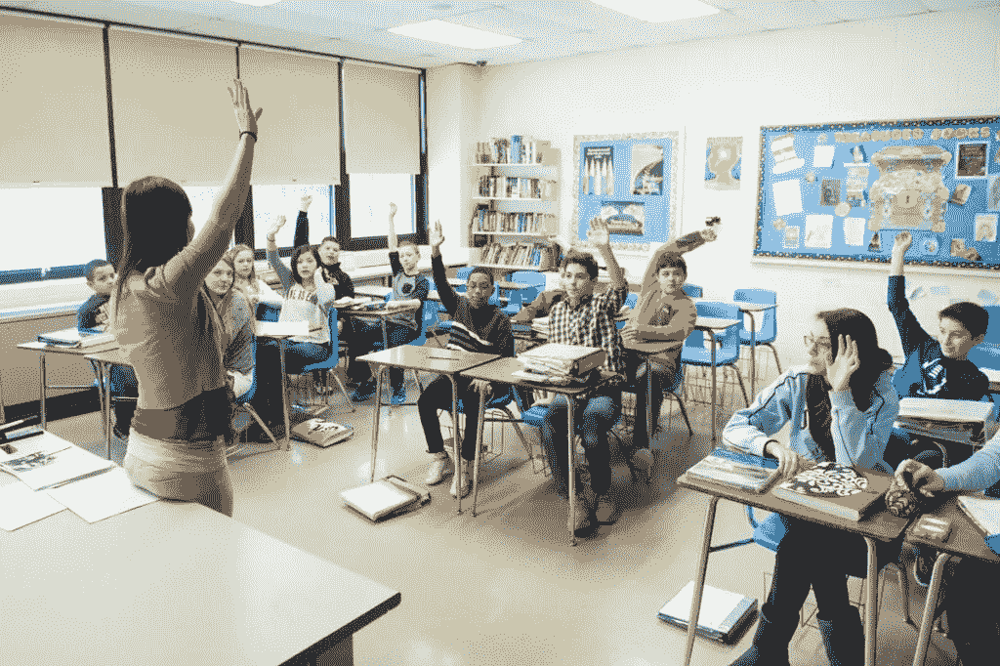

# 我们需要物理教室吗？

> 原文：<https://medium.com/hackernoon/do-we-need-a-physical-classroom-2621682893eb>

## 在线学习和辅导应用的效率检查

“教室”。当你听到这个词时，你会想到什么？嗯，那会根据你出生的时间而改变。对于 90 年代左右出生的大多数人来说，我们想象一个三维空间，有许多像我们一样的孩子，周围有粉笔灰的味道，黑板，笔记本，铃声，教室聊天，集会，一个主导人物在课堂上建立礼仪和传播知识，从书本中取出并有意识地放入我们的大脑。

是的，我们有资源短缺，是的，我们每个科目只有一个老师。从那以后，事情发生了很大的变化。感谢 ***互联网*** 我们拥有世界上一些最好的教授在网上教授的所有资源。能接触到这样的资源感觉太棒了。过去十年，在线学习平台也出现了蓬勃发展，无论是 Udemy、Coursera、Pluralsight、edX、Udacity 还是更多。这些平台不断完善，以提供良好的学习体验，增加了论坛和作业。早在我的大学时代，当我可以在网上读到它的时候，我常常想为什么要去演讲厅，这是一个仍然存在的问题。

我们真的需要物理教室、面对面的讲座吗？难道我们不能按照自己的节奏和方便的方式在网上进行吗？毫无疑问，网络空间是最丰富、最方便的媒介，但我仍然相信这里缺少一个重要的组成部分。

Image I found when I googled “Classroom”

就像聊天缺乏肢体语言、语气和语境一样，我们的数字在线平台也缺乏人情味。不知何故，他们没能建立起 ***学生与教授的关系*** ，而这种关系对大学教育至关重要。在同一个房间里，有另一个人在教你，审视你，这是学习经历中至关重要的组成部分。即使在今天，如果你被要求回忆起在研究生院的学习，你首先回忆起的是不同教授的教学风格和肢体语言，这有时比课程内容更容易回忆起来。有人教你，激励你，并期望你有某种特定的行为。有一种个性和氛围。在数字媒体上很难复制的东西，你可以暂停，倒带，1.5 倍教授讲话的视频，甚至中途打瞌睡。

> 在数字平台上，你获得了控制权

当你掌控一切时，体验就会改变。纪律受到影响，动机也各不相同。这就是为什么在你身边有一个能识别你的人是很重要的。

锻炼应用程序也是如此，你可以控制它们，你可以今天进行会话，或者卸载或暂停它们，但当有一个面对面的教练时，就会有一种额外的*力量*，让你以更大的奉献精神完成任务。学习并不总是容易的，这种力量肯定有助于推动极限和修补你的心灵。

> 人们被观察时会有不同的表现

这就是整个课堂体验变得如此迷人的原因。你是有意识的，不仅仅是听觉，你的身体姿势是有序的，不同的感觉都提升了。数字平台试图尽可能多地模拟它，但直到技术变得过于先进，实体教室才是人们所能拥有的学习体验的最精致的模拟。

除了这些，还有其他小的方面:

*   边听边在笔记本上记下来会让你更加投入，信息会在你的记忆中保留更长的时间。在网上学习时，我们多久做一次？
*   在课堂上与同学讨论，课后讲座是最好的事情之一，我们没有很好的方法在网上做到这一点。即使你添加了一个聊天框或聊天室，表情、语调和肢体语言也是谈话中不可忽视的重要组成部分，尤其是在涉及学习的时候。
*   为了让在线平台更加方便和“按照你自己的节奏”，我们经常进入灵活的时间表，这再次影响了学习的纪律、流程和速度。学习是有原因的，制造间隙和恢复阻碍了学习的流程。

我们做得很好，技术每天都在变得越来越好，但我们是否已经接近为我们的建筑增添人性化的一面了呢？答案并不乐观。我们正处于框架、带宽限制、网络呼叫、平滑 UX 的困境中，涉及到如此多的逻辑和编程因素，以至于我们更容易错过那些实际上可以增强我们参与数字学习的功能。我们能代替教授吗？

我怀疑没有。从今天起我们不能，也不应该。这是我所知道的最好的纽带之一，我相信未来的人类也应该有机会体验它。

这个帖子到此为止。我很快会在下一篇文章中见到你。在那之前，断开连接，反思，写作，继续黑客攻击；)

有趣的是，正如我们在以前的帖子中谈到的技术上瘾，我们能为学习制作一个上瘾的应用程序吗？行得通吗？它已经存在了吗？这在伦理上是正确的吗？有没有学的太多这种事？我听说过任何事情过度都是不好的，我想我刚刚找到了一个反例。你有什么想法？

> 这篇文章是在 90 年代夏天的概念下撰写的。
> 
> “90 年代的夏天”是一个有意识地分析我们对技术的使用，并传播对它带来的问题的认识的倡议，如数字隐私，安全，技术成瘾和设计道德。
> 
> 欢迎你加入我们的行列！
> 
> 在媒体上关注我们，在[脸书](https://www.facebook.com/summer.of.90s)或在 Instagram 上关注[@ 90 年代的夏天，因为我们需要传播消息。](https://www.instagram.com/summer.of.90s/)

