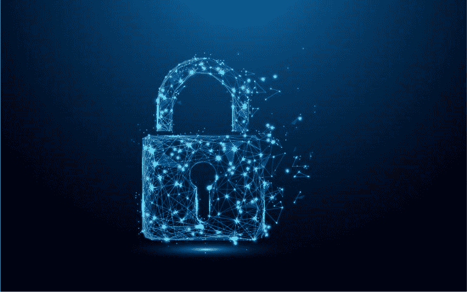

# 你真的需要隐私吗？

> 原文：<https://medium.com/hackernoon/do-you-really-need-privacy-f611311f9901>

让人们关心他们的隐私的第一步是解释他们实际上有多么少的隐私。虽然有些人可能不介意让网站查看他们的 IP 地址，但是如果他们知道网站是如何跟踪他们的，他们可能会更加怀疑。

# “我又不是罪犯，我为什么要在乎？”

***忽视隐私的重要性，我们正在建立一个隐私没有价值、无法保护、保存或增强的未来。***

决定你不需要隐私，或者隐私对你来说根本不重要，这是在让我们的下一代冒着没有隐私的风险。我们都应该倡导我们自己的隐私，否则那些利用数据反对我们的公司将会变得过于强大。想到我们现在拥有的跟踪、定向广告和内容流的水平在不久的将来可能会变得更高，这是很可怕的。

隐私不仅仅是隐藏非法或令人尴尬的活动，而是限制企业对你行为的影响。目前，一个网站对你最大的影响就是推销他们的产品，鼓励你购买。但是正如我们在去年的脸书数据丑闻中所看到的，政治活动正在利用你的互联网数据来影响你的投票行为。

隐私很重要的另一个原因是为了保持社交界限和管理你的声誉。如果你是公众人物，这一点尤其重要。如果在互联网上发布了对你的名誉有害或虚假的信息，你应该有权删除这些信息。欧盟已经有了“被遗忘权”的法律，加州最近也通过了类似的立法。

# 隐私政策的类型

1.  **你会看到一个隐私政策的链接和一个写着“同意”的按钮，或者一个表示你已经认可隐私政策的复选框。**
2.  **你会看到该网站隐私政策的简化版，你可以选择同意或不同意哪些内容。这在手机应用程序中很常见，你可以对许多不同的事情表示同意。**
3.  **隐私政策链接在网站底部，但您无需以任何方式确认。**

第一种模式是给用户一个隐私政策的链接，并让他们在使用服务前同意，这种模式对用户并不友好。让某人阅读一份充满法律术语的长篇文件显然不是告知他们数据是如何被收集和使用的最佳方式。这种模式助长了太多人对隐私的自满。在这种模式下，人们几乎被鼓励盲目同意他们正在使用的网站或服务的隐私和数据做法。不值得花额外的 5 到 15 分钟去了解你的隐私级别。

第二个模型，给用户一个服务收集的物品列表，然后让用户一次浏览一个物品，决定是否同意。这个模式远比第一个人性化，但是这个模式还是不行。它让用户更好地了解他们在使用的服务上到底分享了什么，但它并没有准确地描述它如何工作的复杂性和细节。

第三种类型是隐藏在网页底部的[隐私政策](https://choosetoencrypt.com/news/privacy-issues-with-the-internets-most-popular-websites/),它将隐私隐藏在人们的脑海中，并且没有做足够的事情来告知用户他们是如何被跟踪的。如果一个网站明显侵犯了人们的隐私，应该有一个明确而明显的同意请求。在页面底部隐藏一个隐私政策，没有人愿意阅读，这显然表明网站不关心告知用户他们的数据是如何被收集、存储和处理的。

# 隐私是一项人权

在美国，隐私不受宪法保护。然而，[最高法院](https://choosetoencrypt.com/privacy/general-data-protection-regulation-gdpr-and-private-search-engines/)发现，宪法通过第一、第三、第四和第五修正案授予隐私权以对抗政府的侵犯。然而，当试图将同样的隐私法应用于互联网用户时，情况就变得模糊了。

大多数州都承认人们有权受到保护，免受“对隐居或独处的侵扰，或对私人事务的干涉”但是在网络上还有隐私可言吗？那个已经争论了一段时间的问题。在社交媒体的背景下，很难说任何人使用[脸书](https://choosetoencrypt.com/privacy/how-to-be-invisible-on-facebook/)时都期望他们分享的信息是“私人的”。但是，如果有人在一个安全的网络上用 VPN 连接到互联网，他们可能更希望他们的浏览是“隐私的”。

# 什么是赛弗朋克？

一个 [*赛博朋克*](https://cryptoanarchy.wiki/getting-started/what-is-a-cypherpunk) 是任何一个提倡广泛使用强加密和隐私增强[技术](https://hackernoon.com/tagged/technologies)作为社会和政治变革途径的活动家。这个术语是由旧金山湾区的一名黑客朱迪思·米尔洪在 20 世纪 90 年代初创造的。

> 埃里克·休斯(Eric Hughes)在《一个赛博朋克的宣言》中说，“隐私对于电子时代的开放社会是必要的……我们不能指望政府公司或其他大型匿名组织授予我们隐私……如果我们希望任何……赛博朋克编写代码，我们必须捍卫自己的隐私。我们知道，必须有人编写软件来保护隐私，而且……我们将会编写这种软件。”

密码朋克专注于私人通信、匿名以及最大限度地减少审查和监控。cypherpunk 运动的另一个关键部分是“隐藏隐藏的行为”。如果你成功地隐藏了你的身份，但有人监视你可以告诉你隐藏，这可能会引起注意，并带来额外的审查。

# 隐私是有代价的

例如，如果你决定认真对待你的在线隐私，它可能会与你的商业利益相冲突。[删除你的脸书](https://choosetoencrypt.com/privacy/how-to-be-invisible-on-facebook/)很好，但是如果你需要一个脸书账户来推广你的业务，你就失去了使用脸书的销售机会。

在您的所有设备和网络上实施全方位的隐私和安全工具可能需要时间。除了打开电脑浏览，你可能还需要连接 VPN，并打开另一个浏览器。因为你用 VPN[连接，你的浏览速度会慢一些，但是你会有更好的隐私保护。](https://choosetoencrypt.com/privacy/22-vpn-services-for-privacy/)

# 隐私有可能吗？

一些安全和隐私专家认为*实际的*和*完全的*隐私是不可能的。如果像美国国家安全局或中央情报局这样的政府监控组织想要访问你的互联网通信，他们可以这样做。的确，没有完美的隐私解决方案。任何隐私和安全系统都可能有一些弱点，有人可以利用。

如果你是一个普通人，试着不让你访问的网站知道你的个人信息，你可能会达到这种程度的隐私。但是，如果你是一名国际毒贩，试图让你的通信完全匿名，你可能会很难做到这一点，因为风险更高，对你的通信感兴趣的团体更强大。

*原载于 2019 年 4 月 18 日*[*【https://choosetoencrypt.com*](https://choosetoencrypt.com/privacy/why-do-you-need-privacy/)*。*