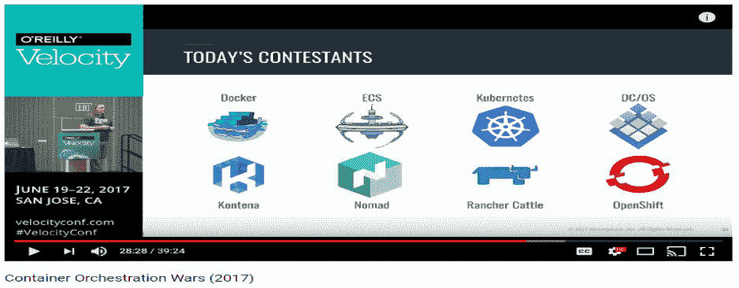
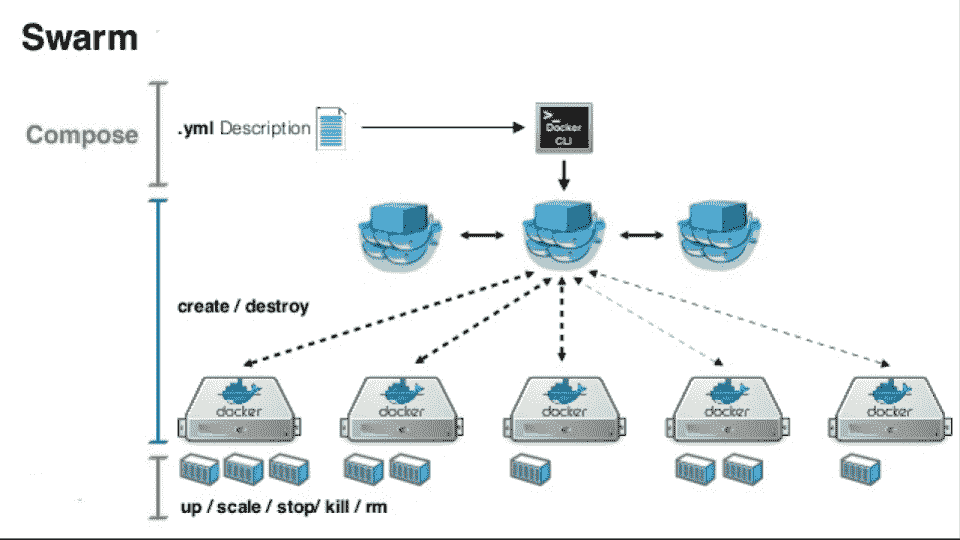
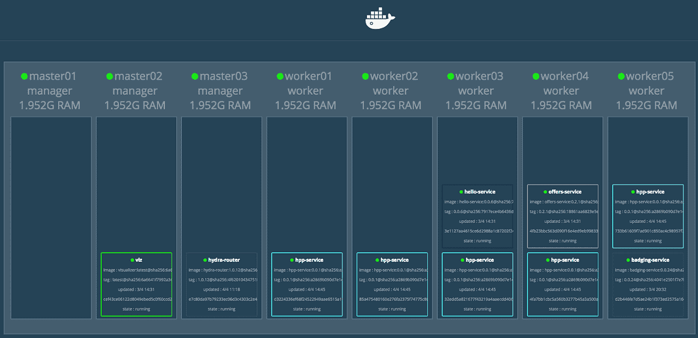

# Docker Swarm，Kubernetes 聪明的小兄弟

> 原文：<https://medium.com/hackernoon/docker-swarm-kubernetess-clever-little-borther-49ac3d0a853>

kubernetes 适合任何基于容器的项目吗？

毫无疑问，kubernetes 是云和容器领域中最受关注的技术之一。Kubernetes 为管理容器提供了一个完整的解决方案，但是有些情况下它不是最好的解决方案。

kubernetes 的主要缺点是它的复杂性和学习曲线。这种复杂性是由几个原因造成的:

*   我们既要知道 Docker 的“语言”，也要知道 kubernetes 的“语言”。
*   基础设施中有许多“移动部件”( kube-apiserver、etcd、kube-scheduler、kube-controller、kubelet、kube-proxy 等..)
*   有许多类型的对象(服务、Pod、部署、复制集)
*   大量我们不一定需要的功能。

简而言之，时间紧迫的项目，或仅由几个集装箱组成的小项目，都不能证明在 kubernetes 上的投资是合理的。这样的项目应该放弃使用容器编排框架吗？当然，答案是否定的。

在这篇文章中，我将首先谈论管弦乐队的好处。然后我会演示 Docker Swarm，Docker 的原生 orchestrator。

Docker Swarm 可能不像他的哥哥 kubernetes 那样功能丰富，但它非常容易使用，在本文结束时，你将知道如何在 orchestrator 中运行和管理容器。

**那么，你为什么需要一个管弦乐队呢？**

在接下来的(略显陈旧的)讲座中，可以看到许多不同类型的管弦乐队。

[Container Orchestration Wars](https://www.youtube.com/watch?v=NRZ6N4e-Mko)

Orchestrators 是容器管理系统，通常具有以下优势:

*   调度
    以最优的资源利用率将容器自动提供给服务器。
*   与云无关的
    在任何云或内部环境中都以同样的方式工作
*   高可用性
*   重启故障容器
*   滚动更新
*   集装箱监控

还有更多…

**码头工人群**

Docker Swarm 是官方的 Docker orchestrator，因此是 Docker 内置的。

它还使用与 docker 相同的“语言”(相同的命令行语法/ docker compose)，因此任何使用 docker 的人都可以利用 Docker swarm，而无需安装第三方和学习新系统。

Docker swarm 的架构非常容易理解。虽然 kubernetes 有几十种对象类型，但 Swarm 只有几种:

*   Manager —管理群集，可以拥有副本以实现冗余。
*   Worker 节点—群集中运行容器的机器。
*   服务—一组相同类型的容器。
*   容器—基本构建块是一个简单的 Docker 容器(不是 pod)。

**运行 Docker swarm 集群**

现在我们知道了什么是 orchestrator，什么是 Docker swarm，让我们看看如何通过几个简单的步骤建立一个 swarm 集群。

1.要准备一些服务器，(一台服务器也可以)，以下端口要开放:2377，7946，4789。服务器可以在任何云上，在几个不同的云上，或者在本地

2.SSH 到将成为管理器的服务器之一(使用外部 ip，例如 x.x.x.x ),并运行:

**$ docker swarm init—advertise-addr x . x . x . x**

3.前面的命令将生成 swarm manager，并返回关于如何向管理器将要管理的集群添加额外服务器的指令。输出将如下所示:

**docker swarm join—token swm tkn-1–49 NJ 1 cmql 0 jkz 5s x . x . x . x:2377**

现在在所有其他服务器上运行上面的输出。这将把它们连接到集群。

4.要查看参与集群的服务器，请返回管理器并运行:

$ docker 节点 ls

**ID 主机名状态可用性管理器状态**

**e32e23r3 worker2 就绪激活**

**Erg56y7j8 worker1 就绪激活**

**t43t 54y * manager 1 Ready Active Leader**

5.剩下的工作就是使用以下命令运行集群中的一些容器:

**docker 服务创建—副本 2 —名称 helloworld nginx**

**docker 服务创建—副本 1 — myredis redis**

“服务”是一组相同类型的容器。

6.要查看群集运行中运行的服务，请执行以下操作:

**$码头服务 ls**

**ID 名称缩放图像命令**

f 54 fg 55 G5 g5g hello world 2/2 nginx

**E32e2323r44r 米雷迪斯 1/1 redis**

7.一些更有用的命令:

改变服务的规模

**$ docker 服务等级 helloworld = 5**

查看容器中的所有元数据

**$ docker service inspect hello world**

删除一组容器

**$ docker 服务室 helloworld**

在[这个脚本中，](https://gist.github.com/DovAmir/410e97f35f3b78530fe92d2793c859e3)有一个在三台服务器上运行 docker swarm 集群的完整示例，一台在 AWS 中，一台在 AZURE 中，还有一台在本地。

**总结**

仅此而已！

我们看到了如何使用 orchestrator 快速建立一个云无关的 docker 集群。

下图显示了 Docker swarm 使用我在 2017 年帮助创建的简单 web UI 工具的示例:

[Docker swarm visualizer](https://github.com/dockersamples/docker-swarm-visualizer)

这里有一些其他的工具来监控和管理 docker swarm。

它们允许运行容器，ssh 进入容器，并从 web 用户界面查看日志:

 [## 群体坑

### 轻量级 Docker 群管理 UI

swarmpit.io](https://swarmpit.io)  [## 集装箱管理，Docker 用户界面，集装箱软件-奥克兰，新加坡，San…

### 现在就轻松构建和管理您的 Docker 环境。在 LINUX、WINDOWS 和 OSX Portainer 社区上可用…

portainer.io](https://portainer.io)