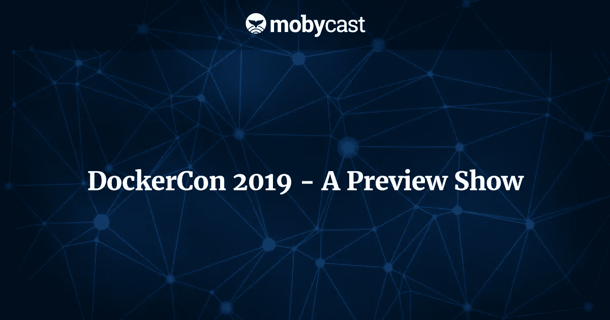

# DockerCon 2019 预展

> 原文：<https://medium.com/hackernoon/dockercon-2019-a-preview-show-3f0355cdd566>

凯尔萨斯的乔恩·克里斯滕森和克里斯·希克曼将前往旧金山参加 2019 年的 DockerCon。在这一集中，他们讨论了这些年来会议是如何变化的，以及他们预测这次会发生什么。

该节目的一些亮点包括:

*   DockerCon 2018:管理层变动导致的文化和内容的转变；过于雄心勃勃，只关注创新、不同方向和技术
*   DockerCon 2019:有趣，但不太戏剧化；该长大了
*   Docker 的商业模式:赚钱；这是一个企业，而不是一个技术创新实验室

期待什么:

*   新产品发布减少
*   继续关注 Docker 企业、混合环境和传统应用
*   如何支持企业在不重写的情况下容器化现有应用程序
*   围绕 Kubernetes 正在进行的“大熊抱”
*   更多教育、最佳实践和使用 Docker 的独特方式
*   与会人数将继续增加

码头工人出勤情况:

*   2014: 500
*   2015: 2,000
*   2016: 4,000
*   2017: 5,500
*   2018: 6,000

DockerCon 布局:

*   与 re:Invent 相比压缩
*   四天:
*   第 1 天:以付费研讨会为特色的前一天
*   第 2 天和第 3 天:从主题会议开始，然后是分组会议
*   第 4 天:回顾热门分组会议

轨道类型:

*   Docker 技术讲座
*   面向开发者的 Docker
*   IT 基础设施和运营 Docker
*   客户案例研究
*   黑腰带
*   生态系统
*   改变
*   Docker 内部的调试:改变你的工作方式，使用工具减少学习曲线
*   喂养你的技术职业:开发人员花时间学习新技术、语言和操作；但是没有时间更新他们的开发过程
*   Docker 的复活使 DockerCon 成为小型组织向 Kubernetes 过渡的理想场所

**链接和资源**

[Docker con](https://www.docker.com/dockercon/)
[Docker](https://www.docker.com/)
[Kubernetes](https://kubernetes.io/)
[AWS re:Invent](https://reinvent.awsevents.com/)
[O ' Reilly 开源会议(OSCON)](https://conferences.oreilly.com/oscon/oscon-or)
[Clare Li guri 在 Twitter 上](https://twitter.com/clare_liguori?lang=en)
[Visual Studio](https://visualstudio.microsoft.com/)
[Visual Studio(VS)Code](https://code.visualstudio.com/)
[node . js](https://nodejs.org/)
[mob](https://mobycast.fm/episode/dockercon-2018/)
[网飞的迈克尔·沃德罗普在推特上](https://twitter.com/MichaelWardrop)
[布雷特·费舍尔](https://www.bretfisher.com/)
[艾比·富勒](https://aws.amazon.com/developer/community/evangelists/abby-fuller/)
[凯尔西·海塔尔](https://twitter.com/kelseyhightower)
[凯尔苏斯](https://kelsus.com)
[秘密斯塔什媒体](https://www.secretstache.com/)

**成绩单**

克里斯:在 Mobycast 的第 57 集，我们展望 2019 年的 DockerCon，讨论将会发生什么，并做出一些预测。欢迎来到 Mobycast，这是一个关于云原生开发、AWS 和构建分布式系统的每周对话。让我们直接开始吧。

乔恩:欢迎你，克里斯。又是一集 Mobycast。

克里斯:嘿，约翰。回来真好。

乔恩:是的，很高兴你能来。今天只有你和我。里奇正在和家人共度时光，而我们已经很久没练习了，因为你去度假了。

克里斯:我在，在完全不同的时区。

乔恩:完全不同的时区。你去蒙大拿了吗？

克里斯:那会是一个不同的时区。我有点希望它只是一个时区之外，至少现在是这样。我的身体非常混乱——我的生物钟。我在意大利，西雅图时差九个小时，然后意外地在芝加哥停留了几天。我的身体不知道什么时候睡觉，什么时候醒来，什么时候吃饭。一切都很顺利。

乔恩:可能不需要。你在意大利做了很多。

克里斯:是的，我看到了。我肯定 carbo 肯定装了。但是我把它洗掉了。我们步行。根据我的苹果手表，我想总共大约有 80 英里，分布在七天内。

乔恩:太棒了。那真是太好了。是的，这里没有去意大利的旅行。我们只是做了凯尔萨斯的事情，并试图在你不在的时候保持稳定，这不是一个容易的任务，但我们回来了。今天我们要谈谈 DockerCon。两周后就要开始了，当你听到的时候，亲爱的听众，已经一周了。一周后就要开始了，你会去的。这是你的第三个，克里斯？

克里斯:实际上，这是我第四次了。

乔恩:第四码头。

克里斯:对。

乔恩:很好。

克里斯:对。有趣的是，我已经很久没有参加会议了，然后 DockerCon 真的是我重新参与的人，那是在 2016 年的西雅图版本中。这是对我来说非常容易的事情之一，不需要旅行。那是我刚开始用 Docker 的时候，很巧。时间刚刚好。我在 2016 年 1 月开始使用 Docker，然后我想是在 6 月的会议上。时间刚刚好。那一届只是[……]这是一次伟大的会议。真的很棒。

乔恩:非常酷。是啊，这些年已经变了。让我们谈谈接下来会发生什么，然后也许在稍后的对话中，我们可以谈谈这些年来它是如何变化的。今年你期待什么？会发生什么？

克里斯:今年将会很有趣，因为我不期望会有太大的戏剧性。去年是文化和内容的大转变。我们在之前的一集 Mobycast 中谈到过这一点，当时我们概括了 2018 年的版本。但随着前任首席执行官本(Ben)和首席技术官所罗门(Solomon)的离职，Docker 在 2018 年发生了巨大变化。有点像组合拳，换岗，引进新的 CEO 和其他新的管理层。以前，Docker 都是关于创新和许多不同的方向和技术，他们在试图过于雄心勃勃方面绝对犯了一些错误，但至少有很多令人兴奋的事情，有很多正在进行的事情，很多创新。

去年，很明显，“好吧，新的管理人才来了。”首席执行官史蒂夫·辛格说，Docker 是一家企业，这种商业模式非常有趣。创新的大幅减少。他们发布的产品数量，少得多，也少得多，只是非常响亮和清晰地聚焦于“商业模式是什么？赚钱，“真正让这个东西成长起来，并理解它是一个企业，它不是一个技术创新实验室，如果你愿意的话。就像，“它必须赚钱。”

我真的希望今年还是一样。我不指望会有很多新产品发布。我预计他们会继续专注于 Docker 的企业版。专注于混合环境，专注于遗留应用和 monoliths，以及如何轻松地向企业公司提供支持，以便他们可以在不重写的情况下容器化他们现有的应用，并继续围绕 Kubernetes 的大拥抱。

乔恩:对。当你期望的时候，它有点像，许多教育，许多最佳实践，和许多，“嘿，这里有一个独特的方法来使用这个现有的东西。你可以用一些你以前可能没有想到的东西，”而不是太多的公告。这些类型的会议都没有，或者可能很少。

克里斯:当然。我肯定会有很多泡沫，冲洗，重复，更实际的是，“你怎么用这个东西。”某种程度上，你还打算拿 Docker 怎么办？它非常坚固、稳定、成熟，拥有集装箱运输所需的一切。在这方面，没有太多的新工具或产品围绕着它。除非它更多地是从商业模式的角度出发。

乔恩:当然。在我面前的是 DockerCon 这些年来的发展。2014 年 500，4000 人，5500，去年 6000。更多的人在使用 Docker。还在增长。你认为 DockerCon 今年会更大还是会缩小一点？

克里斯:当然。当他们公布数字时，它不会缩小。不管真实数字是多少。去年，我想大概是 6000 人。前年是 5500。这并不是一个巨大的飞跃，所以今年我预计他们可能会说大约有 7000 名与会者。我有点怀疑会是这样。是在同一个场地；在旧金山的莫斯康。

Jon:计算与会者人数的有趣方式可能是这样的，“哦，好吧，如果你是金牌赞助商，那么你公司组织中的每个人都是与会者。”

克里斯:是的，当然。亚马逊也是，所以 20 万。

乔恩:对。

克里斯:它们肯定没有周围的其他会议规模大。但还是那句话，是不同的味道。有人喜欢 AWS 和它的 re:Invent 会议。这是一场商业会议，而不是 DockerCon，特别是在过去的四年里，它更像是“在开源和社区等领域有更多的东西。”我认为这限制了与会者的数量。这感觉很像 OSCON 的奥莱利会议。

乔恩:酷。发布会的布局是怎样的？你在那里期待什么？它有多长？那种事情？

克里斯:它非常压缩，尤其是与 re:Invent 这样的东西相比。真的有两天那么长。正式来说，我认为是四天，但第一天是前一天，那里有付费的研讨会，你可以参加。第四天是热门分组会议的回顾。真的是中间的两天，周二和周三，是发布会的核心日子。每天以主题会议开始，然后是分组会议。基本上，两天的完整内容，然后一些额外的东西就结束了；在开始和结束时。大约 100 场分组会议，我的意思是在某种程度上…

乔恩:[……]，对吧？

克里斯:有点令人耳目一新。实际上，你可以浏览目录，注册，这需要 10 分钟，而不是 re:Invent，我想我可能花了 5-10 个小时来浏览，试图为它排列我的议程，因为有 2000 多个。

乔恩:在 FOMO 呆了三个星期。

克里斯:对。当然，更小、更易管理、更紧凑。

乔恩:没错。实际上，我将跳过大纲的一小部分，因为我们刚刚谈到了会话，也许您可以谈谈它所包含的曲目。

克里斯:这在不同的码头区也保持了相当的一致性。它是高层次的东西，一些低层次的东西，以及介于两者之间的所有东西的混合。一些主要曲目是，他们有一个码头技术讲座。这些会议深入探讨了构成 Docker 平台的产品和技术。这是非常实用的信息。

有一个面向开发人员的 Docker 跟踪，它真正关注的是那些在他们的机器和笔记本电脑上使用 Docker 的开发人员。他们如何真正获得最大收益，所以他们使用 Docker Compose、Docker for Mac 或 Docker for Windows 等工具。

然后，他们有一个 IT 基础架构和运营跟踪平台。那是你的 DevOps 类型的东西。你在生产中实际上是如何使用 Docker 的？你如何部署事物？你如何运行它们？你是如何维护它们的？你如何监控他们？诸如此类的事情。

他们有客户案例研究课程。显然，这是正在使用 Docker 的客户，他们站在那里谈论他们如何使用它，他们获得的好处，激励其他人也这样做。

他们有黑带训练课程。这通常深入到 Docker 平台和相关事物的内部。我已经花了很多时间参加黑带会议。我可以肯定地证明，它们通常会非常非常深。另外需要指出的是，在 DockerCon，他们的会议时间是 40 分钟，而 re:Invent 是 60 分钟。这 20 分钟非常重要，特别是在这些 40 分钟的黑带会议中，非常深入，例如剖析 Docker 中的网络工作原理或存储在设备驱动程序中的工作原理，以及在 40 分钟内不能完成的内容。他们通常会经历:他们的幻灯片有 100 张长。你只是觉得自己像被水浇了一样。

乔恩:他们实际上并没有试图给你少一点内容，以便更易于管理；他们只是想把这一切都塞进 40 分钟。

克里斯:绝对是这种感觉。感觉像是 40 分钟的会话中有 60 分钟甚至更多的内容。

乔恩:哇。

克里斯:那有点像你的脚趾，注意，否则，你会错过的。他们有一些其他的轨道，他们有一个生态系统轨道，这是构成 Docker 的整个社区；所有的供应商和其他开源项目和合作伙伴等等，这很有趣，因为你真的看不到。我的意思是，你会在 re:Invent 这样的网站上看到一点点，但远没有你在 DockerCon 这样的网站上看到的那么投入。

然后，他们有一个转型跟踪，这是一个有点像百搭牌的开放式跟踪，就像“这如何实现各种转型或改变文化和流程”之类的事情。

乔恩:其中一首歌引起了我的注意，因为它让我想起了克莱尔·利古里昨天发的一条微博。她问用 Docker 开发的人，当他们在开发时，他们如何在他们的机器上与 Docker 交互。这是一项民意调查。就像是，“你用 Docker CLI 吗？你用 Docker Compose 吗？你是否使用某种 IDE 类型的连接，比如一个按钮来运行你的容器？还是其他？”然后大概 75%是 Docker CLI，20%甚至更多是 Docker Compose，然后很少有人使用其他或 IDE 功能。

她反驳道，“嗯，有点好笑。我真的很喜欢使用…“我想她可能在使用 VS 代码或其他东西或全功能的 Visual Studio“我喜欢使用它，因为它会自动将我的调试器附加到容器，附加到在容器内运行的进程，这样，我就不必手动执行，我就可以运行调试器了。”这让我想起了我职业生涯中的一段回忆，我有一个可用的调试器，然后进入一种技术，在这种技术中，调试器不是你编码的方式，然后回到移动开发和 Objective-C，这就像是，“哦，调试器回来了。多奢侈啊。”然后通常是 JSF，我们现在不再做调试器了。

调试器的全部在于它们很棒，很不可思议，当你接触到它们的时候它们很酷，但是在某些情况下设置它们也很痛苦，Docker 就是其中之一。我很好奇你会去，在赛道上四处窥探，看看那东西有多成熟，我们的团队开始这样做是否有意义。

克里斯:我想我们在之前关于 Docker 学习曲线的一集里已经谈到了这一点，它有点变化；你只需要稍微改变一下你的工作方式。在 Docker 内部调试，我的意思是，这些工具已经存在很多年了。S 代码，在 2017 年，他们展示了它仅仅能够调试运行的容器和[…]以及所有这类东西。你可以做到这一切。这确实需要多一点时间，如果你必须研究和设置它，就让它发生。只是这是否是你真正需要的东西。就像你说的，在某种程度上，避免在创建的调试中使用你的 ide，并单步调试代码。

就我个人而言，在我职业生涯的前 20 年，我使用 Visual Studio，使用调试器是我所做的事情的一部分。我几乎总是，我会通过代码来进行单元测试或一些集成测试，只是检查并确保它做的正是我期望它做的。当我在 2012 年切换到 Node 时，在那个时候，Node 真的没有任何好的调试器。就好像，我从这个集成了调试器、分析器和其他所有东西的非常好的集成 IDE 中走出来，现在我有了一个文本设置器，仅此而已。

乔恩:嗯，我不想在这方面走得太远，但是调试器在技术上更先进。能够真正看到代码中发生了什么是技术的进步，因为人们想看到这一点。远离调试器是一种权衡。就像是，“我想要这种新语言的这些功能，我希望能够以这种新的方式做事，我愿意为此放弃我的调试器。”但是，如果您可以取回调试器，并在某种程度上拥有两个世界的最佳优势，我知道我们已经讨论过这种分离，即永远不允许您的容器拥有仅在我的机器上工作的类型设置，但是如果您的 IDE 真的很擅长帮助您管理这一点，如果您的 IDE 帮助您设置这些钱包，让您完全调试，然后让您确信当您真正看到它时， 您可以去掉所有那些您不想发布到生产环境中的小东西，例如共享文件系统，这可能是一件好事。

我想，我在这里的论点实际上可以归结为这样的事情，在我的职业生涯中，有几次我使用调试器，我注意到，“哦，我的上帝，我没有意识到发生了什么。”我没有意识到这一点，因为代码正在工作，一切似乎都很好，没有问题，没有单元测试说有什么问题。但是调试器就像，“哦，我的上帝，为什么那个文件句柄还在？”如果没有这个调试器或者生产中断，我永远也不会知道。懂我意思吧?调试器有真正的价值。

克里斯:当然。也许工具就在那里，不管你是否在做 Docker 开发，有相当多的工具社区。您可以在容器内部进行调试，您只需正确设置并学习如何进行即可。不需要太多时间。如果你喜欢调试器，并且你真的想要那种能力，你可以用 Docker 得到它。另一方面，我认为大多数人的情况是，当他们要调试时，他们只是在 Docker 之外运行调试，这是一个大禁忌。

乔恩:对，没错。这也是我想让你在这里探讨的。我们在 Mobycast 中经常谈论的另一件事是你自己的技术职业的当前供给。我认为，很多时候，开发人员花了很多时间学习新技术、新语言、新的 ops 东西，然后在你知道之前，你没有花任何时间更新你的开发过程。在 IDE 中学习新的热键，或者尝试一种新的、更强大的开发实践，这种事情就像“我得到了我喜欢的方式。我会一直这样做下去。”但是更新你的那部分技能是非常有价值的。

克里斯:的确如此。

乔恩:酷。我想我们已经在这里花了不少时间。天啊，我们刚刚绕了一大圈。克里斯，我们下一步该去哪里？让我们回到正轨。

克里斯:当然。毫无疑问，这是一个已经完成的任务。这都是关于 DockerCon 2019 之前的一个节目。我们已经谈论了一些历史，我们可以期待这个新的，内容是什么样的，布局。这又一次不同于像 re:Invent 这样的大型会议。在 re:Invent 中，谈论许多更实用的技巧肯定是有意义的，你需要调整自己的节奏，你需要穿舒适的鞋子，补充水分和睡眠，以及诸如此类的东西。DockerCon 的好消息是，它更轻松；一点也不激烈。这是一个很棒的会议，有很多好的技术内容和务实的内容，有很多热情的人真的很投入，你完全可以出去玩。从这个角度来看，它更容易管理，在某些方面，甚至可能更令人愉快。

乔恩:我想问你一个非常重要的问题，因为这可能会在未来的 Mobycast 中出现，因为我们喜欢进行一些谈话。你已经开始审视你的议程了，对吗？有没有什么特别的演讲者让你很想听或看？

克里斯:我一时想不起来，不太想。网飞的人们有一些谈话。网飞大学有一个关于集装箱安全的理论和实践的项目，很有意思。

乔恩:你面前有谁在做那个演讲吗？

克里斯:那是迈克尔·沃德罗普。

乔恩:酷。

Chris:有一个专门围绕 node 的，Node.js。它是由 Bret Fisher 完成的，他是 Docker 社区的长期成员之一，他以前说过话。有 Dockerfile 最佳实践，今年的[…]是由几个不同的人完成的。有很多和以前一样的演讲者。如果艾比·福勒又来了，我一点也不惊讶。我最感兴趣的是，“好吧，有什么新消息吗？有哪些实用的小花絮能让生活变得更轻松一点？”此外，还可以对社区中发生的事情及其发展趋势有一个总体的感觉和感受。

同样，我们过去也讨论过 Docker 的未来，它是会保持独立还是会被收购，他们会制定商业模式，然后还有整个 Kubernetes。去年对他们来说是一个巨大的转变。以前，他们确实支持 Kubernetes，但他们真的专注于 Swarm，去年 Kubernetes 无处不在。今年，围绕 Kubernetes 的会议不多，但是如果你去 DockerCon 网站，它的主要副标题是，“DockerCon 是关于 Kubernetes、微服务和 DevOps 的第一大容器行业会议。”

乔恩:哇。

克里斯:它甚至没有提到 Docker。他们有八九个付费工作室，其中至少有两个在 Kubernetes 上。他们肯定在 Kubernetes 上下了一倍的赌注，所以看看他们从那里走向何方真的很有趣。

乔恩:这将会很有趣，因为库伯内特最近变得有点热了。我在推特上看到了反对它的情绪。就在昨天，我想也许是两天前，Tinder 发布了一个技术博客，基本上讲述了他们花费数百万美元、数周和数月迁移到 Kubernetes 的经历，以及这对他们来说有多困难。凯尔西·海托华(Kelsey Hightower)是谷歌云的一员，他不久前说，“Kubernetes 的一个很好的用例是，如果你有开发人员在一个领域发布不同的应用程序，如果你正在开发自己的平台即服务，看看 Kubernetes；如果你不是，那就不要。”

将平台作为服务可能是一些企业做的事情，可能是电信公司做的事情，可能是有线电视公司做的事情——大公司、大公司、大企业肯定会这样做，他们可能会在内部做，Kubernetes 适合他们。但对其他人来说，却不是。看看我们所期待的 Docker 是否真的仍在尝试拥抱企业，并试图找出如何将企业货币化，这将是一件有趣的事情。在有意义的地方，他们仍然只关注 Kubernetes 是有意义的。

Chris:在某种程度上，Kubernetes 现在有着和 AWS 一样的问题。我们已经讨论了 AWS，快速的创新步伐，每年 1000 个版本，一直有新的服务，这真的很难跟上。在某种程度上，Kubernetes 也有同样的问题。这是一个巨大的怪兽，它在不断地被添加，实际上很难理解它的所有内容，也很难精通整个平台，甚至是它的核心部分。对于那些没有 100 多人的 IT 团队的人来说，这是一个很大的限制因素。

乔恩:没错。

Chris:看看 Docker 是否做了一些事情，让它变得更容易接受，更容易使用，而不必花很多时间去解决如何让 Kubernetes 工作并在生产中可靠地运行它，这将是很有趣的。

乔恩:那会很有趣。这可能是我们的预测，也许我们可以留给每个人；如果 Docker 要复活，DockerCon 将会作为一个地方复活，这是 Kubernetes 的一种入门方式，对较小的组织来说是现实的，可能是实现这一目的的方式。

很高兴和你聊天。我希望你在会议上玩得愉快。当我们回来的时候，我们会有很多要谈的。

克里斯:没错。好吧。听起来不错。

乔恩:下周再聊。

克里斯:再见。再见。