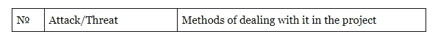
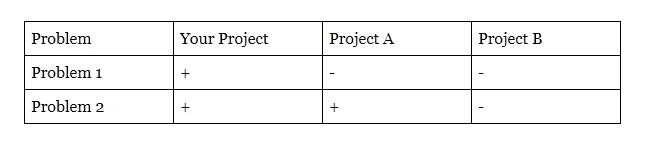

# STO 文件指南

> 原文：<https://medium.com/hackernoon/document-guide-for-your-sto-in-2019-99d30d2b476b>

尽管市场低迷，项目筹集资金的指标数量不断下降，以及对该行业的怀疑日益增加，但许多创业公司仍然继续认为 ICO 是一种进入现金流并获得美味投资的简单方法。

然而，目前的现实却大相径庭。每个人都知道 ICO 远非理想，主要是由于代币购买者错误地认为他是一个完全成熟的投资者，他在公司中有投票权，他拥有利润份额或他对新发行的股票有支配权。出于这个原因，美国监管机构(SEC)早在去年 7 月就在其报告中指出，一些代币可以被归类为证券，因此它们应该像传统证券一样受到监管。ICO 的另一个问题是欺诈性项目，其任务只是让创始人发财，不管现在听起来有多老套。

这就是该行业转向安全令牌产品(STO)的原因。但应该理解的是，STO 与 ICO 不同，它是为不同的受众设计的，因为只有专业投资者才能参与这些发行。

这就是为什么要让投资者不仅听到你的想法，而且相信它，一份 15 页的白皮书和几个图表已经不够了。

在本文中， [482.solutions](https://482.solutions/#/main) 公司的 Vladimir Malakchi 将考虑 2019 年成功申请项目所需的所有必要文件:

*   白皮书
*   技术论文
*   概观
*   一页纸
*   竞争性论文

**白皮书:无处不在**

白皮书——即任何项目都应该从哪里开始。这不仅仅是一个描述你伟大想法的文件，它甚至不是广告材料。这是网站、营销策略甚至财务计划建立的基础。

我知道几个项目认为白皮书只是一个广告手册，可以在着陆页准备好并在电报中注册个人资料后编写。但在实践中，一切都变得更加困难，因为投资者将这份文件视为整个项目的门面，没有人希望陷入困境。因此，在 ICO 实施的每个阶段都会发生一系列的变化，最后期限会改变，当然，成本也会增加(数倍)。既然我们讨论的是从更成熟的公众(专业投资者)那里筹集资金，你应该回答下面这三个问题。

**白皮书应该回答的三个问题**

我建议在开发文档的结构时，首先回答这些问题，随后将项目的精髓传达给社区，并将读者转化为潜在的投资者。

**问题 1。**

这个项目与其他数百个项目有何不同？

而且你不需要写广告标语和充斥着明亮的标题。有必要提供事实，证明由于筹集的资金而将实现的技术是独特的，你的想法将会受到欢迎。

专业投资者更难“上钩”；他总是仔细检查彼此有些相似的项目。

**问题二。**

**至于真正的发展计划？**

如果你想在一个月内推广金山、令人惊叹的区块链，甚至是 XXX 的利润——唉，不得不让你失望了。STO——投资者是受过教育的金融市场参与者，他们检查每一个报价，无数不会上当的专家帮助他们。该项目必须是可信的和合理可实施的。

**问题 3。**

**为什么要投资这个项目？**

事实上，只要投资者找到了**问题 2 的答案，这个问题就自动解决了。**但是，您还应该提供可能出现的财务风险的信息，以及将这些风险从您的团队中排除的方法。例如，与没有这个加密英雄的项目相比，托管邀请可以显著提高你吸引更多投资者的机会。

**白皮书亮点**

1.  **摘要**

这是第一个模块，用几句话描述了项目和发行的代币或硬币的整体想法。摘要通常用两页纸，并设定一个目标——让读者感兴趣。如果这两页没什么意思，就不太可能有人会去读剩下的 70 页。

**2。简介**

有必要在这里描述行业的总体情况，以及触及项目和加密货币持有者面临的最新趋势和问题。

**3。背景**

但是真正的工作从这一点开始。它可以是一个完整的大部分，在这里你必须描述在你的项目的优先任务中应该解决的问题。正是这种不恰当的情况成了你的想法的动力。你的想法能根除的问题越大，成功的机会就越大。

但是回到**问题 2** 。不要发明与风车作战。问题应该和解决问题的方法一样真实。在你和你的业内“智囊”能够安全地着手解决以下段落中的这些主要问题之前，用并不令人欣慰的统计数据来补充这一项。

**4。特定项目部分**

这是最重要的项目，有无限数量的子项目，您可以在其中展示您的项目及其组成部分，并展示在**背景**中描述的问题的解决方案。

在这里，潜在投资者应该可以找到关于你的项目的信息:

1.  项目目标；
2.  项目的意义(谁是你的 TA，你会如何帮助他们，你会让世界变得更好吗)；
3.  财务数据(令牌组学的描述，以及关于投资者的增长和潜在利润的预测)；
4.  最小原型的描述，MVP(只有原型的存在已经帮助项目吸引更多的注意力)；
5.  使用的真实例子。

这个项目通常花费最多的时间，因为它的开发涉及到整个团队的密切合作——从开发人员到设计人员。

你的任务是使用额外的图形或图表来讲述你的项目。你不应该使用复杂的技术术语，如果你不能避免使用概要词，花点时间把它们的解释放在括号里，或者在文档的末尾形成一个单独的小词典。

也要尽可能多地展示你的技术或想法的实际用途。它意味着在线和离线世界的整合越多，就越能吸引人们的注意。

**5。技术规范**

我认为这一点很有争议，因为根据基于个人经验的统计，只有大约 2%了解技术、编程语言和实现区块链产品的复杂性的读者不会错过这一点。

事实上，这是整个项目的技术背景，包括代码和公式所在的位置。

是的，毫无疑问，这一部分很重要，但是如果你有一个有趣的技术项目，需要详细的技术描述，我建议你将这一项放在一个单独的文档中，我们稍后会谈到这一点。

**6。财务模型**

在本节中，投资者应找到代币销售每个阶段代币分配的所有信息。最方便的是，在简短的文字描述后，放置一个饼图，在这里可以清楚地看到团队将获得哪部分令牌，以及有多少将用于销售和营销。不要忘记，您需要指定为储备金和 Escrows 顾问提供的代币数量。

在财务模型中，将您的路线图与项目的逐步实施的详细计划放在一起也是合乎逻辑的。

**7。合法合规**

此项目必须出现在您的主文档中，因为为了使您的令牌被视为证券，它必须符合所有法规要求。

例如，如果你要征服美国市场，你应该表明你的令牌符合豪威测试。

要被视为证券，令牌必须满足以下标准:

*   代币是金钱或资产的投资；
*   投资必须在一个共同的企业中进行；
*   应该期待它从所做的工作中获益。

要在美国推出 STO，您还需要了解:

*   [条例 D](https://www.ecfr.gov/cgi-bin/text-idx?SID=e282de4f5c69b6a69c70dd05d5b92d39&mc=true&node=sg17.3.230_1498.sg11&rgn=div7)
*   [规例 A+](https://www.ecfr.gov/cgi-bin/text-idx?SID=c395f9ef73e021327612e76dda074813&mc=true&node=sg17.3.230_1240.sg2&rgn=div7)
*   [规例 S](https://www.sec.gov/rules/final/33-7505.htm)

SEC 并不是唯一允许你创办 STO 的监管机构。您还可以考虑欧洲国家(法国和瑞士)、亚洲(新加坡、韩国、中国、香港)、中东(以色列、阿联酋)和北美(加拿大)的司法管辖区。

在任何情况下，你都不会选择哪个监管机构的赞助，这是值得仔细研究这一全新筹资工具的所有法律方面(如果没有专业的法律支持，你就做不到)，并详细描述你的 STO 的法律合规性。

**8。团队**

是时候和你的潜在投资者面对面了。与此同时，我们建议在这一部分不仅要放置项目创始人的信息，还要介绍每个团队成员，在 Linkedin 上添加个人资料的链接。对于不怕露脸，有经验的项目，信任度总是更高。

在这一部分发布关于项目顾问和负责人的信息也是值得的——毕竟，他们在行业内越有名，就越有机会达到硬性上限。

**9。结论**

这一点通常很少被注意，但这是徒劳的，因为在最后一句话之后，在结论中，读者可以转移到参与前 STO 的页面。

在这里，我们总结结果，回忆项目解决了哪些问题以及如何解决这些问题，还关注其相关性，不忘暗示投资者获得利润的高概率。同样在这一部分，你可以顺利地切换到 STO 战役的第一批参与者的奖金制度，从而把读者变成投资者。

**技术论文:读得少，但更用心**

就其结构而言，技术文件与白皮书非常相似，但这些文件的内容完全不同。

从本质上讲，这是一本技术参考书，可以回答任何关于你的项目的技术问题。

我们在白皮书(技术规范)中提到了类似的观点，但我仍然建议您将所有技术信息收集在一个单独的文档中。

因此，我们让普通读者不再需要面对复杂的公式，让专业开发人员不再需要在整个文档中搜索一项。

值得注意的是，一篇高质量的技术论文大约需要 50 页，因此至少出于这个原因，您可以用它单独制作一个文档。

最好将技术论文的开发委托给与文案合作的开发人员，他们会帮助将所有的公式打包到一个漂亮的、文本化的“包装器”中。

技术文件的必要组成部分:

1.  **简介**

在 WP 中，我们揭示了项目的主要特征，但是我们只关注技术部分。

**2。技术特定部分**

这个全局部分应该揭示你的项目的整个结构，告诉你将使用什么技术，最重要的是，你为什么要使用它们。

**3。风险和安全**

我喜欢这个项目以表格的形式制作，例如:

由于这种方法，您向潜在用户展示了您的系统的优势，并建立了你们之间的信任。

**4。结论**

总之，您必须划清界限，并最终确信您已经明智地选择了一种或另一种协议，实现了一些解决方案，并为您区块链选择了一种特定的编程语言。

最好不要在技术论文结尾发布有关加入 STO 的信息，至少不要像我们在白皮书中那样清楚。

**概述:共 5 页**

这份文件应该简明扼要地解释你的项目的本质、目标和使命，并通知潜在投资者 STO 竞选的时间和资金分配的细节。

必需的概述部分:

1.  **问题及解决方案**

对于每个问题，你只需要分配两小段，其中包括问题的描述和用你的项目解决问题的方法。

**2。基本工作机制**

在本节中，最好列出系统的整个结构，并简要描述其组件。我们建议在一页上开发一个可视化演示。

**3。MVP 描述**

这一项是可选的，因为原则上，MVP 的开发并不存在于每个项目中。但是我们已经在上面写了，最低产品增加了投资者的信心，如果你有一个，那么利用任何机会来吹嘘它。

**4。代币销售信息**

有必要在此提供 STO 阶段的所有数据，并指出软上限和硬上限。此外，你需要证明这些数额。例如，当达到软上限时，您将只在开发系统的一个组件上花钱，但有了硬上限，您将能够在指定的时间框架内体现整个想法。

**5。团队**

总的来说，没有必要代表每个员工，只需要公司的关键人物和顾问。

不要忘记在你的社交网络上放置可点击的按钮。

**一页:项目广告手册**

在本文档中，您需要在一页上描述该项目的所有优势:

*   行业存在哪些问题，你的项目将如何应对；
*   项目与竞争对手相比的主要优势；
*   资金分配的时间表，以及 STO 的时间；
*   团队；
*   所有其他文档和社交网络的链接。

一页纸的目的是让潜在投资者在一分钟内熟悉你的想法，让他们更详细地了解这个项目。

**竞技论文:为什么是你而不是别人？**

这份文件应该展示你的项目与竞争对手的不同之处。要做到这一点，有必要进行卓有成效的分析工作，详细了解类似的项目是如何运作的，并以最佳的方式展示你的项目。

竞争论文结构:

1.  **简介**

该部分假设对市场情况进行了总体描述，影响了问题的负面后果，还讲述了本文档的目标(向用户传达您的项目相对于其他项目的优势)。

**2。比较分析的标准**

这里你列出了你比较项目的标准。最好是用带有术语解释的字典格式。

**3。结果**

在表格中，您注明了您的优势，例如:

**4。比较**

这一项意味着对结果的文字描述。为什么这个或那个项目不能解决指定的问题，而你的项目将有助于根除缺陷。

在这篇文章中，我们提出了 STO 在 2019 年需要的最低文件包。我们还试图揭示白皮书和技术论文、概述、一页纸、竞争论文的写作特点。文中提供的所有数据仅基于成功的个人经验，希望对你有所帮助。