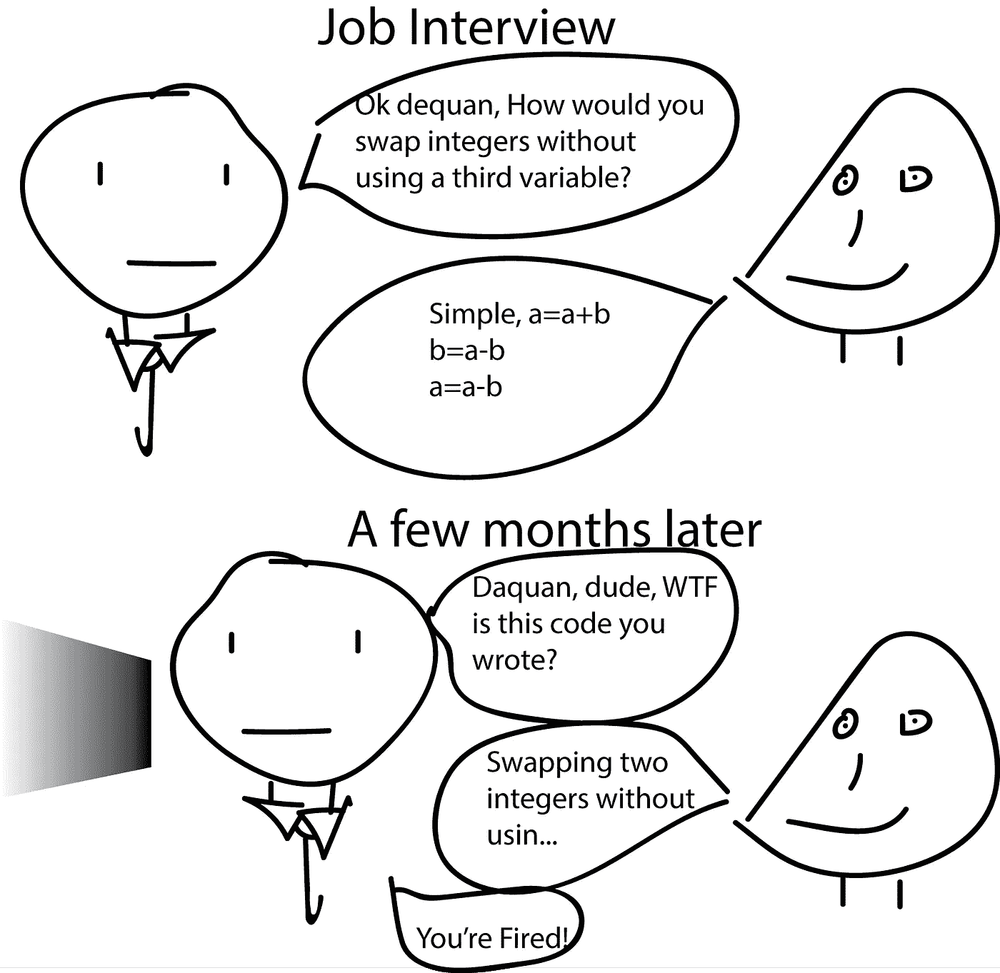
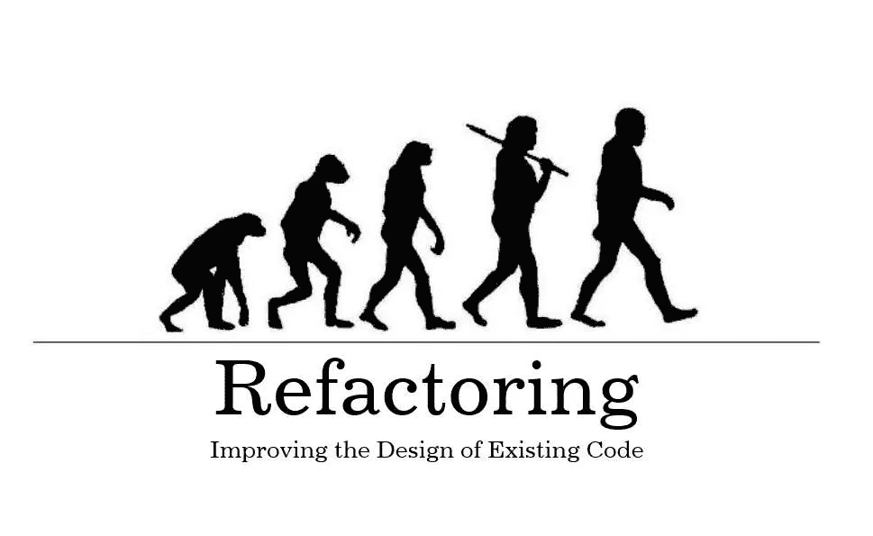
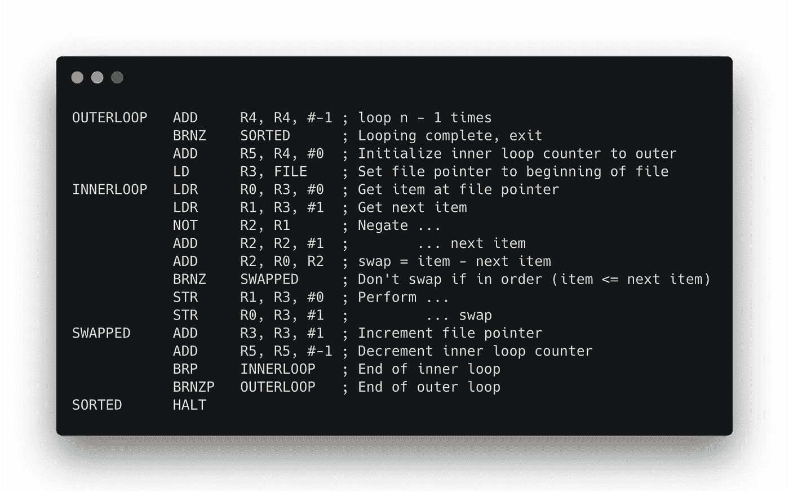

# 商家在乎算法技能吗？

> 原文：<https://medium.com/hackernoon/does-business-care-about-algorithmic-skills-1ca7f42e2a03>

算法是每个面试中常见的问题。它们变得如此普遍，以至于没人想出问它们的理由。每个开发人员都必须知道如何解决随机黑客任务。许多公司认为这是默认要求，因此候选人也这么做。但你确定这是维护项目和满足期限的必备技能吗？我会说，对这些目标来说是最没用的。

TL；DR——我不知道如何解决算法任务，我不想拥有这种技能，我认为移动开发者应该忽略需要这种技能的空缺。

在过去的一年里，我参加了 20 次面试。不是所有的人都成功了。失败面试的典型例子:

在一家公司面试有四个步骤:语言、平台、架构模式和算法的知识。我只挂了最后一个，是解决两个来自 HackerRank 的简单/中等水平的算法问题。

在另一家公司，很少有关于 iOS SDK 的具体问题。而我说的“*具体的*，我的意思大概是:*“在我的职业生涯中，我已经成功解决了所有的任务，甚至连这样的问题都不知道，更别说回答了”*。最令人难忘的问题之一是:*“Git diff 算法是如何工作的？”*

How does autorelease pool work? U know, we use it every day in Swift

# 移动开发人员任务

IMO 99%是布局，简单的对服务器的 REST 请求，解析 JSON 并刷新到 UI。当然，我听说过增强现实、区块链和机器学习，这些都需要特定的数学技能。我把抽象的 1%留给他们。但是我翻了 200 个空位，只看过一次 AR。根本没有区块链或曼梯·里。这些技术被使用，是的。但不要搞错了，它们远非无处不在。移动开发人员的典型任务如下:

*   阅读并理解大量遗留代码
*   提交对它的更改，而不使同事对它的理解变得复杂，也不产生新的错误
*   向服务器请求，解析，输出到用户界面，改变字体，颜色，圆角半径

# 大部分时间去了哪里？

*“阅读别人的代码占用程序员 80%的时间”* —想法很明显，不是我发明的。[书籍数量](https://www.amazon.com/Robert-C.-Martin/e/B000APG87E)、文章数量、讲座数量*“如何让你的代码干净？”*证明这确实很重要。

你花了大部分时间去理解某人的代码，所以任何优化都应该从那个地方开始。这是整个开发过程的瓶颈，因此其他地方的改进并不重要。

如何减少理解你的前任写的 b̶u̶l̶l̶s̶h̶i̶代码所需的时间？要让大家把代码*写清楚*。单词*“清晰”*的含义是由 IT 专家和他们关于最佳实践的无休止的讨论定义的。静态代码分析器很久以前就被发明出来了，新的语法检查规则也在不断地为它们添加。每个著名的公司都有一本公共风格指南。现代语言(Swift、Kotlin)允许开箱即用的选项、函数式编程元素和其他允许更简洁地编写代码的东西。

令人惊讶的是，我每天都遇到狗屎代码…但它的创造者完全知道如何平衡二叉树。有多少面试官问我关于风格指南或棉绒的经验？**他妈的零。**

# 构建一个抽象

有人说*:“但是移动开发也有复杂的事情！很难通过网络发送数据，处理滑动手势或将数据保存到设备内存中。这应该只能由具有高级算法思维的人来完成。”*

这种观点与真实情况相反。我不仅了解手机开发的历史。通过创建高级抽象来简化有一个明显的发展趋势。程序员发现使用抽象来完成普通任务很方便。

曾几何时，我们认为这条线是世界上最舒适的图案。现在 Swift 里甚至根本没有`++`操作员。为了防止人们犯一个接一个的愚蠢错误，它被弃用，用`.map`、`.sort`和`.reduce`代替。

don’t trust built-in sort, u can make it better

*特殊人员*正在为您的项目开发工具。创造语言、框架和服务。这些工具经过了开发者和用户的彻底测试。想想吧。停下来一分钟，看看你的生活。不一定要成为一名程序员才能意识到基于其他人的成就来做某事的想法是好的。

如果你还是不相信我:

*   *Spring Boot*——高于其他抽象的抽象。该项目的意义——使配置和使用尽可能简单
*   你仍然确定每个开发人员都必须知道 lock 和 recursive_lock 的区别吗？[结账并关闭](http://www.modernescpp.com/index.php/multithreading-in-c-17-and-c-20)
*   *Javascript —* 我甚至不想谈一些具体的事情*。*就整 JS。JS+html->React；回调- >承诺- >异步/等待；CSS - > flexbox

一切都证明了这一趋势。面向对象的发明。c-> с++。飞机自动驾驶仪。输送机。麦当劳。汽车共享。

## 做得更少，得到更多

人们真的希望能够做得更多，付出更少的努力。你可以训练超级专家，他们会完美地执行你的复杂任务，用汇编语言实现它，不会出错。你可以训练飞行员对任何事件做出即时反应。但是这将花费更多的时间和金钱，并且不会带来任何好处。

显然，你甚至无法在生活所需的所有领域达到可接受的技能水平。因此，唯一正确的方法是成为其中一个领域的专家，并将你的技能转化为其他人的服务。这些不仅仅是我愚蠢的假设，这是进化。重用别人的作品。外包。分担责任。它更快。这样更好。世界就是这样运转的。

人们的认知偏见在于通常不愿意承认一个简单的事实:程序员不应该过分挖掘他的工具的深度。他必须信任他们。

如果在你公司写的私有库中发现了安全漏洞，那只能怪你自己。没有人会帮你，因为你把所有的责任都揽在了自己身上。从重要项目带人，送修，赔钱。如果在 [Alamofire](https://github.com/Alamofire/Alamofire) 中检测到一个安全漏洞……那么，iOS 社区的很大一部分将同时尝试修复它，因为这是一个共同的问题。

Alamofire 代码是公开的，这意味着每个人都可以发现其中的错误，批评架构并提交问题。因此，有永久的补丁，修复，改进。但是有了自己的私有库，只有在用户的数据泄露之后，你才会发现一个 bug。

他们对我说:*“我们不会在 Github 上使用这种有一万颗星星的依赖；我们不信任它，也不知道它是如何工作的。我听到的是:*“我认为自己比 10000 名开发者更聪明。我将实现我自己的轮子，我不需要任何帮助。人们知道算法，并确信他们是编程之神，会让一切变得更好。这阻碍了时间的合理使用，增加了公司的风险和那些自认为是程序设计之神的开发人员的成本。**

# 泄漏抽象

流行的观点是 **:** " *如果不深入了解您的工具是如何工作的，您就不能认为自己是专业人士。万一出了问题，你想不出去哪里找原因。你依赖于你的工具的制造商。”*

当你被一个知名公司的锤子砸到手指时，你只有两个选择:

1.  你开始钻研锤子的材料，研究合金，化学成分。然后你买一本小的量子物理教科书给假人，了解到原子不是最小的粒子。你现在很了解锤子的工作原理了。但是你的手指还是会痛，而且指甲也没有堵塞。
2.  你意识到你是一个他妈的智障，问题是你，第二次尝试小心翼翼地钉钉子。

好吧，忘了隐喻吧。您的工具可能会崩溃的情况。但是即使不知道锤子是如何工作的，你也会明白原因就在其中。如果你能够阅读和理解代码，你就有能力定位错误的位置。如果您的工具使用接近错误，联系制造商是有意义的

应该自己深究并改正错误吗？在我看来，不。当你的车坏了，你去服务中心。当你的健康状况恶化时，你去看医生。当 [UIKit](https://developer.apple.com/documentation/uikit) 坏了，你提交一个[雷达](https://developer.apple.com/bug-reporting/)。这是我们这个世纪的优势——你可以在任何时候得到专业人士的帮助。

但是如果你仍然真的想要——深入研究。但只是在必要的情况下！在那之前，只要多跑几次，什么都不要想。无法完全控制是很可怕的，但你会习惯的。你每天都会信任一个人一百次。电话制造商、出租车司机、餐馆厨师、公共事业。

# 有什么问题吗

要求理解你所有工具的深层结构是适得其反的。我会说是倒退。一个厨师即使没有任何炼刀技术的知识也可以成为一名专业人员。赛车手可以是专业的，不知道汽油从哪里来。这个没有前提条件，没有必要。专业人士是知道如何使用他的工具来生产高质量产品的人。无论是美味的菜肴，赛道上最好的时光，还是 5 星移动应用。

问题是解决算法问题的能力不会帮助你快速理解代码或者以一种简洁的方式编写代码。而且，有一种观点认为，解决算法问题的代码是世界上可读性最差的代码。

这些公司要求我有一个反生产的心态。与进步、进化和理性完全矛盾的思维模式。与此同时，能够真正提高我工作质量和速度的技能(使用第三方工具和 linters)被忽略了，甚至被负面看待。

# 一分钟的理性

我知道编程之神真的存在。他们创造出令人惊奇的东西，每个人都毫无疑问地使用。而且这些东西真的很复杂，远不是随便给一个按钮涂个新颜色或者`view.layer.cornerRadius = 4`就能搞定的。但是这些人是独一无二的，他们只是开发者总数的万分之一。请不要将其他开发者与他们进行比较。

商业很少需要创造革命性的新东西。它几乎总是希望*“像那些项目中的那样”**“稳定且可扩展”*。企业对您在`NSURLSessionTask`上的新包装不感兴趣。如果想开发工具，可以去这方面工作。例如，阅读复杂的书籍，获得所有必要的技能，加入 Swift 核心团队。但是电子商务应用程序不需要算法技巧。我们不会把他妈的特斯拉送上太空，好吗？

thinking about variable naming

相信成为一名程序员就意味着成为一名发明家、创造者和建筑师，这是非常舒服的。每天都沉浸在抽象事物和概念的最深处。但那只是……是自欺欺人。这个行业需要代码猴子，它们能够以要求的质量和速度执行单调的工作。这是一个非常大的问题:工业需要你的创造潜力吗？也许你只是希望这是真的？

# 能力考试

有我的疑问:“*每个 iOS dev 真的都需要知道算法吗？*”。一个人引用丘吉尔的话回答我:

> [“事实上，有人说民主是最糟糕的政府形式，除了那些不时尝试过的其他形式……”](/@bayareabelletrist/this-is-an-age-old-debate-dfb31b165c15)

这意味着这比其他任何检查开发人员知识水平的方法都要好。

我完全不同意这一点。一个普通开发者对*“你知道哪些数组排序方式”*这个问题的最佳回答应该是这样的:*“只需调用* `.sort` *并传递比较闭包】*。没有快速或冒泡排序。

同样成功的是，我们可以把解决积分的能力称为“能力”的主要标准。或者，举例来说，制造你自己的主板的能力。嗯，这也是关于逻辑和计算机的。沃兹尼亚克知道怎么做，为什么你不能？

面试官必须检查员工是否符合企业的实际需求。如果业务需要我快速修复 bug 并清晰地实现一个新特性，给我一个测试任务来找到并修复一个 bug。给我一个任务来重构一个类，并使它对其他开发人员可读。

著名和富有的公司可以承受任何不合逻辑的狗屎。要求候选人是 dovahkiin。但问题是，其他不太聪明的人看着这些明星，什么都信。他们只雇佣哈佛毕业生做清洁女工吗？现在就把这个需求加上“”。这就是对 T2 牛仔工程师 T3 的崇拜被创造和维持的方式。这就是为什么我们有些开发者鄙视使用别人的决定。他们只是来到任何项目，发明他们的*天才*轮子，没人理解。两年后，企业想知道为什么从头重写一个项目比解决所有问题更容易。

认为天空是绿色的并不像试图说服每个人那样糟糕。

实话实说吧。至少给我打三个 iOS 里需要的算法。[diff 算法除外，该算法已被批准添加到 Swift 中。](https://github.com/apple/swift-evolution/blob/master/proposals/0240-ordered-collection-diffing.md)

去他妈的算法。背熟 [Swiftlint/Rules.md](https://github.com/realm/SwiftLint/blob/master/Rules.md) 的规则。

**如果你喜欢这个故事，请为它鼓掌(50)并分享以帮助其他人找到它！欢迎在下方留言评论。关注我阅读更多关于 RxSwift 的内容。**