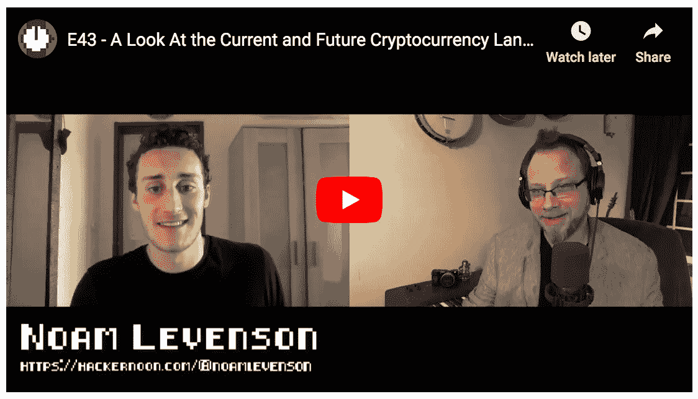

# 分权减少了垄断的可能性吗？

> 原文：<https://medium.com/hackernoon/does-decentralization-reduce-the-likelihood-of-a-monopoly-703cb27fd760>

## …与顶级黑客 Noon 作家 Noam Levenson 进行更多的加密对话。

## 在 [iTunes](https://podcasts.apple.com/us/podcast/look-at-current-future-cryptocurrency-landscape-writer/id1436233955?i=1000438102669) 、[谷歌播客](https://play.google.com/music/listen?u=0#/ps/Iy3btdr7spqcih5fheglsxdymie)上听采访，或者在 [YouTube](https://www.youtube.com/watch?v=RAlHLZp8-ck) 上看。

> *“重要的问题不在于分散还是集中。那就是垄断的可能性是不可能的。”****——****诺姆·利文森*

## [订阅黑客正午播客](http://podcast.hackernoon.com)。

## 阅读更多由 Noam Levenson 在 Hacker Noon 发表的技术文章:

*   [**为加密货币的灵魂而战**](https://hackernoon.com/the-war-for-bitcoins-soul-b81d5c87aa3c?source=user_profile---------0---------------------)
*   [**加密货币革命失败了吗？**](https://hackernoon.com/did-the-cryptocurrency-revolution-fail-988bf9b2fc90?source=user_profile---------1---------------------)
*   [**为什么频数不会长久**](https://hackernoon.com/why-cyptocurrencies-wont-be-irrelevant-for-long-ec9ccb7d1286?source=user_profile---------2---------------------)
*   [**戳破泡沫:加密货币 vs .网络公司**](https://hackernoon.com/popping-the-bubble-blockchain-and-cryptocurrency-7130156f91b2?source=user_profile---------3---------------------)
*   [**信任一个不信任的系统？本体如何给区块链带来大生意**](https://hackernoon.com/trust-in-a-trustless-system-how-ontology-could-bring-big-business-to-blockchain-fd73260ffee9?source=user_profile---------4---------------------)
*   [**中国一个被低估的区块链市场对你来说是好消息**](https://hackernoon.com/an-undervalued-blockchain-market-in-china-is-good-news-for-you-d0c010170622?source=user_profile---------5---------------------)
*   [**卡尔达诺:以太坊和新黑仔还是被炒作和定价过高？**](https://hackernoon.com/cardano-ethereum-and-neo-killer-or-overhyped-and-overpriced-8fcd5f8abcdf?source=user_profile---------6---------------------)
*   [**区块链需要 iExec:市场只是还没有意识到**](https://hackernoon.com/blockchains-need-iexec-the-market-just-hasnt-realized-it-yet-5597c743cd0a?source=user_profile---------7---------------------)
*   [**Request Network 不仅仅是 PayPal 2.0——它可能会彻底改变金融世界**](https://hackernoon.com/request-network-is-more-than-just-paypal-2-0-it-could-revolutionize-the-finance-world-87b54bb455?source=user_profile---------8---------------------)
*   [**NEO 对以太坊:为什么 NEO 可能是 2018 年最强的加密货币**](https://hackernoon.com/neo-versus-ethereum-why-neo-might-be-2018s-strongest-cryptocurrency-79956138bea3?source=user_profile---------9---------------------)
*   [**为什么方舟值得你关注**](https://hackernoon.com/why-ark-deserves-your-attention-c57acd51846a?source=user_profile---------10---------------------)

## 收听更多的[黑客午间播客](http://podcast.hackernoon.com)集:

*   [**分散治理是令牌化资产的未来吗？——与 CoinList 首席执行官安迪·布罗姆伯格**](https://podcast.hackernoon.com/e/andy-bromberg/) **:** *“目前，加密的很多价值都在投机和金融工具中，所以分散的金融起初很有意义，但后来转向其他一些东西，如分散的治理，随着越来越多的人参与进来，这似乎是自然而然的下一步。”*
*   [**Will Martino 和 Tony Pham 的区块链智能合约**](https://podcast.hackernoon.com/e/smart-contracts-on-blockchain-with-will-martino-and-tony-pham/) **:** *“总的来说，我认为整个空间的发展方向是共享经济——企业共享经济。这是一个重新定义消费者和企业如何互动的领域。”*

## [订阅黑客正午播客](http://podcast.hackernoon.com)。

## 还可以查看[五月头条](https://hackernoon.com/archive/2019/05)、[最新故事](https://hackernoon.com/latest-tech-stories/home) [、今日首页、](http://hackernoon.com/)和[编辑专题故事](https://hackernoon.com/editors-top-tech-stories/home)。

[photo credit](https://www.flickr.com/photos/wwarby/11513424364)