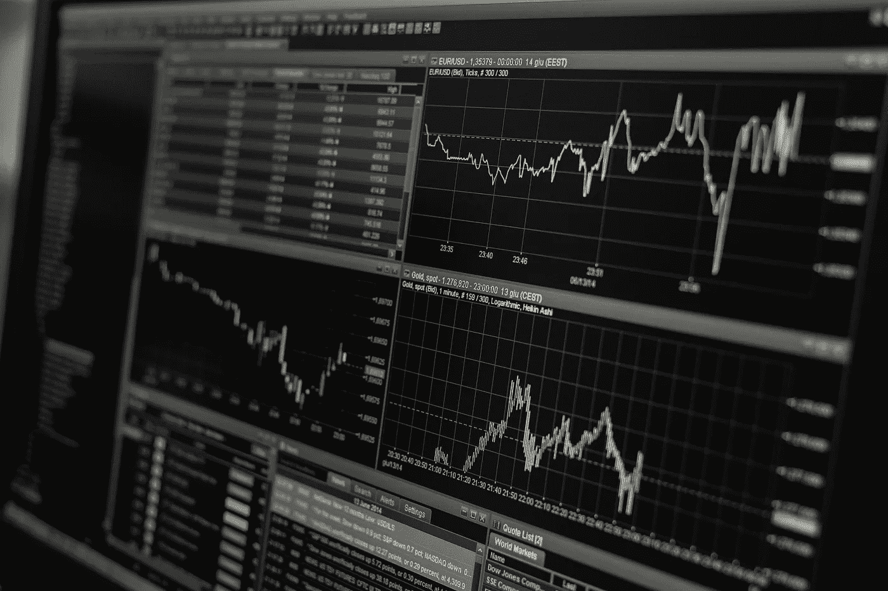
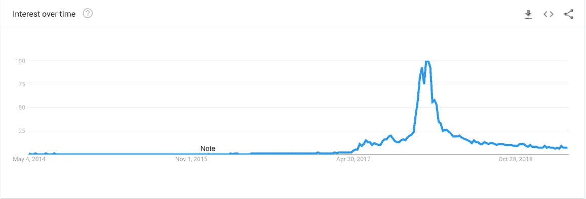
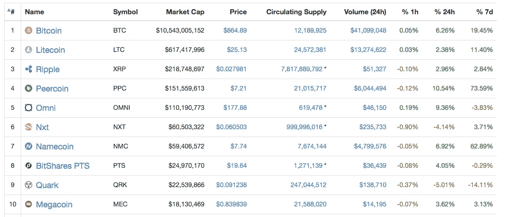
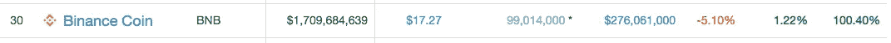

# 投资交易所有意义吗？

> 原文：<https://medium.com/hackernoon/does-it-make-sense-to-invest-in-exchanges-4bc0b1016b4b>

嗯，至少现在可能是这样。

许多加密货币项目可能会严重失败，极少数项目可能会成功。一些成功的项目甚至可能在几年内成为家喻户晓的名字。但尽管如此，加密货币和区块链仍将存在。任何花了一些时间研究一些好项目的基础的人都可以肯定地告诉你这一点。

# 欣快

几年后，围绕加密货币和 5 倍、20 倍和 100 倍回报的狂热可能会消退。请记住，今天没有人吹嘘互联网。加密货币也是如此。比特币将被接受为货币的互联网和互联网的货币。大部分的 alt 也会慢慢死去。那些会留下来的，将是因为它们解决了所在行业的一个特定问题，而不仅仅是因为它们是加密货币。我们将开始看到货币变得稳定，其价值逐渐增加，这取决于他们的结果，就像股票一样。投机和波动将会非常少。但是，要实现这一点还有很长的时间。未来几年，我们仍将看到猖獗的 FOMO 和 FUD。我们仍处于早期阶段。只要记住这一点，不管你什么时候进入加密世界，你仍然是一个早期采用者。

# 寻找下一个沉睡的巨人

有很多人在寻找下一个沉睡的巨人。这是一项非常艰巨的工作，因为有太多的问题需要新公司努力解决，而找到合适的公司扩大规模总是一个挑战。就我个人而言，我开始寻找可以解决比特币目前问题的硬币，然后我开始寻找隐私硬币，然后我试图寻找可以作为其他硬币平台的硬币，然后我开始寻找中国版本的成功硬币等

# 失去睡眠和内心的平静

这些方法我都取得了一些成功。但到了 2017 年底，我看到了 altcoins 最疯狂的牛市，要跟踪所有正在发生的新 ico 变得非常困难。感谢上帝，这种狂热已经消失了。那时我加入了几个专门的团体，帮助我节省了时间。但是仍然有很多超载。最近我专注于我们的产品[高亮](http://bit.ly/highlights-extension)，这是高亮和做笔记的扩展。其中一个原因是我不得不为加密货币做大量的阅读工作。很难记住我读过的所有东西。我们的扩展现在对我来说更容易了

自从我忙于我们的产品，我一直在寻找不太需要投入的东西。在此期间，我想采取“低风险中等回报的方法”来控制我的血压。

# 低风险，中等回报

Interest in Cryptocurrencies

简单看一下上面的图表，你就知道对加密货币的兴趣在 2017 年左右达到顶峰，现在又恢复正常。大约在同一时间，我做了一个简单的测试。我问了两个问题“你听说过比特币吗？”，“你投资过比特币吗”在我的办公室，朋友聚会，堂兄妹聚会。第一个问题的答案基本上是肯定的。对于第二个问题，只有大约 10%的人回答说他们投资了比特币。这大约是上一次牛市的时间。虽然现在利率可能已经大幅下降，但只要等待下一轮牛市，看看它会如何再次飙升:P

# 观察 1:随着时间的推移，对加密货币的兴趣将会增加。

既然我们知道对加密货币的兴趣将会随着时间的推移而增加，下一步就是识别回报丰厚的硬币。这说起来容易做起来难。看看下面的截图，你会知道我指的是什么。

这张截图对你来说应该很清楚了，因为这是今天排名前 10 的硬币。现在来看看下面的截图。

这是 2014 年 1 月 5 日的十大硬币。你能认出多少个？除了前三名之外没多少了吧？这正是我的观点。这份名单中有许多硬币在 2014 年 5 月曾位列前十，但如今甚至不在前 30 名之列。有许多硬币当时甚至不存在，但今天却进入了前十名。因此，如果你想投资于表现最好的硬币，你必须投入大量的时间和资源。你还应该注意到，与新的和有前途的硬币相比，前 10 名中的老牌硬币通常会给你较低的回报。

# 观察 2:很难识别给你带来良好投资回报的硬币。

做了这两个观察之后，我试图去了解如何充分利用这两个观察。我在考虑选择将受益于加密货币整体兴趣增长的项目，但它们的表现与单个项目无关。因此，有两种选择，要么投资于指数基金/代币，比如 https://www.bitwiseinvestments.com/(T0)、https://crypto20.com(T3)和 T2()，要么投资于热门/即将上市的交易所。虽然投资指数基金似乎是一个好主意，但据观察，与大多数活跃交易者的投资组合相比，它们的回报并不丰厚。这些指数基金大多不投资即将发行的硬币或 ico。因此，回报并没有那么高。所以下一个选择是交换。

# 投资加密货币交易所。

对我来说，这似乎是个好方法。我来解释一下原因。

对加密货币兴趣的指数级增长正在考验许多系统和门户的极限。即使在 2017 年 12 月牛市之前，两大 Poloni Exchange 和 Bittrex 也无法处理其门户网站的流量增长。波洛尼交易所的客户支持很糟糕。在和他们有了一次非常糟糕的经历后，我把我所有的存货都从波兰交易所搬走了。虽然丢失大部分库存可能是灾难性的，但更糟糕的是客户支持根本不在乎。诸如此类的经历促使人们开始寻找替代品。[币安](https://www.binance.com/?ref=29262812)和[库考恩](https://www.kucoin.com/#/?r=1yR7v)已经试图很好地填补这一空白。我个人一直支持库科恩取得成功，但币安几乎抓住了机会。我仍然认为库科恩会卷土重来。除此之外，我还在关注 Bitshares、Kyber Network 和 Cobinhood。虽然我在这些公司中有一些偏好，但我认为这五家公司都有很大的增长潜力，并将继续向顶级公司迈进。至少在未来几年，加密货币的采用速度几乎是指数级的。分布式交换还远未被采用。因此，所有这些都有发展空间。一旦兴趣从指数增长到线性增长，我想会有两个硬币出现，其他的可能会慢慢被遗忘。同时，这里是简短的评论。

# 比特股份

我认为这是第一个分布式交换，而且早些时候还排在前 10 名。我已经购买了 [Bitshares 的终身会员资格。我选择了终身会员，因为我的所有交易将获得 80%的返现。](https://bitshares.openledger.info/?r=gokul-nk)

## 赞成的意见

1.  成熟的技术。
2.  随着 Steem 和 EOS 的采用，这将得到更多的关注。
3.  将会有一些与 EOS 的整合，这将增加比特币交易的效用。
4.  这不仅仅是一场交易。您可以创建自己的数字资产。
5.  你可以在 Bitshares 上运行你的 ico。
6.  Bitshares 实际上是区块链或平台。[https://bitshares.org/](https://bitshares.openledger.info/?r=gokul-nk)只是前端。你可以使用任何你喜欢的流行前端。如果你是一个安全狂，想自己运行，你可以从 https://bitshares.org/download/的[下载交易所，然后自己运行。这样你也可以避免 DNS 攻击。](https://bitshares.org/download/)

## 骗局

1.  错误的用户界面
2.  低容量。
3.  没有正版手机 app。

理想情况下，我希望我所有的交易都在比特币上进行。但是我认为它还没有准备好。一旦用户界面得到改善，有足够的交易量和交易对，我将把我所有的交易转移到 Bitshares。

# 币安

目前，我的大部分库存都在[币安](https://www.binance.com/?ref=10117962)交易所。

## 赞成的意见

1.  圆滑的用户界面。
2.  交易费用低。(0.1%交易费)
3.  如果你有 BNB，你可以选择 BNB 扣除 50%的交易费。这也将减少残留物问题。
4.  CEO 似乎头脑冷静。
5.  他们支持所有的比特币分叉。[这样你就可以为所有的比特币叉子免费兑换硬币了。](https://steemit.com/cryptocurrency/@gokulnk/how-can-i-get-free-coins-in-the-upcoming-bitcoin-forks)

## 骗局

1.  他们有性能问题。这个问题在去年左右就已经解决了。
2.  他们在 2017 年 12 月左右减少了引荐奖金。
3.  一些相关人士指责他们收取高额上市费用。币安似乎很好地应对了这一指控。

# 库科恩

## 赞成的意见

1.  好 UI。
2.  频繁添加好币。
3.  KCS 持有者从交易所交易量最高的硬币中获得所有交易费用的一部分。因此，如果你持有足够的 KCS，这可能是一个很好的多元化战略。持有足够的 KCS，就像在这个交易所的顶级交易中投资少量的硬币。
4.  KCS 持有者可优先解决投诉。

## 骗局

1.  上次检查的时候没有止损。

# 凯伯网络

## 赞成的意见

1.  不可信的即时交易。
2.  除了交换，它还支持跨链支付。

## 骗局

1.  据我所知，这种体验还不错，但交易量和流动性都很低。

# Cobinhood

大约在 2017 年牛市结束时开始了解。它被称为零交易费交易所。如果是这样的话，我不知道为什么大家都不使用它。在最近的大屠杀之后，我没有在 Cobinhood 上做太多交易。但是看起来他们已经走了很长的路。

# 结论

2018 年 2 月我写了这篇文章的初稿。我根据今天的学习更新了这篇文章。一件重要的事情是，我在币安身上的赌注得到了回报。排在第 30 位的币安没有排在第 7 位。尽管币安在大多数方面做得不错，但我认为它现在定价过高。

你有什么想法？投资交易所还有意义吗？