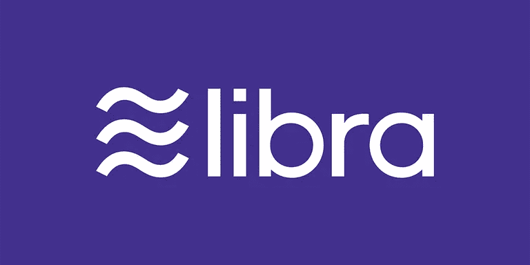

# 天秤座重要吗？

> 原文：<https://medium.com/hackernoon/does-libra-matter-7cf94da982a5>

## 脸书的新加密货币 Libra——它如何影响银行、社交网络和你。

本周，脸书推出了一种稳定的、由法定货币支持的加密货币 Libra，旨在促进跨境资金转移。脸书的目标是通过创建一个在线生态系统(在社交网络上/外)，在 Libra 周围建立一个支付网络，用户可以在这里进行购物和点对点(P2P)转账。它的结构和支持为 Libra 创造了成为加密货币市场催化剂的潜力。

## 为什么脸书对加密感兴趣？

一家大型科技公司带着一个不包括信用卡的解决方案进入支付市场，这一直是银行、信用卡支付网络和其他传统金融机构的担忧。这是一种尝试。天秤座是早期和固执己见的，但它给了金融系统走向的一瞥，但它确实对金融系统的形成有着有趣的影响:

*   一个基于区块链的全球支付系统可能会导致数字消费经济的根本性变化——支付变得更快、更可靠、更便宜。
*   银行利润的很大一部分来自跨境和外汇，这将直接受到这一替代方案的影响。
*   Libra 还有很长的路要走:全球政策制定者的决定将对加密货币的未来产生重大影响。

考虑 Libra 和比特币之间的显著差异很重要，后者一直是大多数加密货币政策和设计的基础。值得注意的是:

*   天秤座将*而不是*完全去中心化或匿名化(至少最初是这样)。
*   天秤座是用来交换的，不是用来当储值的。
*   Libra 由各种全球法定货币支持，以避免大多数现有加密货币经历的大规模波动。

脸书对全球支付的追求证明了改善现有跨境和 P2P 支付系统的巨大机遇。从一个国家向另一个国家转账应该像发短信一样简单。银行可以利用其现有的市场地位和新技术来更好地填补这一缺口，让它们在 Libra(或类似工具)起飞时更好地避免非中介化。

## **天秤座是什么？**

> “一个*简单的全球货币和金融基础设施，让数十亿人受益”——*[*Libra 白皮书*](https://libra.org/en-US/white-paper/)

Libra 是一种稳定的货币——一种由政府支持的货币和证券支持的数字货币。目标是避免价值大幅波动，以便 Libra 可以用于日常交易，这是比特币等更不稳定的加密货币面临的主要挑战之一。

脸书创建了一个新的子公司，称为 Calibra，以建立新的钱包，并专注于该公司的区块链努力。这种数字货币预计将于 2020 年推出。

## 它将如何工作？

为了让 Libra 达到作为一种支付方式所需的可用性和接受度，它需要得到广泛的信任。脸书正在创建一个新的支付网络，用户可以在这个网络上购物和互相支付。这个生态系统包括:

*   **天秤座区块链**:一个新的、开放的轨道，任何人都可以在上面构建。
*   **天秤座储备**:实物资产储备，分布在全球各地，以支持天秤座。
*   天秤座协会:整个天秤座网络和储备的管理结构。

Libra 协会的成员将通过 Libra Reserve 向该网络投资 1000 万美元，Libra Reserve 将管理数字硬币。虽然脸书将是创始成员之一，但它只是该协会的一个平等成员。创始成员是:

*   **支付**:万事达卡、贝宝、PayU (Naspers 旗下的金融科技公司)、Stripe、Visa
*   **技术和市场** : Booking Holdings、易贝、脸书/卡利布拉、法尔费奇、Lyft、MercadoPago、Spotify AB、优步技术公司。
*   **电信**:伊利亚特、沃达丰集团
*   **区块链** : Anchorage、Bison Trails、比特币基地公司、Xapo 控股有限公司
*   **风险投资**:安德森·霍洛维茨、突破倡议、瑞比特资本、兴旺资本、联合广场风险投资
*   **非营利和多边组织以及学术机构**:创造性破坏实验室、Kiva、美慈组织、世界妇女银行

## 为什么这对脸书有意义

脸书的大部分收入来自广告。支付是脸书将其消息平台——Messenger 和 WhatsApp——转变为补充性创收业务的一种潜在方式。

凭借其 25 亿用户，脸书的网络令全球任何其他银行或支付系统相形见绌——具有公认的网络效应。将其用户群货币化可能会在脸书生态系统内形成一个全球商业网络。

正如预期的那样，这是一个需要时间并面临几个监管障碍的项目。任重而道远。脸书试图通过建立一个将脸书视为管理机构平等成员的治理结构来解决一些迫在眉睫的监管问题。Libra 协会的宗旨是定义一个可持续的治理结构，一条走向权力下放的道路，并监督 Libra 网络和保护区。

脸书将在 2019 年大力参与开发 Libra 背后的技术。Libra 区块链是开源的，目的是让任何开发者都能在其上构建应用。这是整个支付生态系统都应该效仿的举措。

让我们看看当你把 25 亿人指向一种加密货币时会发生什么。