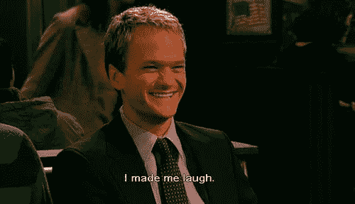
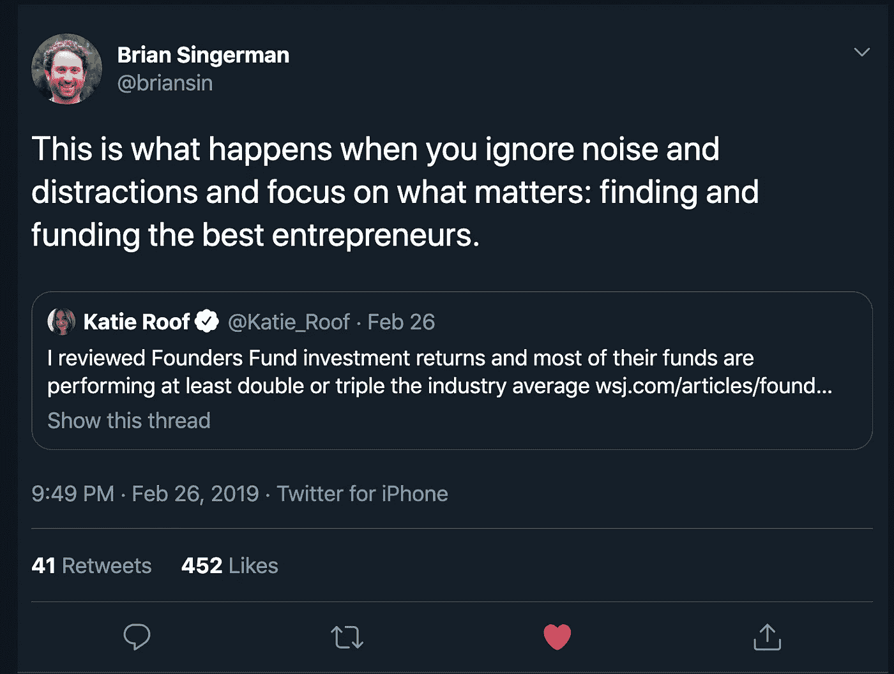

# 风险投资有自我问题吗？

> 原文：<https://medium.com/hackernoon/does-venture-capital-have-an-ego-problem-e1071bab214a>

## 风险投资并不以谦逊著称。随着新公司的激增以及下一代经理人的出现，这是一个改变这种形象的机会。一个让风投变得更加人性化和平易近人的机会。但是，该行业漫长的反馈周期和个人品牌建设(没有现金回报)是否几乎自然而然地让新兴经理人变得以自我为中心？让我们来解释一下，当你在为未来投资时，为什么很难控制你的自我。

作为一个最近进入这个行业的人，我亲身经历了自我陷阱。在推出自己的基金后不久，我开始体验感觉自己是宇宙主宰的日子。日子是这样过的:

> 我打开我的笔记本电脑。我首先看到的是我上周接受采访的新闻文章在网上。还有，我今天早上洗澡时想到的智能推文现在已经被转发了好多次。这对我的个人品牌来说太棒了！
> 
> 等待...那是创始人发来的冷冰冰的邮件吗？他们希望我对此做出回应吗？！如果他们很优秀，他们会知道如何通过介绍找到我。更别提我待会要去的那个科技活动了。那里的大多数人都一无所知。感谢上帝我在说话，这样我就可以发展我的个人品牌。

但是当我离开办公室的时候，我通常会被我内心的声音带回到现实中，“你到底还了多少钱，克里斯蒂安？”。我整个晚上都在友好地回复那封冷冰冰的邮件，并给我之前在活动中遇到的那个人写一封后续邮件。

自负是你作为风险投资人将要面对的最大敌人之一。这是阻碍有抱负的年轻风投成为伟大投资者的原因。它甚至撕裂了老牌公司。它是藏在每个投资者床下的怪物，随时准备在你最脆弱的时候突袭。但是怪物为什么会存在呢？你如何阻止它变得更强大？

# 社会资本和回报

风险投资中的反馈回路真的很长。至少要花五年时间才能知道你是否优秀，花十年时间才能知道你是否非常优秀。这需要等待很长时间，尤其是在成为五家独角兽公司的早期投资者之前，你需要吸引优秀的创始人。此外，你需要每三年筹集一只新基金，但没有现金回报，因此建立个人品牌似乎是个不错的主意。

所以我们在这里。你大张旗鼓地推出你的基金，TechCrunch 正在报道这次发布。那天整个互联网好像都在说你。但是，当你疯狂地更新你的浏览器标签，看看是否有更多的人转发你的故事时，你的自我意识正在你的潜意识中慢慢增长。

社会资本的问题在于它是一个不停运转的飞轮。媒体的提及转化为 Twitter 的关注，进而转化为在大型会议上的演讲。不知不觉中，所有人都在不停地抚摸你的自我。重要的感觉成为你身份的一部分，不承认这一点，你就在寻找不断解决问题的方法。权力甚至会腐蚀最纯洁的灵魂。然而，你还没有完成有限合伙人委托给你的工作:返还资本。

这是否意味着你不应该建立一个个人品牌？绝对不行。建立品牌是加速交易流程的一种强有力的方式，尤其是在你刚刚起步的时候。它增加了企业家和其他投资者的信任度。但你应该意识到，哪些东西真正服务于你的交易流程，哪些只是在满足你的自负。在答应之前，重要的是要问“我是在为我的回报潜力服务还是为我自己服务？”。

This is Brian. Be more like Brian.

建立社会资本的关键是理解什么是有用的，什么是纯粹的自我建设。根据经验，寻找能让你对特定主题发表意见的社会资本，将有助于你在特定的利基市场中获得强有力的地位。几乎所有其他的事情都很有可能服务于你的自我，同时伪装成个人品牌建设。做过头了，它会成为你作为投资者死亡的开始。

# 权力的幻觉

你会听到风投吹嘘的最常见的事情之一是他们的“接受率”(筛选/投资)。它会变化，但通常会在 0.5-2%之间，大多数投资者会说不**很多**，因为每年看到+1000 笔交易并不少见。感觉从你这里获得投资是独家的，只留给杰出的创始人。但这就一定能证明你有很大的流量吗？

不。因为权力法则。不清楚确切的回报分布是什么样的，但我听到的最常见的概念是，前 5%的公司回报约 95%的资本。太贵了。如果你筛选的 1000 家公司中没有一家属于前 5%，那就更糟了。在这种情况下，你在失败者中挑选。你的投资感觉很排外，但永远不会有有意义的资本回报。然而，10 年后你才会知道。这就是风险投资的残酷本质。不要忘乎所以。

根据我的经验，评估交易流程的一个更有用的方法是跟踪你错过但应该看到的交易。对我来说，这些是最痛苦的，减少这个数字是我改善交易流程的方式。在你确定你遇到了最好的创始人之前，更多的公司在你的漏斗顶端不会增加你资助一个局外人的机会。像任何方法一样，这也有它的缺点，但会帮助你保持谦逊。不要为了“接受率”的虚荣指标而优化。

# 自我选择的自大狂？

当你读到这里的时候，你可能会想:“冒险不就是吸引自负的人吗？”。这话有几分道理。大多数人在筹集资金之前都有过成功的经历和大量的人脉。从这个角度来看，谁能成为风险投资人是非常非精英化的。然而，以前的成功并不一定会导致巨大的自我，在任何行业中上升到顶端的人，通常是那些最谦虚的人。

但由于人们往往在职业生涯的巅峰时期开始投资基金，因此有理由把包袱甩在身后。然而，对所有伟大的投资者来说，似乎普遍适用的是理解你不知道的东西。有了强烈的自我反省意识，你会很快发现成为一名伟大的风投是非常困难的。很少有人能做到。把你的自我放在门外是成为少数几个这样做的人的重要的第一步。

理解一个人为什么会成为风险投资人是一个很好的方式来扫描作为一个企业家的自负。答案似乎是*“因为他们知道有人愿意给他们钱”*还是*“这是最能打动他们朋友的事情”*？。可能不是最好的迹象。寻找那些对你的[业务](https://hackernoon.com/tagged/business)、[技术](https://hackernoon.com/tagged/technology)真正好奇的人，发现他们不知道的东西。

# 在结束语中

当我开始我的基金时，我 25 岁。自然而然地，你对任何事情都知之甚少，也没有有意义的关系网。你“生存”的唯一方法就是带着极度的谦卑(+长时间)来接近你的学习曲线。我犯了一系列令人尴尬的错误(这里列出的)，每天都在质疑自己的基本能力。现在也是。然而，它也给我灌输了一种不断发展智力的动力，这是我所依赖的。我希望这将成为一个核心价值观，永远不会被自我的飞轮所腐蚀。

作为一个新的投资者，在噪音上花费大量时间是很诱人的。在持有时间如此之长的资产类别中，它能带来即时的满足感。你的实际回报不会被披露，但每个人都可以在 Twitter 上看到你的关注人数。但即使是最“强大”的风投也不会在没有最终回报的情况下继续经营下去。我们非常幸运地拥有这样的特权工作，但我们必须记住，一切都是借来的，并承诺有巨大的回报。