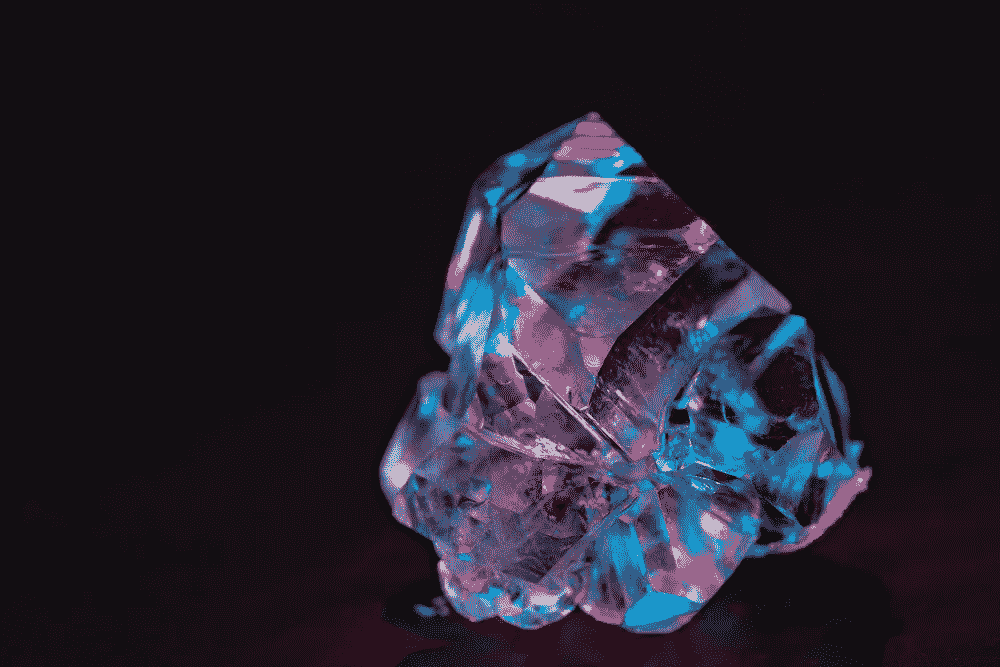

# 行善:区块链朝着结束全球人类悲剧的方向前进

> 原文：<https://medium.com/hackernoon/doing-good-blockchain-making-progress-ending-a-global-human-tragedy-125b11618ae>

## 区块链被利用的方式有很多，但很少是围绕解决非商业的社会问题。一个主要的例外是一些开发商如何利用这项技术来解决一个长期存在的问题——全球血钻交易。

Photo: monsitj / Adobe Stock

在过去的几年里，区块链技术的快速采用有望解决企业和消费者长期存在的问题。如果你环顾四周，你会发现它无处不在，从沃尔玛的农产品供应链到加州的 T2 私人住宅销售。随着区块链使用的数量和种类的增加，人们对该技术最终可能在更大范围内实现的目标的希望也在增加，特别是在应用于长期的社会需求和问题时。

一些人将其视为解决主要问题的方法，如确保民主国家的选举制度，其他人希望看到它被用于帮助发展中国家建立财产权。技术专家希望看到区块链提供社会效益的方式很多，但到目前为止，这种用途的例子很少。然而，有一个显著的例子，区块链技术被用来解决一个重大问题，这个问题在近 30 年里一直困扰着所有其他解决方案，它与你可能意想不到的东西有关——钻石。

Photo: Victor Moussa / Adobe Stock

# 血钻的悲剧

要了解区块链与钻石的关系，你必须先熟悉它所解决的问题。问题是，自 20 世纪 90 年代初以来，整个非洲大陆的专制和革命政府一直利用非法出售钻石来资助内战、侵犯人权和无数其他暴行。这种做法如此普遍，如此具有破坏性，以至于产生了一个名字:血钻。问题变得如此严重，以至于在 2001 年，美国甚至[禁止了来自利比亚或塞拉里昂的原石交易，在那里发生了一些最严重的虐待事件。尽管如此，滴血钻石仍然是一个问题，因为在商品行业中，它们非常难以追踪，因为在可追踪的零售供应链中，产品有时会转手(和国家)几十次。](https://beyond4cs.com/loose-diamonds/blood-diamonds-controversy/)

为了解决这个问题，一个由 81 个国家代表组成的联盟走到了一起，制定了一个名为“金伯利进程”的协议，该进程是以该组织召开会议的城市命名的。它要求所有签署国致力于管理所有钻石商品交易的具体控制程序和认证要求。人们希望自律足以结束血腥钻石的祸害，但人权观察和其他人得出结论认为[自愿系统是无效的](https://www.hrw.org/news/2016/06/06/human-rights-watch-statement-kimberley-process)，部分原因是它仍然很难确定违反公约。这正是区块链出现的地方。

Photo: pickup / Adobe Stock

# 一个全局不可变注册表

从 2015 年开始，就在比特币开始进入公众意识，企业家开始寻找底层技术可能适用的方法时，一家名为 [Everledger](https://www.everledger.io/) 的初创公司利用区块链建立并开始运营一个新的钻石登记处。这个主意简单明了:区块链钻石登记处可以保证任何进入系统的钻石在源头都可以被追踪到整个供应链，任何人都没有机会把它换成不同的钻石。这不仅将消除钻石贸易中的欺诈和欺骗，还将结束血腥钻石，因为再也没有办法不被发现地将它们偷偷带入全球供应。Everledger 的首席执行官符晓薇·坎普[这样总结这个概念:“…我们已经看到并继续看到围绕欺诈的问题，人们会复制或篡改证明文件……ever ledger 提供了一种数字调节机制。如果证书是在第一个国家创建的，则该数据存在于全球分类账中，因此第二个国家能够访问这些证书的实时验证和对账。”](https://breakermag.com/diamond-tracking-is-a-girls-best-friend-an-interview-with-everledgers-leanne-kemp/)

Photo: science photo / Adobe Stock

# 越来越受欢迎的想法

Eveledger 平台背后的想法非常有前途，引起了钻石行业重量级人物 De Beers 的注意，他们后来推出了自己的区块链平台，旨在确保通过其庞大的全球供应链的钻石的真实性和原产地。这个被称为“追踪系统”的系统意义重大，因为戴比尔斯公司控制了全球毛坯钻石贸易的大约 30%的份额，因此在一劳永逸地结束血腥钻石贸易方面具有独特的影响力。

好消息是，控制着世界其余大部分钻石供应的主要利益相关者现在开始效仿。今年二月，[俄罗斯国家通讯社塔斯社报道](http://ftreporter.com/russia-launches-a-blockchain-diamond-tracker/)原产于那里的钻石供应现在可以在一个新的区块链平台上追踪，这个平台被称为 Bitcarat。虽然该系统的具体细节尚不清楚，但该系统将为血腥钻石敲响丧钟，因为俄罗斯控制的钻石储量超过所有其他钻石生产国的总和。这意味着，俄罗斯钻石供应受到控制，德比尔斯公司和 Everledger 公司的努力，这三者结合起来，很有可能最终结束非法钻石贸易。

# 底线

区块链通过终止滴血钻石贸易来帮助解决一个大规模且长期存在的人权问题，这是一个技术如何服务于公共利益的光辉范例。这里提到的区块链平台的融合何时会成功完成他们的既定使命是不可知的，但是在短短的四年里，他们已经完成了比任何其他尝试都要多的事情来解决这个令人憎恶和不可接受的问题。如果没有别的，它应该成为其他区块链开发者的号角，将他们的注意力转向使用该技术来解决其他社会弊病。如果他们真的这么做了，那么区块链可能不会作为比特币技术和私人企业利益而被人们记住，而是作为一种工具，让我们的世界成为一个更美好、更公平的居住地——那会很酷，不是吗？