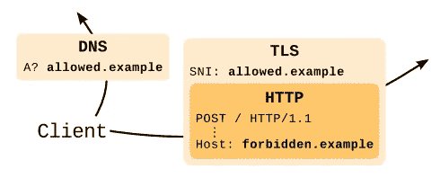

# 简而言之，域名前置

> 原文：<https://medium.com/hackernoon/domain-fronting-in-a-nutshell-159e21bf23a4>

你可能已经听说过[域名抢注](https://en.wikipedia.org/wiki/Domain_fronting)，尤其是在像[信号](https://signal.org/blog/looking-back-on-the-front/)和[电报](https://www.wired.co.uk/article/telegram-in-russia-blocked-web-app-ban-facebook-twitter-google)这样的流行信息应用逃避政府审查的背景下

CDNs

## 简要描述

域名前置允许绕过审查，对可能被 DPI、DNS 过滤或 ip 阻止的资源进行审查，在幕后，它依赖于托管多个域的 cdn。无论是 AWS 还是 GCP(主要的 CDN 提供商)都不会再允许这种伎俩被使用了。谷歌声称它在 GCP 从未被支持过，而亚马逊[称](https://aws.amazon.com/blogs/security/enhanced-domain-protections-for-amazon-cloudfront-requests/)违反了 AWS 服务条款。

## 域名前置是如何工作的？

> 域名前置通过使流量看起来像是由一个有效的域名产生的来绕过审查。这种方法是可行的，因为现代 cdn 包含两个相互独立存在的部分。外部部分用于建立与客户端的 SSL 连接，而内部部分在流量解密后处理请求。在这个阶段，重新路由到隐藏的目的地变得可能。

在正常情况下，三个请求(DNS、SNI 和 HTTP 主机头)具有相同的主机名。DNS 和 SNI 请求以纯文本形式发送(可能会被审查者跟踪)，而内部 HTTP 流量是加密的。域前置依赖于在 DNS 和 SNI 请求中发送相同的主机，在 HTTP 主机报头中发送不同的被阻止主机。

Domain fronting in a nutshell

例如，域 A、域 B 在同一个 CDN 下，并且域 A 在某些国家被阻止，而域 B 没有。将有效的域 B 放在 SNI 报头中，将被阻止的域 A 放在 HTTP 报头中，这是域前置的主要思想。由于 SNI 不是 TLS 协议的加密部分，授权机构可以看到与有效的域 b 建立连接的意图。CDN 读取带有被阻止的域 A 的 HTTP 主机报头，并将请求转发到指定的源(被阻止的域 A)

## 实验

捕捉网络流量的过程是对审查者的模仿。为此，我更喜欢使用 Wireshark 或 ngrep。

在一个终端中启动 tshark:

> sudo tshark-T fields-Y ' TCP . dstport = = 443 和 SSL . handshake . extensions _ server _ name '-e SSL . handshake . extensions _ server _ name

在第二个终端中运行以下命令:

> 科尔-斯[https://github.com](https://github.com)

在第一个终端中，tshark 显示了我们刚刚访问的站点的名称:

> github.com

这是对上面 cURL 发送的请求的模拟:

Tshark 在上面的直播中展示了同样的回应。

现在让我们尝试利用域名前置。由于 GCP 和 AWS 禁止这种方法，我们使用 GitHub 页面进行演示。使用 GitHub 页面的网站列表在这里是。如上所述，禁止域(从上面的列表中随机选择- *bulma.io* )必须只在 HTTP Host header 中设置，而同一 CDN 下的“有效”域(*GitHub . io*domain*—GitHub pages)必须在其余地方指定。*

*它生成的输出证明响应是由“禁止的”资源发送的:*

*在第一个终端，tshark 显示了*github . io*——审查员的“有效”域名。结束了。*

*有时使用 GitHub 页面的网站也会使用带有受限域名前缀的 cdn。在这种情况下，畴前是不可实现的。*

*在写这篇文章的时候，有可能使用域名前缀和快速 CDN。使用该 CDN 的网站列表在此处为。*

*与上面的例子类似，我随机选择了 *StackOverflow* 作为“阻止”域，随机选择了 *NY Times* 作为“允许”域:*

*输出:*

*在第一个终端中，tshark 显示了*nytimes.com*，我们得到了来自 *StackOverflow 的响应。从 nytimes.com*和 Fasty CDN 到 stackoverflow.com*的*流量被成功地重新路由*

*Fasty CDN 下的更多有趣的域示例(查看上面的最后一个链接):*

*沙克指着 drupal.org*

*正如预期的那样，沙克展示了 apple.stackexchange.com*

## *副作用*

*cdn 服务于数千个不同的领域。因此，对一个域名的审查可能会破坏许多无害资源的可用性。这发生在一年前的俄罗斯，当时当局试图封锁电报。当局盲目封锁 Telegram 使用的 CDNs 下的所有资源。许多主要和次要的网络服务不可用。这个先例似乎是 GCP 禁止在 AWS 中使用这项技术的真正原因。*