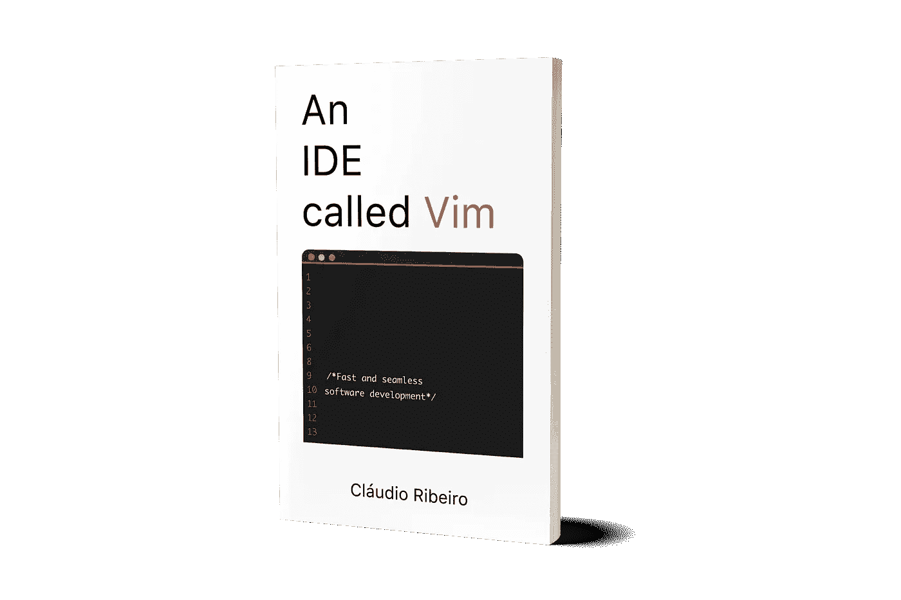

# 搞定了维姆图特，现在怎么办？

> 原文：<https://medium.com/hackernoon/done-with-vimtutor-now-what-69733ad0149c>

我不止一次说过，对于想开始使用 vim 的人来说，vimtutor 是最好的资源。它通过动手实践的方式介绍了该软件的所有基础知识，从而开始使用 vim。虽然对一些人来说这已经足够了，但是大多数人会问，

我已经通过了 vimtutor，现在呢？

无论您是想写代码、写论文还是在远程机器上做一些工作，都有几个步骤可以巩固和扩展您新获得的 vim 知识。

## 阅读 Freackin 用户手册！

Courtesy of Unsplash

就像大多数人不知道 vimtutor 的存在一样，他们也不知道有一本用户手册。而且真的很好。

要启动用户手册，我们可以使用 Vim 中的 **:h** 或 **:h 用户手册**。(注意，如果您使用 **:help** 或 **:h** ，用户手册会在缓冲区中向下打开一页左右)。从这里开始，如果手册以拆分方式打开，我们可以使用:只让用户手册成为屏幕上唯一的缓冲区。

要从 Vim 外部启动用户手册，我们可以使用**$ Vim-c ' h user-manual | only '**。这个命令不仅会启动用户手册，还会使它成为屏幕上唯一的缓冲区。

从这里开始就是正常的 Vim 导航了。请注意，我们可以通过将光标移到您感兴趣的文件名上并按下**<C-】>**来跟踪链接(标签)。要返回目录，只需使用 **< C-t >** 。

用户手册内容广泛，见解深刻。它提供了关于 Vim 的每个活动部分的信息，在我看来，它是那些想要扩展其软件知识的人的主要信息来源之一。

## 阅读一本面向 vim 的书

Courtesy of Unsplash

外面不缺 Vim 的书。从作家、程序员或只是好奇的人的书，提供了巨大的。我的建议是找一本专注于你想要完成的任务的书。如果你想用 Vim 写作，那就去搜索一本专注于用 Vim 写作的书。找代码？搜索一本专注于编码的书。

如果你想要一本关于 Vim 的通用书籍，我推荐德鲁·尼尔的《实用 Vim》。它将 Vim 展示为一系列让您更快、更高效的技术，同时解释了 Vim 的一些核心概念。

以上是我对刚完成 vimtutor 并想要更多的人的建议。直到今天，当我在 Vim 方面需要帮助或者想改进我的工作流程时，我仍然会求助于这些资源。根据我的经验，这些资源是真正有用的，所以在你需要的时候一定要考虑它们。

想了解更多关于 Vim 的知识？想学习如何将其用作 IDE？看看我的新书《一个叫做 Vim 的 IDE》。从基本的 Vim 使用到文件查找、自动完成、文件管理器等等，它都有。