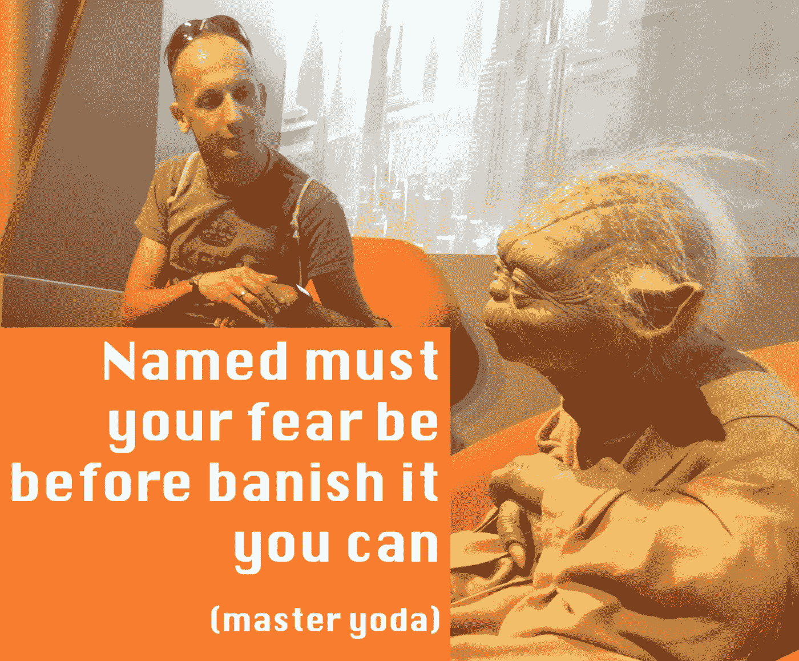

# 不要害怕(科特林)

> 原文：<https://medium.com/hackernoon/dont-be-afraid-of-kotlin-38dc53144b6b>

Intergalactic expert summit

如果你是一名 Java 开发人员，你可能听说过 Kotlin:一种在短时间内征服了很多领域的语言。现在我们可以说:科特林在这里停留。看起来它将成为 JVM 语言№2，在 Android 上，它成为我们许多人选择的语言。
但并不是每个人都很兴奋。如果您是一名长期的 Java 开发人员，您可能会担心所有这些。

# 神话

有人说开发人员应该每两年学习一门新语言，我们应该把业余时间花在业余爱好项目上。

我从来没有真正这样做过，我知道很多开发人员也没有这样做过。

老实说，有很多原因可以解释为什么你应该跳出自己的编程世界。学习一门新语言有助于你更好地掌握你的主要语言。

由于其庞大的宇宙，Java 使得呆在舒适区变得非常简单，并且在 Android 上也有如此多的体验。

# 然后科特林发生了

如前所述，很多开发者都喜欢 Kotlin！其他人在犹豫。而第一组往往不理解第二组。Kotlin 不是又让开发变得有趣了吗？

犹豫可能有各种原因。就像在你的项目中没有好的理由去科特林。

这可能是真的。

有时候！

但其他时候却隐藏着*恐惧*！

# 恐惧？

你可能会问，开发人员会害怕什么？

怎么样:

*   害怕现在有新的人，经验较少的人突然变得比他们“聪明”？
*   或者你对一门你已经烂熟于心的语言失去了控制？

失去我们的舒适区让我们害怕！我见过许多开发人员遇到这种情况。这可能发生在我们任何人身上！如果你是一个新手，或者是一个非常有经验的人，甚至是害怕失去控制的团队领导，这都没有关系。

我给你讲个故事吧。

# 很久以前…

当我在 2001 年获得大学毕业后的第一份开发工作时，我很快转向了 Java。很长一段时间，我都在编写运行在 Windows、Linux MacOS 和 OS/2 上的 J2SE“应用程序”。很快，我转向了嵌入式(CDC)，尤其是移动(J2ME CLDC)。

认证在当时是开发者的事情。所以我考了 Java 认证程序员，当我在移动设备上时，我成为了一名认证的黑莓开发者。成为开发人员的大好时机！所以我想。

My Android shirt at the Blackberry 10 launch as a sign that the winds had changed

# 没有什么是永恒的

在某种程度上，很明显，黑莓和诺基亚一样，在与新对手苹果，尤其是谷歌的安卓系统的竞争中节节败退。

我意识到我的开发人员证书很快会变得一文不值。我害怕吗？当然，我完全是！我想我需要重新开始！学习新平台！？太可怕了！

# 请回到科特林

我想很多开发者对 Kotlin 的感觉都差不多。

但我真的认为我们都不应该和科特林对抗。最终会导致同事离职。随着时间的推移，在“遗留”Java 代码基础上，这些将越来越难被取代。从长远来看，你可能会毁了整个项目。

所以你还能做什么？

换个领域？弃安卓而去后端？Java 是新的 Cobol！你会在 Java 找一份几十年的工作！所以有很多方法可以让你呆在自己的舒适区。但是，如果你和我一样，热爱手机:让我们呆在一起吧！

# 拥抱改变！

难道科特林不正是我们热爱 Android 的另一个原因吗？只是这次它是一种新的编程语言。

好消息是:你所知道的一切仍然有效！所有那些 JVM 的细节你都知道吗？有效！新开发人员不会有这些见解！

但不止于此。你见过这么多事情。那些是用什么语言写的并不重要！这对每个新项目来说都是宝贵的知识！比以往任何时候都更需要你！否则，新的团队成员将会重复我们本可以帮助避免的错误。
和他们结对！向他们学习，就像他们向你学习一样。

你可能仍然不能每隔一年学习一门新的语言，这很好，但是 Kotlin 现在是你学习一门语言的机会！让我们使用它！

# 回到未来

当我被扔出我的舒适区时，回头看，那是我一生中发生的最好的事情之一！Android 为我打开了新的可能性，我成为了一个新社区的一部分，我仍然认为这是我所能期望的最好的。

Found the best community I could have wished for

2016 年我搬到了科特林。我想相信我以前的经历让我对这次行动更加开放。

最近，我不得不接触一些很棒的代码。我想念我的 Kotlin，但它让我好奇，想看看更多的东西。我听说 Clojure 是个东西。我很久以前就离开了我的舒适区。

来加入我吧！