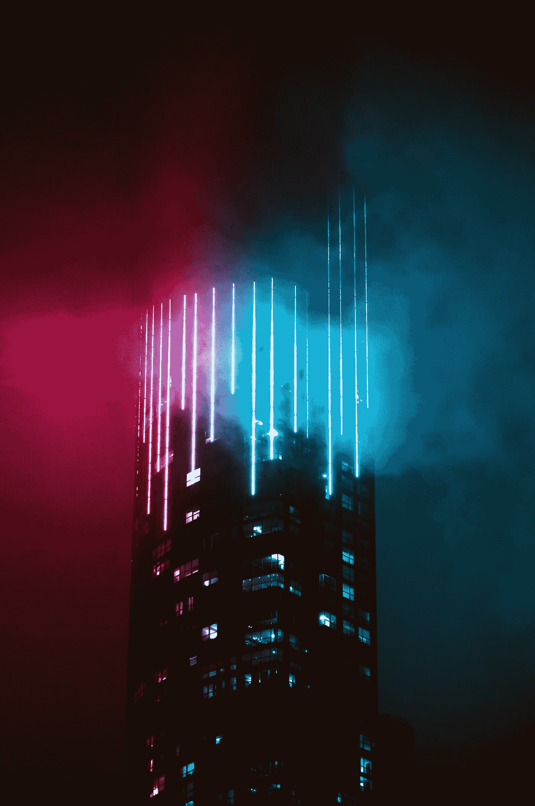

# 自然化我们与科技的融合

> 原文：<https://medium.com/hackernoon/dont-fear-the-techno-reaper-bc6c38a56424>

## 将我们即将到来的技术融合与自然主义哲学相协调

Photo by [Victor Rodriguez](https://unsplash.com/@vimarovi?utm_source=medium&utm_medium=referral) on [Unsplash](https://unsplash.com?utm_source=medium&utm_medium=referral)

> “生活的意义就是活着。这是如此简单明了。然而，每个人都在巨大的恐慌中跑来跑去，好像…