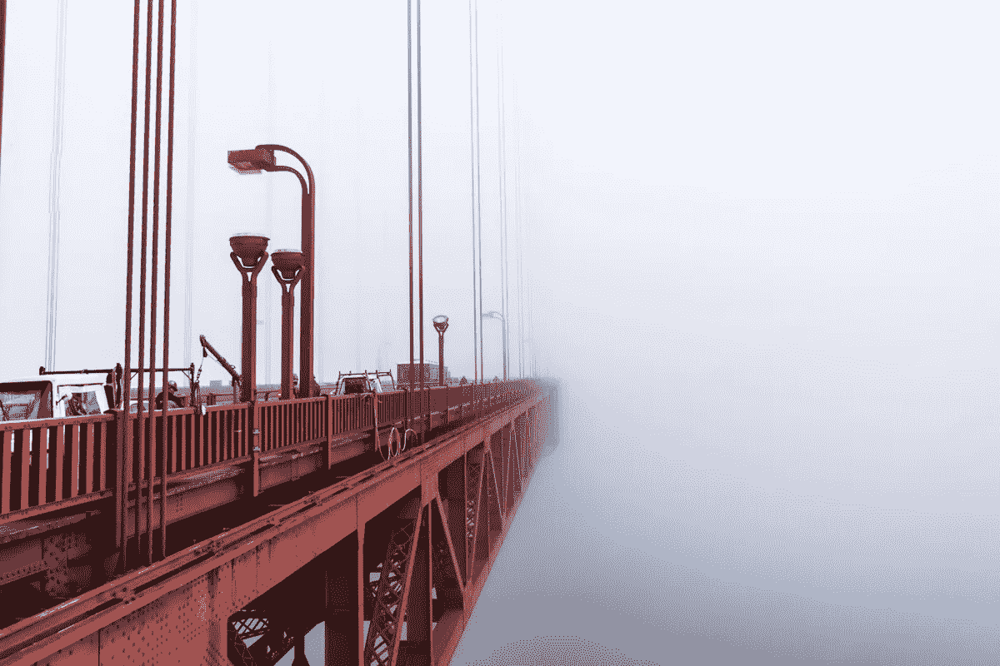
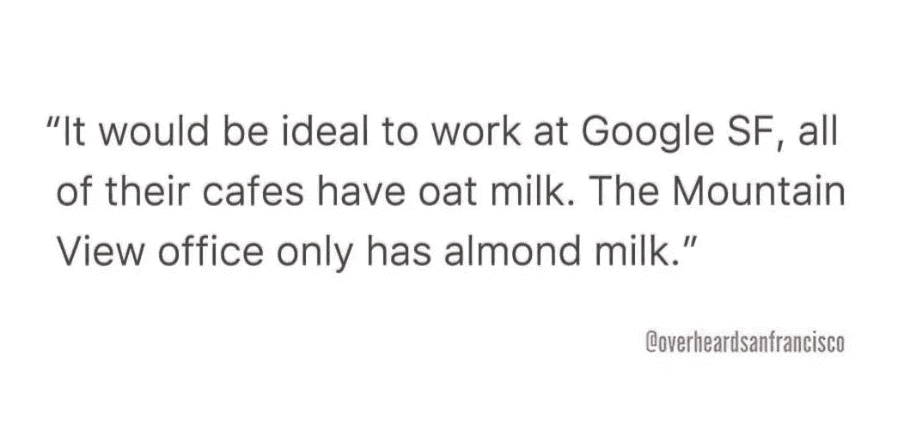
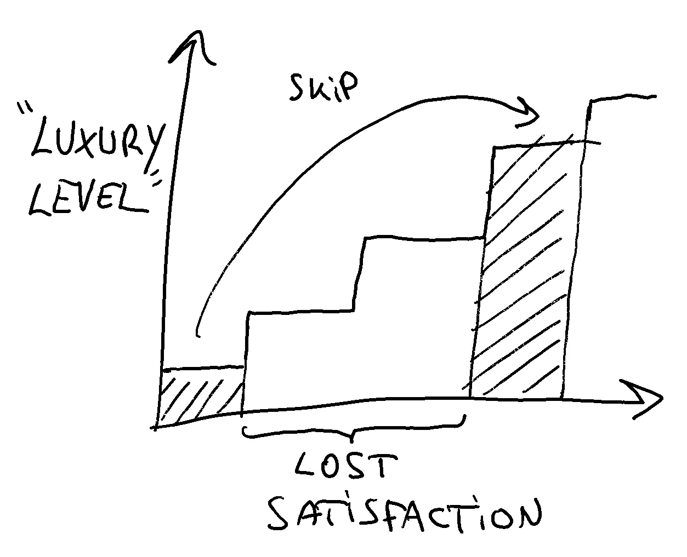
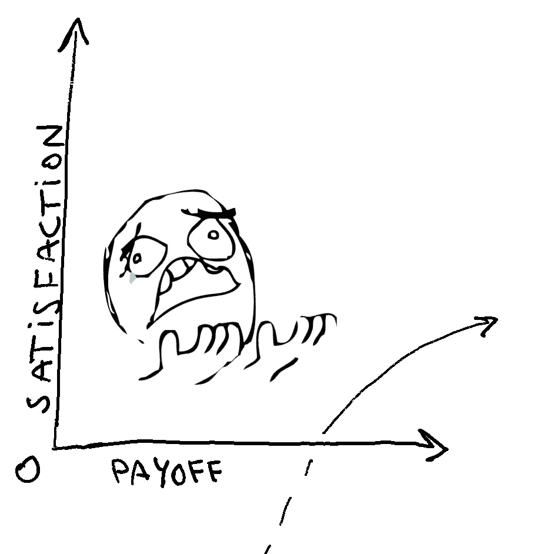
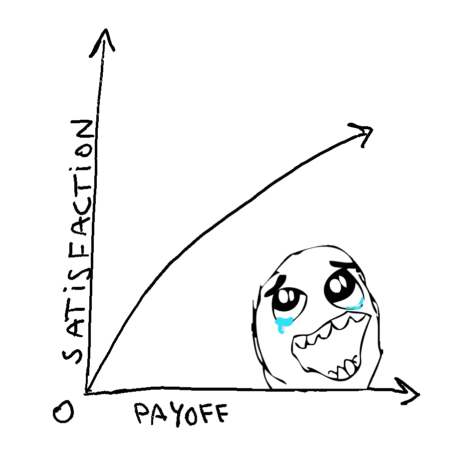

# 不要习惯于科技行业的好时光，它们可能不会持续太久

> 原文：<https://medium.com/hackernoon/dont-get-used-to-the-good-times-in-tech-they-might-not-last-4534a55043fc>

## 专注于你所能控制的东西，量入为出，设定明智的参考点，以此来对冲未来科技领域的糟糕时期

The Golden Gate Bridge going into the fog — © [Joan Gamell](https://instagram.com/jgamell) 2019

我们正处于科技行业的巅峰:我们的薪酬比以往任何时候都高，我们中的大多数人在估值处于历史高点时获得了股权(除非你在优步或 Lyft 工作)，许多人获得了荒谬的津贴。**这是*不是*正常。**几年前不是这样，但我们的记忆非常有限，很快就习惯了好东西。对于刚拿到第一份工作的行业新人来说更是如此，认为一直都是这样。

因此，评估我们的现状，认识到这是技术人才需求远远高于供给的产物，这符合我们的最大利益。就这样，纯粹而简单。这并不是因为我们更好或特别，**我们这些“技术人员”只是碰巧在正确的时间拥有正确的技能，而且绝对不能保证这种情况会永远持续下去**。这种认识让我开始思考我们能做些什么来防范未来可能出现的最坏情况。这篇文章就是成果。

我希望这些节制的话语能传达给一些 22 岁、喝燕麦牛奶的孩子，他们在大学毕业后的第一份工作中赚了 12 万美元以上，对他们来说，失去工作的前景是绝对不可能的。

When you worry about this minutiae, you don’t have actual problems — [@overheardsanfrancisco](https://www.instagram.com/overheardsanfrancisco/?hl=en)

不要误会我的意思，我确实认为技术是未来，从长远来看，这个行业会发展得很好，但是没有人知道在我们到达那里之前会发生什么。现在调整和适应你的心态——当情况好的时候——将证明如果事情变糟了是明智的，就像为地震做准备是一个好主意，即使你不希望地震发生。

# 驯服我们贪得无厌的欲望

我们人类在一个叫做 [*享乐适应*](https://en.wikipedia.org/wiki/Hedonic_treadmill) *的过程中有一种特殊的能力来适应我们周围的环境。*这就是为什么我们总是陷入这样的想法，比如“当我得到那辆[车/晋升/工作]时，我会最终快乐起来”，却没有看到当我们得到它时，我们会**让**适应更好的环境，并将这种新状态作为我们快乐的新基线。

但情况变得更糟:升级(即适应更好的环境)比降级容易得多(加薪、更好的房子、更好的通勤条件)。实际上，享乐跑步机只能单向旋转，所以我们在旋转之前最好三思。

> “我想要十亿美元。令人震惊的是，在五年的时间里，我从对第一笔奖金——4 万美元——感到兴奋，到在对冲基金工作的第二年，我的薪酬“只有”150 万美元，这让我感到失望
> 
> ——山姆·波克，摘自《NYT》的“[为了对金钱的热爱](-%20Sam%20Polk,%20from%20%22For%20the%20Love%20of%20Money%22%20article%20in%20the%20NYT)”一文

无论如何，这都不是一个新问题。几千年来，哲学家们一直在努力解决这个问题，最近的心理学研究证实了这是一个真实的现象。

From Steve Cutt’s magnificent short: [*Happiness*](https://www.youtube.com/watch?v=e9dZQelULDk)

斯多葛派哲学家推荐一种叫做*消极视觉化*的技术来克服这种对生活乐趣的固有适应，并真正欣赏我们已经拥有的东西(重点是我的):

> *“在世界各地，几千年来，那些仔细思考过欲望运作方式的人已经认识到这一点——我们获得幸福最简单的方法就是学会如何想要我们已经拥有的东西。* *[…]*
> 
> *斯多葛派[…]建议我们花时间想象我们已经失去了我们珍视的东西**——我们的妻子离开了我们，我们的车被偷了，或者我们失业了。斯多葛派认为，这样做会让我们比其他时候更珍惜我们的妻子、汽车和工作。”*
> 
> —威廉·布拉克斯顿·欧文。"美好生活指南:古代斯多葛派的快乐艺术."

一些人认为消极的视觉化是可怕的，因为他们认为实践消极视觉化的人是悲观主义者，或者他们是在“呼吁坏事发生”。我觉得不是这样的。对我来说，意识到你所拥有的(包括你的生命)是短暂的，它可能会在任何时候消失，这让我更加珍惜现在和我所拥有的一切，而不是仅仅认为它们会永远存在。

# 知道你能控制什么，不能控制什么

把斯多葛派的推理路线延伸得更远一点，可以得出这样的结论:我们越少把幸福与我们无法控制的事情联系在一起，我们的幸福就越强大。以你的工作为例，我们当然控制着许多影响我们就业的因素:我们学什么，我们面试的公司，我们表现出多少主动性等等。但现实是，我们远远没有控制住局面——只要问问最近被解雇的人就知道了。

Nassim Taleb 将员工的隐性风险与工匠的易变但可见的风险进行了对比:

> 工匠，比如出租车司机、妓女(一个非常非常古老的职业)、木匠、水管工、裁缝和牙医，他们的收入有一些波动，但他们对一只小职业黑天鹅相当稳健，这只黑天鹅会让他们的收入完全停止。他们的风险显而易见。 ***对员工来说就不是这样了，他们没有波动性，但在接到人事部门的电话后，他们会惊讶地发现自己的收入变为零。员工的风险是隐藏的。***
> 
> *——纳西姆·尼古拉斯·塔勒布。“抗脆弱”*

*虽然塔勒布的观点很有道理，但并不是每个人都可以或想成为一名工匠。那我们能做什么？*

*想想你的恐惧，想象更糟糕的事情发生——同样，消极的视觉化——然后考虑你能做些什么来对冲或准备你不能控制的事情。专注于你能控制的事情并努力去做:学习新的语言或技能，开始做一个自由职业者的副业，开始吃得更健康。不管是什么，总比什么都不做，担心自己控制不了的事情好。*

*如果你的恐惧成真，你会尽你所能做好准备，如果没有，你会感到平静，知道你比大多数人更有准备，更糟糕的事情会发生。*

# *量入为出，慢慢适应*

*如果你将来不得不退回到更低的生活水平，量入为出可以最大限度地减少你的痛苦。这也能让你积累一些储蓄，如果经济不景气，你可以利用这些储蓄来维持你的生活方式。*

*没人知道这场科技盛宴会持续多久。它可能会再持续一年，也可能会一直持续到我们退休。不管怎样，你能做的最糟糕的事情就是期待派对会永远持续下去，并且入不敷出。*

*如果你想进一步优化，从同样多的现金中获得最大的“满足感”，试着慢慢适应更好的财务状况，而不是一下子适应。换句话说，**不跳一步地慢慢推进快乐跑步机:**不要在你取出你的 rsu 或你的 crypto 时就买那个蓝宝，而要把钱**逐渐地**花在更小的、增量的东西上。*

*实际上，如果你把钱花在体验上就更好了:也许是一次比上一次稍微奢侈一点的旅行，或者开始时常光顾更好的餐馆，你甚至应该试着捐出一些钱——我们通过帮助别人获得的满足感比我们从物质财富中获得的满足感更持久。*

*或者更好，不花，存起来！*

*同样，我们最终会适应最好的环境，而这种适应大多是单向的，因此，如果你从一个层级的底部(本田思域)一直跳到顶部(兰博基尼)，你就跳过了一堆需要享受的“满足感”。用书呆子的话来说，我们从参观“豪华层级”的所有层级中获得的满足感，比我们跳过任何层级所获得的满足感都要大。*

**

*I hope you enjoy my awful handwriting*

# *明智地选择你的参考点*

*TL；博士:不要在它们孵化之前数你的简历*

*考虑到[甚至招聘人员也将股票和奖金计入总薪酬](https://blog.usejournal.com/how-i-negotiated-a-software-engineer-offer-in-silicon-valley-f11590f5c656)——隐含地假设股票价格和市场环境将保持稳定(或上涨)，人们很容易下意识地认为你的股票和奖金是有保证的。)直到你的期权或 rsu 归属。*

*不过，有一个大问题:股票和奖金远不能保证保值，它们有很大的可变性(是的，即使是在上市公司)。**假设它们和现金一样好只有心理上的负面影响**。丹尼尔·卡内曼和阿莫斯·塔沃斯基用[前景理论](https://en.wikipedia.org/wiki/Prospect_theory)教会了我们很多，它告诉我们，我们倾向于根据参照点*(重点是我的)来评估事物的得失:**

> ***“对于财务结果，通常的参考点是现状，但也可以是你期望的结果，或者是你觉得应该得到的结果，例如，你的同事获得的加薪或奖金。* ***比参考点好的结果就是收益。低于参考点，它们就是亏损。*****
> 
> ***——丹尼尔·卡内曼。“思考，快与慢”***

***不仅如此，损失比收益更能让我们满足。同样，来自卡尼曼:***

> ***第三个原则是厌恶损失。当直接相互比较或权衡时，损失似乎大于收益。这种积极和消极的期望或经历之间的不对称有一个进化的历史。将威胁视为比机遇更紧迫的生物有更好的机会生存和繁殖。”***
> 
> ***——丹尼尔·卡内曼。“思考，快与慢”***

***把这两者放在一起:给定相同的收益，我们会觉得好或者(非常)不好，这取决于我们最初选择的参考点。想象一下，你刚刚与一家私营运输初创公司签署了一份要约，其中包括价值 50 万美元的股权。在那个时候，你有两个选择:随着这家初创公司即将引领历史上最大的 IPO 之一，你可以在心里计算这 50 万美元(或更多！)就好像它们已经是你的了，或者你可以有意识地努力试着“忘记”那些钱，因为它们只是不流通的纸币。***

***如果你不努力把股票从你的心理账户中删除，走上简单的道路，假设你已经富有了 50 万美元，3 年后，当公司首次公开募股，你的股票“只”值 30 万美元(税前)时，你可能会感到非常痛苦。).***

******

***tears of why, or how some Uber employees must be feeling right now***

***另一方面，如果你从来没有考虑过这笔钱，同样的情况会感觉像是 30 万美元*的收益。*请注意，结果是完全一样的:你多了 30 万美元，唯一的区别是你有意识地选择了参考点为**零——什么也不期待**。好吧，这并不像听起来那么容易，你永远也不可能完全忘记一大笔纸币，但是当回报来临时，付出努力会大大提高你的满意度。***

******

***downside completely hedged by setting reference point to 0 — tears of win***

# ***嗅闻气味***

***有些人可能想知道是什么促使我写这篇文章，所以我将以一些你可以思考的开放式问题来结束。就像我们在程序中寻找[代码气味](https://martinfowler.com/bliki/CodeSmell.html)一样，我喜欢寻找和思考“现实气味”,以保持健康的怀疑态度。就像代码的味道一样，它们并不能证明某些东西一定有问题，但是我认为思考一分钟并没有坏处。***

*   ***距离上次衰退已经过去 10 多年了:这正常吗？过去的膨胀周期持续了多长时间？有衰退来临的早期迹象吗？[经济能否永远向上](https://beta.washingtonpost.com/business/economy/is-this-the-too-good-to-be-true-economy/2019/05/03/9f05aff0-6dbc-11e9-8f44-e8d8bb1df986_story.html?outputType=amp)？***
*   ***人们抛弃其他职业，成群结队地转向科技行业，这正常吗？是否可持续？技术工人的需求会跟得上供给吗？***
*   ***海湾地区一栋被烧毁的废弃房屋卖了近 100 万美元，这正常吗？***
*   ***经济学家和政治家能可靠地预测衰退吗？***
*   ***我们认为未来会比实际情况更像现在吗？***

***  I 感谢您的阅读，希望您觉得有用。如果你喜欢它，请**考虑订阅** [ **灰色事件** ](https://graymatters.substack.com/) **🧠** ，这是我与[马里奥·查莫罗](https://medium.com/u/6291e977af46?source=post_page-----4534a55043fc--------------------------------)共同撰写的每周时事通讯，我们在这里讨论生产力、科技、新常态以及介于两者之间的一切。***