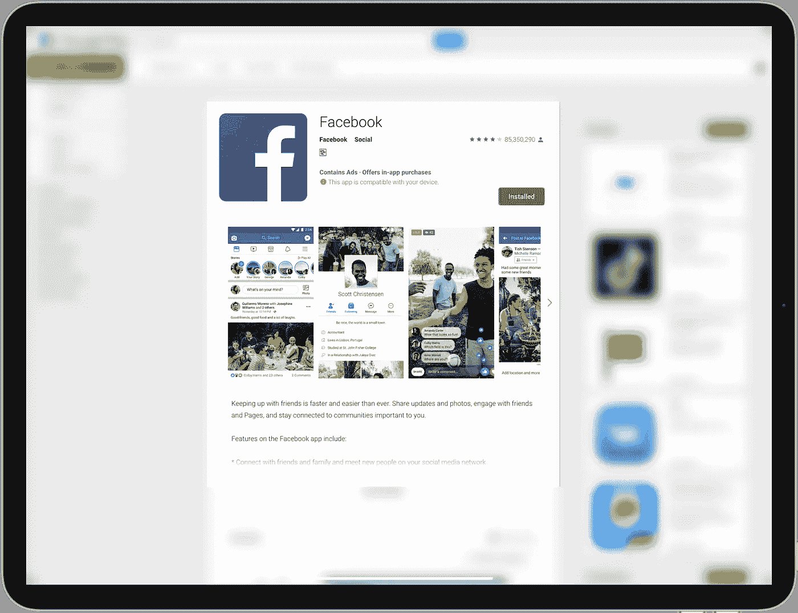
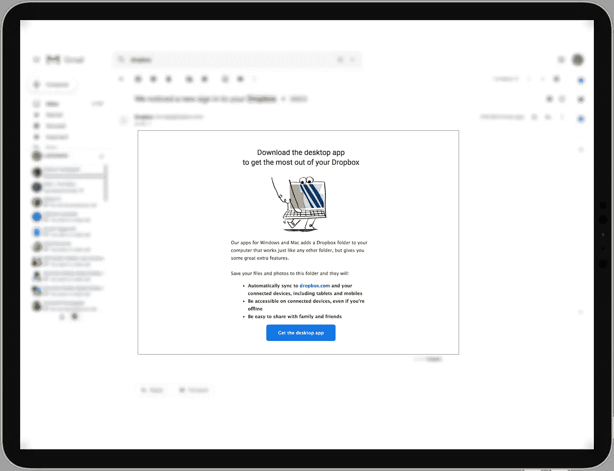
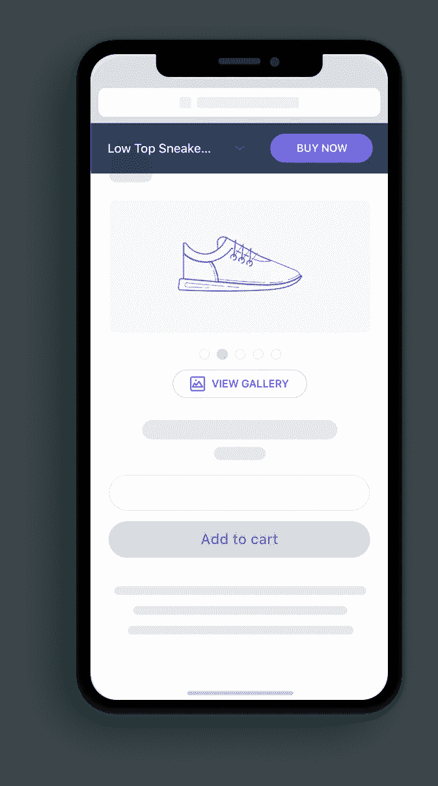
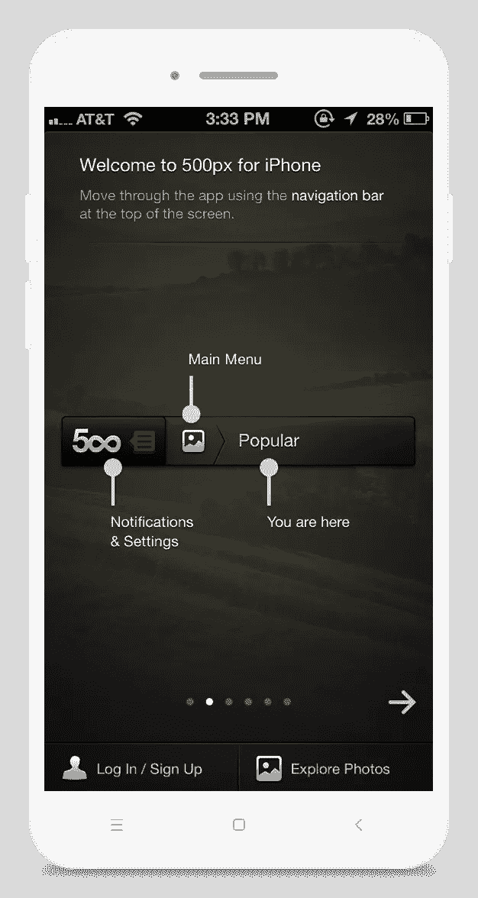
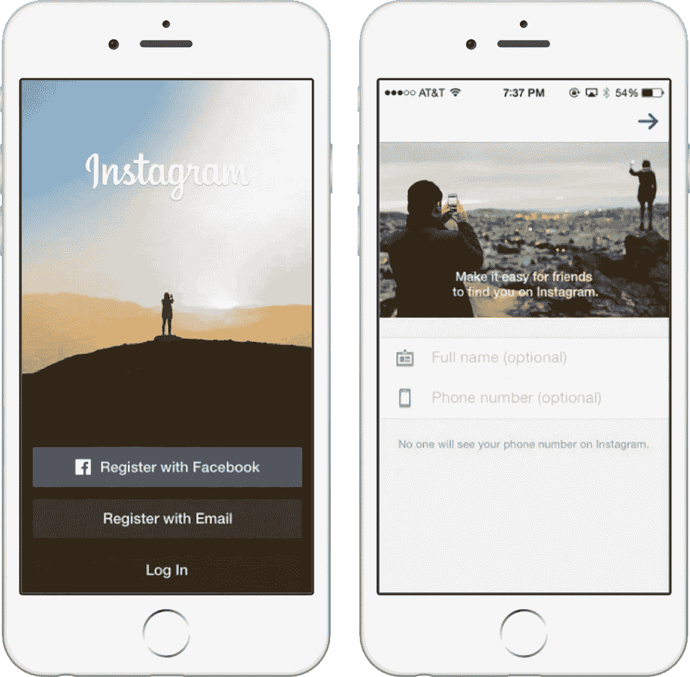
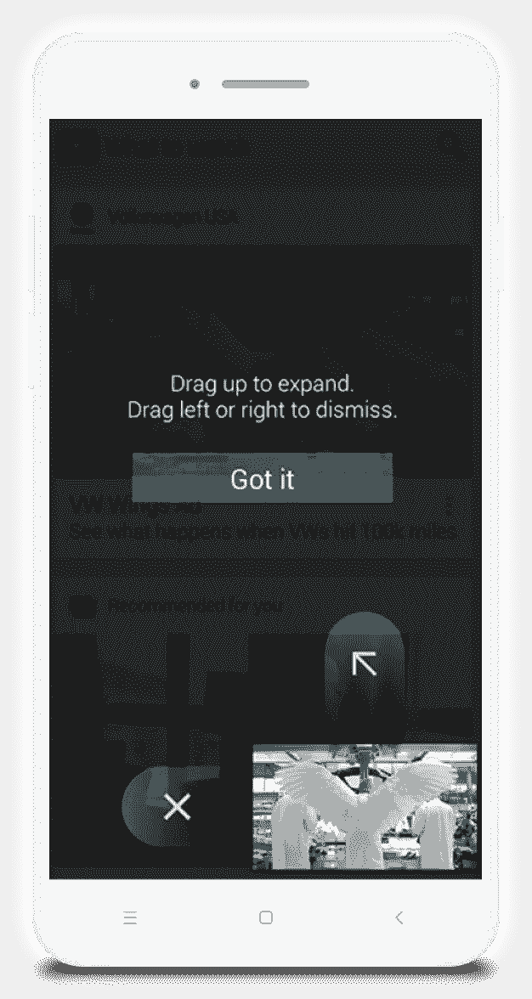
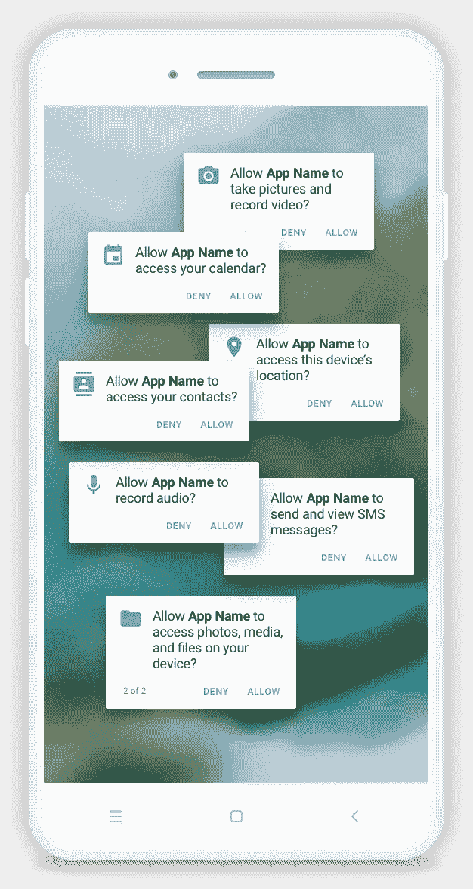
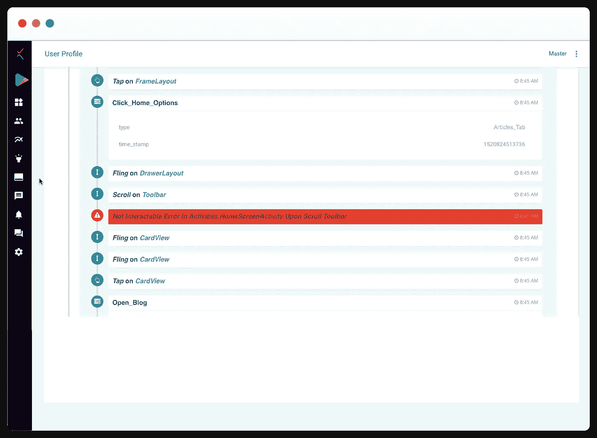
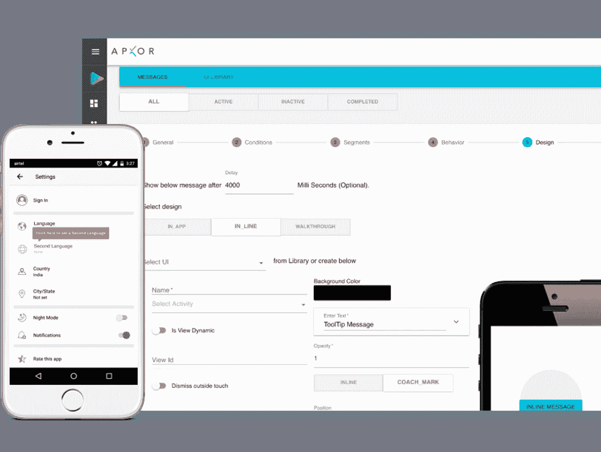

# 着装杀人:改善你的应用首次用户体验的方法

> 原文：<https://medium.com/hackernoon/dress-to-kill-methods-to-improve-your-apps-first-time-user-experience-ftue-4c0957ad7d7a>

在像 Tinder 和 Badoo 这样的约会应用的时代，与一个陌生人约会是非常容易的。然而，这个人在现实中的样子可能与他/她的简介所说的大相径庭。这个人的外貌、衣着/时尚感、行为、表情(微笑、大笑、皱眉)都会在你的脑海中留下第一印象。在第一次见面的时候，你就可以决定你是否愿意再见到那个人。令人乏味的初次见面很少会有第二次。这就是你的应用的首次用户体验的重要性。它让你的用户决定你的应用是否是一个守护者。当第一次用户下载你的应用程序并成为你的用户时，你总是需要“打扮得漂漂亮亮”,展现你迷人的最佳状态。

# FTUE 是如何工作的？

FTUE 或首次用户体验在用户开始使用应用程序之前就已经开始了。app 在 app store/ play store 上的登陆页面，分享的截图，评论，清晰的 CTA，用户看过的创意，这些都共同构成了 FTUE。

例如，Dropbox 会向你的收件箱发送一封可爱的邮件，要求用户下载他们的应用程序。这封邮件的措辞让用户自动准备好在应用程序中享受美好时光。

现在是新用户在应用程序中的体验。正是你提供的这种价值让激活的用户留下来并转化。这进一步转化为留存率、参与度以及用户是否成为冠军(向其他人推荐应用)。

# 改善你未来的方法

FTUE 质量随着每一次非用户友好交互的发生而降低。因此，重要的是找到并纠正在将新用户转化为激活用户的过程中产生摩擦的潜在原因。

FTUE 可以通过参与以下应用程序入门最佳实践来提高:

# 1.有明确的 CTA

首先，一个应用程序需要有非常明确的行动要求(CTAs)选项，如登录、注册或购物是激活用户的要求。他们应该让用户知道他们在哪里，他们可以做什么，他们可以去哪里，他们会得到什么。

# 2.有介绍性的幻灯片或演示

介绍性的幻灯片或演示帮助用户快速浏览并知道会发生什么。同时，太多的幻灯片会导致他们完全跳过它。因此，要让它们对你的用户来说是个性化的、与上下文相关的。

# 3.无缝登录，确保隐私

登录是可怕的瓶颈，用户有更多的机会退出。原因可能是——a)害怕泄露私人信息，b)这个过程需要很长时间。向用户保证他/她的信息将被保密是成功登录的一种方式。另一个重要的方面是保持登录页面简单。只需询问基本信息，并让您的用户快速加入。例如，Instagram 的登录界面非常简单。它还向用户保证保护他们的数据。

# 4.新用户奖金

你可以通过在第一步保持简单来提高你的 FTUE。通过提供奖金或奖励来吸引新用户注册。用户会被诱惑去进一步探索，这导致更好的记忆。网飞提供一个月的免费订阅。它还规定用户可以随时取消。这一令人放心的承诺吸引用户加入订阅计划。由于从那时起提供的质量是持续的，因此留住用户的可能性更高。

# 5.导航覆盖图和蔻驰标记

你的应用程序可以有一个以覆盖图或应用程序内消息形式出现的弹出窗口，建议下一步的行动。快速简单的覆盖图是引导新用户的最佳方式。YouTube 的 Android 应用程序一次只关注一个元素，从而将用户需要阅读的文本减到最少。让教练长时间盯防是绝对不允许的。

# 6.处理好权限和信息

用户可能不愿意一开始就透露太多信息。一开始寻求大量权限的应用程序可能会吓跑用户。仅在需要时寻求特定操作或罕见权限。

Flipkart 就是一个很好的例子。只有在购物时，在线购物应用程序才会搜索您的地址。敏感信息，如信用卡号码等。，仅在用户允许的情况下存储。为了保持无缝的用户体验，Flipkart 更进一步，免除了用户的登录，即使是在购买过程中。

# 使用 Apxor 微调您的 FTUE

很多时候，应用程序所有者/开发者可以推测激活率下降的原因。这可能是要求太多的信息，缺乏培养你的用户，直到他们激活等等。Apxor 帮助开发人员使用其先进的[产品](https://hackernoon.com/tagged/product)分析来验证他们的假设。它有助于你定位和查明 FTUE 不符合你的期望的原因。Apxor 收集用户的动作、每个动作花费的时间、用户交互问题和应用程序的性能，以便在用户被困在你的应用程序中或离开时，让你了解**时间线、**。

入职漏斗有助于根据年龄、地点、性别、兴趣等不同属性对用户进行分类。而分析入职路径有助于根据用户在应用程序中的互动方式来洞察。现在你可以分析和修正可能导致不良后果的不足之处。

# 阿普索的美国药典

让 Apxor 更好的是它能够让你动态创建**教练标记**来推动用户的上下文。您可以随时随地创建教程并提高可发现性。您可以使用 Apxor 创建的演练与您的用户在应用程序中的体验高度相关和个性化。

Apxor 在 FTUE 上取得成功的一个很好的例子是一个社交媒体应用。发现在第 0 天卸载的大多数用户是女性。对这些女性互动的进一步分析显示，原因是陌生人随机连接请求的比率非常高。对于他们来说，这可能是一个非常低的价值产生或相当恼人的体验。通过引导这些妇女进行隐私设置的上下文演练，该问题得到了解决。因此，从长远来看，用户 FTUE 的微小变化可以带来业务的增长。看看这里的演练。