# DuckDuckGo vs. Google:你需要知道的

> 原文：<https://medium.com/hackernoon/duckduckgo-vs-google-what-you-need-to-know-869368b08c4f>

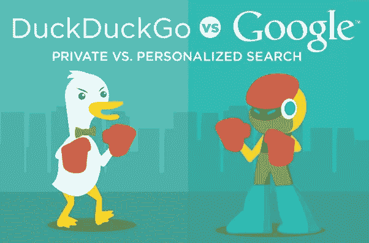

[Adweek: DuckDuckGo vs. Google](https://www.adweek.com/digital/duck-duck-go-privacy-vs-google-personized-search-infographic/)

不可否认，我们还需要几年时间才能看到其他搜索引擎接管谷歌。是的，它已经变得如此之大，让我们如此依赖自己，以至于它不可能这么快就发生。

谷歌通过你的智能设备追踪你几乎所有的活动——尤其是在安卓设备上。你去过的地方，你走过的路，你在每个网站上花的时间，你做的搜索，你点击的产品等等。

如果你正在使用谷歌设备和/或其产品，谷歌是你的后盾。

> 到处都是。一直都是。

(如果你想知道，是的，谷歌知道你昨晚和前天晚上以及一整年都在看什么)

为什么知道这一点对你很重要？

> 告诉我，为什么不呢？这是你的数据。你不和你女朋友分享，你为什么要和别人分享？

在谷歌搜索引擎部分，跟踪数据(搜索/活动)的影响反映在你在谷歌上搜索关键词时看到的有偏见的搜索建议和结果中。

所以，基本上，谷歌用信息轰炸你，它“*认为*”与你之前的活动一致。

这就是 **DuckDuckGo** 的用武之地。这是一个搜索引擎，旨在当你每次使用它的时候，把你当作一个匿名用户。简而言之:它不会跟踪你或你的活动。

> 这意味着你通过 DuckDuckGo 搜索的所有内容都只停留在你和浏览器之间。

DuckDukcGo 的座右铭？

> 简化互联网时代的隐私，并“设定网上信任的新标准”

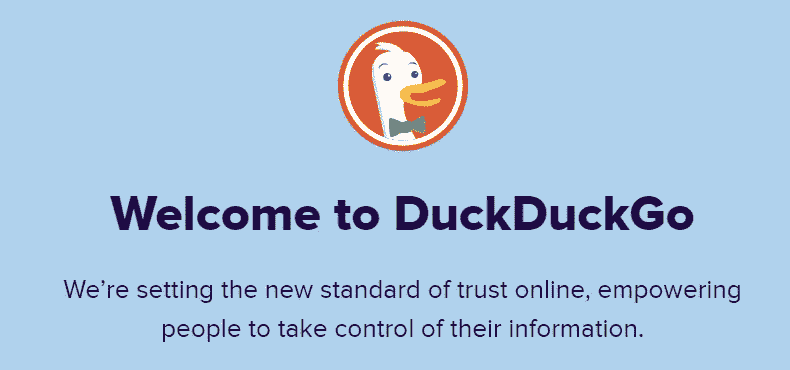

[DuckDuckGo/About](https://duckduckgo.com/about)

# 这些快照说明了一切

如果你想验证这一点，只需在两个搜索引擎上遵循第一到第三步。

1.  打开你的隐姓埋名标签，前往[Google.com](http://google.com)
2.  搜索任何关键字。*我搜索了“* [*内容作家。*](/@mwriterpreneur)
3.  *一旦搜索结果出现，输入不同的词，注意谷歌的建议。我输入了“什么是”、“如何做”、“网站”。就这样。谷歌知道我接下来可能会对什么感兴趣。*

*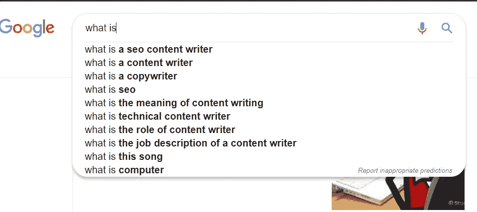*

*[Snapshot Google](https://www.google.com/search?ei=-eVDXJ-sKo6S9QPNhYXQCw&q=content+writer&oq=content+writer&gs_l=psy-ab.3..0l10.917.8511..8676...12.0..2.431.4864.0j7j10j2j1......0....1..gws-wiz.....0..0i71j0i67j0i131j0i10.KBSZocZXjTc)*

*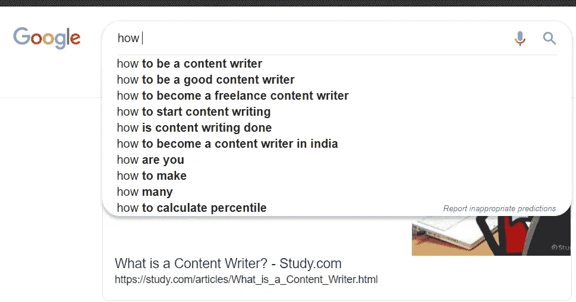*

*[Snapshot Google](https://www.google.com/search?ei=-eVDXJ-sKo6S9QPNhYXQCw&q=content+writer&oq=content+writer&gs_l=psy-ab.3..0l10.917.8511..8676...12.0..2.431.4864.0j7j10j2j1......0....1..gws-wiz.....0..0i71j0i67j0i131j0i10.KBSZocZXjTc)*

*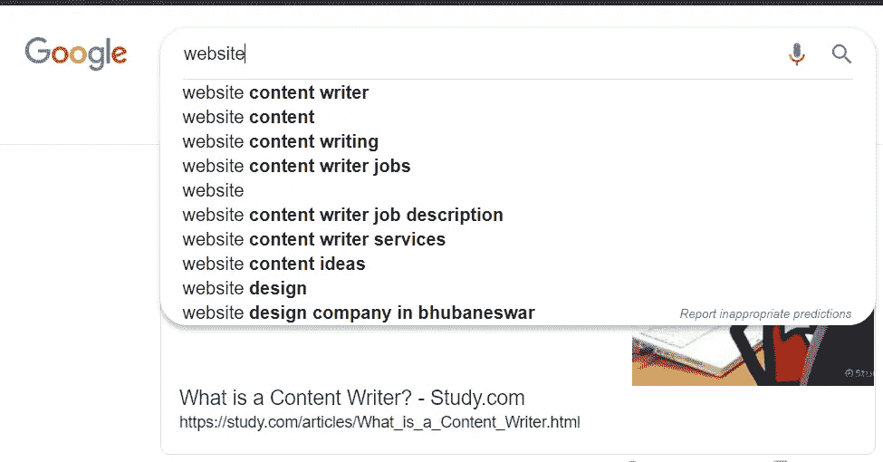*

*[Snapshot Google](https://www.google.com/search?ei=-eVDXJ-sKo6S9QPNhYXQCw&q=content+writer&oq=content+writer&gs_l=psy-ab.3..0l10.917.8511..8676...12.0..2.431.4864.0j7j10j2j1......0....1..gws-wiz.....0..0i71j0i67j0i131j0i10.KBSZocZXjTc)*

> *对 [DuckDuckGo](http://duckduckgo.com) 重复同样的操作。这是结果。*

*另一方面，当你使用 DuckDuckGo 时，它向你展示了一个完全独特的建议，几乎与你之前的搜索没有任何关联。*

*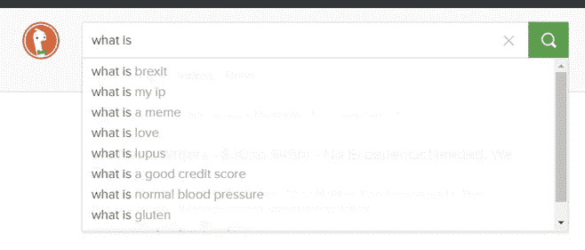*

*[Snapshot DuckDuckGo](https://duckduckgo.com/?q=content+writer&t=h_&ia=web)*

*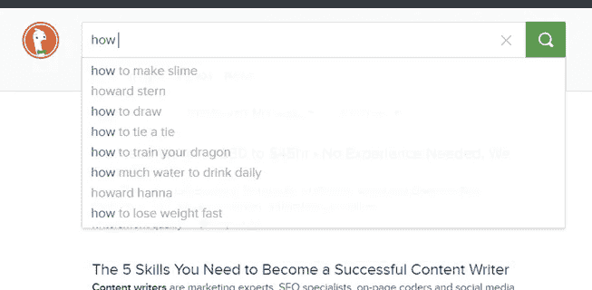*

*[Snapshot DuckDuckGo](https://duckduckgo.com/?q=content+writer&t=h_&ia=web)*

*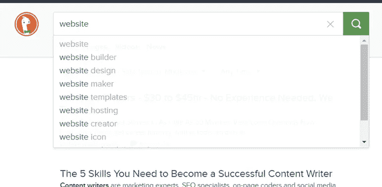*

*[Snapshot DuckDuckGo](https://duckduckgo.com/?q=content+writer&t=h_&ia=web)*

*现在，我想，你更清楚了。*

## *DuckDuckGo 走过了漫长的道路*

*尽管与搜索巨头谷歌相距甚远，但 DuckDuckGo 的增长速度超出了预期。随着平均每年 50%的增长，搜索引擎正在舞台上上演一场精彩的表演。*

*从 2008 年开始至今，DuckDuckGo 在 2019 年的前 20 天里，从平均每天 79，839 次搜索扩展到平均每天 33，964，034 次搜索。*

*下面是 DDG 值得称赞的增长的图表:*

*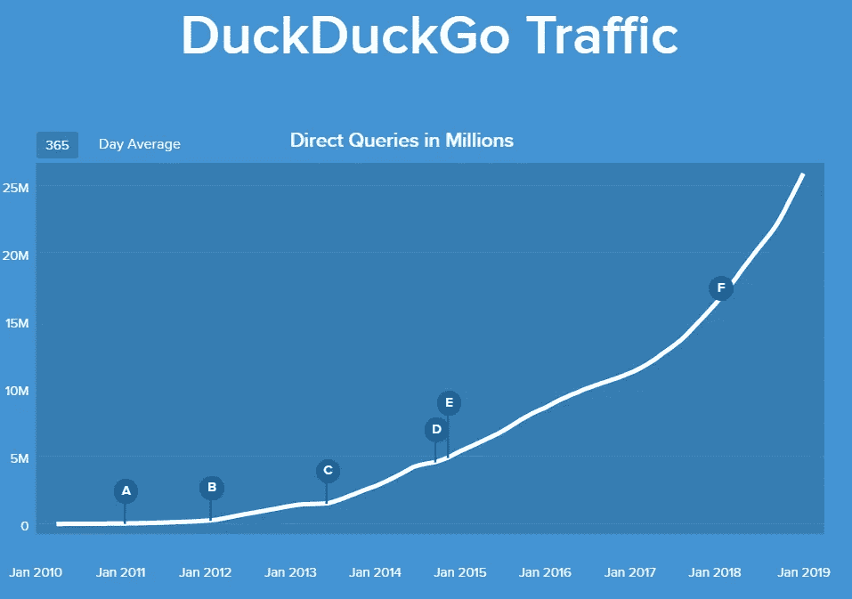*

*[DuckDuckGo Traffic](https://duckduckgo.com/traffic)*

# *这离谷歌有多近？*

*无论是从搜索次数还是总收入来看，DuckDuckGo 与谷歌相比都只是“小巫见大巫”。*

*这里给你做一个简单的对比:DuckDuckGo 一天做的事情，Google 在~12.5 分钟内完成。是的，在谷歌上每 12.5 分钟就有大约 3300 万次搜索。也就是说，每天有 35 亿次搜索，而 T2 每年有 12 万亿次搜索。*

> *可以说，DuckDuckGo 不是谷歌的竞争对手，但当然是一个值得尊敬的对手*

*还有，你不要忘了，比谷歌年轻差不多 10 岁。随着每年 50%的增长和人们越来越意识到数据隐私，未来 DuckDuckGo 的情况可能会发生变化。*

> *至少我希望如此。*

# *利用他们的两个特点来为我服务*

*虽然 DuckDuckGo 希望谷歌彻底消失，但我持不同意见。*

> *我希望他们两个都是。*这才是真正的消费者**

*这仅仅是因为我从他们两个身上获得了好处。*

*如果说我没有受益于谷歌显示的过滤搜索建议和结果，也没有受益于它的其他突出功能，那我就错了。*

*但是谷歌一直显示基于我的位置和搜索历史**—**的结果，而且有时无法关闭它——这让我很不爽。*

> *这是我转投 DuckDuckGo 的唯一原因。*

*作为一名内容作家，我必须对各种不同的主题进行大量的研究。为此，我需要依赖未经过滤的结果，而不仅仅是与我所在位置最相关的结果。*

*在全球范围内寻找潜在的自由职业客户时，DuckDuckGo 也很有帮助，因为它不会过滤我住的地方的任何东西。*

> *如果我在谷歌上尝试，做同样的事情几乎是不可能的。它会不断向我扔出离我“最近”(无论多么不相关)的东西。那可是一卡车的垃圾要处理。*

*还有一些时候，你只是打开你的搜索引擎去探索新的东西。DDG 在这方面也很方便。它收集了全球范围内与你输入的单词或短语相匹配的最热门关键词。在谷歌的情况下，这将是你已经经历了 10 次的同样的老废话。*

*一句话，当你需要**未过滤的、无偏见的结果**时，DuckDuckGo 就是你想要的。*

*有很多例子表明，谷歌让人感觉是一种福气。尤其是因为它的**搜索页面功能**。*

*假设你搜索“**字典**，谷歌会自动在搜索页面上调出一本字典本身。因此，您不必打开并导航到任何其他选项卡。*

*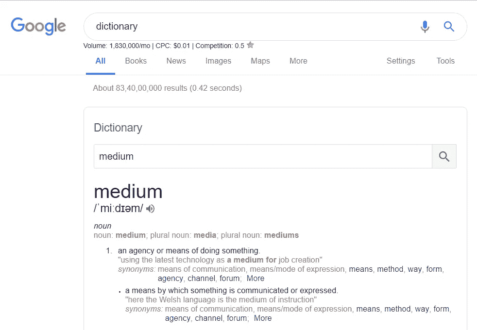*

*[Snapshot Google](https://www.google.com/search?q=dictionary&hl=en-IN&authuser=0&source=lnms&sa=X&ved=0ahUKEwiZjJHwyvvfAhWKbn0KHQdOAfIQ_AUICSgA&biw=1536&bih=723&dpr=1.25#dobs=medium)*

> *这真是太好了。*

*谷歌还掌握了美学组织和向用户展示信息的艺术，以防搜索关键词需要这些信息。例如，当我搜索关键字“**蟋蟀**”时，它显示的是这样的信息，*

*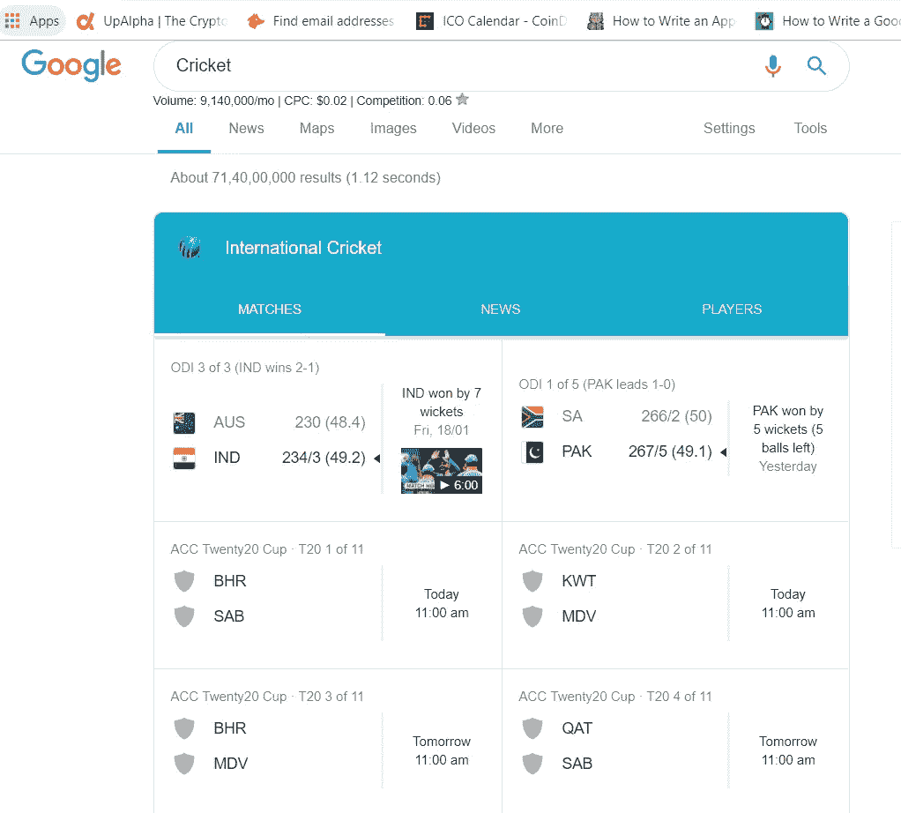*

*[Snapshot Google](https://www.google.com/search?ei=u_5DXMPzK4fRrQHm0ovYCQ&q=Cricket&oq=Cricket&gs_l=psy-ab.3..0i67l5j0i131j0j0i20i263j0i67j0i131.4139.7479..7669...6.0..0.322.2732.0j4j7j1......0....1..gws-wiz.....6..0i71j35i39j0i131i67.AXiUBQxaCeg)*

*那是最近几场板球比赛的时间表。它能变得更有条理吗？*

*此外，如果我想搜索一些当地信息，没有什么可以击败谷歌。嗯，我们确切地知道“如何”，谷歌。我们知道。*

***总之，我想说，对我个人来说，** **这实际上是根据我需要知道的信息在两个搜索引擎之间做出明智的选择。***

*在评论里让我知道你用的是哪个浏览器，你喜欢或者不喜欢它的什么地方？*

*Mohammad 是区块链和加密货币领域的知名技术、B2B 和 B2C 作家。如有疑问，您可以访问 https://www.mohammadmusharraf.com 或发电子邮件给他*