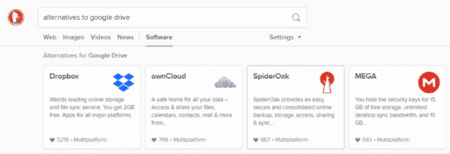

# DuckDuckGo 的独特之处

> 原文：<https://medium.com/hackernoon/duckduckgos-unique-features-f928ba1f5f49>

在 DuckDuckGo 的早期，它被视为谷歌的“精简”版本。隐私倡导者开始关注谷歌除了搜索引擎之外的一长串其他 T2 服务。谷歌曾经干净简单，但现在已经被广告和其他问题所覆盖。尽管 DuckDuckGo 曾经是一个非常简单的元搜索引擎，但在过去几年里，它已经变得[特别功能丰富。](http://techland.time.com/2011/06/16/duck-duck-go-the-in-n-out-burger-of-search-engines/#ixzz1PXPmPOeK)

# 即时回答

许多 DuckDuckGo 搜索包括“即时回答”，它直接在搜索结果页面上给你问题的答案。搜索引擎从 100 多个来源中提取即时答案。根据它的[开发者页面](https://duck.co/ia)，DuckDuckGo 有超过 1200 个即时答案。这些答案包括编码小抄、游戏和缩写。

# 大量其他嵌入式答案

## ！刘海

！Bangs 让你直接从 DuckDuckGo 搜索其他网站。例如，键入“！亚马逊”，你可以搜索亚马逊，而不必先导航到 Amazon.com。如果 DuckDuckGo 被设置为你的主页，这将是一个非常有用的工具。但是，我们不得不指出的是！刘海不是“私人”搜索。即使您从 DuckDuckGo 搜索，您的搜索也会通过您正在搜索的网站。这是一个便利的工具，但是失去了 DuckDuckGo 的隐私保护。根据它的信息页面大约！刘海，有超过 12，000 个刘海，这个数字还在不断增长，因为任何人都可以[添加一个！砰地一声躲开了。](https://duckduckgo.com/newbang)

## 下雨了吗&天气搜索

在 DuckDuckGo 上，你可以搜索“是否在下雨”，它会告诉你你所在的位置是否在下雨。对于其他私人搜索引擎，这将是一个问题。找出用户位置通常会引起隐私问题，但 DuckDuckGo 这样做时不会将您的 IP 地址存储在其服务器日志中，也不会创建唯一的 cookies。虽然这个功能看起来很基本，但它是其他私人搜索引擎不经常包含的。对于偏执的互联网用户来说，这个功能可能是一个问题，因为它确实使用 IP 查找来确定您的大概位置。例如，Startpage 不包括当地的天气结果。这对任何寻找天气结果的人来说都是一个额外的步骤，但它坚持“隐私”的说法，即搜索引擎不需要你的 IP 地址来提供有用的搜索结果。

# 快捷键

DuckDuckGo 的另一个便利特性是许多键盘快捷键。这让你不用离开键盘就能浏览搜索结果页面。您可以使用这些快捷方式打开选定的结果或在后台打开该结果。来自 DuckDuckGo 的[帮助页面](https://help.duckduckgo.com/duckduckgo-help-pages/features/keyboard-shortcuts/):

**打开结果:**

*   输入或 l 或 o —转到突出显示的结果，或者立即使用它转到第一个结果
*   Ctrl/Cmd+Enter —在后台打开结果
*   d-域搜索(如果结果突出显示)
*   或 v —在新窗口/选项卡中打开突出显示的结果。由于这使用 JavaScript，您需要首先关闭弹出窗口拦截器。

**走动:**

*   ←和→ —导航即时回答选项卡。当即时答案打开时，在即时答案中导航。
*   ↓或 j —下一个搜索结果
*   ↑或 k —先前的搜索结果
*   /或 h —转到搜索框
*   s-转到拼写错误的链接(如果有)
*   t —转到顶部
*   m-转到主结果

# 地图搜索

如果 DuckDuckGo 确定某个地图与您的搜索词相关，它将使用 OpenStreetMap 返回一个地图。然后，你可以从许多提供商(苹果地图、谷歌地图、必应地图、HERE 地图)中选择从一个地址到另一个地址的路线。DuckDuckGo Maps 可以在地图上查找地址，但不提供内置导航。由于您必须到第三方获取路线，因此您的位置可能会与您选择的提供商共享。

这是一个隐私问题，需要更明确的公开。由于 DuckDuckGo 没有谷歌、必应和其他搜索引擎使用的追踪功能，你需要输入一个城市、一个地址或另一个位置，才能获得你具体位置的地图。

# 嵌入式社交媒体档案

如果您搜索一个品牌或一个人，DuckDuckGo 会找到他们的社交资料，并将它们嵌入到您的搜索结果中。这是一个有用的工具，可以从一个品牌或其他帐户获得最新的更新，而不需要去 Twitter。

# 软件搜索

DuckDuckGo 有一个搜索功能，当你搜索“替代 _____”时，它会给你一些替代服务。这些服务并不都是“隐私友好的”,但这个功能是找到主流软件和互联网工具的隐私替代品的好方法。

# 链接缩短和扩展

你可以在 DDG 的搜索栏中输入“shorten[你想缩短的网址]”，它会返回一个使用 [is.gd](https://is.gd) 的缩短链接。Is.gd 非常简单，并且是隐私友好的，特别是与其他链接缩短程序如 Goo.gl 或 bit.ly 相比。

# DuckDuckGo 有很多很棒的功能，但是…

虽然这些功能确实让 DuckDuckGo 从竞争对手中脱颖而出，但它似乎已经忘记了自己的核心目标:**隐私**。许多这些功能增加了便利性，但以牺牲隐私为代价，而隐私是 DuckDuckGo 的首要价值主张。比如说，加法！bangs 允许人们直接从 DuckDuckGo 搜索谷歌和其他一些非私人网站。没有足够明确的警告，使用谷歌！砰的一声，就跟你去‘www . Google . com’然后从那里搜索完全一样。人们很容易得到这样的印象:他们的搜索是隐私的，因为他们使用了！砰，尽管事实并非如此。

DuckDuckGo 的天气搜索是另一个以牺牲隐私为代价增加了*便利性*的工具。这是谷歌早期陷入的类似陷阱。为了提供更友好的用户体验，它增加了更多的功能。其中许多功能需要关于人们如何与谷歌互动以及他们的需求的数据。如果 DuckDuckGo 打算自称为私人搜索引擎，它应该把隐私放在第一位，即使这意味着它不能提供与谷歌或脸书同等水平的可用性。如果你想让你的数据不落入谷歌之手，DuckDuckGo 是一个可靠的选择，但如果它提供！带你到谷歌和谷歌地图链接的刘海，它没有做它的工作。

# DuckDuckGo 的替代品

*   [**Search Encrypt**](https://www.searchencrypt.com/)**——**Search Encrypt 使用本地加密，因此您的搜索不会被网络上的其他人看到。其 [AES-256 加密](https://choosetoencrypt.com/privacy/how-search-engines-encrypt-your-data/)是加密的行业标准，也是最安全的标准之一。它有许多与其他私人搜索引擎不同的特点。
*   [**start page**](https://hackernoon.com/untraceable-search-engines-alternatives-to-google-811b09d5a873)**——**start page 在欧洲尤其是德国最受欢迎。这是一个私人搜索引擎，其搜索结果来源于谷歌，但消除了跟踪和存储你的数据。Startpage 明显比 DuckDuckGo 或 Search Encrypt 简单，功能也不丰富。

有许多其他的私人搜索引擎坚持他们最大的焦点，隐私。如果人们想要方便，但必须为他们的数据付费，那么他们可能会继续使用谷歌的数据收集引擎。如果你想要隐私，你应该使用真正把隐私放在第一位的搜索引擎。

*原载于 2019 年 5 月 15 日*[*【https://choosetoencrypt.com】*](https://choosetoencrypt.com/search-engines/duckduckgo-features-that-make-it-unique/)*。*