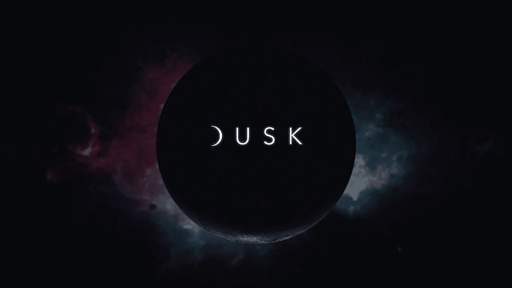
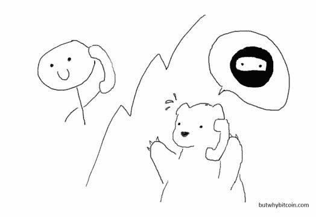
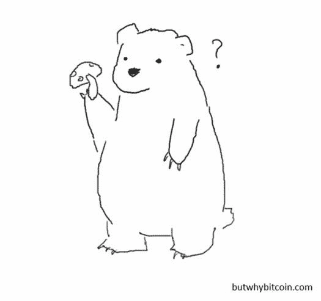
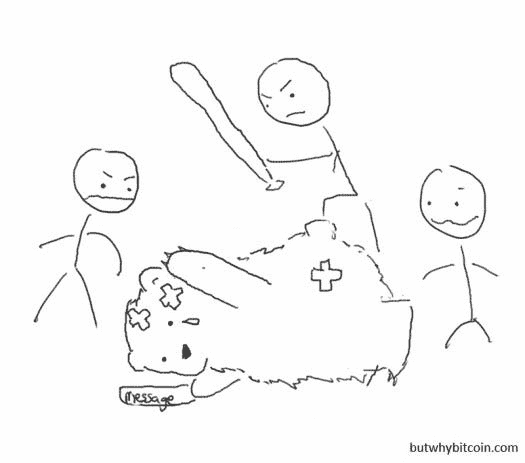
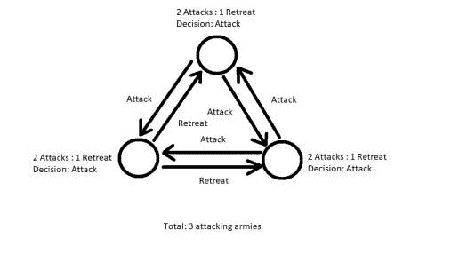
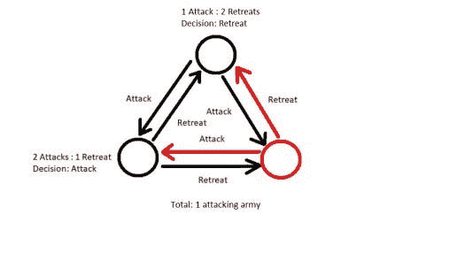

# 黄昏网解释道

> 原文：<https://medium.com/hackernoon/dusk-network-explained-eb669bd53eda>

你有没有听说过黄昏网络，并试图阅读他们的白皮书，但读完第一页后感到失落？我试着简化一下，向你解释黄昏网络是如何利用新技术打开安全市场的。如果你喜欢，请看看我在 https://butwhybitcoin.com 的更多故事

一个新的加密货币项目是黄昏网络，它试图将以太坊的效用和 Monero 的隐私结合起来。

如果你熟悉以太坊，那么你会知道世界各地正在发生的被称为**初始硬币发行** (ICO)的现象。如果你不幸有机会在厨房餐桌上听到人们吹嘘在 2017 年底用加密货币在几周内赚了超过 10 倍的钱的故事，那很可能是通过 ICO。

事实上，我自己第一次认真研究 ICOs 是在我的表弟告诉我他进入的一个名为 WABI 的投资组合时，该投资组合最终从 0.24 美元(公开利率)飙升至 5.39 美元的峰值，在一个月内获得了 22 倍的回报。当然，这一高峰并没有持续，突显了这一领域的风险。

这个概念本身来自“正常的”**首次公开募股** (IPO)，这是由私人公司完成的，向公众出售公司的股份或部分股份，以筹集资金来发展业务。ico 的类似之处在于，公司出售他们将创造的硬币总量的一部分，最终用于回报公司未来提供的服务。

一个简单的例子是，一家航空公司建立了 100 万个忠诚飞行常客积分，并向公众出售了其中的 50 万个积分。通过使用**区块链**并以这种方式设置点数，向客户保证点数实际上是有限的，不能凭空创造更多点数，稀释您当前持有的点数价值(**通货膨胀**)，这类似于创造比特币是为了用钱解决的问题之一。

然而，ico 和 IPO 之间有一些关键的区别。

# IPO 和 ico 有什么区别？

## 这些服务还不一定存在。

因为这些公司中的许多都是为他们的项目筹集资金的初创企业，所以他们提供的服务即使能提供，也不太可能在未来几年内可用。这些代币基本上是你可以转售的借据，只有在公司成功的情况下才有用。

## 你不拥有公司的任何部分或其资产。

对于首次公开募股，你实际上是购买了公司的一部分，包括它的资产和利润。你对公司的运营也有发言权，即使你的发言权很小，因为这种权力是由股份数量来分配的。对于 ICO 来说，情况并非如此。你无权分享他们的收入，他们也不必听取你对他们应该如何经营业务的意见。如果他们最终真的破产了，你没有权利要求任何赔偿。

## 信息不需要公开。

一家私营公司一旦上市，就会失去很多好处。他们现在被迫披露财务报告，并且必须有一个董事会。他们必须向所在国的相关管理机构报告，例如美国的证券交易委员会(SEC)。作为一家已经完成 ICO 的公司，他们没有必要做这些事情(至少目前如此)，因为他们仍然是私人公司。

# 那么为什么会有人投资 ico 呢？

尽管存在所有这些风险和明显的劣势，但 ico 在 2017 年大受欢迎，一些项目甚至独自筹集了数十亿美元。那么到底是什么优势吸引这么多人投资 ico 呢？

# 答案是利润和流动性。

所有投资者都被高回报的投资所驱使，相对容易地兑现这些硬币和代币的能力使其非常有吸引力。快速获得新铸造的硬币意味着投资者可以迅速获利，在短时间内成倍增加他们的资本。我的意思是谁不喜欢现金流好赚钱快？

由于 ico 的需求，ico 的主要平台以太坊(Ethereum)从 2017 年初的 7 美元迅速跃升至 2018 年 1 月的 1432 美元。这是一年时间内 200 倍的回报率。在 ICO 活动的高峰期，我记得听到有人抱怨说，每隔几周将他们的资金乘以 3-5 已经不够了。这就是期望值提高的程度，也是为什么这一切必须改变的原因。

# 为什么一切都在改变？

随着 ico 越来越受欢迎，欺诈和快速致富计划很快在整个空间盛行。快速致富计划，专门针对那些希望快速致富的人。项目承诺了巨大的回报，却没有一个可靠的商业计划或除了一份白皮书(一份应该提出问题并详细说明解决方案的报告)之外的任何东西。有些甚至连这都没有。这很快引起了监管机构的注意，随之而来的是对新项目和现有项目的更严格的要求。

# 输入安全令牌产品(STO)

虽然 ico 出售硬币或公用代币，这些东西可能没有价值，但安全代币是由公司资产支持的，如股票、收益、投票权或其他有价值的东西。这使它更接近于其他现有的投资产品。假设即将实施的法规与 IPO 面临的法规相似，以太坊将无法满足这些条件。

# 以太坊为什么不能托管 sto？

在许多主要国家，内幕交易是非法的。这基本上意味着，对于了解公众不知道的上市公司信息的人来说，他们不允许根据这些信息交易股票或证券。**这包括竞争对手的股票或证券**。这些人通常是董事、大股东，如果是初创企业，还包括**的所有员工**。

由于以太坊和其他常见的 ICO 资金平台如 NEO、ICON 等的公共性质，所有的投资交易对每个人都是可见的。有人可能会说，因为交易是公开的，所以不构成内幕交易，因为信息是公开的。然而，考虑这样一种情况，一个著名的投资基金可以利用这种公开信息来操纵市场，传播他们正在对某个项目进行大量投资的事实。由于他们名字的影响，价格会上涨，一种形式的**市场操纵**。

缺乏身份验证。由于法律问题，一些国家被禁止参加 ico。目前唯一的解决办法是通过第三方网站或服务在区块链境外审查这些人。但是，这并不意味着参与 ICO 的人一旦被验证就一定是那个人。

# 进入黄昏网络

黄昏网，还是那句话，和比特币一样是互联网货币。然而，与它最终将以智能合约为特色不同，以太坊拥有的智能合约允许开发者编写特殊程序并将其放在区块链上，更重要的是托管 ico(或在这种情况下，sto)。

# 什么是智能合约，它们有什么作用？

如果你已经知道什么是智能合约，可以跳过这一部分，但是为了其他不知道的人的利益，我将给出一个快速的介绍。合同的基本存在是为了确保两方或多方履行其条件。例如，你和你工作的公司之间可能有一份合同，他们必须为你的服务向你支付 x 金额。它消除了信任的必要性，信任在进行交易的人之间可能不存在，尤其是在他们彼此不认识的情况下，因为它是由法律强制执行的，违反它会有后果。

智能合同是一个类似的概念，然而，它不是由律师编写和起草的，而是由程序员编写的，不是由法院执行的，而是由区块链和所有运行它的人执行的。

像真正的契约一样，智能契约的用途可以非常广泛，并且只受程序员知道如何编写的限制。例如，我总是对从网上购买东西心存疑虑。我敢肯定，许多人在第一次购买时都有同样的恐惧，“如果它永远也不会到来怎么办？”，'如果它坏了怎么办？'，‘如果是错的呢？。我的想法是我们有像 PayPal 这样的第三方中介的原因，当出现问题时，他们会给你退款。但是如果我们有智能合同呢？

通过将您的付款发送到智能合约中，它将被锁定，直到满足释放条件。在这种情况下，您的包裹的跟踪状态可能会从“运输中”更改为“已交付并已签名”，如果在特定天数内未能满足，将会向您退款。因为这都是由一个程序自动执行的，特别是由一个代码对公众可见并且不能被修改或删除的程序(区块链的所有功能)，所以很少依赖于应该站在你这边的 Paypal 客户代表的情绪。

这只是智能合约用例的一个例子，还有很多，以太坊和区块链科技催生的许多项目就是证明。已经有一些项目使用智能合同来处理贷款、销售和购买流程、租赁、游戏内容，当然还有它目前最大的用例，筹集资金。我必须再次重申这一点，因为这只是事情的开始，可能性真的只受我们的想象力的限制。

对，那黄昏网络和以太坊有什么不同？

# 黄昏网络是面向隐私的

区块链的隐私并不是什么新鲜事。其实已经有 Monero 了，基本就是比特币的私人版。然而，Monero(以及比特币)目前缺乏智能合约的功能。这就是暮光网络试图将两者结合起来的地方。

# 可替代性

这可能是一个显而易见的问题，但我们为什么需要隐私？抛开你堕落的爱好或在那些本不该公开的事物上花费的需求，货币需要是可互换的。不，我们不是在说真菌或者你买的那些东西。可替代性意味着任何单个单位的货物或商品都需要与其他单位的价值相同。换句话说，我手里的美元需要和你手里的美元或者其他任何美元(同类型)价值相等。

现在，如果你和我一样，随意地把纸币揉成一团，塞进我的口袋，只是为了让它在几周后像一张用过的纸巾一样出现，可替代性是一个救命稻草，否则我现在就住在街上了。事实上，多亏了这条规则，你可以把撕碎的钞票换成新的，即使剩下的不到 50%。不，你不能把它撕成两半，然后换成两个全新的，或者把不同音符的片段粘在一起，然后交换(我知道，我很失望我的天才策略没有奏效)。

但是加密货币是数字化的，所以它们怎么可能比另一种货币更不值钱呢？由于比特币和其他非私人加密货币的完整历史向所有人展示，最终，由于可疑的爱好和犯罪，这些东西将追溯到硬币。现在，一些组织或个人(想一想政治家)不想与这种事情联系在一起，正因为如此，这些硬币的价值对人们来说会更低。

现在这是一个问题，因为钱的目的是让交易更容易，而价值的不平衡只会让事情变得更难。真正的纸币有这样的好处，你不知道它曾经穿过谁的衬衫，也不知道它被用来支付什么商品，因为没有它的历史记录。这就是区块链需要隐私的地方。

# 隐私币如何保持私密？

如果账本的全部意义在于人们不能复制硬币，那么它怎么能保持私密呢？如果它是私有的，人们如何验证或审计它呢？

要做到这一点，需要做几件事情。

## 秘密地址

为每笔交易创建一次性随机地址。想想每次收到邮件时使用不同的转发地址。所有收到的款项仍然会寄到你的地址，但是除了你以外，没有人能看到你收到了多少邮件，来自哪里。支付并不链接回公共地址或交易地址，因此这个名字的秘密部分。当然，如果发生这种情况，你如何看到自己的交易或让别人审计它？对此的解决方案是拥有三个不同的密钥。

创建钱包时，您将像往常一样收到一个公钥，但不是只有一个私钥，您将同时拥有一个**私人查看密钥**和一个**私人消费密钥**。单独的密钥可以用来做顾名思义，结合两个私人密钥将导致您的地址。私有视图键可用作只读地址，用于记帐和审计目的。

## 环签名保密交易

当你在比特币和其他公开的区块链上进行交易时，只有一笔交易是可以轻易验证的。然而，这也使得它很容易被追踪，因为它会在区块链上留下永久的书面痕迹。有了 Monero 这样的隐私币，**环签名**是一种创建被称为**输出**的诱饵交易的方式，这些交易是使用发送者的账户密钥和从区块链获取的诱饵密钥进行的。

发送交易变得像一个小组练习，参与的诱饵地址的数量被称为**环签名大小**。这些地址被捆绑在一起，有人为其他人签署交易，就像联名账户一样。当与禁用交易历史跟踪的秘密地址结合使用时，很难看到交易的去向和真正发送交易的人，从而使所有涉及的地址都有可能被拒绝。就像当老师问是谁扔的纸团，但你们谁也没说……而你的同学不断地变成其他人。

更进一步的是环签名保密交易，它也隐藏了发送的数量和目的地。这是如何工作的可以用一点数学来演示。我们可能已经有一段时间没有接触代数了，所以让我们保持简单。如果我有 100 个黄昏，想给你发 50 个黄昏，我的交易会如下:

输入:100 黄昏
输出 1: 50 黄昏给你
输出 2: 50 黄昏给我作为改变

然而，你我之外的所有人只会看到这样的东西:
输入:10x
输出 1: 5x
输出 2: 5x

显然，交易比这更复杂，因此更难确定金额是多少。然而，使用这种诱饵交易的缺点是，随着时间的推移，区块链会迅速变大。与比特币相比，大约增加了 8 倍。

最终，Dusk Network 将转向 **Bulletproofs** ，这是一种**零知识证明**(一种在没有任何知识的情况下确定某事为真的方法)，这将通过确保存储在交易中的信息不包含任何不必要的信息(如诱饵交易)来进一步缩小规模。这使得交易规模更小，速度更快，Monero 最近已经实现了这一点，降低了超过 95%的网络费用。

所有这些功能都是目前其他加密货币中存在的。那么《黄昏网络》带来了哪些新功能呢？

# 匿名网络层

当数据在互联网上到处发送时，它遵循一套被称为**协议**的规则和指令，为了确保你正在发送的数据不会泄露给不打算发送的人，**加密**是必要的。

几个世纪前，当战争期间的信息由人工传递时，许多信息会被敌军士兵截获，计划和策略被泄露。因此，加密标准得到了更广泛的应用。你可能熟悉凯撒密码，这是最早的加密形式之一，在这种情况下，你的信息中的字母被字母表中更靠后的数字所代替。

比如:
黄昏网

通过两个字母的移位变成:
BSQI LCRUMPI

这很容易用手破解，所以随着计算机的引入，更难的算法被创造出来，所以人类很快就无法破译它们。

然而，虽然我们有许多能够加密的协议，但它们通常不太考虑用户的隐私。在大多数情况下，你的 IP 地址，一个你的电脑的在线标识符，会被泄露。虽然在大多数情况下，唯一可以提取的信息是您的大致位置，但在某些情况下，您的个人信息可以从您的互联网服务提供商处提取。作为一种解决方案，Dusk Network 提出了匿名网络层，以便在其网络上实现完全匿名。

## 大蒜路线:确保它不能被追溯

你可能听说过**洋葱路由器(Tor)** ，人们可以匿名浏览互联网。Tor 网络是一个由服务器组成的网络，它会像一个巨大的弹球机一样，通过移动你的请求来隐藏你的身份。任何试图跟踪它的人都只能看到来自其中一个节点的流量。把你的请求想象成一个盒子，里面有东西。然后，这个盒子用礼品包装纸(很像洋葱)包装多次，并传递给某人。然后，这个人打开一层，露出一张卡片，告诉你把它传给哪个人。最终，当这些层用完时，它会到达真正的人手中，他会发现里面是什么。

通过使用**隐形互联网项目(I2P)** ，一个 15 年前发布的由志愿者更新和维护的免费开源项目，黄昏网络将洋葱路由扩展到**大蒜路由**，将消息聚集在一个盒子里(像蒜瓣一样)，使追踪消息的来源更加困难，并提高了数据传输速度。那些信息，每一条都有自己的发送说明，只是在最后才被披露。

然而，I2P 的一个局限性是它是单向的(数据单向传输),这适合于一些使用情况，如流式传输或发送消息，但不适合于数据需要同时双向传输的情况，如音频或视频呼叫。这就是 Dusk Network 偏离并实现双向路由以实现该功能的地方。

最重要的是，它能够提供匿名文件下载和通信，包括使用相同方法的音频和视频流。这是通过连接到一个**凭证种子节点**来实现的，该节点列出了所有活跃的 Dusk 网络节点，连接到一个节点并向前发送数据。

等等，如果这些数据在节点间传递，它们不会有这些信息的副本吗？如果任何有节点的人都可以接入它，它将如何保持通信安全？

## 安全隧道交换:保持通信安全

当进行音频或视频通话时，您希望通过网络上的多个节点联系的人可以使用一条通信线路。当你被通信的时间超过一定量时，一条新的通信线路被打开，两条线路都保持打开，直到它们同步，这个过程被称为**位匹配**，此时旧线路被关闭。随着通信的继续，重复这个过程。这与使用许多不同的手机和号码并在通话过程中进行切换没有太大区别。以这种方式，增加了保密性，没有节点持有超过一定量的加密通信，也不会容易受到网络上的目标攻击。

## 隔离拜占庭协议:工作证明(PoW)和利益证明(PoS)有什么问题？

在比特币使用**工作证明**来保护区块链的地方，我们现在知道它是极其低效的。现在这样做是有目的的，目的是让网络上的攻击变得极其昂贵，从而使网络更加安全。然而，这不是成本有效的，并且对环境有害，因此可以预期的是，法规可以进来抑制它。因此，一些货币转而使用**股权证明**。现在，利害关系证明是**共识**的一种不同类型的方法，使用不同的标准集(如持有硬币的年龄或钱包持有硬币的数量)选择将决定链上下一个区块的节点。当然，正如你可以想象的那样，这只会让富人更富，因为他们获得了对网络的更多控制，因此违背了去中心化的目的。

那么你该如何着手呢？黄昏网络提出了一种新方法，称为**隔离拜占庭协议**。听起来像一口不是吗？这到底是什么意思？名字来源于拜占庭将军问题，一个协议问题，一群将军指挥拜占庭军队(东罗马军队)的一部分包围一座城市。每个将军都有进攻或撤退的选择，但重要的是，将军们要在一个选择上达成一致，否则只有一部分军队会进攻并遭受惨败。

通常这是一个很容易解决的问题。如果有奇数个将军，他们只需要互相提交他们的选票，然后把选择汇总起来。然而，让问题变得复杂的是，一些将军是故意误导军队的叛徒。因为将军们是分开的，因此需要单独联系，一个卖国的将军可以给一半的将军发送一个“攻击”投票，给另一半的将军发送一个“撤退”投票，导致一半攻击，另一半撤退。

如果不够复杂，没有一个将军会亲自发送消息(否则当将军还有什么意义？)，因此我们必须考虑到每个将军的使者也有可能背叛。

因此，最初提出的解决方案是引入中尉，而不是所有的将军。这些中尉，如果忠诚，将永远听从将军的命令。很快，一些关于执行什么命令的问题就减少了。有三个将军，如果一个是叛徒，两个军队会收到错误的命令。然而，在 1 名将军和 2 名中尉的情况下，如果中尉是叛徒，只有 1 支军队会有错误的命令。然而，如果碰巧将军是叛徒呢？那么我们仍然有一个问题，我们将继续有这个问题，而超过 1/3 的将军是叛徒。

在黄昏网络中，将军扮演**供应人**的角色，中尉扮演**节点**的角色。希望成为供应方的节点必须在系统中提交并锁定最小量的资源，该系统被称为黄昏系统，类似于利益证明系统，以便在网络中命令更多的权限。如果从人才库中被挑选出来成为委员会的一员，那么他们就负责帮助核实区块(**验证**)，选择下一个区块(**投票**)以及阻止欺诈(**公证**)。作为回报，他们会得到稳定的黄昏回报，作为帮忙的收入。

另一方面，常规节点只处理事务，并竞争生成下一个块。由于这不是工作的证明，所需的计算能力是最小的，因此即使手机也可以这样工作。在生成下一个块时，该节点将获得一笔黄昏奖金。

## 该过程

1.  普通节点试图通过将块锁发送到秘密地址，在特定的黄昏时间内产生块锁
2.  它们被返回由信誉和伪随机过程确定的优先级分数
3.  委员会是从已经达到作为供应器的最低划分要求的节点池中选出的
4.  具有最高优先级分数的节点提议该块
5.  该块的验证由在前一个获胜块中投票的节点完成
6.  投票由当前一轮置备程序完成，如果没有达成共识，则添加一个空块
7.  公证是由在前一个获胜块中投票的节点完成的
8.  产生获胜区块的节点和所有供应方(不限于委员会)将获得黄昏奖励

您可能已经注意到，由于步骤 6 添加了一个空块，如果没有达成共识，将永远不会出现分叉。

# 这怎么解决富人越来越富的问题？

有趣的是，虽然你下注的黄昏越多，你被选中成为一个补给者的机会就越大，但它也减少了你获得的回报，即使你把你的赌注分成几个补给者，也不会超过被选中的机会减少。因此，这促进了股权分散和黄昏。

# 真实世界用例

目前，据证实，马耳他的一个房地产基金已经在工作，以象征他们的安全和组织一个黄昏网络 s to。在一个简单的场景中，如果这个房地产基金拥有 100 处房产，并以这些房产为支撑组织了一个 STO，并出售了 1000 个代币中的 500 个，如果你购买了 100 个，从技术上讲，你将拥有该基金和房产的 10%。这包括物业负责的租金或资本增长带来的任何回报。通过像这样的股票，意味着一个廉价和有效的方式进入房地产投资或类似的是可用的，如果你没有足够的钱单独投资。

# 身份验证或 KYC(了解你的客户)怎么样？

为了满足证券所有权转移的法规和法律要求，需要进行身份验证(否则您以后如何证明您拥有特定的资产？).在这些情况下，Dusk 协议允许保密的安全令牌标准，该标准允许第三方发布安全令牌，该安全令牌只能被传送到具有通过监管要求的身份验证数据的地址。

# 开发团队

负责开发的团队分为三个部分。

## 黄昏核心

这是由黄昏网络聚集的内部团队组成，负责网络的核心要素，如隔离的拜占庭协议共识机制和安全隧道交换系统。由领导；

> [**伊曼纽·弗兰西奥尼**](https://www.linkedin.com/in/emanuelefrancioni/)
> 
> 项目和技术主管
> 
> [**德米特里**](https://www.linkedin.com/in/khovratovich/)
> 
> 首席密码学家
> 
> [**法拉帝**](https://www.linkedin.com/in/matteoferretti/)
> 
> 首席虚拟机架构师

## 黄昏 R&D

正如所建议的，这个团队负责研究和开发改进的方法，并平衡生态系统，如奖励输出和声誉系统。这将直接向其他两个开发分支提供必要的信息。

> 
> 
> **首席研究员**
> 
> **[**托格拉莫夫**](https://github.com/toghrulmaharramov)**
> 
> **高级研究员**

## **黎明公共发展**

**让社区开发人员确保新鲜的想法总是大量存在，而不是被团队的约束所束缚，而不是采用纯粹的内部开发。在代码被审查和批准后，Dawn 开发者会得到基金会的适当补偿。这个分支将专注于用户体验、本地化、钱包和区块探索者。**

# **业务团队**

## **业务开发团队**

**扩大商业影响力，获得潜在的合作伙伴关系和发展关系都是留给这个团队的工作的一部分。如果没有人使用你已经建立的基础设施，那就没有意义了，不是吗？该团队由营销团队、顾问和合作伙伴组成。**

> **[**杰利波尔**](https://www.linkedin.com/in/jellepol)**
> 
> **业务和产品开发**
> 
> **[**杰斯克·恩尼克**](https://www.linkedin.com/in/jeskeeenink/)**
> 
> **公关与传播**
> 
> **[**帕斯卡·普特曼**](https://www.linkedin.com/in/pascal-putman)**
> 
> **业务和项目经理**
> 
> **[**梅尔迪斯**](https://www.linkedin.com/in/mels-dees-41651383)**
> 
> **伙伴关系和业务发展**

## **令牌化证券财团**

**为了启动 sto，这是黄昏网络的一个主要用例，就像 ico 对于以太坊一样，需要一个在 IPO 领域及其要求方面经验丰富的团队。**

# **顾问**

**没有一个团队是完整的，如果没有一个顾问团队来填补需要的空白，通常他们在各自的行业都有丰富的经验。**

> **[**詹姆斯罗伊保尔特**](https://www.linkedin.com/in/jamesroypoulter/)**
> 
> **保护区**
> 
> **[**艾龙·莫利**](https://www.linkedin.com/in/aylonmorley/)**
> 
> **温特沃斯霍尔家族办公室**
> 
> **[**加里奎因**](https://www.linkedin.com/in/garyquin/)**
> 
> **瑞士信贷集团**
> 
> **[**理查德·桑德斯**](https://www.linkedin.com/in/richasanders/)**
> 
> **密码之刃**
> 
> **[**马塞尔·勒兰茨**](https://www.linkedin.com/in/marcel-roelants/)**
> 
> **比特币支付**
> 
> **[**尼古拉·西蒙**](https://www.linkedin.com/in/nicolas-cimon/)**
> 
> **跨境咨询**

**想读更多这样的故事吗？查看我的网站，订阅时事通讯；[https://butwhybitcoin.com/](https://butwhybitcoin.com/)**