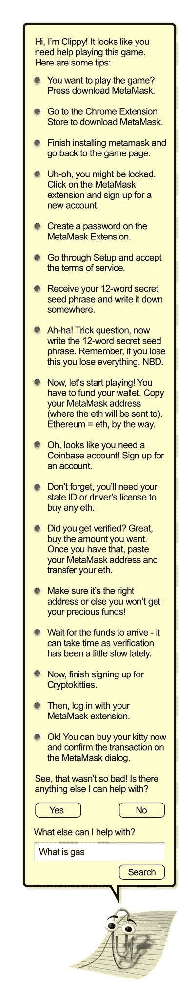

# 收入加密>加密

> 原文：<https://medium.com/hackernoon/earning-crypto-crypto-3a998963d0d1>

颠覆、激进的代币模型、价值获取论点以及向任何愿意倾听的人传播[密码](https://hackernoon.com/tagged/crypto)福音的时代已经结束。为[区块链](https://hackernoon.com/tagged/blockchain)转型、价值创造和采用腾出空间。成熟是一件好事。

尽管发生了转变，曾经的赛博朋克对未来的愿景——价值、主权、隐私和微支付的互联网——仍然触手可及。ICO 模型存在悲剧性的缺陷。在技术和文化转变之前，新的商业和社会协调模式被出售。令牌工程价值获取受到早期密码网络的限制(尝试计算链上的任何东西)。然而，没有什么比普通的互联网用户更能盖过我们加密福音合唱团的刺耳噪音了。

他们不关心健全的货币政策、分权、隐私或审查阻力；部分原因是因为我们自己的行业无法定义这些术语。[变化](https://abcnews.go.com/Technology/facebook-apple-twitter-linkedin-face-investigations-violating-european/story?id=61411161)来了。[潮](https://www.wsj.com/articles/facebook-ads-will-follow-you-even-when-your-privacy-settings-are-dialed-up-11551362400)正[换挡](https://www.theguardian.com/technology/2019/mar/02/facebook-global-lobbying-campaign-against-data-privacy-laws-investment)。

> “给他们密码，你喂他们一天。教他们**挣**密码，你就养活了他们一辈子。”

我们可以引导新用户使用密码，但不能强迫他们进行交易。我们必须通过让他们获得自己的价值来训练这个机制。参与式商业模式帮助用户形成习惯，为网络做出贡献。一旦他们积累了有意义的金额，教育他们私人钥匙和硬件钱包。这就是这篇文章的观点。

在*路径上挑选 ***一个*** 阻断器，以主权个人价值创造和解决那个问题。*

# *新型号*

*在 2014-2017 年，我们看到了许多疯狂的想法。我认为大多数人的意图是好的，因为我是一个乐观主义者。但作为一个现实主义者，我也认为这个领域的大多数项目不知道他们不知道的事情。创始人不了解基本原理和限制，也不知道如何解决他们成功的最大障碍。厚颜无耻的团队试图颠覆世界的基础设施，但他们甚至没有在他们的未来领域🧐做功课*

*去中心化的社交网络到处涌现，却没有一点对历史合作模式的研究。感谢[这并没有带来新的用户……但它让人们知道可编程数字稀缺性有多可怕。我个人感到欣慰的是，叙事已经成熟。我们正在更全面地思考自举网络和社区。](https://medium.com/u/e7d4eae1a2eb#DeFi </a>生态系统。

生态系统。

生态系统。
<p id=)[创造真正的粉丝](https://kk.org/thetechnium/1000-true-fans/)来获得新用户。*

*密码产业太狭隘了。我们都在唱，好歌，但只有我们知道歌词。现在是我们关注教育和入职的时候了。*

*首先，我们需要在用户所在的地方与他们见面。在 Web 2.0 上😲*

# *转换*

*我一直认为，公共加密网络的几个特征是可以被侵入的。我们必须让用户毕业，因为他们为网络创造了更多的价值。从保管钱包开始(别@我)。使用支付渠道或第 2 层解决方案来 **a)** 消除您自己数据库的风险，并 **b)** 为用户提供一个通往公共区块链的可靠出口。然后**教育**你的顶级价值创造者，不要管长尾理论。你网络中的潜伏者和低价值用户会无视你的入职邮件。*

*除了加密货币和奖励，还有其他载体。考虑加密由中央数据库存储的用户数据。这可以在不影响用户体验的情况下完成。调整登录流程，跨用户设备使用临时密钥对，加密和 presto…不再有来自被黑数据库的聚合数据转储。或许你甚至可以抛开欧盟，问:“GDPR 是什么？”😎*

*这些是增量的、无意义的 B2B 问题，蕴含着巨大的价值获取机会。谁在解决它们？说真的，联系我…📱*

# *价值创造*

*为什么赚取加密比使加密更容易获得更有价值？当人们获得某些东西时，他们会与奖励建立更深的关系。你今天训练这个机制，他们明天就会回来。这类似于 [Instagram 工程](https://medium.com/u/a4c6efa67fe0?source=post_page-----3a998963d0d1--------------------------------) [习惯形成行为](https://www.nirandfar.com/hooked)。只有这一次，用户在网络中拥有了他们的喜欢和影响者的价值。去死吧扎克😝*

*许多令人兴奋的项目，如 [Cent](https://medium.com/cent-official) 、 [SpankChain](https://medium.com/u/9f9f2cef797a?source=post_page-----3a998963d0d1--------------------------------) 、 [Gitcoin](https://medium.com/gitcoin) 、 [Burner Wallets](https://medium.com/gitcoin/tagged/burner-wallet) 等等，都允许用户立即在网络中赚取价值，并在以后兑现。**这就是你在 2017 年寻找的模型**以及为什么它可能是，“[购买&建造代币](/@cburniske/the-best-time-to-buy-build-tokens-d14ebe7acbd3)的最佳时机。”😍克里斯·伯尼斯克*

# *采用*

*在不把用户体验(UX)鼓得太响(更像死马)的情况下，我们需要让加密网络的采用像它们的 Web 2.0 对等物一样无缝。虽然我赞扬像斯塔克威尔和 T2 这样的团队令人难以置信的工程努力；你在衡量什么？*

*我们需要更多的工程来**前线**。让我们去见见用户，让他们**获得**密码。我知道我们可以建立解决方案，公平分配给网络贡献者⚒️🤗*

*Time for a hardware wallet…*

# *摘要*

*这很简单，你可能想要遵循[分](https://beta.cent.co)的例子:*

*   *机上用户立即*
*   *让他们在网络中创造/赚取价值*
*   *根据需要由无信任基础架构支持(通道/第 2 层)*
*   *让有价值的用户转向非保管式价值存储*

*不需要 14 步的登录流程。如果用户没有比 2 美分的意见或 5 美元的收藏品更有价值的东西，就没有必要学习任何新东西。让我们作为一个团体来确定这些新的模式🤗*

*你将如何帮助他人在互联网上创造和赚取价值？*

*[solo block . solutions](https://soloblock.solutions)
[medium.com/@mattdlockyer](/@mattdlockyer)
[twitter.com/mattdlockyer](http://twitter.com/mattdlockyer)
[linkedin.com/in/mattlockyer](http://linkedin.com/in/mattlockyer)*

# *附录*

## *阅读*

* [## 对海洋的奖励:改变世界的激励

### 12 月 1 日和 2 日，Bounties Network、ConsenSys Social Impact 和 Coins.ph 一起参加了一个活动，其中有一个…

medium.com](/bounties-network/bounties-for-the-oceans-incentives-to-change-the-world-8f3429fd01e9)  [## 树立信心，而不是衣冠楚楚

### 我们需要开始消除对加密货币等式的恐惧。

medium.com](/mycrypto/building-confidence-not-dapps-d8a3bc1f29d1)  [## 最低可行分权

### 如果你想让人们使用你的产品，分散最低限度。从自由网、I2P、暗网市场和…

medium.com](/@jbackus/minimum-viable-decentralization-d813dcf653fc)  [## 美分:来自任何地方的收入。

### 今年夏末，我和我的联合创始人卡梅伦开始测试 Cent 的测试版，这是一个雄心勃勃的项目…

medium.com](/cent-official/cent-income-from-anywhere-519515b396d8) 

## 喜剧

*