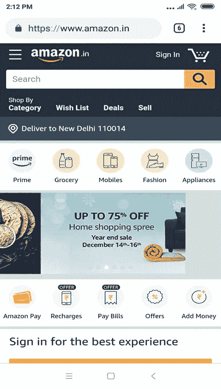
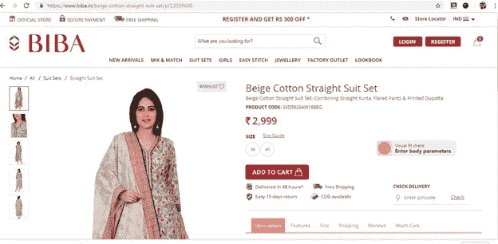
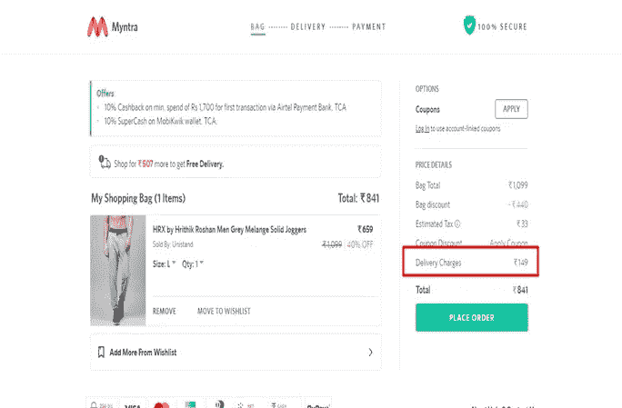
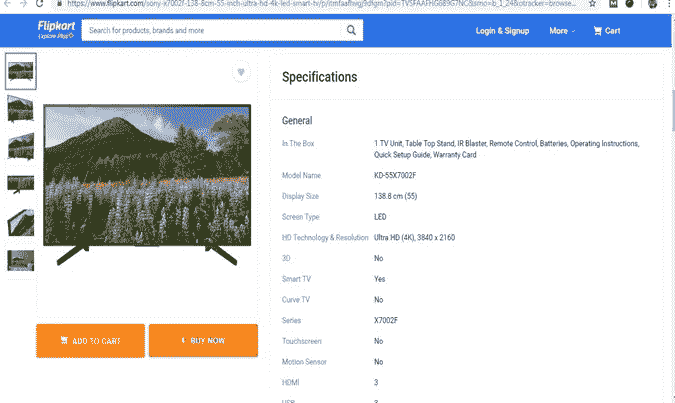

# 2019 年电子商务网站要点

> 原文：<https://medium.com/hackernoon/ecommerce-site-essentials-for-2019-c77409996a19>

## 购物永远关乎选择、质量、价值和信任。

如果你正在经营或打算开展电子商务业务，你需要了解你的目标受众的行为和偏好。鉴于网上的竞争，销售产品越来越具有挑战性。

首先，不要试图马上卖掉你的产品。首先，你需要与你的客户建立信任并建立良好的关系。这个想法是为了更好地了解你的前景，给人留下最好的印象。

以下是你应该优先考虑的电子商务网站:

# **移动购物者的最佳用户界面**

今天，70%的人使用移动设备进行在线购物，这就是为什么移动响应网站极其关键。移动访问正在超越桌面使用。您的电子商务网站需要为所有设备设计和构建，而不仅仅是个人电脑或笔记本电脑。

那么，你给他们提供什么？你有一个手机友好的网站吗？你打算推出一款能更有效接触用户的手机应用吗？

设计一个移动响应式网站，提高转化率，并不是一件容易的事情。你必须确保你的电子商务网站的所有功能必须易于通过移动设备导航。

例如，亚马逊是一个在线购物网站，在所有智能手机上都运行良好。你会发现整个网站相对容易导航，并提供了有益的用户体验。网站上不同的促销产品有不同的标签。你会在显著的位置看到产品类别的链接，而每个类别都有正确的名称。您也可以使用他们的手机应用程序轻松查看您需要的产品。

查看网站在智能手机上的外观:

不仅仅是亚马逊，还有许多其他电子商务品牌也高度重视移动用户。除了是一个手机友好的网站，你需要确保它有快速的加载时间和高速度。为此，你需要可靠的托管服务，如 HostPresto，可以使您的网站安全，可靠，易于管理，在最终确定之前，你必须了解不同的主机，以便您可以选择最好的。此外，你需要让你的网站的结账过程对你的移动用户来说简单易行。

您可以借助[谷歌手机友好测试工具](https://search.google.com/test/mobile-friendly)在手机上检查网站性能。很容易检查该工具给出的每个问题，并让您的开发团队修复它们。甚至你可以借助最佳搜索引擎优化公司的帮助，提出建议来提高你的网站的性能。

# **优质产品图片**

在网上购物中，顾客只需看到产品的图片就可以购买。由于顾客无法触摸和感受产品，这是在线企业销售产品的主要挑战之一。那么，你打算如何改变网站访问者的想法呢？

这就是理解你的客户的行为和他们的需求的地方。这些知识将有助于你推动顾客做出购买你产品的决定。因此，使用具有强大变焦功能的高质量图像可以改变游戏规则。让你的客户看到你的产品的实际图像，并最终确定它们的质量。

特别是，如果你在网上卖衣服，那么你必须在你的网站上使用高质量的照片。购买前，购物者喜欢查看产品图片，以获得产品的视觉感受。很明显，它能决定你的销售成败。此外，只要有可能，确保您的产品图像也应该精简和快速加载。

例如，BIBA 增加了高质量的图像缩放功能，这样用户就可以很容易地检查产品。你看，观察产品的质量、颜色和设计也很容易。

# **明确运输、退货政策和付款选项**

电子商务转换取决于多种因素。从功能到产品信息的视觉吸引力，一切都很重要。即使在设计了一个手机友好的网站并添加了高质量的图片后，你也没有得到适当的投资回报。放弃购物车背后的其他可能原因可能是不清楚的运输信息，明确的退货政策，以及根本没有支付选项。

在顾客的口袋里烧钱并不容易，因为没有人愿意花不必要的钱。根据 Baymard Institute 的数据，将近 70%的网上购物车都被丢弃了(T3)。研究表明，高昂的运输成本和不明确的运输政策是其中最主要的原因。请记住，客户不希望收取额外费用，尤其是对于有问题的产品。

所以你需要清楚地说明你的运输和退货政策。您可能无法在每个地点为每个产品提供免费送货服务。有时运费只在结账过程中显示出来，这时顾客会觉得被额外的费用欺骗了。因此，如果你想优化运输过程和设置灵活的成本，你可以在你的网站上使用[运输套件扩展](https://www.mageworx.com/magento-2-shipping-suite.html)。数字化购物者高度重视透明度，这对于你的商店的成功至关重要。

例如，Myntra 在他们的网站上很好地提到了运输价格，这样人们就知道他们为什么要收费以及收费多少。

# **详细的产品描述**

即使客户登陆了你的网站，这还不够好。他们还没有确信你提供的任何产品都有很高的价值。这就是产品描述可以发挥重要作用的地方。客户渴望了解你的产品的功能和特点，并与竞争对手的网站进行比较。所以你需要确保你的描述是吸引人的、信息丰富的和优化的。

添加详细的描述有助于用户理解规格、产品如何工作以及它们比其他产品好多少。

例如，Flipkart 在其网站上增加了查看产品规格的功能。

# **轻松结账流程**

结账是顾客的最后一程。既然这是客户与自己的血汗钱分道扬镳的阶段，那么就应该是平稳无缝的。如果顾客觉得这个过程太复杂，他会不买东西就离开。根据多项调查，40%的顾客放弃结账页面仅仅是因为这个过程的复杂性。因此，一个完美的结账过程需要大量的调整和排除干扰。

以下是简化结账流程的一些步骤:

您必须添加一个功能以作为来宾登录，并且不要求用户注册。让他们自己决定。

仅询问必需的信息，如地址、姓名、电话号码、电子邮件 ID。

允许客户存储他们的卡的详细信息。

多种付款方式，货到付款。

你的结账过程必须是移动友好的。

提供购物车物品的清晰摘要。

社会登录选项应该有，这样他们也可以通过社会媒体档案登录。

更短、更智能的结账流程可以显著提高电子商务网站的转化率。