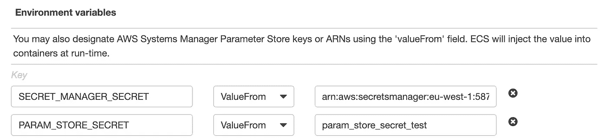

# ECS 的秘密做对了

> 原文：<https://medium.com/hackernoon/ecs-secrets-done-right-9e094cfa6200>

Photo by [Markus Spiske](https://unsplash.com/@markusspiske?utm_source=medium&utm_medium=referral) on [Unsplash](https://unsplash.com?utm_source=medium&utm_medium=referral)

去年，我写了一篇关于 ECS 中[秘密管理的痛苦的文章，但随着 AWS 对 ECS 的一些升级，世界现在变得更加光明。](https://hackernoon.com/secrets-management-within-aws-ecs-1b6975819ccd)

大变化？秘密现在在 ECS 任务定义中有一级支持。根据您的使用情况，它们可以从 AWS secrets manager 或 SSM 参数存储中传递。更好的是，这些值都不会显示在 ECS 控制台的任务摘要中。对于那些使用 CLI 或 [Boto3](https://boto3.amazonaws.com/v1/documentation/api/latest/index.html) 的用户，使用`containerDefinitions`中的`secrets`部分，并指定秘密的完整 ARN，如下所示。如果您使用同一地区的 SSM 参数，您可以使用参数名称而不是完整的 ARN。

Secrets Manager — specify the full ARN

SSM Parameter Store — full ARN or parameter name (if parameter is in the same region)

如果您更喜欢 ClickOps，也可以在任务定义控制台中指定秘密。它们没有自己的部分，而是属于使用`valueFrom`字段的常规`Environment variables`选项卡。与该特性的初始实现不同，当您访问任何正在运行的任务的概要时，任何使用`valueFrom`类型的变量都不会出现在环境变量列表中(这正是您所期望的秘密)。

AWS Console — Task Definition Container Configuration

您还需要向您的 ECS 任务执行角色添加一些新的权限，以利用该功能。下面的内联策略应该是您开始工作所需的全部内容。`secretsManager:GetSecretValue`和`ssm:GetParameters` 权限是必需的，这取决于你从哪里提取秘密，而`kms:Decrypt`只有在你使用秘密管理器中的自定义 KMS 密钥时才是必需的。

最初，这种方法只针对 EC2 启动类型，但是从 Fargate 版本 1.3.0 开始，Fargate 用户也可以使用 secrets 支持。和往常一样，记住价格是很重要的，尤其是 Secrets manager 的价格是每个秘密每月 0.40 美元。如果您只运行几个服务，每个服务都有几个秘密，这应该不是问题，但它不会很好地扩展，尤其是如果您预算紧张。

遗憾的是，该功能的云形成稍微滞后，但已根据[功能请求确认在某些地区有效。](https://github.com/aws/containers-roadmap/issues/97)要了解 ECS 机密的最新变化，或 ECS、ECR 和 EKS 的任何其他信息，请查看下面的官方容器路线图。

## 链接:

 [## AWS/容器-路线图

### 这是 AWS 容器服务(ECS、ECR、Fargate 和 EKS)的公共路线图。-AWS/容器-路线图

github.com](https://github.com/aws/containers-roadmap/projects/1)  [## 指定敏感数据——亚马逊弹性容器服务

### Amazon ECS 使您能够通过将敏感数据存储在 AWS……

docs.aws.amazon.com](https://docs.aws.amazon.com/AmazonECS/latest/developerguide/specifying-sensitive-data.html)