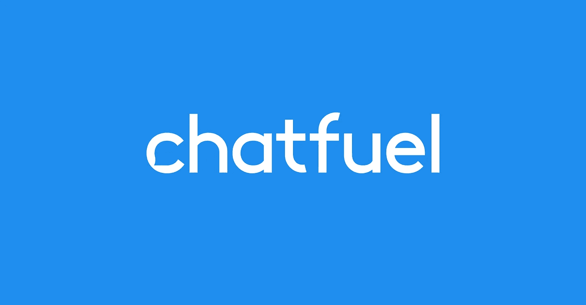
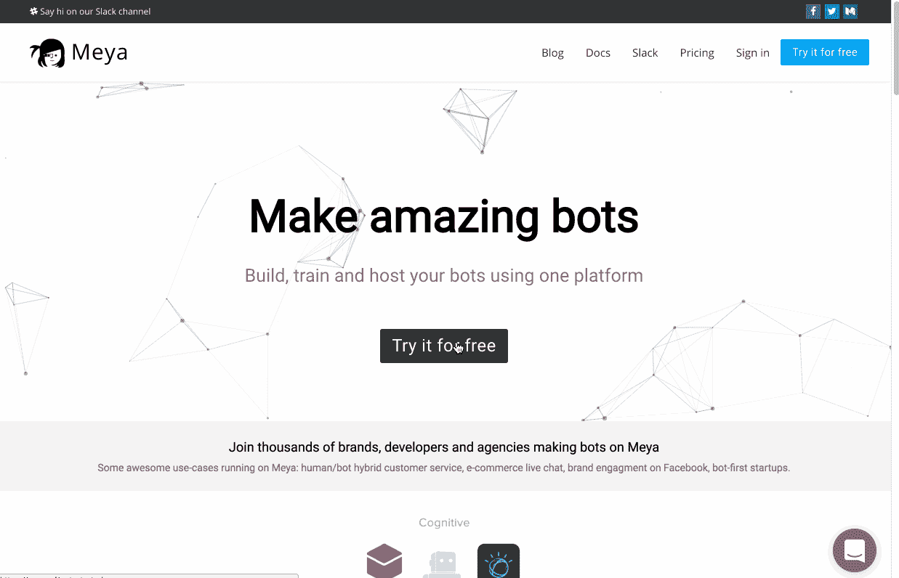
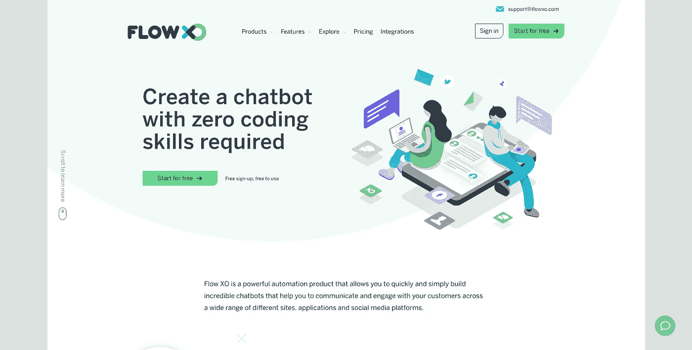
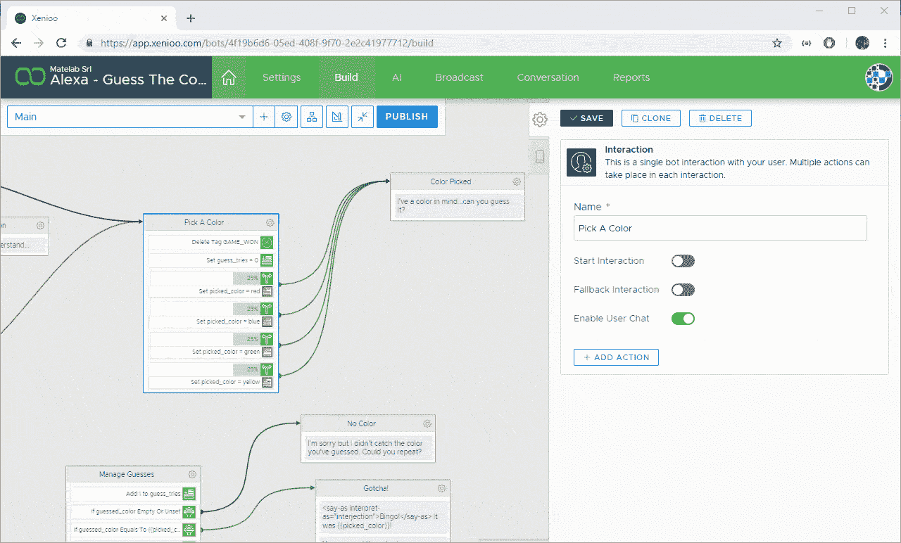
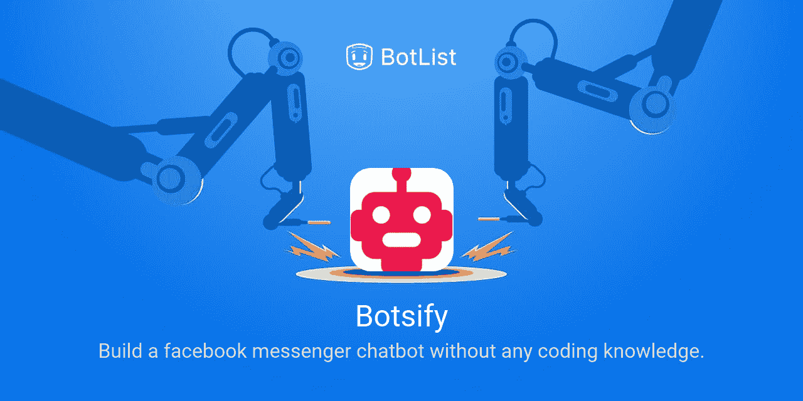

# 11 个趋势人工智能聊天机器人平台

> 原文：<https://medium.com/hackernoon/eleven-trending-ai-chatbot-platforms-ed58f250f841>

聊天机器人的人工智能正在彻底改变客户体验。当客户需要时，他们可以提供有用的信息。因此，许多使用人工智能聊天机器人的公司呈指数级增长。它为他们的客户提供积极主动的帮助。

许多品牌通过聊天机器人提升了他们的客户服务体验。它已经成长和改进，以利用各种社交网络和消息平台。

根据统计，到 2020 年底，近 80%的企业将拥有自己的聊天机器人。已经超越了 [**脸书的信使**](https://www.messenger.com/) 使用量从 2016 年的 3 万到大约。如今 10 万。因此，聊天机器人现在可以被认为是新一代技术。

在这篇博客中，我们将看看各种人工智能聊天机器人平台，它们肯定会增加你的商业收入。[从顶级聊天机器人开发公司雇佣开发人员](https://www.valuecoders.com/hire-developers)也能让你长期受益。

请查看以下列表:

**1)** [**聊天燃料**](https://chatfuel.com/)

它创造了智能的人工智能聊天机器人，并允许你自动回答客户或潜在客户的常见问题，如 Facebook Messenger。

如果你的机器人不能正确回答问题，你甚至可以将对话转移到一个人工代理。这种自动化确保您不会错过客户的任何聊天，并能继续提供他们需要的帮助。

**2)****[**梅亚。艾**](https://www.meya.ai/)**

****

**它有一个代码编辑器，实时调试器和可视化工具。在 Meya 的帮助下，公司可以利用 AI 的 [**优势为客户服务。它帮助公司创建机器人，在消息传递和客户支持应用程序中帮助他们的客户。你可以在 Meya 建造、训练和托管你的机器人。您还可以轻松扩展您的机器人。Meya 很容易与第三方应用程序集成，这增加了它的易用性。**](https://en.wikipedia.org/wiki/Artificial_intelligence)**

****3)**[**Imperson**](http://imperson.com/)**

****

**Source: Shane Barker**

**该平台开发了商业 AI 聊天机器人，支持主要消息平台中的视频、文本、音频、AR 和 VR。他们的对话机器人为客户提供真实而迷人的聊天体验。**

**对话浏览器使用关系的记忆、NLP 用户的尝试和深度对话的上下文来指导对话。人工智能的调解人帮助达到客户的目标。Imperson 通过托管和部署您的 bot 并实时提供信息来提高其性能，从而提供端到端的 bot 解决方案。**

****4)**[流 XO](https://flowxo.com/)**

****

**Source: API2Cart**

**无需学习任何代码，它允许你创建智能聊天机器人。通过其简单的拖放编辑器，你可以创建逻辑工作流，然后将你的 AI 聊天机器人连接到你选择的平台。**

**Flow XO 集成了大量第三方应用。您可以创建与 Salesforce、Google Sheets、Twitter 等服务集成的机器人。它的托管和管理功能使它成为最好的人工智能聊天机器人平台之一。**

*****阅读更多:*** [***聊天机器人可以让技术变得更容易理解***](https://hackernoon.com/chatbots-can-make-technology-more-accessible-7d8ea241fc11)**

****5)**[**Xenioo**](https://www.xenioo.com/)**

****

**Source: Xenioo**

*****最佳部分:免费报名*****

**不需要任何代码，你就可以使用这个简单易用的平台来构建令人惊叹的聊天机器人。它允许您为您的网站或任何社交网络平台即时构建和启动智能聊天。你可以在多个渠道使用它，包括 Slack、亚马逊、脸书、WhatsApp、Telegram 等等。**

**此外，在集成到平台中的 NLP 引擎的帮助下，这些 AI 聊天机器人能够理解和响应复杂的多语言表达。它甚至有一个训练模块，允许你通过创建意图和表情来训练聊天。**

****6)**[**Botsify**](https://botsify.com)**

****

**Source: Botlist**

**它可以帮助你为你的网站或 slack 创建智能 AI 聊天机器人，而不必花费时间和精力编写代码。Botsify 提供了多种插件来帮助您将其与您的 Shopify 商店、RSS feed、Google Sheets 或 Google search 集成。**

**它有一个易于使用的拖放式用户界面，并由人工智能和机器学习提供支持。这使得 [**机器学习开发者**](https://www.valuecoders.com/hire-developers/hire-machine-learning-experts) 能够在机器人没有适当装备来协助客户端的情况下，将对话从机器人无缝转移到人类代理。**

**该平台还提供对话形式，您可以通过聊天机器人对话收集潜在客户的信息。**

****7)**[**mobile monkey**](https://mobilemonkey.com/)**

**您可以使用它来管理一系列潜在客户挖掘活动，如聊天流、点滴活动和列表创建。它还允许您通过提供常见问题的答案来自动化客户服务，并减少等待时间。你甚至可以取消你的 AI 聊天机器人，随时跳入对话，没有问题。**

**它帮助你建立聊天机器人，可以将你的 Facebook Messenger 营销提升到一个新的水平。**

****8)**[**Aivo**](https://www.aivo.co/en/)**

**它是最好的人工智能聊天机器人平台之一，因为它增强了客户支持体验，并帮助组织通过文本或语音实时做出响应。它可以帮助你提高转化率，优化你的资源。**

**Aivo 的 AgentBot 可以很容易地与 Zapier、Live、Zendesk、Salesforce 等第三方平台集成。它适应渠道的规则，并自动做出响应，为客户提供个性化的体验。**

****9)** [**潘多拉机器人**](https://home.pandorabots.com/home.html)**

**Pandorabots 为交钥匙聊天机器人的完整开发提供解决方案。这个平台是世界上最古老和最大的人工智能聊天机器人托管服务之一。它允许双向通信扩展。**

**您可以在您的网站、移动应用程序和流行的消息平台(如 Line、KiK、Twitter、Telegram 和 Slack)上创建和实现聊天机器人。Pandorabots 实现并支持 AIML 开放标准。**

****10)**[**many chat**](https://manychat.com/)**

**对于营销、销售和支持系统，它可以帮助您轻松创建 Facebook Messenger 聊天机器人。它的拖放机器人的可视化创建器可以帮助你立刻建立一个 Facebook Messenger 机器人。**

**它帮助你有效地传递你的信息。您还可以自动进行 Messenger 营销，并根据延迟或某些用户操作发送消息。它还为您提供了一套工具来帮助您增加 Messenger 受众。**

****11)**[boost . ai](https://www.boost.ai/)**

**它可以帮助公司建立对话聊天机器人。这可以帮助您为客户提供更快的支持，并通过提供常见问题的答案自动减少您的等待时间。**

**它有一个易于使用的 API 和一个对话流编辑器，可以帮助你轻松地训练你的 AI 聊天机器人，而不需要任何技术知识。Boost 已经被一些领域的领先公司成功地开发出来。人力资源、电信、银行、保险，甚至公共部门。因此，它是最好的人工智能聊天机器人创建平台之一。**

****最后备注:****

**到目前为止，我们已经看到一些主要的人工智能聊天机器人平台，让公司 [**建立智能聊天机器人**](https://www.valuecoders.com/hire-developers/hire-chatbot-developers) 来增强他们的客户体验。您甚至可以使用这些聊天机器人轻松广播您的特价信息和其他信息。最终，这些将帮助您提供高效快捷的客户支持。**

**然而，我们列出了 2019-20 年我们最佳的人工智能聊天机器人平台。您可以根据您的业务需求选择以上任何一项。或者联系我们，ValueCoders 是一家领先的[软件开发公司](https://www.valuecoders.com/)，提供过去 15 年的优秀成果。**