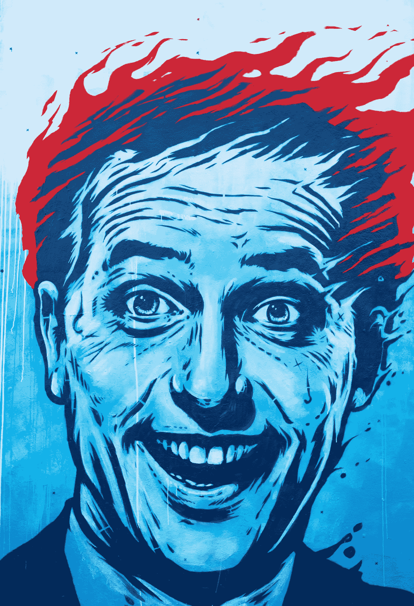

# 埃隆·马斯克，燃烧的男人！

> 原文：<https://medium.com/hackernoon/elon-musk-man-on-fire-22f194fadf8b>

## 爱他或恨他，他是我们这个时代的人之一。从特斯拉车祸到他频繁的推特咆哮，在来自各方的压力下，他的观点两极分化。但你觉得他在乎吗？

Photo by [Thiébaud Faix](https://unsplash.com/@thifalin?utm_source=unsplash&utm_medium=referral&utm_content=creditCopyText) on [Unsplash](https://unsplash.com/?utm_source=unsplash&utm_medium=referral&utm_content=creditCopyText)

# 褪色的乌托邦

随着埃隆·马斯克在火星太空飞行和无人驾驶汽车方面走得太远？有人认为他做到了。不管你的观点如何，我们不能从这个男人身上拿走的一件事是他有胆量。他努力去做我们许多人梦寐以求的事情。好吧，我明白了。他在银行也有几十亿美元的存款，这并不妨碍他统治世界的明星和人工智能(AI)事业，但当你因最近的推特强调人们在特斯拉汽车自动驾驶时做爱而受到抨击时，现金并不是一切，更不用说该公司的股票[在今年 1 月下跌了 27%](https://www.businessinsider.com/teslas-stock-may-drop-another-27-selloff-jpmorgan-2019-1?r=US&IR=T)。

> 或许是时候为这位南非出生的美国人担忧了？
> 
> 不太可能。

马斯克是一种罕见的不知道何时放弃的人。这使他成为这个星球上最富有和最具创新精神的人之一。

他是我们这个时代的爱迪生，勇敢地走向我们大多数人永远不会到达，也永远不会尝试到达的地方。

> 你必须有理由在早上起床，你想活下去。为什么要活下去？有什么意义？是什么激励了你？你喜欢未来的什么？“如果未来不包括置身于群星之中，成为一个多星球物种，我觉得那简直不可思议”
> 
> ——埃隆·马斯克

谈到技术，他不是一个悲观主义者，他正是我们需要的那种人，在 21 世纪的头几十年和以后领导我们。他相信，就像地球上仅有的二十几个拥有疯狂大脑的异类一样，明天可以在今天到来。

# OpenAI

直到现在，对所有这些积极的喧嚣有一个警告，一个来自这个男人自己的警告。尽管他相信人工智能通过他的公司 Neuralink 的推广以及它可以为丰富我们未来的生活做的所有积极的事情，但他很清楚如果我们不能正确利用它的力量，我们可能会面临的危险。他称之为*、*、*、*。这也是他创立并资助 OpenAI 的部分原因，open ai 是一家非营利性人工智能研究组织，其座右铭是:*发现并制定通往安全人工通用智能的道路。*

马斯克的担心——和许多计算机科学家和人工智能专家一样——在最近的一次采访中得到证实，他说:

> “由于人工智能可能比人类聪明得多，相对智力比率可能类似于人和猫之间的比率，甚至可能更大。”

猫在智力竞赛中对“奇点”的认识听起来太像科幻小说了，因为迄今为止，我们仍然无法处理人工智能计算机可以处理的最基本的问题解决任务——特斯拉再次陷入困境，因为其无人驾驶汽车引发了另一场事故。

对它的声誉或销售都没有好处。

# 怀疑者

T 对这项技术持怀疑态度的人，那些认为司机人工智能无法预测骑车人在路上的移动方式或区分路标上的涂鸦的人，预见了一个基本屠杀和一个接一个事故的时代。这些批评者强调，将这些无形的东西教给人工智能系统是不可能的，计算机人工智能接管人类智能的独特性是不可能实现的，或者至少是一段很长的路要走。

> **‘我不害怕电脑。我担心缺乏他们。”**
> 
> — **艾萨克·阿西莫夫**

马斯克已经意识到奇点成为现实的危险，并正在努力使人工智能尽可能安全。

然而，我们应该认真对待这些警告吗？如果是的话，在协助马斯克等人的过程中，我们能做些什么？

有无数的计算机科学家、学者和其他对该领域感兴趣的人主张，在人工智能技术与我们的生活如此融合以至于没有它就难以生活之前，需要对人工智能进行更广泛的研究。

显然， [OpenAI](https://openai.com/about/) 是一个开始的证据——但是这就足够了吗？

# 白宫七宝奇谋

此外，马斯克要求美国政府花些时间考虑大规模推出人工智能技术的影响，首先深入了解，然后采取行动。

Photo by [John Cameron](https://unsplash.com/@john_cameron?utm_source=unsplash&utm_medium=referral&utm_content=creditCopyText) on [Unsplash](https://unsplash.com/search/photos/trump?utm_source=unsplash&utm_medium=referral&utm_content=creditCopyText)

然而，出于某种悲观的立场，他不认为特朗普和白宫打手会这样做。他还担心脸书和谷歌的 DeepMind 可能会垄断人工智能，这就是他创办 OpenAI 的原因。

> 我们的导弹技术，我们的设备，比任何人都要好五倍。我的意思是，看，就技术而言，没有人能接近竞争对手。“现在我们将开始得到它，因为过去的政府和伊拉克战争已经削减了军队，而且消耗得非常严重，这是另一场灾难，”
> 
> —特朗普总统

与人工智能领域的其他企业家和专业人士不同，马斯克认为，如果潜在的技术不受当权者的限制和控制，它将非常危险。在最近的一次采访中，他重申了这样一个事实，即应该有一个政府委员会来监督人工智能的发展，建立与行业专业人士合作的规则，这反过来将增加人工智能发展的安全性。

马斯克对人工智能变坏的能力所持的看似悲观的世界观根本不是那么回事，至少一开始是这样。他的消极来自于他对人工智能的潜力的乐观，他认为人工智能是改变世界的力量。这种二分法使他成为如此迷人的角色，也可能是他如此成功的原因。

尽管如此，特斯拉股价的大幅下跌是另一个担忧，更不用说它是今年纳斯达克 100 指数中表现最差的公司，[损失了 42%。](https://markets.businessinsider.com/news/stocks/tesla-stock-price-stats-put-stock-plunge-into-perspective-2019-5-1028228512#tesla-just-snapped-its-longest-losing-streak-since-august-20181)

# 好人

乌斯克一次又一次地证明他的批评者是错误的。吸引许多人的是他承认自己错误的能力。他人性一面的展现——不像我能提到的其他思想领袖和亿万富翁公司巨头——让他变得可爱和值得信赖。

无论这个南非人带着人工智能、他的特斯拉汽车、太空竞赛或他脑海中的任何其他商业想法走向何方，有一件事我们不能从这个人身上拿走——他会按照他的方式做事，无论你、我或这个星球上的任何其他人喜欢与否。

现在，即使他是一个着火的人，在来自各方面的压力下，我认为他会带着奇怪的擦伤从另一边出来，也许还会遍体鳞伤，但准备好并愿意为他的信仰而战。

嗯，我认为这的确是一种值得过的生活。