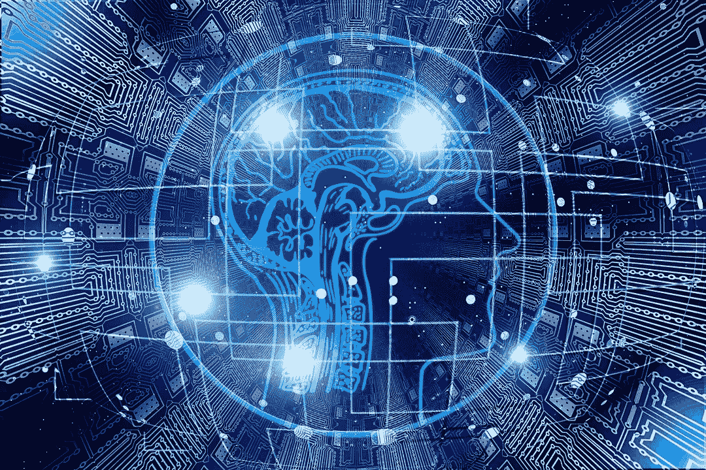
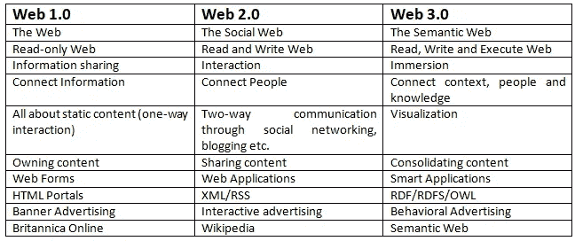
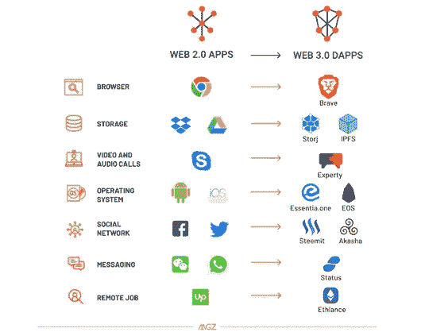

# 拥抱 Web 3.0:新的互联网时代即将开始

> 原文：<https://medium.com/hackernoon/embracing-web-3-0-the-new-internet-era-will-begin-soon-630ff6c2e7b6>

**2018:** 脸书数据泄露曝光 5000 万个人账户[ [来源](https://www.nytimes.com/2018/09/28/technology/facebook-hack-data-breach.html)

**2017:** 美国三大信贷机构之一的 Equifax 遭遇违规事件，可能影响 1.43 亿消费者[ [来源](https://www.nbcnews.com/tech/security/massive-equifax-data-breach-could-impact-half-u-s-population-n799686)

**2016:** AdultFriendFinder 网络黑客曝光 4.12 亿账号[来源](https://www.zdnet.com/article/adultfriendfinder-network-hack-exposes-secrets-of-412-million-users/)

**2015:** 保险巨头 Anthem 遭遇大规模数据泄露，1.12 亿个人数据受损。[ [来源](https://www.forbes.com/sites/danmunro/2015/12/31/data-breaches-in-healthcare-total-over-112-million-records-in-2015/#790bab3d7b07)

**2014:** 易贝面临 1.45 亿个人的大规模数据泄露。[ [来源](https://www.businessinsider.in/Cyber-Thieves-Took-Data-On-145-Million-eBay-Customers-By-Hacking-3-Corporate-Employees/articleshow/35630666.cms)

2013 年:雅虎的数据泄露危及 30 亿个人的数据[ [来源](https://www.wired.com/story/yahoo-breach-three-billion-accounts/)

这些事件留给我们这样的问题:

*   尽管有高端的安全性，巨型服务器还不足以保护数据吗？
*   难道数据安全不应该是所有即将到来的大大小小企业的关键因素吗？
*   当涉及到安全和隐私时，什么样的网络已经为未来做好了准备？
*   大型巨头未来也会遭遇数据泄露吗？

让我们来了解一下 www 在未来还能提供什么来避免这些灾难。

我们生活在 Web 2.0 时代，虽然现代技术被用来保护数据，但最终它缺乏对安全性和隐私的控制。

因此，我们将很快告别 Web 2.0，迎来 Web 3.0！

# Web 2.0 即将消亡:Web 3.0 万岁

当一个东西离开这个世界，新的东西就诞生了！Web 2.0 很快就会被它更智能的兄弟 Web 3.0 所取代；克服安全和隐私问题。

取代不安全的数据库和不透明的数据共享实践，Web 3.0 将控制权交还给用户，这意味着他们将能够从任何地方访问数据；主要由云应用和智能手机驱动。除了安全性，个性化是另一个附加功能！

# Web 3.0 带来了什么？

Web 3.0 可以说是一个智能 Web！

这完全是关于第三代互联网服务的演变，它融合了语义网、微格式、人工智能、数据挖掘、自然语言搜索和机器学习技术。

专家表示，Web 3.0 是一个数据驱动的语义网。用户将在 web 上键入查询；web 将理解上下文，并从本质上满足用户的需求。

因此，如果你执行更多与旅游目的地相关的搜索，你会收到更多与旅游目的地相关的广告。此外，当您搜索廉价机票时，搜索引擎会记住之前的搜索，并向您显示结合“旅游目的地和廉价机票”的结果。

因此，下一代搜索引擎不仅会搜索匹配的关键字，还会根据用户的行为和偏好执行上下文搜索。

## Web 2.0 很大程度上是关于文字的；Web 3.0 将是文字和可视化的融合

Web 3.0 将更加关注 Web 交互，并将:-

*   限制和控制用户内容
*   将网络变成一个大数据库
*   专注于以有意义的方式组织数据

# 让我们变得简单一些

## Web 2.0

露西想去电影和游戏区，然后在附近购物和吃饭。她会去谷歌，在网上浏览一堆信息，比较时间、价格等。这将耗费大量时间。

## Web 3.0

在搜索引擎的帮助下，露西将能够更快地生成这些信息。搜索引擎将根据 Lucy 的个人资料以非常智能的方式提供高度准确的推荐。露西将一次性获得所需的信息，最终将节省大量时间。

搜索引擎将从您执行的每次搜索中了解您和您的习惯，并将从您以前的活动(如喜欢和社交帖子)中收集您的详细信息，并根据您的偏好提供答案。

那么，Web 3.0 与之前的 Web 版本会有怎样的不同呢？

# 快速比较:Web 1.0 与 Web 2.0 和 Web 3.0

# 回到 Web 3.0 —使用 Web 2.0 的顾虑

由于网络上的所有东西都将被链接起来，而且机器会保存用户的偏好，这就带来了安全和隐私的问题！

当用户持续深入参与时，网络会产生更多可验证和可挖掘的数据。提供的信息越多，他们获得的更丰富、更动态的体验就越多。然而，这就产生了安全问题！

那么，有什么技术可以帮助保持安全呢？

# 区块链技术——解决安全和隐私问题的答案

区块链技术使得以安全的方式存储数据成为可能。随着数据的分散化，个人信息将不会存储在公司的大型数据中心和数据库中。相反，所有数据将由一家公司控制，这将大大减少个人数据泄露。

> ***比特币是开场。那是 Web3.0 的开端.*T3**

以太网等公共区块链提供了一个去中心化的平台来运行智能合约，并消除了中间人，使个人能够直接沟通。在 Web 3.0 中，苹果、谷歌、脸书等等都无法控制用户的数据，这将导致高度的安全性和隐私性。

让我们看看 Web 3.0 内置了什么样的平台。

# 即将到来的 Web 3.0 平台

下面提到的只是在 web 3.0 中用来避免安全和隐私问题的例子。

如果我们看看当前的场景，分散的应用、钱包、平台等等。构成 web 3.0 的都是分散的。要使用它，总是需要身份、登录、OTP 等。这扰乱了安全。

那么，如何使用 Web 3.0 来避免隐私混乱呢？

[Storj](https://storj.io/) 是一个基于云的数据存储平台，出于安全原因使用客户端加密。数据所有者可以信任并轻松访问他们的文件。这是一个分散式网络，可提供出色的性能、功能和耐用性。

Brave 是一款提供无与伦比的隐私和安全性的浏览器。它可以防止跟踪，并保证信息的安全。它在您的设备上保持私有状态，直到您删除它。

示例中提到的应用本质上是语义和智能的，这导致了改进的通信。

# Web 3.0 如何让去中心化成为可能？

根据[维基百科](https://en.wikipedia.org/wiki/Semantic_Web)，Web 3.0 是语义网的同义词！但在人工智能和语义的帮助下，将有助于赋予数据意义，解决问题。Web 3.0 是近距离理解人类思维的一个必由之路。

# 用于开发语义 Web 3.0 的 Web 栈

从技术角度来看，语义网主要由三个标准组成:

## RDF(资源描述框架):

它是一种数据建模语言，web 信息以 RDF 存储和表示

## SPARQL (SPARQL 协议和 RDF 查询语言):

它是一种查询语言，专门用于跨各种系统查询数据。

## OWL(网络本体语言):

这是模式语言或知识表示(KR)语言，它使您能够定义概念，以便尽可能多地重用它们。

# 拥有 Web 3.0 的优势

Web 3.0 提供了许多优势:

-> **没有中间人来控制数据:**如上所述，以太网将提供一个平台，在这个平台上，数据将是分散的，在没有网络中其他实体的允许的情况下，任何实体都不能修改代码。此外，没有人有权封锁网站和服务。

-> **减少数据泄露:**由于数据将会去中心化、分布式，黑客将很难对整个网络进行控制。但是，数据一旦进入区块链，就无法擦除或更改。这将创建一个连续的准确信息流，最终不会导致数据丢失。

-> **能够在任何小工具上工作:**今天，应用程序是特定于操作系统的，这意味着它运行在单一的操作系统上。Web 3.0 将提供易于定制和设备无关的应用程序，即应用程序将在任何设备上运行，包括电视、冰箱、微波炉、传感器、智能手机和更多设备。

-> **不间断服务:** DDoS 攻击将大幅减少！由于系统的分散性，会有连续的数据处理；不能阻止任何系统来停止服务；没有单一的硬件基础设施可以容纳这项服务。它将有多个备份，以防止服务器故障。

# 还需要考虑的挑战

Web 3.0 提供了许多可以让用户的生活更轻松的东西。但是，正如所说，硬币总有两面。

让我们看看它带来了哪些痛点:

-> **庞大的数据集:**毫无疑问，www 包含数十亿和数万亿的网页和术语。现有的技术不足以消除重复的术语。新系统将不得不处理大量的数据输入，并且可能无法理解上下文。

-> **可扩展性:**创业者将不得不担心如何以可扩展的方式管理数据，即如何组织数据、存储在哪里以及如何找到合适的内容。

-> **可视化:**随着过载信息的增加，可视化对于相关内容和目的的容易识别将起到关键作用。

# 让 Web 3.0 变得超级棒的 5 个主要特性

-> **语义网:**增强的网络，其中内容基于单词的含义进行分析

-> **人工智能:**专注于自然语言处理，计算机将更像人类一样理解信息，以便提供更快和相关的结果

-> **三维图形:**三维设计将用于网站和服务，为用户提供清晰的画面。例如:博物馆指南、电脑游戏等。

-> **连接性:**信息连接到元数据，元数据有助于用户获取准确的信息

-> **无处不在:**你周围的每台设备都将与网络相连，这意味着你可以在任何地方访问内容

# Web 3.0 —企业主的收获

->必须在整个互联网上使用高质量的内容，以提供您的产品在市场上的价值

->选择带有 3D 图形的网站，获得更加身临其境的互动体验。这将有助于网站的现代外观

->此外，选择易于导航的网站，以提供简单而迷人的用户体验

->因为用户将能够从任何地方获得互联网上的任何信息；您应该考虑优化所有设备(手机、平板电脑或台式机)上的信息

->您的客户将享受到关于您的产品和服务的新鲜内容

->人工智能助手正在创造未来！企业家必须专注于创造丰富的数字资产，确保搜索引擎能够轻松定位和提供内容。

看起来，用语义网在网上建立一个存在会变得更加困难，但是使用最佳策略会让你赢得这场战斗。Web 3.0 就是让人们的生活变得更容易，他们不需要安装和升级应用程序；他们只需要从任何地方立即访问文件。

# 超越 Web 3.0——展望未来

可以肯定的是，Web 3.0 将改变我们的生活，使我们在网上搜索任何东西都不会有任何麻烦，同时保证我们的数据安全。随着数字技术领域的发展，Web 3.0 即将到来！我们进入另一个互联网时代只是时间问题。