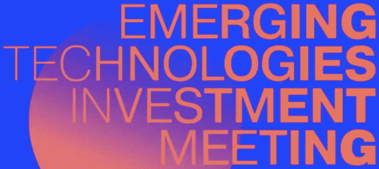

# 将在达沃斯呈现的新兴技术趋势

> 原文：<https://medium.com/hackernoon/emerging-technology-trends-to-be-presented-in-davos-883bca3c4c05>

新兴技术投资会议将于 1 月 25 日在达沃斯的商业聚会期间召开。几十个为机构、行业和整个国家创造创新环境的远见者和公司将展示他们的项目。

有助于解决一些最复杂问题的新兴技术趋势如下:

**便携式太阳能解决贫困问题**

**Kenneth Winther 和 Dmitry Suschov 是针对我们时代重大挑战的基金** [**Moonwalk**](https://moonwalk.me/) 的投资者，他们将解释便携式太阳能如何解决贫困问题，并为新兴市场的所有人提供能源。

[Pawa Technologies](https://moonwalk.me/pawa/) 是 Moonwalk 的投资公司，是世界上第一个离网电力生态系统，其多功能、袖珍太阳能可充电电力平台——一种电力载体，使人们能够获得电力，为手机、电灯等充电。

它是专门为撒哈拉以南的非洲人定制的，他们每年花费数百美元和数千小时来为他们的企业供电，为他们的家庭照明，收听他们的收音机，为他们的手机充电。

> ***Kenneth Winther:****“Pawa 太阳能收费有助于能源民主化，因此人们可以通过工作摆脱贫困。对非洲人民来说，Pawa 是创造收入的免费能源。它不同于其他产品，因为它的免费能源来自一个移动的、个人的和模块化的系统，该系统防水、耐用和防呆。”*

**未来城市中的可变形建筑**

[**Boris Bernaskoni**](https://en.wikipedia.org/wiki/Boris_Bernaskoni)**，BERNASKONI bureau** 的创始人，获奖建筑师，三次参加威尼斯建筑双年展，俄罗斯第一个总统中心叶利钦中心的作者，将展示 [**超立方体**](http://bernaskoni.com/projects/hypercubebuilding) ，第一个在莫斯科之外建造的可变形建筑，它不仅存在于空间维度，也存在于时间和交流维度。建筑灵活的立面和内部空间可以及时转换。混凝土外框架允许更新外观。室内空间可以很容易地根据建筑的功能进行改造。最初开放的公共建筑可以改变它的功能，成为一个封闭的科技园区或入驻企业的办公区。

> ***Boris Bernaskoni:****“超立方体是关于硬件和软件的层次。硬件是骨架:一个外骨骼，也就是可变的外观，以及内部的骨架部分。当代建筑的立面年龄在 30-40 岁之间，但功能老化得更快。软件是内部结构，旨在允许在建筑的生命周期内进行简单的改造。”*

**商业优化的区块链技术**

区块链的破坏性及其将交互控制从集中式系统转移到分布式用户的能力在监管严格的环境中的各种行业中获得了发展势头。

**[**QIWI 区块链技术**](https://qiwi.tech/)**【QBT】**负责人阿列克谢·阿尔希波夫将通过几个项目讲述商业优化。为大型复杂企业开发的总部位于区块链的系统 workinate，可以快速调整公司的结构和员工的职责，因为该系统可以深入分析工作量、员工的个人和专业优先事项及其与公司战略目标的关系。**

**区块链平台上的另一个项目是为了减少石油和天然气公司的供应链欺诈和浪费。由俄罗斯最大的石油和天然气公司之一测试的系统已经证明，在石油和天然气产品从源头到最终用户的整个过程中，它可以成功地检测和减少欺诈活动。**

> *****阿列克谢·阿尔希波夫:*** *“越来越多的公司将区块链视为增加透明度的技术解决方案。随着通过工作化获得更多数据和可见性，决策会更好，公司会更有效率。这同样适用于区块链驱动的供应链管理系统，它改变了许多公司的游戏规则。我们的系统已经由一家领先的石油和天然气生产商进行了测试，将进一步适用于更复杂的行业。”***

****公民发展****

****David Solomon 是投资平台**[**blue prints**](https://blueprints.org)的首席执行官，该平台致力于通过公平的资产和对等技术提供公平的 50:50 模型来扰乱经济发展，他将通过公民发展和个人集体主义的增长趋势进行演讲。**

**全球经济因不平等的经济发展而日益两极分化，一个巨大动荡的时期正在作为一种不可避免的反应出现。要解决这一蓝图，就要建立 50:50 的经济发展模式，并对点对点技术进行革命，以实现“个人集体主义”。**

> ****大卫·所罗门:**“我们如何让全球数百万公民公平分享他们的经济？我们从被剥夺公平份额的发展中经济体开始，尽管新兴/发展中经济体的国内生产总值为 33.52 万亿美元(基金组织)。我们展示了社会公益和投资回报如何在规模上相互关联，通过我们非常简单的 ABC 模型，将资产与资本蓝图相结合。”**

****在加密和机构世界之间搭建桥梁****

****Stephen Kelso，** [**银河数码**](https://www.galaxydigital.io) **欧洲，**一家致力于数字资产和区块链科技行业的多元化商业银行的负责人，将就 EmTech 投资大趋势发表演讲。**

> *****斯蒂芬·凯尔索:*** *“区块链技术作为‘互联网 3.0’，将预示着比前两次进化对生活方式和商业方式更大的改变。数字财富的转移和各行各业的智能合约去中介化将进一步彻底改变社会，缩小发达市场和新兴市场之间的差距。大数据和人工智能将迅速商业化，超越广告和被动投资管理，这是迄今为止的重点。”***

****[**Crypto Finance Group**](https://www.cryptofinance.ch/)**【瑞士】**的董事会成员 Marc P. Bernegger 将通过加密资产管理、交易和存储基础设施在传统金融界和新兴数字资产市场之间搭建一座桥梁，他将解释所有市场参与者如何从专业、安全和稳定的数字资产市场准入中受益。****

> *******Marc p . Bernegger:****“这是数字化的下一波浪潮，数字资产公司对人们日常生活的影响将堪比互联网。这项技术将为资产开辟高速基础设施，带来新的资产类别和新的投资工具。”*****

******区块链的社会影响******

******Ramesh Ramadoss，** [**IEEE 区块链倡议联合主席**](https://www.ieee.org/) 电气和电子工程师协会(IEEE)是世界上最大的专业组织，其使命是推动技术进步，造福人类。IEEE 是一个全球性的非营利社区，在 160 个国家拥有 420，000 名成员。通过区块链等新举措，IEEE 处于新兴技术的前沿。****

> *******Ramesh Ramadoss:*"***IEEE block chain 是一系列专注于社区发展、外联和教育的全球倡议的一部分，是跨学科交流与合作的论坛。在达沃斯期间，IEEE 瑞士区块链小组将举行欢迎招待会，主题是区块链的社会影响以及该技术如何应对社会挑战。”*****

******机器学习和商业人工智能******

******计算设备生产商和云计算服务提供商** [**GoWeb**](http://www.goweb.com/) 的联合创始人 Vladimir Novitskiy 将解释对新计算能力的需求是如何不断增长的。****

****利用在设计用于数学计算的专用计算设备方面获得的经验，GoWeb 创建了配备有能够实现机器学习和神经网络建模的设备的计算中心，并利用其他部门的免费资源来优化计算机容量利用率。****

> *******弗拉基米尔·诺维茨基:*** *“人工智能将会并且已经在通过精确的数据分析来削减成本和增加利润，从而彻底改变全球商业运作的方式。GoWeb 是一家高效、快速发展的企业，拥有成功的历史、客户和合作伙伴。我们提供了一种练习跑步的能力，并以比竞争对手更低的价格将人工智能应用到企业中，因此人工智能可以更容易被世界上更多的人所接受。”*****

*****你怎么看待 2019 年的新兴科技趋势？*****